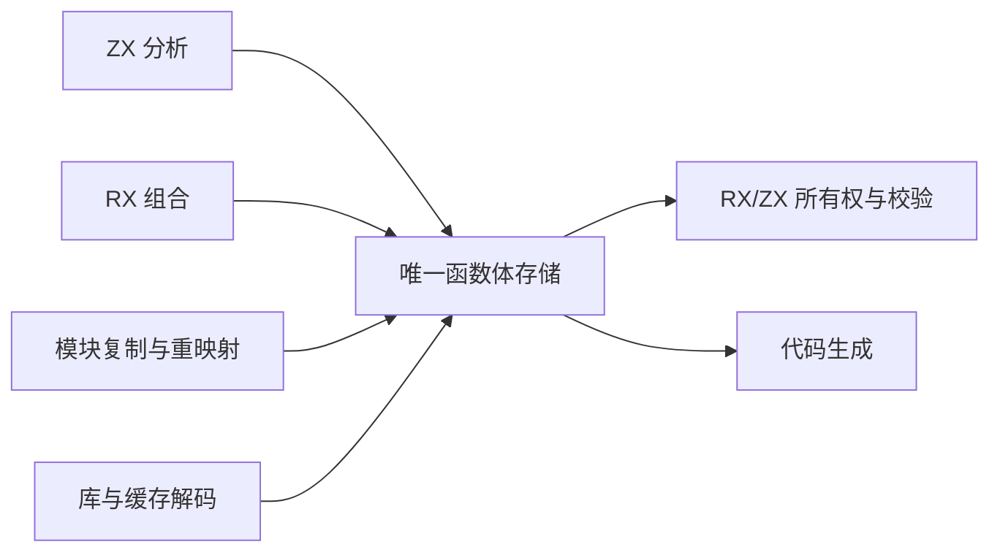

# 统一 IR 函数体存储

## Intent

让 ZX 分析、RX 组合、模块复制和 codec 共同生产及消费唯一函数体模型。最终 RX/ZX 算法直接读取该模型，删除所有权检查的转换适配层，不新增专用 Reader、Writer 或状态镜像作为最终架构。

## Data

当前 Program、Function、Contract 用 union Expression 数组；Statement 持递归 slice。Analyzer.append/finish、expression_program.build、contracts.analyze、RX Builder/program.lower/capture.argument、artifact.Nodes、project/link/semantic_cache.restore，以及库和增量缓存 JSON 解码都是实际生产或发布入口。只改 ownership 输入不能完成迁移。

类型表已有按列存储和无分配读取的本地范式。本阶段先实现控制流存储，再覆盖表达式与符号。完整函数体才是最终验收边界；分步实现不得保留两份正式状态。

## Edges

- ExprId、SymbolId、FunctionId 和 BlockId 保持 u32 的编号宽度；源位置仍能表达 u64 偏移。
- 控制块按后序写入，branch/switch 只引用已有块。每块语句直接连续存储，无须额外 block_statements 索引数组。
- 所有可变长载荷以 first/count 和原始标量列表示，避免 ZX 对象数组的指针外壳及逐记录分配。表达式模型必须覆盖全部 36 种 kind。
- 分配失败不发布半条 statement 或半个 block；容量预留可改变，但已有逻辑内容不变。计数和容量溢出须在写入前拒绝。
- 草稿 native storage 仅用于现有 Zig producer 的迁移期；整个 producer 的语义与状态生命周期仍要迁入 RX/ZX。观测时允许从旧 IR 构造候选存储，不把观测转换器接入正式编译器。
- 模型迁移必须同步 codec 和 IR version；不永久维护旧新两种内部模型。

## Answer

先交付真实可构建的 canonical Control schema、后序块 storage、RX/ZX 结构校验与终结路径计算；借用输入仅复制 slice descriptor，不复制数组，不用 allocator。利用已有真实 IR 对照旧 terminates，验证列式结构与结果，随后替换所有正式 producer，再删除观测转换。

后续表达式表、符号表和 Body 发布迁移完成前，不宣称统一 IR 或完整自举已完成。




## 具体控制模型

```zx
export type Control = {
    statement_kinds: StatementKind[]
    statement_payloads: u32[]
    block_first: u32[]
    block_count: u32[]
    branch_conditions: u32[]
    branch_yes: u32[]
    branch_no: u32[]
}
```

此处仅展示头部和分支列；草稿 control/model.zx 包含全部八种语句及所有载荷。最终不是上述局部示例，而是完整模型。

## 自我复核

不能因候选表能从旧 IR 转换而宣称 producer 已迁移。此阶段验证 schema 和存储不变量，随后必须改变实际 owner 及 codec，才会移除旧存储。避免为迁移便利保留递归语句镜像或每次检查都重新 flatten。

## 候选表达式存储

完整 Expressions schema 包含 88 个标量或字符串 slice，覆盖 36 种表达式。List/Tuple/Template 共用 sequence 池；Field/TupleField 共用 projection 池，语义仍由 kind 区分。可变长 captures、arguments、bindings、arms、fields、evaluation 均通过明确命名的 first/count 及对应载荷列表示；没有对象指针数组。

native/expressions 中的迁移期 append 对当前 ir.Expression 逐项写列，先统一预留，再发布 kind/type/span/payload。它尚未替换 Analyzer 的 owner；observed_decode 仅用于真实输入的无损对照，不是正式读取层。正式读视图必须直接读取列，不得照搬这个会分配临时 record 数组的观测解码器。

容量扩展前先记录来自自身载荷池的切片偏移，扩展后重新定位；控制流 destructure 的可选符号列同理。外部输入仍借用其原始切片。此约束独立于 Arena 是否保留旧分配，不能利用当前分配器行为隐藏悬空引用。

函数体 Body 统一引用 symbols、expressions、control 和 root；契约 Predicate 复用同样的 symbols/expressions，并保留 predicate 及 span。函数、Store、native module 和 global type metadata 仍按既有模块边界处理，不把局部 ExprId 改为全局空间。

## 控制流阶段观测

- 观测构建 31/31；现有 RX 并行推断、Store 所有权证明和 typed try 分析专项 36/36 步骤、228/228 用例通过。
- 所有权模块图：261 次观测、541 个块；控制模块图：46 次观测、222 个块。生成输出与未观测 CLI 字节一致。
- 现有专项产生 241069 次观测、241361 个块，包括故障注入重跑，不能将其称为独立程序数量。覆盖全部八种语句 kind。
- 每次逐列验证 27 个数组地址和长度不变，再逐块对照原 terminates。原始大日志压缩保存，统计明确区分观测次数和输入形状。
- 这轮只使用从既有 IR 构造的结构合法表；尚未独立验证伪造 canonical 列的拒绝行为。后续正式 codec 迁移必须补上这一边界的现有回归证据。

## 失败与借用边界复核

静态审查发现逐列 toOwnedSlice 在中途失败时会清空已转移的列，导致保留的 Storage 各列长度错位。候选 finish 明确定义为消费操作：成功交付全部列；失败释放已转移与尚未转移的全部列，Storage 回到 empty。append 仍保持失败时逻辑长度不变。不能把两者混称为同一种失败原子性。

表达式 reserve 只检查和扩展当前 kind 实际使用的列，避免每个表达式都扫描并调用全部 88 列的容量接口。容量变化可能使先前读视图失效；调用者在 append（包括失败返回）后重新取得读视图，不能保存跨变更的临时 slice。当前表达式自借用载荷在本次成功追加内部已按偏移重定位。

## 生成入口复现

在仓库根目录使用当前 CLI：

```sh
zig-out/bin/zxc docs/2026-10-07/统一IR存储/草稿/check.rx --no-cache --out docs/2026-10-07/统一IR存储/生成/控制入口.zig

zig-out/bin/zxc docs/2026-10-07/统一IR存储/草稿/body_identity.zx --no-cache --out docs/2026-10-07/统一IR存储/生成/函数体接口探针.zig
```

第一个命令生成的 `控制入口.zig.abi.zig` 对应观测构建使用的 `控制接口.zig`；生成后复制或重命名该 ABI 文件。第二个入口只验证完整 Body ABI 与身份传递，不是业务算法实现。两个生成文件可由已保存的 RX/ZX 源重建，不作为第二套手写源码维护。

临时接线补丁仅用于本工作树的观测构建。引用的整数 widen/narrow 是现有静态转换模块；它不包含 IR 规则，后续应归入统一的普通数值转换能力，避免保留编译器专用路径。

## 函数体阶段结果与下一步

最终候选完成构建（31/31）。最终所有权模块图对照包含 261 次观测、107522 个表达式；自身控制模块图包含 46 次观测、6671 个表达式。每个表达式的 type、span、kind、完整 payload 经观测解码后与原值逐项序列化结果一致；88 个表达式列地址和长度保持不变，Body 接口探针返回原输入身份。两份编译输出均与未观测 CLI 字节一致。

五项专项 75/75 步骤、142/142 用例；补充四项专项 83/83 步骤、417/417 用例。各批存在重复输入，不相加为唯一程序数。合计观察到 34/36 种表达式，尚缺 NegativeInteger、Unit。专项运行后收紧了 finish 消费失败契约并精简 reserve；随后重建并重跑两个模块图，没有重复整批专项。没有新增测试，没有执行全量测试。

正式 compiler/test 接线已恢复。候选仅存在 docs，正式 IR version 仍为 25。下一步必须完成无分配的 native 记录读视图和 canonical 表校验，再把 Analyzer、RX Builder、节点复制及两种 codec 原子地切换为唯一存储；之后删除 observation 转换器。任何时点都不能将 observed_decode 放入正式读取路径来掩盖迁移缺口。
