# 统一 IR 函数体存储

## Intent

让 ZX 分析、RX 组合、模块复制和 codec 共同生产及消费唯一函数体模型。最终 RX/ZX 算法直接读取该模型，删除所有权检查的转换适配层，不新增专用 Reader、Writer 或状态镜像作为最终架构。

## Data

当前 Program、Function、Contract 用 union Expression 数组；Statement 持递归 slice。Analyzer.append/finish、expression_program.build、contracts.analyze、RX Builder/program.lower/capture.argument、artifact.Nodes、project/link/semantic_cache.restore，以及库和增量缓存 JSON 解码都是实际生产或发布入口。只改 ownership 输入不能完成迁移。

类型表已有按列存储和无分配读取的本地范式。本阶段先实现控制流存储，再覆盖表达式与符号。完整函数体才是最终验收边界；分步实现不得保留两份正式状态。

## Edges

- ExprId、SymbolId、FunctionId 和 BlockId 保持 u32 的编号宽度；源位置仍能表达 u64 偏移。
- 控制块按后序写入，branch/switch 只引用已有块。每块语句直接连续存储，无须额外 block_statements 索引数组。
- 所有可变长载荷以 first/count 和原始标量列表示，避免 ZX 对象数组的指针外壳及逐记录分配。表达式模型必须覆盖全部 36 种 kind。
- 分配失败不发布半条 statement 或半个 block；容量预留可改变，但已有逻辑内容不变。计数和容量溢出须在写入前拒绝。
- 草稿 native storage 仅用于现有 Zig producer 的迁移期；整个 producer 的语义与状态生命周期仍要迁入 RX/ZX。观测时允许从旧 IR 构造候选存储，不把观测转换器接入正式编译器。
- 模型迁移必须同步 codec 和 IR version；不永久维护旧新两种内部模型。

## Answer

先交付真实可构建的 canonical Control schema、后序块 storage、RX/ZX 结构校验与终结路径计算；借用输入仅复制 slice descriptor，不复制数组，不用 allocator。利用已有真实 IR 对照旧 terminates，验证列式结构与结果，随后替换所有正式 producer，再删除观测转换。

后续表达式表、符号表和 Body 发布迁移完成前，不宣称统一 IR 或完整自举已完成。

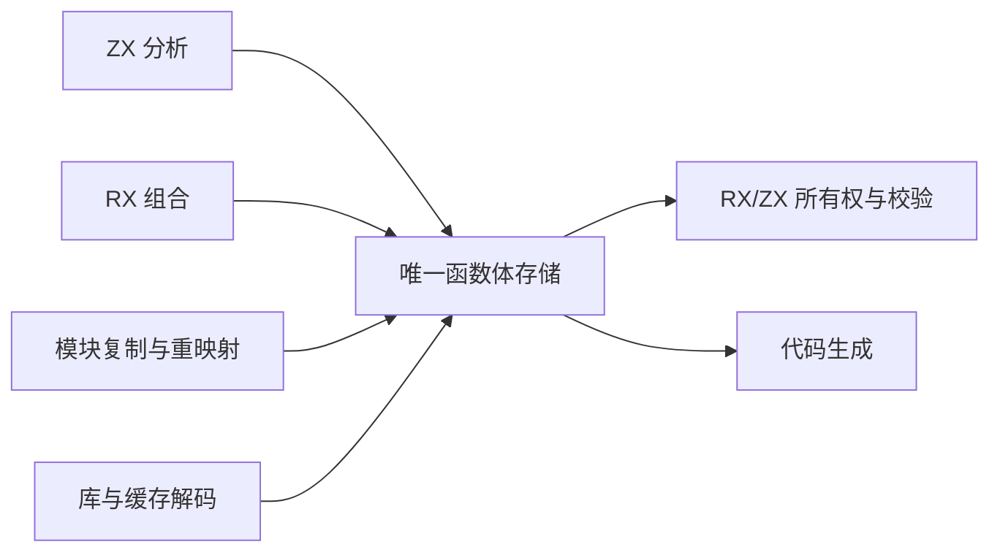


## 具体控制模型

```zx
export type Control = {
    statement_kinds: StatementKind[]
    statement_payloads: u32[]
    block_first: u32[]
    block_count: u32[]
    branch_conditions: u32[]
    branch_yes: u32[]
    branch_no: u32[]
}
```

此处仅展示头部和分支列；草稿 control/model.zx 包含全部八种语句及所有载荷。最终不是上述局部示例，而是完整模型。

## 自我复核

不能因候选表能从旧 IR 转换而宣称 producer 已迁移。此阶段验证 schema 和存储不变量，随后必须改变实际 owner 及 codec，才会移除旧存储。避免为迁移便利保留递归语句镜像或每次检查都重新 flatten。

## 候选表达式存储

完整 Expressions schema 包含 88 个标量或字符串 slice，覆盖 36 种表达式。List/Tuple/Template 共用 sequence 池；Field/TupleField 共用 projection 池，语义仍由 kind 区分。可变长 captures、arguments、bindings、arms、fields、evaluation 均通过明确命名的 first/count 及对应载荷列表示；没有对象指针数组。

native/expressions 中的迁移期 append 对当前 ir.Expression 逐项写列，先统一预留，再发布 kind/type/span/payload。它尚未替换 Analyzer 的 owner；observed_decode 仅用于真实输入的无损对照，不是正式读取层。正式读视图必须直接读取列，不得照搬这个会分配临时 record 数组的观测解码器。

容量扩展前先记录来自自身载荷池的切片偏移，扩展后重新定位；控制流 destructure 的可选符号列同理。外部输入仍借用其原始切片。此约束独立于 Arena 是否保留旧分配，不能利用当前分配器行为隐藏悬空引用。

函数体 Body 统一引用 symbols、expressions、control 和 root；契约 Predicate 复用同样的 symbols/expressions，并保留 predicate 及 span。函数、Store、native module 和 global type metadata 仍按既有模块边界处理，不把局部 ExprId 改为全局空间。

## 控制流阶段观测

- 观测构建 31/31；现有 RX 并行推断、Store 所有权证明和 typed try 分析专项 36/36 步骤、228/228 用例通过。
- 所有权模块图：261 次观测、541 个块；控制模块图：46 次观测、222 个块。生成输出与未观测 CLI 字节一致。
- 现有专项产生 241069 次观测、241361 个块，包括故障注入重跑，不能将其称为独立程序数量。覆盖全部八种语句 kind。
- 每次逐列验证 27 个数组地址和长度不变，再逐块对照原 terminates。原始大日志压缩保存，统计明确区分观测次数和输入形状。
- 这轮只使用从既有 IR 构造的结构合法表；尚未独立验证伪造 canonical 列的拒绝行为。后续正式 codec 迁移必须补上这一边界的现有回归证据。

## 失败与借用边界复核

静态审查发现逐列 toOwnedSlice 在中途失败时会清空已转移的列，导致保留的 Storage 各列长度错位。候选 finish 明确定义为消费操作：成功交付全部列；失败释放已转移与尚未转移的全部列，Storage 回到 empty。append 仍保持失败时逻辑长度不变。不能把两者混称为同一种失败原子性。

表达式 reserve 只检查和扩展当前 kind 实际使用的列，避免每个表达式都扫描并调用全部 88 列的容量接口。容量变化可能使先前读视图失效；调用者在 append（包括失败返回）后重新取得读视图，不能保存跨变更的临时 slice。当前表达式自借用载荷在本次成功追加内部已按偏移重定位。

## 生成入口复现

在仓库根目录使用当前 CLI：

```sh
zig-out/bin/zxc docs/2026-10-07/统一IR存储/草稿/check.rx --no-cache --out docs/2026-10-07/统一IR存储/生成/控制入口.zig

zig-out/bin/zxc docs/2026-10-07/统一IR存储/草稿/body_identity.zx --no-cache --out docs/2026-10-07/统一IR存储/生成/函数体接口探针.zig
```

第一个命令生成的 `控制入口.zig.abi.zig` 对应观测构建使用的 `控制接口.zig`；生成后复制或重命名该 ABI 文件。第二个入口只验证完整 Body ABI 与身份传递，不是业务算法实现。两个生成文件可由已保存的 RX/ZX 源重建，不作为第二套手写源码维护。

临时接线补丁仅用于本工作树的观测构建。引用的整数 widen/narrow 是现有静态转换模块；它不包含 IR 规则，后续应归入统一的普通数值转换能力，避免保留编译器专用路径。

## 函数体阶段结果与下一步

最终候选完成构建（31/31）。最终所有权模块图对照包含 261 次观测、107522 个表达式；自身控制模块图包含 46 次观测、6671 个表达式。每个表达式的 type、span、kind、完整 payload 经观测解码后与原值逐项序列化结果一致；88 个表达式列地址和长度保持不变，Body 接口探针返回原输入身份。两份编译输出均与未观测 CLI 字节一致。

五项专项 75/75 步骤、142/142 用例；补充四项专项 83/83 步骤、417/417 用例。各批存在重复输入，不相加为唯一程序数。合计观察到 34/36 种表达式，尚缺 NegativeInteger、Unit。专项运行后收紧了 finish 消费失败契约并精简 reserve；随后重建并重跑两个模块图，没有重复整批专项。没有新增测试，没有执行全量测试。

正式 compiler/test 接线已恢复。候选仅存在 docs，正式 IR version 仍为 25。下一步必须完成无分配的 native 记录读视图和 canonical 表校验，再把 Analyzer、RX Builder、节点复制及两种 codec 原子地切换为唯一存储；之后删除 observation 转换器。任何时点都不能将 observed_decode 放入正式读取路径来掩盖迁移缺口。

## 无分配读取阶段

Intent：把候选表达式列直接提供给消费者，不通过重建旧 record 数组读取。

Data：原观测解码器只有 ParallelBranch、ScopeBinding、MatchArm、ObjectField 四类记录序列需要分配；其他载荷可按值读取，原始 ID 列可按固定 u32 表示借用。沿用已有 TypeFields 的 len/at 视图风格。

Edges：read 接口要求表已通过结构与引用校验，不在每个字段读取时增加兜底或重新校验。view 只持列切片，生命周期依附 owner；append 后须重新取得 view。观测用 materialize 仍只在比较边界存在。

Answer：read.zig 不接受 allocator，四类记录以列视图按索引返回单个普通值；随后逐真实表达式通过该读路径对照全部内容，并接入表校验与正式 owner 迁移。

结构校验检查列宽、连续完整的分段、kind 对应 payload 的顺序与数量、宿主偏移的可表示范围，以及控制块后序约束。RX 的 Switch 只在结构合法后调用局部引用校验；引用校验覆盖表达式与符号 ID，包括可空 ID。外部类型、函数、Store 槽位、字段编号及表达式依赖环属于程序级语义，当前函数体入口没有这些元数据，不宣称已经校验。span 的这里检查只保证可转换为宿主 usize，不代替源码范围或位置语义检查。

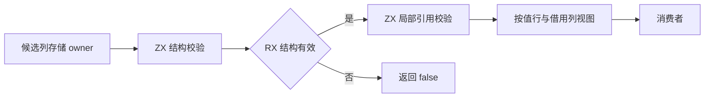

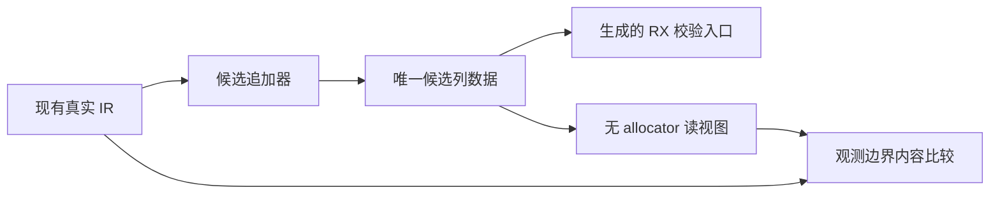

无分配是读取 API 和实现的性质；整个观测器仍分配候选表、JSON 对照数据及校验执行所需的临时内存，不能将其描述为整条编译流程零分配。原始 IR 到候选表的复制只存在于迁移观测中，尚未实现正式 owner 替换。

### 读取与校验验证结果

- 观测构建 31/31 步骤成功。
- 所有权模块图：261 次观测、107522 个表达式、541 个控制块；校验器自身模块图：98 次观测、29712 个表达式、1204 个控制块。
- 两张模块图中，新表达式读视图经观测边界物化后的完整内容与原 IR 一致；控制读视图逐语句、逐分支内容一致；所有候选表通过结构与局部引用检查。两份最终生成输出分别与普通 CLI 输出字节一致。
- 现有 RX 推断、字段所有权专项：27/27 步骤、173/173 用例通过；13467 次观测、59396 个表达式、13813 个控制块。观测次数包括故障注入重跑，不是独立程序数量。
- 临时 compiler/test 接线已完整恢复。没有新增测试用例，没有执行全量测试。详细计数、源码哈希及压缩原始日志见 `读视图观测.json` 和 `验证/读视图*`。

复现新增校验生成入口：

```sh
zig-out/bin/zxc docs/2026-10-07/统一IR存储/草稿/body_check.rx --no-cache --out /tmp/zxc_canonical_body_check.zig
```

观测接线补丁引用该生成文件及自动生成的 `.abi.zig`，还依赖前文控制入口与 Body 接口探针。生成文件不是正式源码。旧阶段的哈希与观测日志描述各自阶段快照，不代表当前草稿的哈希。

### 本阶段自我复核

读取层已消除四类记录序列重建及控制流树重建，完整结构验证由 RX/ZX 实现；但正式 Analyzer、RX Builder、节点复制、库 codec、语义缓存 codec 仍持有旧表示。这是迁移先决条件的完成，不能称为正式统一 IR 或编译器自举完成。当前证据来自真实合法 IR，未新增伪造表拒绝用例，也没有覆盖所有表达式 kind，因此不是验证器正确性的形式化证明。下一步应推进唯一 owner 的原子迁移，并复用现有 codec 非法输入回归验证发布边界，不继续以观测器替代生产进展。

## 正式存储迁移

Intent：依次把符号、表达式、控制流改为唯一列存储，每种表示切换时同时迁移全部生产者与 codec，不保留旧表示作为正式旁路。

Data：符号是独立的五列值表；表达式额外涉及 genz 内联泛型 ID 重映射、同表增长后的借用有效期；控制流涉及后序块发布。原先把三者一次切换的计划会把这三类不同风险混在一次验证中，因此先完成符号表的完整生产迁移。

Edges：每个阶段都同步提升 IR version 并拒绝旧格式；Program、Function、Contract 仍共享所属 arena 的生命周期。类型、表达式、控制流尚未切换的部分不能宣称已统一。

Answer：正式 core SymbolTable / SymbolStorage 与全部 ZX、RX、artifact、genz 构造路径；验证器在任何列读取前检查结构；复用现有专项验证，不新增测试。

正式符号表的 names、types、span_start、span_end、ownership 与 RX/ZX Symbols schema 对齐。Ownership 列明确采用 u32 的 Copy/Borrowed/Owned 枚举，语义行读取转换为既有 ir.Ownership；列本身可直接借给生成的 ZX 接口。SymbolStorage.append 先预留全部五列，再同时增加逻辑长度；finish 成功和失败都消费 owner。字符串按既有 arena 边界持有，artifact 深复制仍复制名称内容，普通 Program↔Function 只复制表描述符。

库 codec 随 Program 的声明直接读写唯一列存储；语义缓存 decoder 在发布前检查函数及契约的符号列结构。共享 artifact copier 也在读取前检查结构，因为直接 link 的调用路径不必经过缓存 decoder。IR version 从 25 升到 26，旧库与旧语义缓存沿既有版本门禁拒绝，不增加隐式转换。

RX span 映射只分配 start/end 两列，其他三列借用同一 Result.arena。genz 内联重建的新 SymbolStorage 与原函数符号表独立，不保存跨自身增长的列 view。初始输入符号从Values 仅是短构造入口，没有为消费者维护第二份 Symbol 数组。

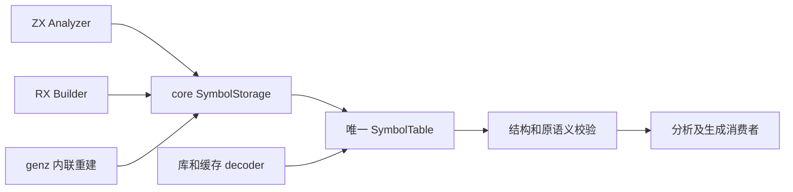

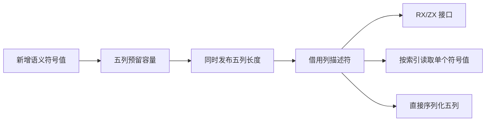

尝试 grit Zig 模式被当前工具拒绝（迁移.grit 保存尝试），且未找到可用 Zig ast-grep 配置；这次采用限定接收者的文本改写后逐项编译修正。已排除 SymbolId 映射数组、destructure 符号列表及借用分析状态，保留它们原有表示。现有测试中的直接 IR 构造和畸形输入变异随表示迁移，未增加用例或削弱断言。

### 正式符号存储验证与自我复核

最终根构建 35/35 步骤成功。契约、独立表达式、库 codec、缓存 codec、模块 artifact、原生引用、RX 推断和模块调用执行八项专项 136/136 步骤、433/433 用例通过；受接口变化影响的类型验证、类型合并和任务分析三项专项 63/63 步骤、252/252 用例通过。两组按各自运行统计，未执行全量测试。只迁移现有测试表达方式，没有新增用例。

现有畸形 IR、版本不匹配、序列化生命周期与分配失败检查仍通过；新的五列长度不一致拒绝路径经过静态调用链复核，尚未增加专门伪造列测试。因此不能把现有回归说成新存储所有非法组合的完整验证。形式上的同构与读视图并不代表整个编译器自举：本阶段正式替换了 symbols；expressions/control 的唯一 owner 与自举生产者仍待迁移。

首次编译中已修正所有权字段写入、独立 RX 参数读取及误匹配的 SymbolId 临时数组接口。一次旧失败构建尚未退出便发起修正构建，导致早期临时日志混写；最终证据使用两者退出后、源码稳定时的独立构建日志，不使用混写日志。后续构建必须先确认既有 handle 终态，再启动同一目标的修正构建。

最终 CLI 重新编译所有权 RX/ZX 模块图，输出与迁移前基线逐字节一致；输出哈希与正式源码哈希见 `正式符号存储结果.json`。

## 表达式迁移的内联语义边界

Intent：消除内联优化对 record 数组物理字段的递归反射依赖，防止换成 u32 列视图后静默漏算子树、漏标调用或漏做 ID 重映射。

Data：现有 cost 与 selection.walk 只需表达式的直接 ExprId 边；它们此前按任意 Zig 结构体字段递归。mapping.value 则同时复制语句和表达式载荷，四类 record 序列应在表达式入口明确处理。

Edges：保留既有边顺序和重复边，包括 Object 的 fields 与 evaluation 两组引用；捕获符号、函数 ID、类型 ID、Store 槽位不算表达式边。成本仍饱和累计并截断到原 limit+1，不改变优化选择策略。新增 children 只服务 genz 内联，不引入运行库。存储切换仍待后续实施。

Answer：一个穷尽所有表达式 kind 的 children len/at 视图供成本和选择使用；四类 record 的映射显式进入 typed records 路径。随后实际切换为 canonical 视图时，只需更换这些语义读取点，不能继续反射其内部列。

Analyzer 跨 append 的实际复核未发现 payload slice 后续读取：iteration/update 保存的 reference/field/tuple_field/index 只有标量 ID；其他跨追加使用仅为 type/span。不要因此引入全域临时复制。保留处理应落在未来 appendRow 的同表借用边界；独立源表到目标表的 artifact/inline 重建无需重定位源视图。

本阶段根构建35/35、现有模块调用/聚合循环/迭代调用专项202/202步骤与344/344用例通过。所有权模块图重新生成的Zig与符号存储迁移后的基线逐字节一致。没有新增测试、没有全量测试。此阶段消除了成本和选择对物理字段的反射依赖，显式了四类记录映射入口；表达式存储仍是旧表示，不将此结果宣称为表达式列存储已完成。

## 正式表达式列存储切换

Intent：用唯一 ExpressionTable 取代 Program、Function、Contract 和独立表达式结果中的 Expression 数组，贯通 Analyzer、RX Builder、内联重建和 codec。

Data：已经验证的 88 列 schema 与零分配读取视图；正式内联依赖遍历已显式覆盖全部表达式 kind。

Edges：ir.Expression 只作为追加时的短构造值，ExpressionRow 作为读取值；四类记录通过 at 读取。ID 序列借用须在同表扩容前记录偏移并重取。模块复制直接复制列，按既有生命周期深复制字符串并重映射类型与函数 ID。结构校验先于任何不可信输入的行读取。控制流树留待后续独立迁移。

Answer：原子迁移所有表达式 owner 及读取者；IR version 27 拒绝旧缓存；根构建与受影响的现有专项通过后提交。没有新增测试或运行库。具体实现位于 core/expression_table，校验阶段分别检查列宽、连续分段和 payload 发布顺序。

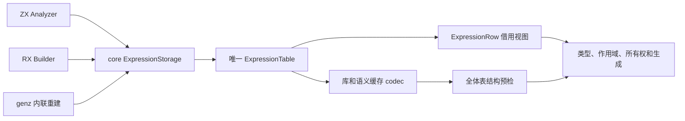

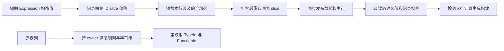

结构检查采用全局前置顺序：主 Program、所有 Function 及全部 Contract 表先通过结构检查，再进入既有语义验证。原因是任务验证会提前读取其他函数，逐函数晚检查不足以保证安全。模块提取 roots 在 Nodes copier 之前读取表，因此两者各自保留入口检查；语义缓存 decoder 在返回前检查可选函数及契约。库 codec 复用公共 IR 验证入口。

生成指纹继续按语义行识别 TypeId、FunctionId 和 Span；不能对新的裸 u32 列直接反射，否则既会遗漏类型与函数依赖，也会把源码位置纳入生成缓存键。SymbolTable 同样按语义行读取。生成指纹域提升为 v29，IR 提升为 27。

借用边界：Storage 的历史 view 不能跨任意后续 append 保留；失败扩容也可能改变列地址。retained 只保证本次追加输入的同表 ID slice 在成功预留后重新定位。字符串字节仍属于外层 arena 或源 owner，finish 只转移列缓冲区，跨生命周期 artifact 复制必须复制字符串字节。此次没有引入通用 appendRow、可变 row 指针或 truncate API。

现有变异测试随表示调整，保持原语义意图。只改 TypeId、运算符或引用时，仅复制对应列；切换种类时同时维护旧载荷移除和新载荷发布，不能让测试仅因列结构无效而提前通过拒绝断言。

### 正式表达式存储验证与自我复核

最终根构建 35/35 步骤通过。十二项主批专项（契约、独立表达式、库 codec、缓存 codec、模块 artifact、模块生成、原生引用 IR、RX 推断、任务分析、typed try 分析与库、XML 位置）112/112 步骤、460/460 用例通过。补充八项专项（模块调用、聚合循环、迭代调用、库初始化、缓存所有权、集合谓词、解析缓存、loop 语法边界）273/273 步骤、553/553 用例通过。前端专项 23/23 步骤、313/313 用例通过。以上按各批运行记录，不表示去重的全套测试数；未执行全量测试，没有新增测试用例。

最终 CLI 重新编译所有权 RX/ZX 模块图，生成 Zig 与内联语义遍历阶段基线逐字节一致。输出哈希和变更源码哈希记录于 `正式表达式存储结果.json`。编译过程中修正了旧数组空值、四类记录读取接口及不属于 IR 的同名 nodes 接收者；最终构建和专项均在这些修正后运行。格式化仅作用于本次变更文件。

此次正式替换 Program、Function、Contract 和独立 Expression 的唯一持久表达式表示，读取时不再构造四类记录数组。追加仍将构造载荷写入列池，跨 owner 的 artifact 复制仍按生命周期复制列与字符串；不能据此宣称整个编译器的数据路径已经全部零复制。控制流仍为旧树，完整自举尚未完成。

新的列结构拒绝规则经过逐字段静态复核，并由真实 IR 与现有非法语义、生命周期、分配失败回归覆盖；没有新增针对每种畸形列组合的伪造输入，因此不是完整的形式化证明。历史 Body 观测草稿已调整为直接借用正式表达式列、对照两套读取视图，但本阶段没有重新接入临时 observer；先前观测日志仍只代表各自阶段快照。

## 正式控制流存储切换

Intent：把 Program/Function 的语句树替换为唯一控制列存储，使完整函数体的符号、表达式与控制流均可直接借给 RX/ZX 自举接口。

Data：已验证的 27 列控制 schema、8 种语句、后序块编号和读取视图；正式 symbols/expressions 已迁移。现有 owner 是 ZX Analyzer、RX Builder 和 genz 内联重建，artifact 克隆保持函数内 ID 不变。

Edges：主体同时携带稳定的 ControlTable 指针与可选根 BlockId，避免分离传递后误用其他函数的控制表。无主体使用 null root，合法空块仍有块 ID。列描述符在所属 arena 中稳定持有；Block/Case 读取视图不指向按值参数的局部描述符。构造值只保存子块 ID，父块暂存后一次发布，所有子块须先发布；不能边构造父语句边插入子块而破坏连续分段。读取视图不能跨同 owner 扩容保留。

Answer：正式 core ControlBody/ControlStorage、全部构造及读取路径、codec 结构门禁和语义 fingerprint；只迁移现有回归，完成后提交推送。初始临时语句数组只用于构造一个块，不作为发布后的持久表示。artifact 跨 owner 完整复制控制列并保留局部编号，无需递归重建语句树。

控制列仍表达树，不允许共享子块。后序编号只排除环，不能排除共享 DAG；共享会使现有按作用域递归分析产生指数遍历。因此 Body 校验在列分段检查之后以 O(块数) 临时归属与深度表检查：根块没有父归属，每个其他块恰好一个父归属，所有块均被覆盖，控制树深度不超过既有作用域边界 256。后序编号允许同步自底向上计算深度；这避免平铺 JSON 绕过旧嵌套格式的深度约束。校验分配失败按原 OutOfMemory 通道传递，不把失败解释为合法输入。该约束由公共 IR、语义缓存和 artifact 复制入口执行。

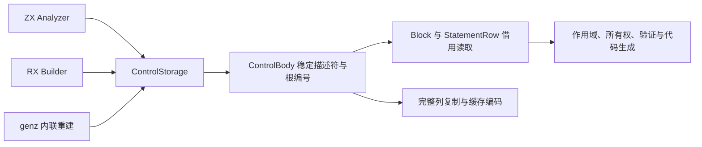

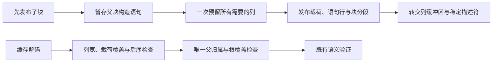

### 正式控制流存储验证与自我复核

最终根构建 35/35 步骤通过。主批十二项专项 112/112 步骤、460/460 用例通过；补充八项专项 273/273 步骤、553/553 用例通过。库发布既有契约篡改回归使用现有 Z3，3/3 Node 用例通过；首次未指定 solver 时因环境缺少 PATH 内的 Z3 返回 FileNotFound，显式配置后通过。没有新增测试，没有执行全量测试，各批数字不表示去重的全集规模。

正式 CLI 在关闭缓存后重新编译所有权 RX/ZX 模块图，生成 Zig 与表达式迁移基线逐字节一致；结果哈希、源码哈希和压缩运行日志随本记录保存。IR 版本为 28，生成指纹域为 v30；旧缓存按既有版本门禁失效。现有夹具保持原语义断言，库契约篡改夹具同时维护表达式载荷池，避免因物理列不合法而提前拒绝，掩盖契约校验退化。

自我复核发现并补齐两类平铺格式风险：共享子块造成递归分析放大，超深控制链绕过 JSON 嵌套深度限制。入口检查现在拒绝两者，但没有新增覆盖所有畸形列组合的用例，不能宣称形式化证明完备。正式持久 Body 已无旧语句树副本；单块构造仍使用临时语句值，跨 owner 生命周期仍复制列。历史 observer 与候选 ZX 控制检查器尚需按新的树约束对齐并接入，完整自举仍未完成。

## 完整 Body 接入所有权 RX/ZX

Intent：让正式所有权 facts 使用完整 RX/ZX 执行器；Body 的符号、表达式、控制列均直接借用正式存储，移除重建旧模型的过渡转换。

Data：正式 IR 28 已统一三类列存储；既有 ownership 草稿完整覆盖 36 种表达式与 8 种语句，具有真实成功事实、拒绝位置及分配成本的历史对照。当前草稿仍采用嵌套记录及 u64 ID，不能直接接收正式表；历史对照不能自动成为迁移后的证据。

Edges：工作栈、快照、布局等内部 u64 索引保持不变，读取 u32 IR ID 时显式扩宽。Body.root 改为可空并保留无主体语义；ZX 结构校验同步唯一子块归属、根覆盖及 256 深度限制。函数归属与 Store 元数据仍为独立适配边界，不在 Zig 中预计算 escapes 等所有权事实。seed 可保留旧算法引导生成，但正式检查必须调用生成模块；Store 编排、其他原生规则及阶段自编译仍是后续完整自举验收内容。

Answer：迁移并验证 RX/ZX 读取层，接入正式 facts 及构建依赖；在现有所有权、库、缓存及 Store 专项中核验成功与拒绝语义。只在实际改动范围运行专项，不新增测试、不运行全量测试。生成代码和平台适配由既有静态模块构建，不引入解释器或专用运行库。

实际 ABI 实例化暴露了此前声明阶段没有验证的边界：正式 Symbol/Expression/Control 的枚举列使用显式 enum(u32)，而 ZX ABI 生成器使用按成员数推导的最小标签类型。直接借用编译期检查正确拒绝这组尺寸不一致。现将内部枚举列对齐生成器的推导表示，并额外检查 tag_type 完全一致；ID 与偏移列仍为 u32。JSON IR 的枚举名称、成员顺序及字段不变，不增加复制，也不把所有 ZX 枚举全局放大为 u32。历史“声明已匹配 schema”的记录只能说明成员集合，不能当作 ABI 实例化证据。

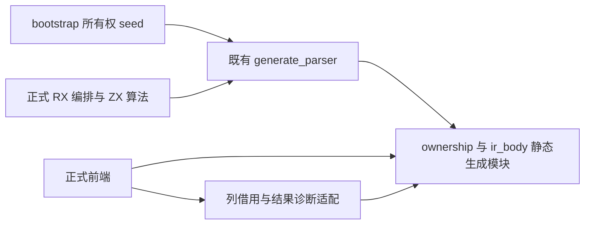

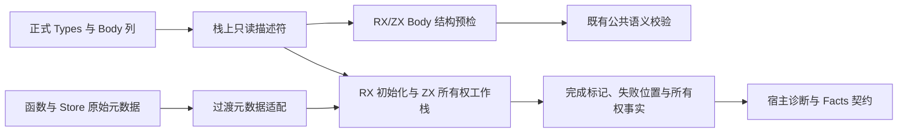

### 正式接入验证与自我复核

正式前端的所有权 facts 已切换到生成模块，旧 check/places/layout 移入 bootstrap/ownership，仅无生成解析器的 seed 构建可导入。新增正式源码不引用 docs。RX 负责准备布局、初始化内存及调度执行；ZX 负责工作栈、分支快照、借用传播和结果归属。公共 IR 校验先检查主 Body 与全部函数 Body 的列结构，再运行既有语义检查，避免跨函数读取未经验证的列。

实际实例化确认三类列和类型表可借用；枚举借用同时检查标签类型、尺寸、对齐、成员名、顺序和值。函数 output_ownership 与 StoreSlot 仍复制为 ABI 记录及指针数组，字符串借用，不预计算逃逸事实。因此这里只能确认 Body 输入无旧树重建，不能宣称整个 Program 或整条编译管线 zero copy。

根构建 35/35 步骤通过；前端专项 23/23 步骤、313/313 用例通过。所有权、Store、任务、取消、typed try 与 match 主批首次执行 536/536 用例通过，但取消形状夹具仍将旧 union tag 当作列种类，导致三个依赖步骤未构建。仅把夹具期望类型改为 ExpressionRow 后，最终主批 130/130 步骤通过，其中 4/4 用例实际执行，其余命中缓存。补充库、缓存、模块与 RX 专项 92/92 步骤、288/288 用例通过。没有新增测试或运行全量测试，以上数字不作去重加总。

新 CLI 在关闭缓存后编译迁移后的所有权 RX/ZX 模块图，生成 Zig 与 seed 基线逐字节一致；ABI 文件也逐字节一致。旧 native CLI 对相同输入的输出与 ABI 同样一致。输入、源码和产物哈希见《正式所有权接入结果.json》，日志按阶段压缩保留。此处是该模块图的自编译对照，尚不是完整编译器 stage 1/2/3 验收。

单次 Debug CLI 对照中，新路径耗时 24.27 秒、峰值 RSS 13,584,523,264 字节；旧 native 路径 19.92 秒、峰值 RSS 13,885,915,136 字节。该输入的整体管线原本就有约 13–14 GB 峰值，不能将其解释为本次所有权接入新增的数量级退化，也不能据此宣称性能提升。未做分层成本归因或统计性能证明。

自我复核：正式算法迁移成立，但输入/诊断桥、函数元数据、Store 编排及 artifact/cache 的原生结构检查仍是过渡依赖。全部自举目标仍未完成。历史临时 observer 未接回正式路径，历史日志不替代本次验证；结构拒绝规则的静态核验与现有专项也不等价于完整形式化证明。

## Store 槽位持久列存储

Intent：消除所有权输入中逐槽位重建 Store ABI 记录的过渡复制，为函数元数据与完整 Store 编排迁移提供可直接借用的基础。

Data：Program、Function、模块 artifact 当前均持有 StoreSlot 记录数组；所有权输入每次调用重新分配记录和指针数组。槽位只有路径、类型 ID、句柄与读写权限五个字段，和已迁移的 SymbolTable 同属稳定编号的只读表。调用表达式的 stores 则是 u32 槽位映射，必须保持独立。

Edges：先建立唯一五列持久表示，构造用 StoreStorage，读取按值返回单个 StoreSlot；不得另存持久旧数组。跨 owner 的字符串和列复制保留生命周期语义；类型映射和包实例重定位仍显式处理。未完成 Function 表迁移前，函数摘要数组仍是过渡边界。完整 Store 编排还受 ZX 不能直接调用本地 RX、以及每个函数分析工作区需及时释放的约束，本阶段不伪造通用调用能力。

Answer：正式持久表及构造、读取、artifact、缓存和 genz 路径同步迁移，ZX 使用相同五列 schema。现有夹具仅按表示迁移，不新增用例；运行受影响专项，记录实际证据并提交推送。IR 结构版本随序列化形状变更提升。

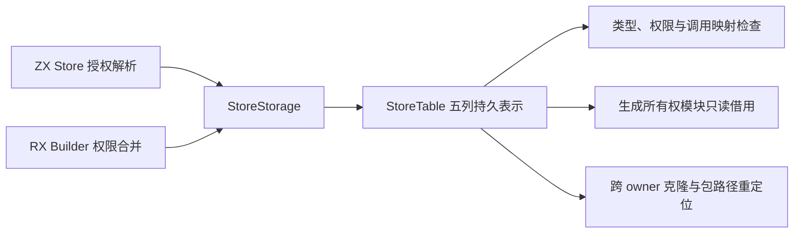

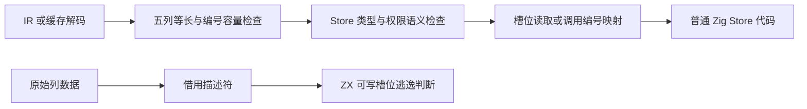

实现复核：StoreSlot 保留为单次构造与按值读取的记录；Program、Function 和 artifact 不再持有该记录数组。调用表达式的 stores 仍是槽位编号映射，不改成 StoreTable。复制路径复用 Nodes.stores，显式复制路径和句柄、映射类型 ID；同 owner 下仅重定位一个路径时只复制路径列。公共 Body 结构检查和 semantic cache 解码同时检查列宽，seed 使用对应原生结构检查。IR 版本提升为 29，生成指纹域提升为 v31。

五列数据直接借用，但每次调用仍包装函数摘要、函数指针和 Store 表描述符；这不是完整 Program 零复制。Store 编排的后续调用可通过现有统一库接口发布 check.rx，再由 ZX 静态导入，无需放开本地 RX import；普通调用仍共用 allocator，逐函数工作区释放必须单独解决，不能新增所有权专用原生回调。

批量迁移曾尝试 Grit 的 Zig 语法规则，当前安装版本拒绝 language zig，因此回退到限定接收者的结构替换与逐段复核。调用映射、Context 注入绑定和 RX Store 声明均保留原表示；既有测试只迁移读取与构造类型，不增加或放宽断言。

现有 Store IO 专项暴露了独立的初始化判定问题：RX project 在完成联结后将应用 native_modules 目录附到每个初值，用于共享类型身份；后端却仅凭目录非空拒绝初值。该目录不是执行效果。后端现保留 type_only=false、functions 为空、Store 为空、contracts 为空、完整 validateIr、void 输入、object 输出和共同 ABI 类型检查，仅移除 native_modules 非空这一无关拒绝条件。所有原生调用仍需引用 functions，空函数表及 IR 校验共同排除实际调用；没有清空目录绕过类型身份验证，也没有放宽测试断言。

### Store 列迁移验证与自我复核

最终根构建 35/35 步骤通过。主批 Store、所有权证明、artifact 槽位、模块 artifact、缓存与库 codec、库联结、库初值、RX 推断及原生引用 IR 专项 101/101 步骤、653/653 用例通过；首轮 515/515 已执行用例通过，但遗漏了一处夹具局部 slots 变量的旧下标读取，已只迁移读取方式后重跑。前端专项 23/23 步骤、313/313 用例通过。

Store runtime、IO、独占回收与跨请求借用专项最终 76/76 步骤通过，构建汇总包含 39/39 Zig 用例，节点运行器的独立消费者检查见完整日志，不将两类数字混合加总。初轮三个 IO 生成失败由上述共享 native 目录误判引起，修复后全部通过。已发布库的 Store 授权与缺失初值边界 8/8 Node 用例通过。没有新增测试，没有执行全量测试，也没有放宽现有断言。

无缓存重新编译既有所有权 RX/ZX 草稿模块图，生成 Zig 和 ABI 与上一阶段基线逐字节一致；这证明该输入的编译行为没有因槽位物理存储改变而变化，不等价于所有可能程序的形式化证明。最终输出与正式源码哈希见《正式Store存储结果.json》，阶段日志压缩归档。

自我复核：迁移从源码构造到发布与消费覆盖同一持久表，未保留 StoreSlot 数组副本，调用编号映射保持原义。对零复制的结论仅限读取五列数据；类型重映射、跨 owner 复制以及函数摘要包装仍存在。完整 Store 编排和整个编译器自举仍未完成。

测试会话随后反馈 37d53431 的 process_entry/fixtures/state.rx 同样触发 InvalidInitializer。已用本阶段最终 Debug CLI 复制原夹具、执行 `build state.rx --optimize safe --no-cache`，退出 0；实际运行所得 count=7，argv/env 与传入值一致，cwd 与临时项目的物理路径一致（macOS /var 为 /private/var 的别名）。只复用既有夹具，没有新增用例。该证据验证 ReleaseSafe 应用生成与运行；执行编译命令的 CLI 自身是 Debug，不冒称已复验 ReleaseSafe CLI。详见《Store初始化反馈复验.json》。
