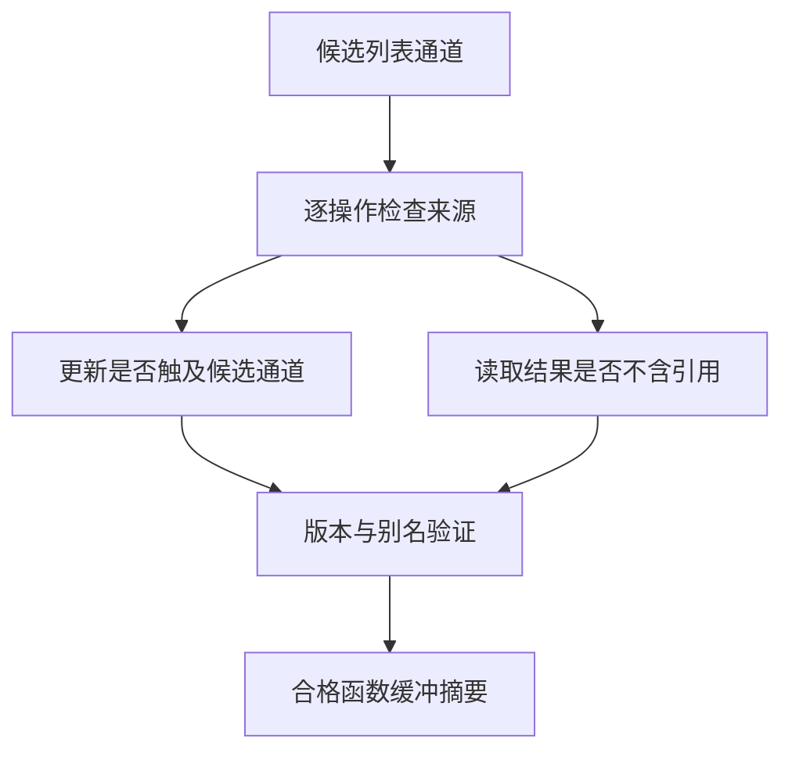
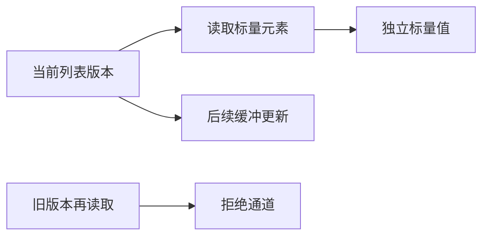

# 缓冲通道局部审查

## Intent：最终目标

函数缓冲摘要按候选通道判断安全性，允许不触及该通道的列表更新，以及不会保留列表引用的元素读取；保留旧版本、重复别名和真实逃逸的拒绝规则。

## Data：可用证据

所有权草稿 snapshots/drop 的两个 first 列因读取 u64 元素被 element_read 拒绝；snapshots/update 的多个未修改列因函数内部修改另一 states 列，被统一的 unsupported_operation 拒绝。当前 audit 对全部 list_update 无条件拒绝，对候选通道上的全部 index 无条件拒绝，尚未利用已有 detached 类型判定和版本验证。

## Edges：边界与限制

只放行结果类型已由 flow.detached 证明不含列表引用的 index；列表及仍可能保留列表存储引用的聚合仍保持拒绝。list_update 只有 target 与 replacement 均不含当前通道来源时才放行。所有候选最终仍执行 versions.check，其中观察读取时的版本、检查调用参数别名、拒绝旧版本继续使用。此项不实现跨函数原地更新通道，也不放行所有权检查器特定字段。

## Answer：交付与验收

最小修改位于 genz 函数缓冲 audit；使用已有快照草稿观察摘要变化，重新生成完整检查入口并实例化，运行适用的已有缓冲与只读访问专项。无新增测试、无全量测试；记录实际接通的通道和仍未解决的复制。

## 自我复核

detached 判定不表示任意操作无副作用；仍必须通过最终版本检查。只读审查、生成摘要或编译成功，均不能单独证明行为等价。完整所有权检查器的 states/memo 生命周期和正式接线仍是后续工作。

## 生成观测

固定 library.zxcir 输入的摘要变化：apply 的 trail 通道通过，drop 的两个 first 列通过，update 的五个未修改列通过。index 输出满足既有 detached 规则时允许读取；不相关列表更新不再直接否定整个函数。候选自身的写入仍被拒绝，版本审查入口未更改。

完整所有权入口的循环外容量由 8 份增至 10 份；37 号 update 函数的三个调用点改为 buffered。这里仅其未修改列传递容量，不能声称 states 更新已变成原地修改。入口已无缓存生成并通过 ReleaseSafe build-obj；编译器根构建 35/35、观测工具构建 23/23 成功。已有 test-detached-reader、test-iterate-buffer、test-iterate-calls 专项共 194/194 步骤成功、341/341 测试通过，另有 1 个库重发布测试通过。没有新增或修改测试，没有执行全量测试。
