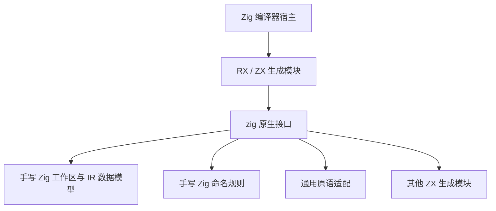
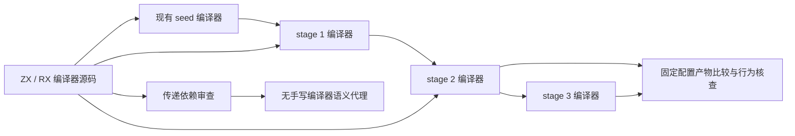

# 自举原生依赖核查

## Intent：最终目标

核实“使用 zxc 自举”的实现是否被缩减为 RX/ZX 调用手写 Zig，并给出可审阅的纠偏边界。完整自举要求编译器自有逻辑与数据模型由 ZX/RX 表达；生成普通 Zig、使用 Zig 后端本身不构成偏离。

## Data：可用证据

2026-10-07 检查工作区，HEAD 为 `9a479db2`。工作区存在其他未提交修改，本记录描述检查时文件内容，不将其等同于该提交的纯净快照。

统计范围为 `packages/compiler/src` 中 `.zx` / `.rx` 实现文件，排除 `.d.zx` 声明。385 个实现文件中，37 个含 `zig:` 字符串引用，共 83 处，涉及 9 个模块。计数包含同模块的值与类型重复导入，不代表调用数或迁移百分比。

| 原生模块          | 引用处数 |
| ----------------- | -------: |
| resolution        |       31 |
| integers          |       19 |
| merge_writer      |       10 |
| type_names        |        7 |
| extract_workspace |        4 |
| named_columns     |        4 |
| references        |        4 |
| merge_workspace   |        2 |
| origin_writer     |        2 |

`packages/compiler/src/zx/analysis/semantic/native` 内有 17 个手写 Zig 文件，共 909 行；该数字不包含它们依赖的工作区、类型表、lint 等实现，不能当作全部原生依赖规模。

### 已证实的三个层次

1. **语言规则仍由 Zig 实现。** `semantic/types/validation/members.zx` 调用 `names.validMember`；`semantic/native/type_names.zig:9–14` 将标签及成员命名校验交给 `packages/lint/src/root.zig:14` 的 `checkName`。后者实际决定首字母、字符集、下划线和大小写规则。这不是 OS 或 ABI 必需的工作。
2. **算法已有 ZX 实现，数据模型仍在 Zig。** `semantic/resolution/name.zx` 确实实现内建类型优先级、别名搜索、递归及深度检查和声明选择；`semantic/resolution/intern.zx` 确实执行查重及容器种类分派。但 `semantic/resolution/workspace.zig` 定义 Frame、State、解析栈及对类型表、resolved、visiting 的引用；`semantic/native/resolution/append.zig` 写入实际 IR 数据。属于混合迁移状态，不能称完整自举。
3. **通用原语适配。** `semantic/native/integers.zig` 只提供 u32/u64 拓宽及带溢出检查的收窄，不应与语言语义代理同等定性。若最终移除该桥，应先核实普通 ZX 的转换能力，避免为了删除 import 引入错误语义。

另一个容易误判的实例：`semantic/native/resolution/buffers.zig:52` 的 `sortFields` 调用的是 `generated_name_sort.execute`，不能仅凭外层 Zig 文件就认定排序算法尚未迁移。必须沿调用链判断实现归属。

### 构建证据

`packages/compiler/build/generate_parser.zig` 注册这些 `zig:` 声明；`packages/compiler/build/parser.zig:275–333` 将手写 type_names、resolution 存储模块接到生成模块；`packages/compiler/build/compiler.zig:43–64` 将生成模块和工作区一起接入正式 frontend。依赖并非只存在于历史文档或示例中。

当前结构：

## Edges：边界与限制

- 静态链接、没有专用运行库与自举是两个独立维度。手写 Zig 编译器逻辑可以满足前者，却不满足完整自举目标。
- 仓库允许显式静态原生模块，不等于编译器自有语义可以永久留在原生模块中。
- `完整类型解析自举/实施计划.md:7、14、100` 明确采用“语义决策在 ZX，存储及分配留在 Zig”的阶段方案，并声明整体尚未完成。因此可证明目前有差距，但不能据此声称此前完全没有迁移或已虚报整体完成。
- 本轮没有遍历所有原生函数及其传递依赖，没有计算全仓自举比例，也没有执行 stage 1/2/3。不存在完整自举成功证据的新增结论。
- 未修改正式源码、规则和既有计划；未新增或运行测试，未调用浏览器。

## Answer：交付格式与成功标准

交付本核查记录。结论：用户观察成立，当前是部分算法迁入 ZX/RX、仍依赖手写 Zig 数据层和部分语言规则的混合编译器。

根因判断：迁移围绕现有 Zig 数据布局保留兼容接口，阶段完成标准聚焦于控制逻辑迁移。它降低了每次切换的范围，却留下越来越多编译器专用原生接口。缺少对最终依赖闭包的约束时，阶段策略容易成为最终架构。此为基于源码和计划的技术判断，不推测实施者动机。

### 建议执行顺序

1. 明确最终边界：自有词法、语法、类型、所有权、IR、模块联结及生成算法与状态模型由 ZX/RX 表达；平台能力、通用底层原语和 Zig 后端单独列明。旧 Zig seed 可保留为引导输入，但不得被最终编译器回调执行编译器语义。
2. 先迁移确定泄漏的命名规则。保持现有规则行为和公共接口，不凭接口名批量删除原生依赖。
3. 以一个完整职责为单位迁移状态所有权，例如类型解析的 Frame、State、类型表及缓存。若普通 ZX 的表达能力、容器或所有权不足，先记录具体缺口；不要继续新增同职责专用 workspace 绕过它。
4. 将所有临时原生桥列为未完成项。模块完成需检查传递依赖，不只看入口后缀或生成成功。
5. 最终验收同时检查编译器语义依赖闭包与阶段自编译。stage 1 构建 stage 2、stage 2 构建 stage 3，在固定配置下比较约定产物并复核行为；产物相等不能抵消对同一手写 Zig 核心的依赖。

目标数据流：

### 自我批判

仅搜索 `zig:` 会漏掉直接由 Zig 宿主执行的未迁移部分，也会误伤整数转换和回调生成模块。此次用构建接线及具体函数实现交叉检查，足以确认问题存在；尚不足以给出全部迁移成本。下一步应按职责建立完整依赖清单，而非用 37/385 作为自举完成率，也不应为追求零 `zig:` 字符串将相同逻辑藏到 `std:` 中。
