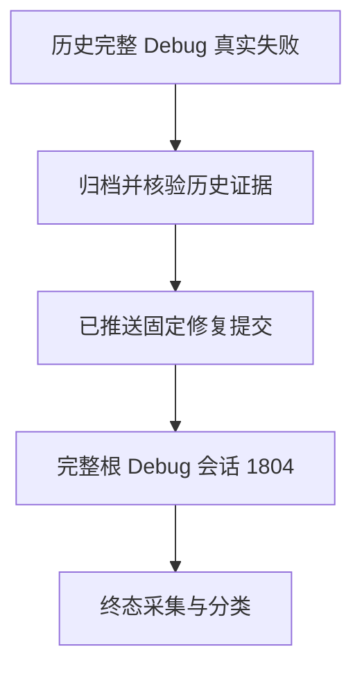

# 修复后全量 Debug 复验

## Intent：最终目标

在包含后续生产修复与两个库辅助程序同步的固定提交上，重新执行完整根 Debug，确认原失败及新增功能在全量门禁中的真实终态。

## Data：可用证据

原会话 45358 已真实退出 1；原完整日志、1,414 个实际测试二进制身份及失败分类已归档核验。`9f2979bfca5abd9d976d8cad037e765daebd9478` 已推送，包树为 `9aeff4ae3b7e6b189a5e1b42380cb53fcd1310e4`。原固定检出只有两个未跟踪的 node_modules 符号链接，经快进后没有包源码修改。

新完整根 Debug 会话为 1804，2026-10-07 12:53:55 UTC 启动。目录、完整命令、日志和缓存路径见 `修复后完整Debug运行状态.json`。

## Edges：边界与限制

这是新的固定版本完整运行，启动不代表通过。运行中不推进检出、不改变包源码、不因观察等待结束而重启。其他两个完整 Safe 会话 55686、17752 保持原固定检出。终态才采集实际摘要、失败及二进制身份，不把缓存步骤计为新执行检查。

## Answer：交付格式与成功标准

先交付可恢复运行定位，终态再交付完整原始证据与独立故障分析。英文 Conventional Commit 保存本次定位；仅经当前版本独立复验的生产缺陷才通知实现会话。

## 自我批判

专项库检查在旧执行基础加两个草稿上通过，新全量运行还包含后续表达式语义检查自举；不能把专项通过直接移植成新提交全量通过。本记录仅证明新命令已启动及源码身份冻结。
