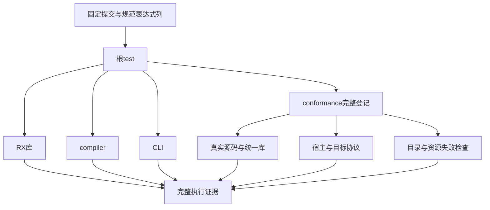
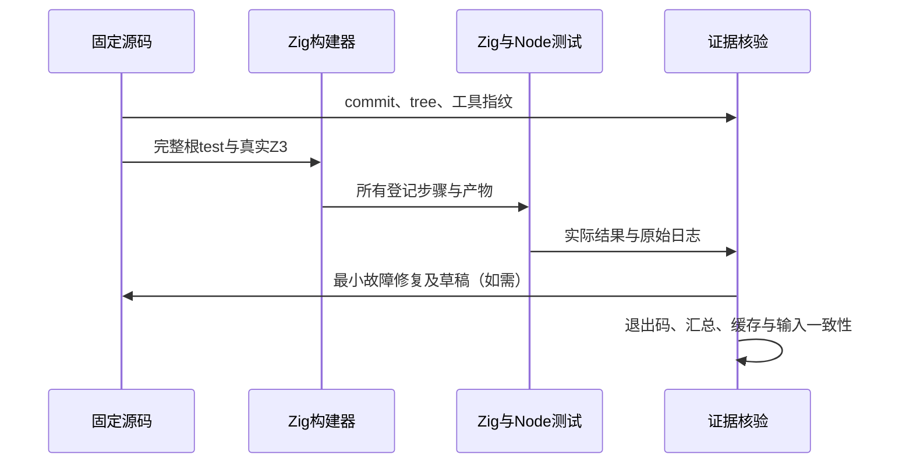

# 规范表达式列全量回归计划

## Intent：最终目标

在共享表达式列重构69897bd7及后续测试提交后的固定基线，执行根test完整门禁，覆盖RX库、compiler、CLI和packages/test的所有已登记测试。查出跨职责回归并修复实际测试或经验证的生产缺陷，保留可续作证据，每个完成部分提交push。

## Data：可用证据

固定基线与根tree/packages tree、Zig/Node/Z3版本和Z3 SHA在开始基线.json。已有目录128,363项，53,597项锁定Test262原文，50,635项仍未审阅；目录审计与执行证据严格分开。

根build.zig的test显式依赖RX库测试、compiler/test、CLI/test及conformance/test。测试包默认入口包含507组runtime、前端、整数安全、模块图、Store、求值顺序，以及统一库、缓存、宿主协议、Wasm/WASI、NAPI、包管理、工具链、形式验证和资源失败检查。没有frontend-filter或单一特性替代总入口。

真实Z3已经在/tmp/zxc-z3-5.1.0/z3-5.1.0-x64-osx-13.3/bin/z3存在，verification驱动支持ZXC_TEST_SOLVER。沿用已有工具，不安装新依赖。

## Edges：边界与限制

该完整门禁证明固定提交已登记测试，不证明所有Test262等价或所有语言未来特性。两种优化先ReleaseSafe后Debug；主机为macOS x86_64。根目录有其他会话原有修改，实际执行使用干净的既有固定worktree，不混入共享源码中途变化。

通过独立临时build cache提高本次运行可观测性；仍记录任何缓存步骤。Node内部构建可能有自己的缓存，不能推断每项都无缓存。构建器测试汇总、目录行数、Node实例数、原文审阅数分别记录。

## Answer：交付格式与成功标准

1. 保存完整命令、具体句柄、实际终态/退出码、原始日志、基线身份及目录审计。
2. 以实际失败行定位源码和产物，不放宽预期为任意错误。测试夹具与生产缺陷分别分类；只有已验证生产缺陷通知实现会话。
3. Debug和ReleaseSafe总入口均退出0，完整汇总无失败，执行后基线与输入保持一致，才声明本阶段完整通过。
4. 若需要修复，最小正式修改仅限实际故障职责，草稿和冻结SHA保存在本目录；修复后重跑受影响门禁及总入口。
5. 发布前核对精确暂存路径、提交钩子后字节及根目录原有修改；英文Conventional Commits提交并push。

## 架构图

## 数据流图

## 自我复核

不把目录数量当成功执行数，不把某一特性通过外推到完整根入口；不因真实总门禁运行时间长而转成狭窄通过测试。进程句柄观察超时不代表运行终止，必须继续跟踪同一实际句柄。总目标保持原范围，部分完成不标记整体完成。
