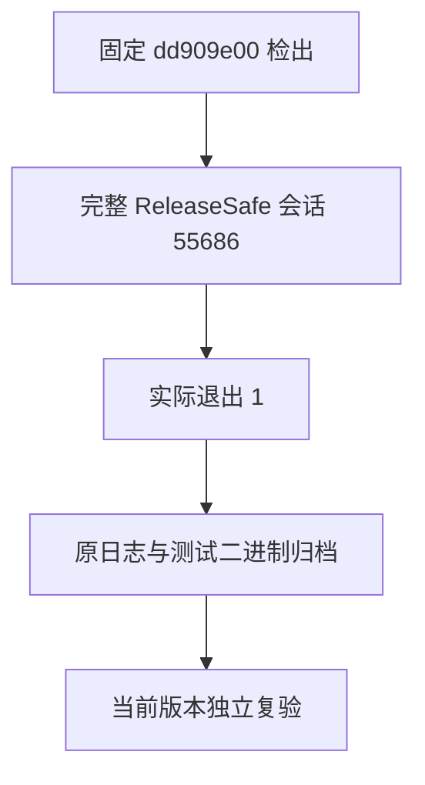
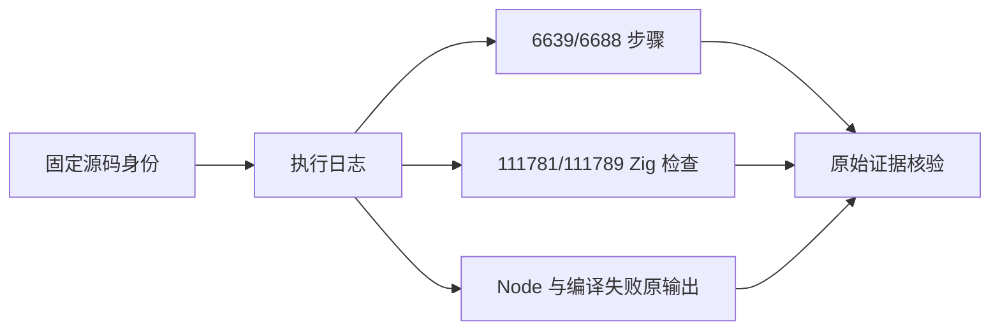

# 规范表达式 Safe 完整门禁终态

## Intent：最终目标

保存长时间完整根 ReleaseSafe 的真实终态，保留原版本失败作为复验依据，避免把运行观察或专项修复误报成完整通过。

## Data：可用证据

固定版本为 `dd909e006261883e88375779c94ada8d4b33c836`，包树 `a7797e6dadb21e0a7522600455dc5e51b9700f2b`。会话 55686 已真实退出 1：6639/6688 步骤、111781/111789 Zig 检查，21 个失败步骤、8 个失败 Zig 检查。

原日志归档为 `日志/规范表达式Safe.txt`，完整命令、日志 SHA 和 1,443 个实际测试二进制身份在 `规范表达式Safe证据.json`；832 个缓存摘要项独立记录。固定检出没有 tracked 包源码变化，仅保留未跟踪的既有文档和 node_modules 链接。

失败涉及生成物一致性检查、嵌套归约容量、枚举验证、语义 lint、迭代 CLI、类型视图、Task、StoreIO、库发布与进程入口等门禁。它们属于这个历史版本；原日志中的 Node 检查不能并入 Zig 摘要的 111,789 计数，失败步骤也不能直接等同于独立生产缺陷数量。

## Edges：边界与限制

本次仅归档，不改生产源码、不放宽断言、不修改原生成器、不新增 Test262 案例。后续专项修复证据与历史完整门禁保持不同来源；当前修复版完整 Debug 会话 1804 仍执行，另一历史完整 Safe 会话 17752 尚未终态。

## Answer：交付格式与成功标准

交付原日志、终态 JSON、完整证据与核验程序。逐一核验所有日志测试二进制 SHA 和固定检出身份后，以英文 Conventional Commit `test(regression): archive canonical ReleaseSafe failure evidence` 提交并推送。只有在当前版本独立复验仍失败并确认是生产缺陷时，才通知实现会话。

## 自我批判

完整运行期间发现的历史失败已分别出现后续修复，但尚不能把这些专项成功累加成新版本完整 Safe 成功。本记录不宣布 21 个失败全部关闭，也不重复通知未经当前版本核实的历史失败。
