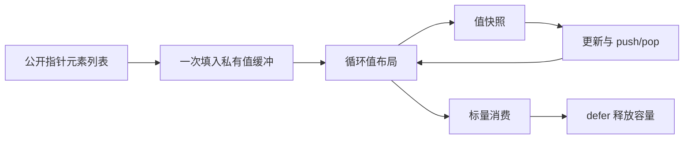

# 局部聚合列表内联实施记录

## Intent：最终目标

让普通 ZX 聚合列表在已证明不逃逸的循环中存储布局值，为解析 Frame 栈的 RX/ZX 迁移补齐通用生成能力。最终目标仍包含完整解析状态和类型表迁移，本阶段不是完整自举。

## Data：实现证据

- `iteration_value/list_plan.zig` 统一检查状态类型、所有聚合列表路径的版本分析、已有缓冲覆盖、condition/body 的完整 IR、局部 symbol、普通缓存、身份比较与函数边界。
- `iteration_value/local.zig` 只接入 consume/discard，保存并恢复生成上下文；最终 consumer 的独立下标在退出内联上下文后生成。
- `initial.zig` 直接向每条聚合列表的 Capacity 填充值元素，初始状态字段引用相同 items，不经中间转换数组再复制。
- `types/root/scope` 在局部上下文贯通值类型、下标、列表构造、scope 与一次求值缓存。
- `collections/list_update` 按当前上下文选择元素表示；其原有参数求值顺序、边界和长度检查保留。
- `iteration_buffer/analysis.zig` 的 optional_value 仅在子事实不包含当前列表版本时允许解包，含别名事实仍拒绝。

## Edges：明确边界

列表元素只接受纯 product：普通标量、枚举、错误、原生引用及其 optional/object/tuple 组合。元素内部包含其他列表或 task 的形状不进入此局部路径。状态不能在 optional 中包裹列表，所有聚合列表都必须取得独立容量缓冲。未证明的身份比较、聚合或列表入出调用、外层聚合捕获、任务、Store、嵌套循环等保留旧表示。

零轮执行仍转换非空初始列表，有一次 O(N) 的元素复制和容量分配；不能称零轮零分配。每轮不会因为构造选定列表元素而装箱，也不会复制整个选定列表。容量增长仍可能搬迁。非 lane 的局部新列表仍按普通不可变生命周期分配，不能概括为所有临时内存均被本优化清理。正式返回聚合列表的循环未修改 ABI。

## Answer：交付与成功标准

生产改动、源码镜像、生成示例、运行记录与既有专项结果一起保存。不得把某个示例的成功推广为任意 Frame 状态形状都已支持；完整解析状态必须随后移除专用 native Workspace。

## 实际生成形态

`草稿/局部栈/stack.zx` 是这一阶段的编译展示源码，不注册新测试。它执行 push、读取旧帧快照、更新同一槽位、pop、可选帧解包和标量消费。

生成物使用 `ArrayList(state_type_3)`，其中 state_type_3 是普通值结构。初始 ABI 帧逐个复制到缓冲；下标读取的局部变量是 state_type_3，pop 的返回包装包含 `?state_type_3`。未发现 create、dupe 或 toOwnedSlice 调用；已有 ArrayList deinit 保留。

## 人工执行记录

草稿经正式 CLI 编译为 Debug 应用，程序通过命令行 JSON 参数接收输入。最初使用 stdin 的调用因 ExpectedJsonInput 被拒绝，未进入应用；随后依据实际宿主接口修正。

最终草稿中，每轮快照与更新计算满足 total 下一步为 4 × total + 2。空初始列表执行四轮输出 170；带一个初始帧执行四轮同样输出 170；非空初始列表执行零轮输出 0。三次命令均退出 0。原始输入仅作为借用来源，生成代码先建立私有 Capacity。

这些人工执行覆盖了对象元素的 push、下标旧快照、槽更新、pop 可选结果与零轮入口，不等于嵌套 product、所有分配失败或全部回退分支的完整穷举证明。未生成断言测试文件，未新增测试注册，未执行全量。

## 自我复核

内联优化保留公开 ABI，而不是把所有列表元素全局改成值。容量别名门禁与生命周期条件是启用依据，不识别 Frame、编译器路径或示例字段名。首次输入转换和几何扩容的真实成本仍在，不能声称整个编译器已经 zero copy。下一步必须回到解析状态迁移与剩余表达能力，不能将这项生成器改进当成最终交付。

## 最终验证

精确源码发行构建 34/34 步通过。循环缓冲、跨函数调用、值返回、类型解析器及类型解析状态既有专项 250/250 步、380/380 Zig 检查、1/1 Node 检查通过。最后一次复核覆盖收紧已有缓冲覆盖检查后的源码。正式 CLI 重生成草稿与前次源码逐字节一致，Debug 应用重新构建并执行成功。

后续完整解析返回至少需要类型表 delta、缓存更新、结果 ID 与诊断；Frame/visiting/游标留在内部。TypeStorage.appendDelta 当前会复制列，不能称零复制接管；字符串可能来自调用结束即释放的 parser scratch，不能盲目借用。类型名字缓存还被 expressions 和 shared_types remap 消费，迁移需同步覆盖。
