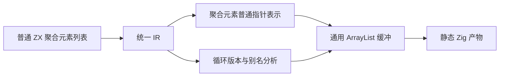
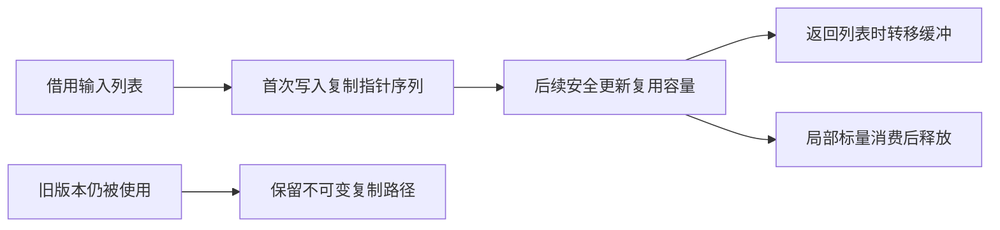

# 解析状态自举的聚合列表前置工作

## Intent：最终目标

让解析状态、访问标记、类型表构建和源节点访问由 RX/ZX 自身承担，删除专用 resolution Workspace。普通 Frame 数组必须通过通用代码生成机制获得合理成本，不能新增专用 Zig 栈桥。

## Data：当前证据

- `semantic/resolution/workspace.zig` 仍持有 Frame 数组、result、每帧子项和字段临时列。
- `analysis/types.zig` 仍持有 resolved/visiting，`native/resolution` 读写状态及类型表。
- 普通 ZX loop 已支持对象、元组、下标嵌套更新及 push/pop。
- `genz/src/zx/iteration_buffer/root.zig` 的内联循环列表候选仅允许标量、枚举、错误集、原生引用及其 optional，排除了聚合元素。
- `genz/src/zx/types.zig` 的 object/tuple 普通表示是不可变对象指针；`state_value/analysis.zig` 对所有列表元素递归标记 boxed。因此容量缓冲可以稳定保存聚合元素指针，但不会因此消除对象装箱。
- 跨函数 `buffer_call` 已有自己的分析及容量路径；不能把内联循环候选限制推广为所有调用路径都复制。

## Edges：边界与限制

本次先统一内联循环聚合元素与已有普通列表的表示：允许 object/tuple 成为缓冲候选，继续由现有版本与别名分析决定是否安全。列表元素内部的列表不自动获得共享缓冲；不修改任务、Store、原生 ABI 和聚合对象表示。

该步骤消除可证明安全路径上的重复指针数组复制，不代表 Frame 内联存储，不代表解析状态已经自举。聚合对象分配和容量增长仍存在。下一阶段必须继续处理聚合元素的内联存储与逃逸约束，再迁移解析核心；不得以本次优化替代最终目标。

## Answer：交付与成功标准

1. 正式生成器只扩大合法元素形状，不弱化旧版本读取、跨容器逃逸或副作用门禁。
2. 使用既有循环与类型解析专项验证，不新增用例，不跑全量。
3. 保存实际构建结果和源码快照；明确测试范围是否覆盖新元素形状。
4. 每阶段只报告已验证效果，整体自举保持未完成。

## 架构

## 数据流

## 本次代码

`iteration_buffer/root.zig` 的 `element` 候选增加 `.object, .tuple`。容量缓冲保持 `self.types[element]`，因此仍为现有指针数组表示。其余证明和 lowering 不变。

## 自我批判

没有专用 Zig 桥不等于零成本。仅移除候选白名单限制并不能解决对象分配；后续迁移不能将这种部分改进描述为完整性能前置完成。现有专项若没有聚合元素命中，应明确其只验证回归，不能声称覆盖新分支。

## 解析状态完整迁移边界

| 现有状态          | 当前 owner                                   | 最终要求                                        |
| ----------------- | -------------------------------------------- | ----------------------------------------------- |
| frames/result     | resolution/workspace.zig                     | ZX 显式 State 和栈生命周期                      |
| resolved/visiting | analysis/types.zig                           | 声明索引缓存与访问标记                          |
| Reader.Ref        | resolution/reader.zig                        | 正式路径直接消费 ZX 索引 AST；原生指针仅留 seed |
| children/columns  | workspace.zig、native/resolution/buffers.zig | ZX 临时列及 offset/count，明确提交生命周期      |
| 类型表追加        | native/resolution/append.zig                 | ZX 类型表或显式 delta 的构造与提交              |
| 初始化/执行       | analysis/types/resolve.zig                   | RX 编排真实初始化与解析输入输出                 |

验收必须检查 `native/resolution/*` 的传递调用依赖，不以移除某一组 getter/setter 为完成。当前 generated resolution 使用零容量 FixedBufferAllocator，仅因为所有状态分配仍在 native；迁移后必须提供正常 allocator，不得保留零容量入口再声称零分配。

## 下一阶段的表示约束

直接把 `ArrayList(*const Frame)` 换成 `ArrayList(Frame)` 会改变引用稳定性：扩容搬迁会使已取出的元素地址失效。因此内联存储必须同时处理下标读取、快照、push/pop、函数参数与结果、返回边界，不能只换容器类型。

可复用的现有机制包括 `value_call` 的按值聚合构造与调用、`state_value` 的 origin 与边界转换，以及 `iteration_buffer` 的版本分析。当前 `state_value` 是按类型选择表示，并全局将列表元素标记 boxed；应先建立局部列表及元素的使用证明，不能直接删除这个标记，让 ABI 或跨调用快照静默变化。若列表或元素逃逸到旧版本、原生调用、Store 或任务，必须保留既有表示，直到相应边界也有完整证明。

完整解析 Frame 内联存储的证据要求：实际生成代码中帧更新不再 `allocator.create(Frame)`，安全更新不再重复 `dupe` 全栈；零次执行保持借用输入生命周期；越界、分配失败和旧快照语义保持。仅观察到 ArrayList 或没有专用 bridge 不足以证明这些性质。

## 执行结果

发行构建退出 0。既有循环缓冲、跨函数调用、值返回、类型解析器、类型解析状态专项共 250/250 步、380/380 Zig 检查和 1/1 Node 检查通过。未新增测试，未跑全量。

这些结果证明本次修改未破坏所执行的既有路径；当前未取得对象/元组元素列表命中新候选的专项运行证据，不能将其写成已覆盖。静态正确性依据为列表元素递归 boxed、不可变聚合指针表示、现有版本/别名证明未改。

## 内联表示的进一步审查

`comparison.zig` 当前对对象/元组采用指针身份相等，不能在内联后悄悄改成结构比较。下标读取与 pop 必须得到按值快照，不能借出 buffer.items 的地址跨越后续 append 或 update。`iteration_value` 的类型与转换尚未处理 list，deepOperation 也拒绝聚合 list/update/op；不能只替换 Capacity 的元素类型。

下一阶段从局部 consume/discard 的无逃逸列表开始建立独立表达式表示计划，保持公开 ABI 和全局 boxed 规则。身份比较、整列表跨函数及未证明边界先保留原路径；调用只消费元素的标量字段不应因此被禁止。这是通用的安全范围，不按解析器名称或字段判断。
