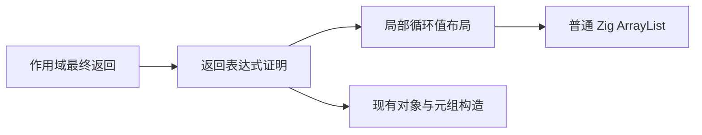
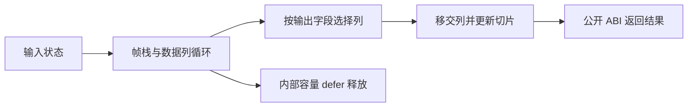

# 局部循环的混合返回

## Intent：最终目标

让 ZX 解析器能够在一个循环中维护值布局帧栈，并返回新构造的类型表、缓存列及标量结果。内部帧栈结束时释放；返回列移交所有权。保持普通 Zig、静态链接和现有公开 ABI。

## Data：可用证据

- 局部聚合列表已生成 `ArrayList(FrameLayout)`；入口仍限标量消费或丢弃。
- `iteration_buffer/capacity.zig` 的 `take` 已生成 `toOwnedSlice` 和 `errdefer allocator.free`，可复用。
- `aggregate.zig` 已处理对象 evaluation 的顺序与缓存，以及普通 ABI 的对象构造。
- `scope.zig` 同时支持公开指针返回和值返回，新的消费入口必须保持这个区别。

## Edges：边界与限制

- 仅对现有局部列表证明成功的循环启用；不改变全局对象表示。
- 返回允许新对象、元组以及标量和标量列表投影；不允许帧对象、帧列表或整个局部状态逃逸。
- 列表输出必须是循环状态的直接字段路径；不能把内部聚合布局视为公开 ABI。
- 移交发生在结果读取前，并更新状态中的切片，避免扩容或收缩后读取旧地址。
- 保留构造顺序；重复列表投影只移交一次。未选中的容量继续 defer 释放。
- 捕获上下文会把错误转为普通控制流，无法直接依赖 errdefer，故暂不启用混合返回路径。
- 初值转换与数组增长仍有实际成本，不能宣称所有数据路径零复制。
- 不新增测试用例，不执行全量测试；运行发行构建和相关现有专项。

## Answer：交付与成功标准

新增通用返回表达式证明和选择性所有权移交，复用现有构造器。交付正式源码、源码镜像、构建记录与生成代码核查。完整自举仍需将解析器状态和类型存储迁移到 ZX。

## 执行与自省

生产改动集中在通用消费入口、局部循环结果生成，以及语句与作用域的返回布局参数。`iteration_value/result.zig` 先证明返回形状，记录列表字段路径和允许的投影，再选择容量移交并让既有构造器生成结果。它不识别编译器模块或业务字段名。表达式按 ID 去重，避免对象 evaluation 与 fields 共享子图导致重复递归。

草稿 `草稿/混合返回/stack.zx` 包含 Frame 栈、输出 columns 和内部 scratch 列。返回对象中 columns 与 mirror 指向同一列。生成代码包含三个 ArrayList，Frame 使用值结构元素；仅 columns 有一次 toOwnedSlice，随后更新状态切片。三个 deinit 均保留；Frame 与 scratch 在作用域结束时释放，已移交的 ArrayList 为空。

初始状态与最终输出各有一次普通对象构造；初始两个空列表仍由既有逻辑生成空 dupe。循环中没有 Frame 的 allocator.create。这是局部生命周期优化，不等于所有分配均已消除。

Debug 应用人工执行：空帧列表四轮输出 total=170、两列均为 [2,10,42,170]；非空初始帧零轮输出 total=0、两列为空；非空初始帧四轮与第一组一致。三次退出码均为 0。没有新增断言测试或测试注册。

首次构建发现局部变量与方法同名、返回语句遗漏新增参数，均已修复。最终验证记录另行附在下方。复核尚未穷举 OOM、捕获上下文、所有嵌套构造及回退；错误捕获上下文显式拒绝本路径，避免误把 catch 跳转视作错误返回。

归档生成源码按仓库 Zig 格式保存；验证 JSON 分别记录 CLI 原始生成物和格式化归档的 SHA256。

完整自举仍未完成：当前正式 resolution 仍通过 Workspace 原生接口维护状态；下一阶段需将帧、访问标记、类型列和名字缓存合并为 ZX 数据合同，并解决输出存储的 owner 生命周期。此处只补齐其混合返回能力。现有局部列表证明只允许标量入出的纯函数调用，未来纯 State 的跨函数 step 还需贯通值表示与缓冲所有权；不能通过把所有模块逻辑塞入单一循环来规避模块化要求。

## 最终验证

包含访问去重与错误捕获门禁的终态源码：发行构建 34/34 步通过；现有循环缓冲、跨函数调用、值返回、类型解析器与类型解析状态专项 250/250 步、380/380 Zig 检查、1/1 Node 检查通过。最终 CLI 重生成结果与先前原始生成物逐字节一致，Debug 应用再次构建并三次执行成功。所有验证进程均正常退出，没有执行全量测试。
