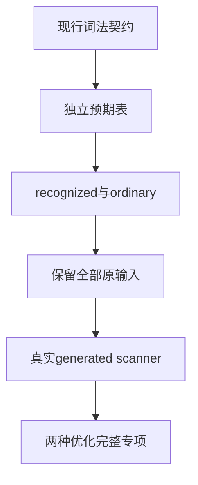
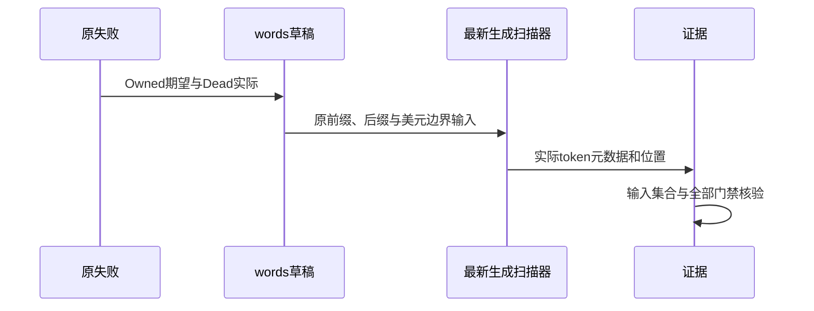

# 词法元数据契约同步计划

## Intent：最终目标

修复当前完整根回归中的scanner metadata预期失配，同时保留旧关键字作为普通标识符的完整覆盖，不删除失败输入。

## Data：可用证据

已发布37d53431的完整ReleaseSafe运行17752实际发现words_test两项失败，旧夹具期望Owned，真实扫描器返回Dead。IR契约版本22已经移除显式输入消费；现行keyword_model.zx和keyword_transition.zx不再声明owned状态。

words.zig仍把owned列入contextual，expected用该列表独立构造关键字及其所有前缀的元数据。失败来源是期望表保留旧词法契约，不能把它上报为现行lexer错误。

## Edges：边界与限制

正式修改仅一个测试预期表。reserved与其余contextual字节不变；owned继续加入all的测试输入，覆盖全部前缀、suffix、大小写、美元前缀和词中美元边界。只是从recognized移到ordinary，不能删除旧输入或改写生产lexer。

运行中的三个完整检出保持原版本。草稿先使用最新固定版本真实generated scanner模块编译执行，Debug和ReleaseSafe均按原模块参数编译执行test-scanner-metadata登记的全部五个测试根；不宣称在修改后的固定检出运行聚合step。不得以四个words测试代替该完整专项，也不能据专项通过声明根回归通过。

## Answer：交付格式与成功标准

交付同路径草稿、原/最终SHA、词表保持证据、两个完整scanner专项日志、真实二进制与生成scanner指纹。门禁全部成功后复制正式源码，英文Conventional Commits提交push。原总目标继续，剩余Store、对象持久值和求值顺序失败另行从当前实现核验。

## 架构图

## 数据流图

## 自我批判

从contextual直接删除owned会使循环不再覆盖它，虽然可能变绿，但削弱测试。新增ordinary集合保留所有原输入，并让独立期望按真实契约产生Identifier/Dead；不把执行时读生产词表当作oracle。
