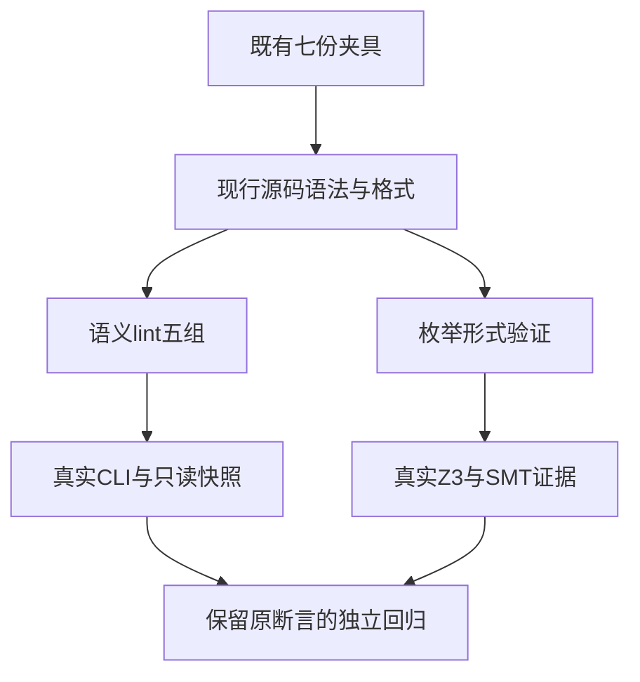
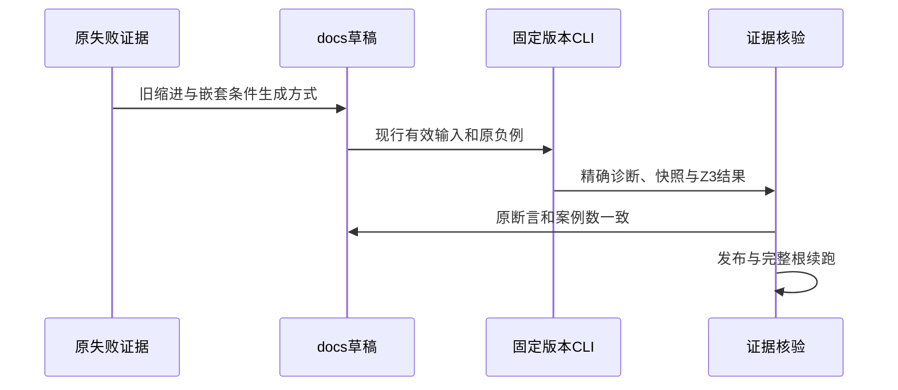

# 语义门禁夹具同步计划

## Intent：最终目标

修复根完整门禁发现的旧夹具，使语义lint真实检查类型、依赖、公开接口、Store和只读行为，使枚举形式验证真实证明原来的有限域与无固定点轮转。保持所有原成功/拒绝断言，不把任意提前失败视为正确的拒绝。

## Data：可用证据

旧dd909e00完整ReleaseSafe日志在语义lint五组及枚举验证出现失败。最新b6a81464 Debug CLI的原枚举与project测试独立复现，日志和终态将保存在本目录。

现行内建formatter采用四空格；semantic_lint夹具仍用两空格，因此原成功输入被格式检查挡住。verification/enumeration/cases.ts按成员数生成嵌套三元表达式；现行语言禁止嵌套条件表达式并要求match。已有verify_test.ts保留真实Z3、SMT位宽/边界、前提可满足性、源码证据与反例模型检查。

## Edges：边界与限制

只修改七份已定位的夹具或夹具生成器，不修改生产语义、断言、formatter、solver或默认构建入口。lint的格式负例继续保留精确扰动；不在createFixture中自动fmt输入，因为那会消除格式负例并削弱只读检查。两种优化完整根运行的固定检出保持不变。

优先尝试Grit处理跨文件模板缩进；只作用于本目录草稿，审查结果后复制正式源码。若模板内部匹配不能可靠覆盖，记录工具限制并用精确、计数断言的文本编辑；不引入抽象层。

## Answer：交付格式与成功标准

交付完整同路径草稿、原始与最终SHA、原失败与修复后日志、两种CLI指纹及命令、保留断言的diff核验。五组既有semantic lint与全部枚举verification使用真实CLI/Z3两种优化执行成功，严格typecheck和格式检查通过，英文Conventional Commits分部分提交push。之后仍以同一修复后版本的完整根Debug/ReleaseSafe成功终态作为全量阶段标准。

## 架构图

## 数据流图

## 自我批判

格式拒绝不能代替类型错误、丢失依赖或Store契约检查。消除提前拒绝后可能暴露真正生产问题，必须继续验证并按用户授权报告已确认缺陷。轮转必须保留每个成员映射及fallback，不能改成恒真确保条件绕过证明。局部全部通过不代表完整根或全部Test262完成。
