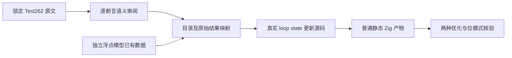
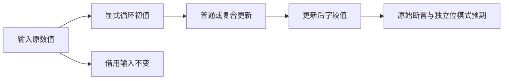

# 赋值上游语义审阅执行计划

## Intent：最终目标

把普通赋值和五种算术复合赋值的真实 Test262 数值写回断言接入持续运行目录，补全目前未登记的上游证据，同时验证 loop state 更新的 f32/f64 特殊值和边界数值。

## Data：可用证据

当前基线 `750a6891665184c5ffc5fe4e290cccc221f85377`，普通元素赋值求值顺序修复已发布。现有浮点目录有独立数值模型及精确位模式预期；现有 control 和 floating 运行支持可直接复用。两名只读分析代理分别查普通赋值与复合赋值原文及既有评审状态。

## Edges：边界与限制

ZX 的可变操作限制在 loop next；只把完整保留数值写回断言的原文登记为 adapted，明确变量声明与循环状态机制的区别。赋值表达式返回值、动态 ToPropertyKey/valueOf、getter/setter、with/eval、未声明变量等语义不能用更新后 return 或 native host 替换来冒领通过。它们继续逐文件审阅，不能重定义为简单数值相同即全部兼容。

普通与复合赋值实际执行不同更新语句，不用纯二元表达式冒充。浮点边界预期来自既有独立模型数据，新增原始断言预期从上游文字保留，不只使用生成器自行计算结果。正式文件先保存在本目录草稿，再精确同步；保护起始既有修改。

## Answer：交付与成功标准

新增分层目录、生成器与默认运行登记，Debug/ReleaseSafe 实际执行所有新目录。上游原文普通/严格模式的实际断言通过，逐文件 SHA 与原断言映射可核验；格式、类型及目录审计通过。保存 IDEA 文档、两图、原始日志、执行产物与自我批判，英文 Conventional Commit 并 push。

## 基线更新

实施期间接入已推送的 `d67cd5e236a5d12482282b083b130d32aff6392f` 普通聚合调用优化；在该基线重跑本阶段全部目录及现有函数更新回归。原有 11 项未提交修改按 SHA 核对并保留。
