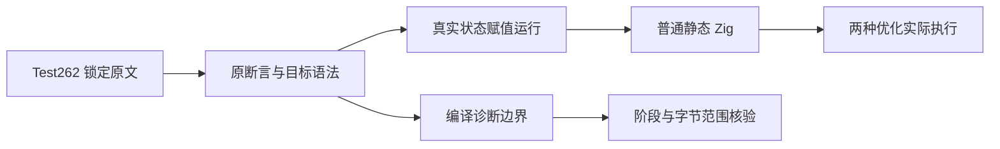

# 赋值目标与表达式边界执行计划

## Intent：最终目标

继续从 Test262 原文验证真实状态赋值的括号目标、成员标识符、换行与空白；单独核对非法赋值目标和赋值表达式返回值的实际编译诊断。保留原断言，避免把不支持的运行要求转换成“通过”声明。

## Data：可用证据

基线 `2fc851f15f279facaabb352961eee6deb206bb07`。已有状态更新目录和精确 frontend 阶段、代码及字节范围校验。上游锁定原文在本地可读，先逐文件检查全部原断言和 flags，再探测现实现。

## Edges：边界与限制

ZX 更新只允许 loop next 的显式 state。静态字段与 JS 环境/对象机制有明确区别；保持括号和原始空白字节。不能用更新后 return 证明赋值表达式返回值，也不能把更早的语法拒绝冒充赋值目标验证。运行兼容、诊断适配及排除项分开记录，只有已复现的生产实现缺陷通知实现会话。

## Answer：交付与成功标准

新增分层运行目录及前端边界目录，登记逐文件 SHA 和原断言映射，Debug/ReleaseSafe 实际执行并核对二进制。类型、格式、生成器和目录审计通过，保留完整草稿、日志及自我批判，英文 Conventional Commit 并 push。保护原有 11 项修改。

