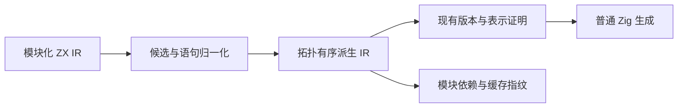
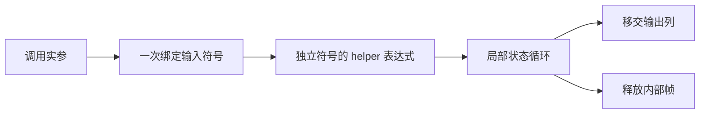

# 跨模块局部状态的编译期展开

## Intent：最终目标

在保留 RX/ZX 源码模块职责的前提下，让纯 ZX State step 调用参与局部帧列表的值布局与所有权证明，为删除解析器原生 Workspace 提供通用编译能力。

## Data：可用证据

- buffer_call 的容量上下文与函数签名仍使用公开指针元素 ABI；修改元素类型不能独立解决边界。
- iteration_value 的完整局部分析能证明展开后的列表版本、别名、快照和身份约束。
- Lower 的符号与表达式数组在初始化时定长，展开必须在其初始化前完成，且重建拓扑顺序。
- 现有 Zig fingerprint 对普通被调用函数只记录签名与摘要。展开后必须共享派生 IR，不能只提高缓存版本号。
- RX 的表达式内联不支持通用函数 body，不能直接复用为 ZX 函数展开。

## Edges：边界与限制

仅对已有标量消费、混合返回或丢弃入口中的局部 product 列表循环，在条件与步进表达式中展开有源码、无 Store、无契约且经现有分析确认纯的聚合入出调用。返回形状复用混合返回证明；整个循环状态逃逸的调用不属于本优化。实参绑定一次；每次调用分配独立符号和表达式身份；语句归一化保持早退、分支、解构与求值顺序。保留公开 ABI。未通过既有局部列表证明的代码保持普通布局；不为解析器设置特例。设置明确的展开成本上限，避免大量重复代码；递归与不支持结构保持原调用。

生成、模块依赖与缓存指纹必须基于同一准备过程；不得粗暴哈希所有 helper 实现而破坏细粒度缓存。嵌套循环与聚合借用的更广泛支持不因展开本身而自动成立。

不新增测试用例，不跑全量测试，不做浏览器确认。验证使用现有专项、正式 CLI 的模块化编译草稿及生成物核对。

## Answer：交付与成功标准

交付 genz 内的通用 IR 准备过程、编译器缓存与依赖同步、模块化草稿、生成物和验证记录。成功标准是分文件 step 的帧 push/pop 能命中普通 Zig 值布局容量，实参不重复求值，修改被展开 helper 后调用者缓存失效。完整解析器状态迁移仍为后续真实闭包，不能把此能力当成完整自举。

## 实施中发现并修正的问题

- 初版把所有循环当作候选，破坏了原有分配成本边界。已将选择收回到本特性的消费/丢弃入口和局部列表支持形状；不按模块路径或函数名筛选。
- 残留聚合调用可能把借用的栈结构存入输出列表。旧 deepOperation.call 无条件接受，展开外层 wrapper 后暴露此生命周期缺口。已沿输入 object/tuple/optional 的实际栈重建边界检查输出列表元素子树；输入 list 原 slice 不被错误视为栈重建。
- 运行时采样确认一轮有问题的生成解析器持续分配，已终止该诊断进程；这不是可交付版本。后续以终态 CLI 和既有专项确认修复。
- switch 的已比较条件使用无 subject 的 match，避免重复比较。
- 准备只执行一次，prepared 依赖分析、指纹和生成共享结果；不假定成本驱动的展开天然幂等。
- 连续 bindings 合并；无 return 分支以 void binding 保留一个后继。用饱和展开树成本和深度边界控制复杂早退图；超限回退整个单元。
- 暂不展开 void 输入的聚合返回签名，避免构造不符合既有 IR 合同的 void 局部绑定。

## 终态实施与验证

通用展开集中于 genz 的 inline_call 目录，分开候选选择、成本、符号映射和语句归一化。compiler 的应用及库输出共享一次准备后的 IR，用于依赖、指纹和生成。原始公开入口仍可传入未准备 IR。函数调用者不再因整图 helper 变动无条件失效，仅实际展开的实现进入其派生表达式。

最终发行构建 34/34 步通过。现有循环缓冲、跨函数调用、值返回、模块生成缓存、类型解析器及解析状态专项 265/265 步、403/403 Zig 检查、1/1 Node 检查通过。此前异常的正式 CLI 示例均恢复快速生成。没有新增测试用例、测试注册或执行全量测试。

`草稿/model.zx`、`step.zx`、`stack.zx` 是模块化编译展示。实际 execute 含一个 Frame 值元素 ArrayList 和一个 u64 数据列 ArrayList；仅数据列 toOwnedSlice，两个 deinit 均保留。源文件模块边界保留，生成的循环中不调用 step，也不逐帧 allocator.create。完整单文件生成物仍保留未调用 helper 的普通 ABI 声明，不能用整个文件的 create 次数充当循环成本。

Debug 应用：空帧四轮输出 [1,3,7,15] 与 total=15；非空初始帧零轮为空列与 total=0；非空初始帧四轮仍为 [1,3,7,15]。三次正常退出。

保持 helper 签名与主模块不变，仅把其计算增量从 1 改为 2：前端重分析 1、复用 2；生成 1、复用 1；应用输出 [2,6,14,30]。恢复 helper 后生成 0、复用 2，结果恢复为 15。草稿已经恢复，缓存验证没有留下变体源文件。

源码镜像、日志、执行输出及原始/格式化生成物的不同 SHA256 保存于本目录。终态验证后的仓库格式化只调整空行，逐文件核对非空行完全一致。

## 上游聚合循环专项衔接

合入上游 e42d096c 后，新增的既有聚合循环专项首次在 call 生成形状断言失败：原先要求普通布局，当前纯读取 helper 已展开并获得值缓冲。将该既有场景纳入值缓冲形状检查，并纳入现有 3 轮与 64 轮分配量相等断言，没有新增用例。原有快照值、输入不变、边界错误与逐分配失败清理检查保持不变。源码与库编解码两条路径最终 78/78 构建步骤、102/102 检查通过。

随后合入 dc8d800b 的既有输出列移交专项，生产源码无变化。该专项在当前实现下 85/85 步、124/124 检查通过，无需调整断言。

提交后重新核对 14 个正式源码 SHA256、草稿镜像及生成物归档 SHA256 均一致。

## 自我批判与剩余边界

初版构建成功并不代表运行语义正确；运行采样和零分配专项实际发现了生命周期与候选范围问题，均在提交前修复。当前示例中的 pop-null 早退分支被编译，但三次执行均没有进入该分支；不可据此声称所有分支形状已穷举。

调用展开不是全局强制内联，也不是第二套函数 ABI。契约、Store、void 输入、复杂度超限与不满足局部消费形状的情形保留普通调用。最终列表表示仍由既有版本、别名、身份和逃逸证明决定。初值转换与容量增长仍存在真实分配/搬迁成本。

完整自举仍需迁移原生 Workspace 的实际 Frame/visiting/缓存和类型列，处理只读 AST product 列表及跨调用输出 owner；嵌套循环也不会因为调用展开而自动获得局部列表证明。不得把本阶段能力声明为完整解析器已经迁移。
