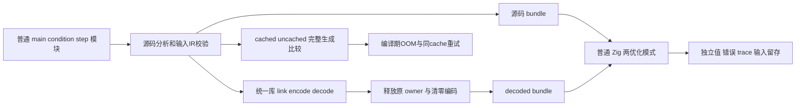
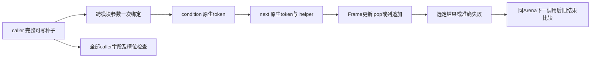

# 跨模块循环内联独立回归实施记录

## Intent：最终目标

验证跨模块 State 调用展开保持应用语义，补足可达提前返回、switch、重复 tuple helper、原生参数求值、精确错误截止与缓存恢复证据。不会将优化资格函数的判断复制为正确性 oracle，不会通过删返回观察强行让夹具命中优化。

## Data：可用证据

新内联实现由 1b4cc783 引入；本轮开始时为 e0567565，冻结前快进合入 f2a1fc44f6ab6f3cc7cb0658990d40a1a170ac77。后者新增直接选定 splice 范围借用，本轮相邻回归一并实际执行既有范围目录。输入清单.json 固定 source/tree、工作目录和 36 份自有源码/构建输入 SHA；11 份原有跟踪修改单独核对。

先精确核对前轮 json-output-conformance 工作区的 15 份范围输入，仅恢复其 2 份已跟踪文件并删除其 13 份自有未跟踪文件，再从干净工作区切到本轮冻结 source。历史执行日志、输入和生成 SHA 保留，不声称被复用的工作区仍停在旧冻结状态。提交前快进合入 f07d36046d63b4c3787c1b8fee5f9aee95fcff3c 的语义类型构造实现，另将 artifact-extraction-integration 工作区中前轮 15 份自有输入逐项核对并移除，冻结为 f07d3604 与本轮相同的 36 份输入，执行完整两模式及相邻回归。最新输入清单.json 保留该工作区和全部 SHA；原 f2a1fc44 工作区与证据仍保留。首次 push 被远端新增 316e3498、85fce785 拒绝；两提交涉及增量类型状态、detached 产品返回分析和 value call 投影，因此将未推送的自有提交 rebase 到远端，再创建 modular-loop-sync 隔离工作区，基于 85fce785 与相同 36 份输入复核。同步输入清单.json 和同步执行日志单独保存，不覆写前两次冻结证据。

普通源码集中于 packages/test/tests/collections/modular_loop/fixtures，编译工具复用成熟源码分析与真实统一库 link/encode/decode 入口。源码 route 发射原分析 IR；library route 在清零并释放编码 bytes、释放原 analysis/library 后发射 decoded.module(0)。两路分别编译执行普通 Zig 和公开 ABI，不把一次 codec 成功当作全部运行通过。

## Edges：边界与限制

正式修改仅为测试、独立构建步骤和总测试的一行登记，没有修改生产实现或专用 runtime。生成程序只允许 std、zxc_abi 和 effects 的显式静态 probe；不新增解释器、动态加载、zxc 私有运行库或自动持久状态。

IR 检查针对原始和解码后的输入 IR，运行实际发射结果；没有独立调用 prepare 后再 validate 派生 IR，也不二次 prepare 已派生 IR。source/library 路由发射的是 bundle；cached/uncached module bundle 全量比较是独立生成观察，不能将其写成分模块产物已经单独部署运行。

只有 simple 严格检查局部 Frame 值缓冲与循环内无逐帧 create；其他正向模式检查实际 execute 中非 external 的聚合 helper 消失，值和错误独立运行验证。完整 frames 返回是逃逸边界，必须保留真实普通 helper；nested 出现第二个 loop 时允许正确回退。不能仅因 helper 可展开就强制全部列表获得值布局，也不能禁止允许的 native bridge。

## Answer：交付与成功标准

最终准确步骤、测试数、运行叶子和日志 SHA 由门禁核对结果.json 汇总；每个进程的 argv、source/tree、36 份输入 SHA 和实际终止码由对应执行结果.json 保留。测试声明数与源码/库实例数分开统计，循环内参数矩阵和 OOM failpoints 不冒充额外 JSON 用例数量。

### 最终实际门禁

| 冻结实现 | 门禁                             | 成功步骤 | 实际运行通过 | 运行叶子 | 缓存测试步骤 |
| -------- | -------------------------------- | -------- | ------------ | -------- | ------------ |
| f2a1fc44 | 完整 Debug                       | 87/87    | 123/123      | 19       | 0            |
| f2a1fc44 | 完整 ReleaseSafe                 | 87/87    | 123/123      | 19       | 0            |
| f2a1fc44 | 相邻 Debug（追加缓存恢复检查前） | 177/177  | 2263/2263    | 40       | 0            |
| f07d3604 | 最新 Debug                       | 87/87    | 123/123      | 19       | 0            |
| f07d3604 | 最新 ReleaseSafe                 | 87/87    | 123/123      | 19       | 0            |
| f07d3604 | 最新相邻 Debug                   | 177/177  | 2263/2263    | 40       | 0            |
| 85fce785 | 同步 Debug                       | 87/87    | 123/123      | 19       | 0            |
| 85fce785 | 同步 ReleaseSafe                 | 87/87    | 123/123      | 19       | 0            |
| 85fce785 | 同步相邻 Debug                   | 177/177  | 2263/2263    | 40       | 0            |

14 个 Zig test 声明形成 18 个源码/库运行实例中的 120 次测试，加 3 次生成及缓存测试，每个优化模式共 123 次。相邻回归由 aggregate_loop、loop_columns、list_range 构成，分别为 102、124、2037 次；不将日志中其他缓存构建依赖算成缓存测试。

产物清单.json 收录 f2a1fc44、f07d3604 两个历史冻结实现、两个优化模式、9 个模式的 source/library 与各自 ABI，共 144 份原始生成文本，每份 SHA 都匹配实际测试缓存中的输出。36 次工具重放仅用于产物归属。另保留追加第三个缓存恢复测试前的 72 份历史生成文本及单独清单，原始生成文本合计 216 份；不把历史产物或重放次数加入实际运行数。85fce785 的同步复核另保存冻结输入、真实执行日志与结果；该次未将生成文本加入历史产物清单，门禁统计保持可区分。

### 普通模块及独立观察

| 模式     | 实际普通程序                                                                      | 独立宿主观察                                                                            |
| -------- | --------------------------------------------------------------------------------- | --------------------------------------------------------------------------------------- |
| simple   | imported condition 与 State step，push/pop 后追加列                               | t'=2t+index+3，列 prefix、mirror、total、iterations                                     |
| changed  | 同入口、同签名，step 增量 3 改 4                                                  | t'=2t+index+4，实际执行变体，配合 caller 缓存失效                                       |
| branch   | 直接 pop 原列表，null 时只推进 index；三个可达提前返回/继续路径                   | 输入尾部 Frame 的原 count，加 index 与对应 5/7/11；耗尽后不追加列                       |
| switch   | 真实 pop-null 早退，choice 0、1 和 default；case 1 再分奇偶                       | 3/5/7/11 不同业务增量，实际命中所有分支，不按 case 编号猜生成 arm                       |
| chain    | 同一个 State→tuple helper 在一轮内调用两次，局部名字独立                          | 分别推进两次 index、追加两个 total；奇数 count 的最终 iterations 可以多 1               |
| bounds   | step 中动态读取 selected 的原 Frame.count                                         | 正确数值、尾项、越界及最大 u64 的准确 IndexOutOfBounds；零轮不读索引                    |
| effects  | condition/next 参数分别 observe(2*index)、observe(2*index+1)，step 两次使用 event | 完整 token 流 0..2n、参数一次求值、native 错误先于 callee bounds、同 Arena 后续失败留存 |
| nested   | step 内再运行两次 Inner 更新，跨模块 inner_step                                   | inner 两次 t'=2t+1 后加 index+3，即 4t+index+6；两个循环局部身份不串位                  |
| escaping | 保留公开完整 Frame[]，通过普通 helper 路径                                        | 每个 Frame 的实际字段、列、镜像、两次调用留存，接受合理 ABI 回退                        |

Seed 构造 257 个可写 Frame、pointer 槽和独立 u64 列，完整检查全部内容和槽位，而非只核对被返回的一项。输入帧长度 0/1/17/257、列长度 0/1/17/257、计数 0/1/2/3/7/16、choice 0/1/2/最大 u64 组合，分支另用长度 3 验证逐尾 pop。期待来自单独宿主状态与数值模型，不读取生产 Plan、selection、cost 或布局资格函数。

### 借用、失败和原生效果

每次执行先保存 error union，再检查整份 caller 输入和 Seed；成功和普通错误均保留原始数据。首个输出在同 Arena 后续调用完成、失败或 OOM 后仍比较值；Arena 生命周期结束后检查普通完成路径全部 backing bytes 已释放。运行期逐分配失败使用成熟 allocation_testing 禁用 resize/remap，完整失败点由标准检查器验证，不把 Arena backing 次数称为每个逻辑分配或零成本性能证明。

原生模块 probe 是显式静态测试宿主，只接收 u64，记录 token、返回 token+5，并按独立配置的 token 抛 ProbeFailed。正常前置条件 loop 的 condition 为 n+1、next 为 n；count=0 仍有 condition 一次。失败时逐项验证已发生的 exact prefix，允许 OOM 在原生调用前后发生；不武断要求所有 OOM 都是零次调用。

动态 bounds 和 native 失败同时存在时，初始 condition token 0、next 参数 token 1 的失败必须先于 step 内 IndexOutOfBounds；token 2 或更后不能绕过先发生的 bounds。native failure 在最后一次本应返回 false 的 condition 上也实际测试。fail_token=7 的首调用 count=3 成功，第二次 count=4 失败，首个结果仍保留。

### 编译、缓存与失败恢复

三个独立 generation tests 比较完整 types、entry、module 名称、源码和 imports。重复生成不新增 generated units；同签名 step 正文 3→4 必须改变展开后的 caller entry bytes；cached 与 uncached bundle 相同，恢复原实现与旧完整 bundle 相同。缓存按 name 保存当前 key，恢复旧实现可以再次生成，不错误要求旧版本永远零生成。

编译期 OOM 与运行期 OOM 分开：第一组逐点覆盖 cache 初始化、原实现、重复、修改、恢复的完整生命周期和清理；第二组先填充同一个缓存，再逐点使替换失败，取消失败后重试并比较 uncached 基线，重复重试不得再生成，最后恢复原实现。不会把失败后销毁 cache 的清理检查冒充同 cache 的恢复检查。

### 生成产物与结构证据

收集生成证据.py 只对测试所用的真实 compile 工具重放发射，给每个模式和 source/library 产物准确归属；每份文本必须以 SHA 匹配实际已测试缓存中的源码或 ABI。重放不是新增运行期测试。两优化模式的对应原始文本逐字节比较，保留原始源码，不对 txt 运行格式器。全范围 diff --check 提示原始日志/生成文本末尾空行，以及保存的原始 diff 文本中的空白行；这些是原始字节证据，保留以维持 SHA。正式源码与非 txt 文档的限定 diff --check 通过。

结构检查先找到 execute，再根据原 IR 的 external 身份区分 native 和普通 helper，函数编号匹配避免 1 与 10 混淆。完整文件可以保留未调用普通 ABI helper 定义，检查不把它们当作循环内调用。完整 Frame[] 与 nested 回退各自如实记录，不为了通过结构门禁删字段或修改生产优化规则。

### 自我批判与未覆盖边界

初次失败来自自有夹具和结构检查误判，已单列完整记录，没有误报实现缺陷。最终以真实输入、原生序列和错误证明语言语义，结构和缓存指标只补充特定生成行为。不会以 AST 里存在 return/null 或某个 if 就声称相应路径已实际执行。

本轮不覆盖 4096 返回树或 depth 128 的全部边界，也不把它们称为整个重建单元大小上限；不覆盖 Store/contracts/parallel/void/capture 的全部拒绝矩阵，Frame 元素含列表、native_reference、返回临时旧产品列表等仍需独立回归。public module bundles 的部署/链接与 persistent cache IO 也不由此次快照比较自动证明。

本轮没有新增 Test262 review 或 JSON catalog 行；仍有 50779 份上游文件未审阅，总体任务保持进行。正式测试和 36 份输入、自有 docs 单独提交；其余修改内容保持原样。全部实际运行和证据核验已通过；提交使用英文 Conventional Commit，提交钩子之后再次核验自有范围与原有修改，并实际 push，不标记整体目标完成。
