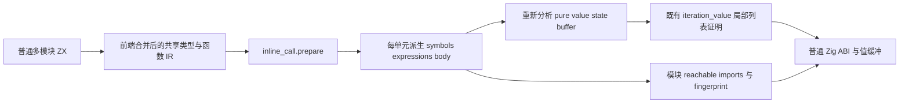
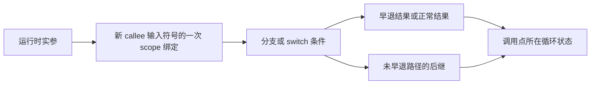

# 跨模块循环内联：实现边界与独立回归建议

## Intent：最终目标

验证 `1b4cc783` 引入的跨模块聚合调用展开，在普通 ZX 模块、循环状态及公开 ABI 下保持求值顺序、次数、早退、错误传播、输入与结果寿命，并确实让适当的聚合循环获得普通 Zig 值布局。

读取时 HEAD 为 `e0567565`。本次全文阅读 inline_call 的 plan/root/block/mapping/selection/cost 六个文件及必要调用链、成熟测试和实施记录。没有运行编译、测试、门禁或提交，没有修改正式源码、测试或注册。所有下面的风险均为需要独立验证的分析，不是本轮复现的生产缺陷。

独立验证的 expected 必须来自明确普通程序语义、宿主 oracle、真实 native trace、IR 结构约束和生成产物，不以 Plan.accepts、selection 标记或 list_plan.eligible 的结果为正确性 oracle。

## Data：可用证据

### 六个文件的实际职责

| 文件                                        | 源码事实                                                                                                                                                                                                                          | 对验证的影响                                                                                   |
| ------------------------------------------- | --------------------------------------------------------------------------------------------------------------------------------------------------------------------------------------------------------------------------------- | ---------------------------------------------------------------------------------------------- |
| `packages/genz/src/zx/inline_call/plan.zig` | 用既有 value_call.analysis 的 pure；拒绝 external、callee Store、callee contracts、双方 primitive 签名、void 输入、parallel/store_set statement；cost 初值为 expressions+symbols+1，再加每个调用的子候选 cost；只接受 cost<=4096  | “可展开函数”不等于“某调用被选择”，也不等于“循环值布局可用”                                     |
| `root.zig`                                  | 为每个无 Store function 单元和无 Store entry 单元单独选择、重建；ExpansionLimit 时回退该单元，OOM 则传播；保留 functions 数量和顺序，复制并替换单元 symbols/expressions/body                                                      | 回退不应污染已经成功重建的其他函数；函数级与 entry 级都应执行验证                              |
| `mapping.zig`                               | 每个 Mapping 有独立 source ExprId→新 ExprId 表和 symbol_offset；调用实参先映射，callee 独立复制 symbols；callee body 返回树生成后，用该 callee 的首符号绑定实参；嵌套 child.selected=null，允许展开所有被 Plan 接受的 child calls | 参数绑定一次、两次调用的局部身份独立、残留调用的 FunctionId/TypeId 稳定是核心                  |
| `block.zig`                                 | 从尾到头将 statements 归一化为 scope/conditional/match；constant/evaluate 保持绑定；destructure 先绑定完整 tuple；分支含 return 时给未返回分支接 continuation；均不含 return 时生成 void 分支绑定后接一次 continuation            | 生成时逆序不意味着运行逆序；应执行早退/继续两条路径来证明，而非只读到 bind 就宣布成立          |
| `selection.zig`                             | 只在符合结果 candidate 的末尾 loop 绑定，或被丢弃的 loop 中寻找 supported state 且含 product list 的循环；标记 condition/body；find 在 iteration/capture/task/transform 边界停止；汇总被标记调用的 Plan cost<=4096 才重建         | 不是全局强制内联；纯标量列表、完整聚合状态逃逸及不符合消费形状的循环不能仅凭函数可接受就算命中 |
| `cost.zig`                                  | 对 ExprId 递归引用其已有 cost；递归累加 struct/union/optional/slice，饱和加法后钳到 4097                                                                                                                                          | 用展开树而非唯一 DAG 节点计数，共享后继仍可能被保守重复计算；不是生成 Zig 字节数预算           |

`mapping.expression` 和 `block.lower` 共用 unit.depth，达到 128 返回 ExpansionLimit。这个 128 包含表达式和 block 递归层次，不是“最多 128 个源函数”或“循环最多 128 步”。

### 调用链及准备后的模块语义

已读调用链：

- `genz/zx/render.zig`：普通 initialize 先 prepare；initializePrepared 对派生 IR 重新建立 value/pure/local/state/buffer facts。emit 与 bundle 走 initialize。
- `genz/zx/modules.zig`：普通 generate 先 prepare，prepared 则直接发射。functionPrepared 将指定函数的 symbols/expressions/body/signature/stores/contracts 设为当前 lowering 单元；公开 call 与可用的 callValue/callBuffered 仍是现有 ABI。
- `compiler/backends/zig/modules.zig`：createCached 在 owned Arena 中 prepare 一次，再为该 IR 创建 names、reachable、function files、entry imports 和 prepared fingerprint/emit。外部 emit/functionFiles 包装仍可接受未准备 IR。
- `compiler/backends/zig/library.zig`：library.program 与各 export module view 分别 prepare；public entry 的 imports 和所需函数均从准备后视图计算，再发射。
- `compiler/backends/zig/fingerprint.zig`：prepared entry/function 的 symbols/expressions/body 纳入指纹；残留 FunctionId 仍通过签名、Store 和摘要处理。被展开 helper 的代码进入调用者派生表达式，不依靠把所有 helper body 一律加入所有 caller hash。
- `compiler/backends/zig/references.zig`：扫描表达式和 contracts 中的残留 call 建立 reachable/imports；扫描的是整个表达式表，不能未经核对就要求所有未运行的孤立表达式也被消除。

本次 Mapping 改的是已经链接的全局 IR。它偏移 SymbolId 并重建 ExprId，保留 TypeId、FunctionId、NativeModuleId 等全局身份；不是第二次模块类型合并。不同 source module 的本地符号名重复不会单凭名字合并，每次 child Mapping 都有不同 symbol_offset。

### 条件与拒绝层次

| 场景                                                       | 当前代码结论                                                                                     | 要保留的区别                                                                                             |
| ---------------------------------------------------------- | ------------------------------------------------------------------------------------------------ | -------------------------------------------------------------------------------------------------------- |
| State→State、Frame→u64 或 State→bool 普通 helper           | 输入或输出至少一方不是 primitive；满足其余条件时可被 Plan 接受                                   | condition 中的聚合入参 bool 返回调用也可能展开，不仅 next 的 State 返回                                  |
| u64→u64、bool→bool 等双方 primitive                        | Plan 拒绝展开                                                                                    | 普通调用继续存在，list_plan 可接受适当 primitive 调用，不是语言拒绝                                      |
| void→聚合返回                                              | Plan 明确拒绝                                                                                    | 不构造 void 局部参数绑定，保留普通调用                                                                   |
| external native callee                                     | Plan 拒绝展开其实现                                                                              | 普通 ZX helper 可能包含 native primitive 调用，helper 仍可能通过既有 pure 分析；不能丢掉 native 调用效果 |
| callee 有 Store、contracts 或 parallel/store_set statement | Plan 拒绝 callee 展开                                                                            | caller 有 contracts 并非 root.prepare 的整体跳过条件；caller Store 才使该单元跳过                        |
| helper 调用后编号函数或自身                                | cost 超限；既有 pure 分析也依赖函数拓扑有序                                                      | 正常项目/库须保留前端无环与有序 IR 合同；不必伪造无效递归 IR 证明普通程序边界                            |
| supported 状态含 object/tuple/optional product 元素列表    | selection 可发现聚合循环                                                                         | productList 在 object/tuple 中递归；不能将纯 scalar list 循环与此入口混淆                                |
| element product 自身含 list                                | list_plan.product 不接受这种产品                                                                 | 聚合调用展开后仍可能回退，不能宣称扩大了元素表示支持                                                     |
| 最后一个 const 是 loop，return 为标量投影或允许的混合结果  | result.candidate 可触发 selection                                                                | 最终 lowering 还考虑 cache、capture、transaction、state_active 等运行生成上下文                          |
| 整个 Frame[] 或完整 State 返回                             | 当前 candidate 不能把 product 列表/全状态视为混合输出列                                          | 普通回退语义仍须正确；不能删返回字段制造内联命中                                                         |
| capture/task/transform 中未被其他已选根覆盖的循环          | find 不穿透此边界                                                                                | 一旦 iteration 被选，mark 对其 condition/body 使用通用递归；因此不能笼统说所有嵌套表达式的调用绝不展开   |
| nested loop/transform 出现在展开后 body                    | Plan 没有仅因这些 expression 就拒绝 helper；后续 list_plan.expression 不接受 iteration/transform | 调用展开与嵌套循环值布局是两层，不代表嵌套 loop 已支持局部值缓冲                                         |

`value_call.analysis.pure` 是当前结构/边界判定，不是数学上的“没有任何可观察效果”。`native_value.valueBoundary` 可接受标量入出的 native 函数；已有 native runtime 正是用宿主 trace/counter 验证其调用次数和错误。因此参数/条件/分支测试可以用显式静态 native probe，但不能将 probe 输出当作业务 hardcode。

### 最终布局仍有独立逃逸门槛

`iteration_value/list_plan.zig` 对 condition/body 的引用、scope、列表更新、push/pop/concat 等做既有证明；残留 call 只能是 pure 且双方 primitive。展开聚合调用是为了暴露这些操作，不能代替列表版本/快照/重叠分析。

`iteration_layout.zig` 的 deepOperation 拒绝 nested iteration/transform 和某些 product 列表操作，并对残留 call 使用 listEscape。它沿 input 的 object/tuple/optional 识别返回列表元素是否包含重建的聚合输入或子树；输入 list 的原 slice 不被同等视为栈 product 重建。此处应执行 returned list 元素的身份及同 Arena 后续调用，而不是调用 borrowedProduct 本身计算 expected。

### 已有验证事实的级别

| 证据                                                              | 已有事实                                                                                                                                                   | 本轮不能推断                                                                        |
| ----------------------------------------------------------------- | ---------------------------------------------------------------------------------------------------------------------------------------------------------- | ----------------------------------------------------------------------------------- |
| `docs/2026-10-07/跨模块局部状态/实施计划.md` 与 `验证结果.json`   | 实施记录声明发行 34/34、相关 265/265 步与 403 Zig/1 Node，通过三个人工应用输入；new_tests=false、full_suite=false                                          | 本次没有重跑，不能当作新独立验证；没有全量测试事实                                  |
| 同目录普通 model/step/stack 草稿                                  | 跨文件 step push/pop，输出 columns/total；人工 four-step `[1,3,7,15]`、total=15，zero-step 空列；签名不变改 helper 增量后有缓存/输出变化记录               | `popped==null` 分支在三次人工执行没有进入；编译这个分支不等于执行覆盖               |
| `aggregate_loop/fixtures/call.zx` 与 read_frame.zx                | 保存旧 Frame、更新当前 Frame 字段、调用读取 helper 返回旧 count；root 有独立累计 oracle、输入检查、OOM、3/64 步资源比较；shape 已将 call 纳入 value buffer | 是简单 Frame→u64 读取，不覆盖 State→State 的 return/control-flow/argument 复杂展开  |
| `aggregate_loop/compile.zig`                                      | source 与真实 codec decode 后 library module 发射、Zig runtime 两 route；对发射前 IR validate                                                              | emitBundle 内部会 prepare；发射前原 IR validate 不自动证明派生 IR 也被独立 validate |
| `loop_columns/compile.zig`、shape.zig                             | 清掉编码 bytes 并销毁分析/library 后，decoded module 再发射；选列数、toOwnedSlice/errdefer/deinit 形态                                                     | 可复用库存储独立性与结果 transfer 断言，不能替代跨模块映射覆盖                      |
| `incremental/native_runtime/loops/runtime_test.zig` 与 choice.zig | 准确的初值/condition/step/native failure trace prefix；zero/postcondition/nested/discarded 调用及 OOM                                                      | 现有 trace 多为 scalar/discarded loop，并非当前聚合 helper 展开                     |
| `incremental/module_generation/cache_test.zig`                    | 普通 helper body 变动只重生成 helper、caller 保留；重复输出等于 uncached                                                                                   | 对被展开聚合 helper，caller 应失效；这与旧普通调用用例不同，需要实际变体            |

## Edges：独立可验证风险

### 1. 参数一次求值与顺序

源码事实：mapping 先得到 argument，再把它作为一个 ScopeBinding 加在 callee body 前；callee 内多次引用 input 是同一个新符号。object.evaluation 与 tuple items 通过 Mapping 按原顺序映射；aggregate.zig 的实际 lowering 将 evaluation/items 顺序绑定后再构造字段。

待验证：展开后是否确实执行一次 argument；参数字段的多个 native probe 是否保序；参数失败是否阻止 callee 条件与正文；callee 不使用 input 时，参数的可观察求值是否仍执行。生成时映射 argument 比 body 早，不能单凭这个编译顺序证明运行时行为。

建议用普通 State step 参数对象含 `a: probe(10)`、`b: probe(20)`，callee 多次读 a；完整 trace 应每步只有 10/20 各一次。第一 probe 失败时只出现 10，第二失败时只出现 10/20，callee 的 condition/body marker 不得出现。再用一个忽略 input 而返回固定合法 product 的 helper，对照 argument trace 仍出现一次。

probe 接口使用已有静态 native 声明/host 模块方式，记录 trace 在验证宿主中；不能为此插入动态 runtime。主代理需从实际 IR/生成循环确认该 helper 确实展开，不能只看正确 trace。

### 2. 跨模块身份、符号和类型映射

源码事实：首 input 符号从 child.symbol_offset 得出；所有 SymbolId 通用递归偏移，ExprId memoized；每次调用独立 Mapping。TypeId/FunctionId 依赖全局已链接身份不变。新 inline_tuple/inline_subject 符号与 source symbols 共处新单元。

待验证：caller、两个 helper 都使用同名 in/current/value，分别调用同一 helper 两次，再经 wrapper→leaf 模块链；tuple destructure、optional refinement、循环 parameter/condition_parameter 是否互不串位。不能仅检查 symbol count 增加或 Mapping 的 ids 数组非空。

建议两个调用采用不同值，例如首 helper 返回 `(input.index+1,input.total+7)`，第二返回另一组合；宿主分别计算预期字段与所有输入不变。库 route 销毁原 analysis/编码 bytes 后发射并执行，验证保留的 name/span/source slice 未借用失效存储。派生 IR 使用现有独立 validateIr 检查 SymbolId/ExprId/type/作用域约束；再执行生成程序，因为 validateIr 不证明别名寿命。

### 3. branch、return、switch 的后继

源码事实：block.returns 判定任意嵌套 result；不是“每条路径都终止”。含早退的 branch 给未返回路径接后继；均继续的 branch 先 void evaluate，再接一次后继。连续 scope bindings 合并，原顺序在 bindings 数组中保留。switch subject 先绑定一次；case body 映射为无 subject match，default/final exhaustive arm 作为 fallback。

待验证：一边 return、一边继续；双方 return；双方继续；嵌套早退；default 与 exhaustive enum；后继是否丢失、重复或在 early return 后执行。只运行正常末尾 return 不足以验证 continuation 算法。

建议 State helper 用输入 mode 选择可达早退，不采用“刚 push 再 pop 必然非空”作为唯一分支源。每路径给业务 total 不同增量，并记录一个分支 marker 与一个后继 marker；早退不得出现后继，继续路径只出现一次。switch subject probe 记录一次，selected arm 的 marker 只出现一次，未选 arm 可设置会失败的 probe，证明没有提前求值。

### 4. 错误/throw 与捕获边界

当前 `ir.Statement` 没有 throw 分支；result 是正常返回表达式，error_value 也是值，不自动等于抛出。现有 fallible native call、索引和分配通过表达式/后端 error union 传播，capture 改成相应控制流。测试不要编造当前语法不支持的 throw statement。

可独立观察两种不同有限 native errors、IndexOutOfBounds 和 OutOfMemory。安排 argument failure、callee branch/body failure、后继 failure，断言最先错误和 exact trace prefix；给失败后的代码另一个可观察 marker，验证 cutoff。source/library 两 route 保持同样有限错误，不把不同错误都吞成统一 sentinel。

selection.find 不穿透 capture；若在已经 marked 的 body 内出现 capture，通用 mark 仍可能处理其子调用。最终 result.eligible 的 capture 门禁及 local/list_plan 可导致回退。需要分别执行普通调用返回错误、直接 captured expression 的恢复/继续与错误输出构造 OOM；不能把 caller capture 的 native helper 等同于在 capture 上下文内完成局部 mixed transfer。

### 5. 栈 product 借用与返回列表逃逸

既有实现记录曾发现这一类生命周期问题并修正 listEscape。独立用例应保留普通 wrapper，wrapper 内留一个因签名/成本而不展开的 call，callee 把输入 product 或嵌套子对象放入返回列表。分别检查 object、tuple、optional；另用输入原 list 的 slice 作合法对照，不机械把所有 list 返回都算危险。

在同 Arena 中调用第二次、制造更多分配后，再读第一结果的元素字段及适用身份；宿主种子完整不变，Arena 结束统一释放。若该程序正确回退，则验收回退语义，不强行要求 value buffer；不借用 listEscape 判定函数做 oracle。

### 6. 嵌套调用、循环与拒绝回退

callee 进入 child Mapping 后不再局限顶层 selected mask，所有 Plan 接受的内部 calls 可递归展开。Plan 使用原 program；root.functions 的逐单元改写不直接成为下一次 callee source，因此每个 caller 的展开是独立生成，不是复用前一单元符号。

嵌套 aggregate wrapper→step→leaf、同 leaf 两次应执行正确值/trace；nested loop、transform、Store、contract、void-input、external 和全 State 返回分别是拒绝或最终布局回退对照。优化拒绝不应使原本合法应用无法编译，也不应改变其错误/资源所有权。不要为得到内联形态而删除该边界。

### 7. 成本上限的实际范围

共有三个不同预算：Plan 的单函数静态成本；selection 的被标记 call 成本总和；Mapping 对重建 callee returned 树的成本。另有共享 depth=128。ExpansionLimit 是保留原单元的优化回退，不是用户程序错误。

重要源码事实：Mapping 检查 returned 的 cost 后才绑定 argument；没有对这一最终 bind 再检查同一个 4096。selection 汇总 accepted callee 的 Plan cost，不计完整 caller/argument 树；root 不检查重建单元的 expressions 总数。因此不能声称“最终单元最多 4096 个节点”或“所有实参展开成本都被限制在 4096”。这是一项需审阅其资源契约的限制，不是已复现的语义缺陷。

另一方面 cost 按引用树累计，object.evaluation/fields 或 continuation 共享 DAG 会重复记成本；可能在唯一节点数不大时回退。深度也包含普通表达式递归，因此拒绝阈值不能简单按源码函数数量推定。

建议用确定语义的多模块链/多个调用构造宽度和深度系列；同样的小输入 expected 固定，由宿主算。记录原/派生 IR expressions/symbols 长度、生成字节数、是否残留真实 helper call、正常输出与失败清理。边界点由实际统计观察定位，不调用 Plan.costs 做 expected；若要验证精确内部阈值，另用独立算术说明每种 IR 构造的计数，但仍以生成和运行证明回退。

预算拒绝变体应保持整个调用单元原 symbols/expressions/body，已成功处理的其他函数可以保留其准备结果。准备本身有 Arena 内 OOM，验证 prepare/emit 的分配失败与生成程序 runtime OOM 是两项不同门禁。

### 8. 缓存与 Prepared 调用链

当前实施记录明确不假设 prepare 幂等。测试避免 prepare 后再调用普通 emit 触发第二次 prepare 来制造虚假的“生产派生 IR”；检查派生 IR 时，执行配套 prepared 发射，或单独记录普通生产发射与检查产物。

对被实际展开的 helper，在签名及 caller 源码不变时修改 increment，caller 生成产物及执行值必须变化；对不展开的 primitive/contract helper，caller 应保持适用缓存细粒度，helper 本身重生成。再恢复修改，cached 与 uncached 的有效产物和值一致。source/link/codec module route 与模块化 emitModules/emitLibrary 的 prepared route 都应准确标记，不能用单文件 bundle 独立证明模块 imports/fingerprint 正确。

## Answer：建议最小独立交付

主代理可按六个普通夹具家族组织，不新增通用解释器或测试专用实现：

| 家族             | 普通模块形态                                                        | 主要独立 oracle                                                           |
| ---------------- | ------------------------------------------------------------------- | ------------------------------------------------------------------------- |
| 参数与 condition | State step 与 State→bool condition，含标量 native probes            | 参数 10/20 各一次，condition 按 pre/post/zero 精确次数；错误 trace prefix |
| 分支与 switch    | mode 驱动 State→State，可达早退/继续/default/exhaustive             | 业务增量、selected marker、后继出现 0/1 次、subject 一次                  |
| 多模块映射       | wrapper→step→leaf，同 helper 两次，tuple/optional 解构，同名局部    | 不同参数的独立结果、旧元素快照、input 全字段不变、派生 IR 验证            |
| 借用逃逸/回退    | 保留真实不可展开 child，将 product/子树放到结果 list；原 slice 对照 | 两调用后先前结果值/身份、清理、普通 ABI；形态接受合理回退                 |
| 成本/嵌套边界    | 宽调用系列与深模块链；合法 nested loop/transform/contract/void 对照 | 固定语义、小输入结果不变，产物与 IR 大小实测、回退单元完整                |
| 模块缓存/库      | 前述模块发布/codec/compiled consumer，加签名不变 helper 变体        | 销毁原存储后结果、cached/uncached 一致、展开 caller 实际失效              |

建议 runtime 复用 aggregate_loop 的“先保存 error union、检查 seed 再展开”与 allocation_testing；trace 复用 incremental/native_runtime/loops 的 exact sequence/prefix；库存储隔离复用 loop_columns.compile；模块缓存复用 module_generation 的成熟缓存 owner。不要让一个巨大 root 同时承担所有成本、别名、native trace 和缓存职责。

生成 shape 限定目标 execute/helper 的 while 区间，确认 selected aggregate helper 的真实 call 消失、Frame ArrayList 元素为值布局、循环内不逐帧 create/dupe、选定列 transfer/deinit 合适；完整生成文件允许保留未调用的普通 helper ABI 定义。primitive/native calls 在真实循环内保留是预期边界。

### 对主代理拟定模块夹具的具体形态建议

| 拟定夹具                              | 可要求的正向观察                                                                                                                  | 不应强制的形态                                                                                                                                                   |
| ------------------------------------- | --------------------------------------------------------------------------------------------------------------------------------- | ---------------------------------------------------------------------------------------------------------------------------------------------------------------- |
| simple State→State push/pop           | helper call 在实际 loop 中被展开；原始种子不变；列/镜像与独立 recurrence；固定 Frame peak                                         | 不禁止正常初始对象和最终 Output 对象构造，也不禁止完整文件中的普通 helper ABI 实现                                                                               |
| partial / nested early-return branch  | 每个可达 return/continuation 的 delta 和列追加次数；未执行分支没有 probe；重复 continuation 不重复运行                            | 若变体故意保存旧列表/完整状态跨修改，或造成 buffer overlap，应接受正确回退，不因有 return 就假定必须无装箱                                                       |
| exhaustive switch                     | subject 一次、只选一个 delta、列值和最终 total；default 与 exhaustive fallback 分别覆盖                                           | 不通过硬编码 generated match arm 编号证明选择正确；完整文件残留 helper 定义可以存在                                                                              |
| State→tuple helper 嵌套 step 链与解构 | tuple 构造只求值一次、各绑定值正确、同名符号不串位、optional/旧值完整保留                                                         | tuple 携带的 State/list 别名若使局部证明拒绝，应先定位实际 alias/escape，再决定 shape，不能仅按函数签名强制                                                      |
| bounds 动态 selected                  | 合法 selected 的 delta；非法 index 正确错误与 trace cutoff，native argument 失败优先于 helper 内 bounds；输入不变                 | 发生错误的未到达后继不必生成与成功路径相同的资源观察；OOM 可以更早发生                                                                                           |
| effects 条件/next 参数 observe        | precondition count=n 时 condition probe n+1、next probe n；step 复用 event 两次但 native 实参一次；zero 与 postcondition 分开定义 | 不删除 native call 以满足“循环无函数调用”；只能要求聚合 helper 的调用被消除，标量 native probe 仍保留                                                            |
| escaping 完整 Frame[]                 | 普通 ABI 返回、镜像/列/total 的实际契约，输入不变、同 Arena 后续调用后旧结果有效、OOM                                             | 明确不能强制 Frame 无装箱、局部 value ArrayList 或 full State/product list 转移                                                                                  |
| nested helper 内第二个 product loop   | 两循环正确值/顺序、局部状态不串位、输出寿命与回退清理                                                                             | 外层 list_plan.expression 不接受展开后的 .iteration，deepOperation 也拒绝 nested iteration；不强制外层无装箱，也不把内部独立 loop 的可能局部布局推广到全部 while |

effects 的 n+1/n 仅针对正常完成的前置条件 loop：失败时按 exact prefix 截断；count=0 仍有一次 condition、零次 next。postcondition loop 的次数应从实际语义另算，不套用此前公式。共用 columns/mirror/total 输出可以保持一致宿主检查，但 escaping 必须完整保留其额外 Frame 列表观察，不为了统一签名删掉它。

成功标准同时具备普通源码与库/模块生成的运行证据、独立值/trace oracle、输入与 retained result 生命周期、明确错误 cutoff、OOM、派生 IR 有效性和局部 shape。每项写明实际 route 与输入，不把生成形态、数值正确、或既有实施日志单独当成完整成功。

### 自我复核

本次只证明了“当前源码写了什么”和“仓库记录了哪些旧验证”，未声明任何新 fixture 通过。参数 binding、早退 continuation、shared expression、借用逃逸、成本预算范围均分成源码事实与待验证风险。

已避免用 eligibility/costs 自证正确、把 pure 当无效果、把 error_value 当 throw、把 prepare 当幂等、把 4096 当总节点数，以及把 nested call 展开等同 nested loop 值布局。主代理执行后若发现与普通语义不符，应记录最小复现及生成物；当前分析不能直接据此更改生产规则。
