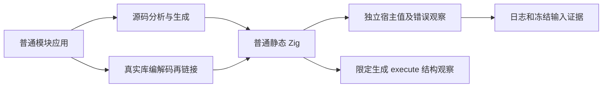
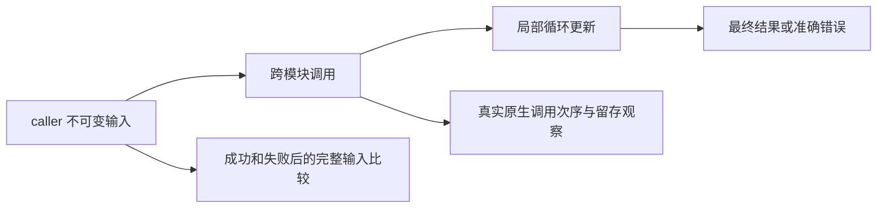

# 跨模块循环内联独立回归执行计划

## Intent：最终目标

为最新跨模块聚合循环内联实现建立独立源码与真实库编解码执行证据。验证优化保持普通应用的循环更新、列表/产品值、参数求值顺序、错误优先级、输入留存和生命周期语义，必要时向实现会话报告实际生产缺陷。

## Data：可用证据

前一部分已以 e0567565 完成测试与上游审阅并 push，是有状态变更及真实执行证据的进展。新实现由 1b4cc783 引入 inline_call，d9aa512e 迁移解析器类型顺序。当前正式实现、仍在使用的 aggregate_loop/loop_columns 回归与相应编译/库往返工具作为入口；并行只读分析各定位新实现边界与既有覆盖，实际测试范围在源码阅读后补充。

## Edges：边界与限制

只新增已授权测试和构建登记，不修改生产实现或旧测试以掩盖失败。不得以优化资格谓词自身作独立 oracle；普通行为使用宿主明确计算，形状观察针对生成代码的 execute 范围并与执行结果分开。不得新增专用运行库、动态加载或解释器。保留其他修改，不问用户，不调用浏览器。只将可复现实际生产缺陷通知授权实现会话，准备工具/环境问题单独记录。

## Answer：交付与成功标准

先形成具体普通应用与源码/库路由计划，再编写独立 fixtures、模型及生成结构观察。通过 Debug/ReleaseSafe 与必要相邻回归，保存 SHA、原始日志与生成产物、IDEA 和 Mermaid、自我复核。完成该部分后英文 Conventional Commit 提交并 push；不将局部绿色门禁视为全部 Test262 或全特性已完成。

## 本轮具体夹具与门禁

正式目录收束于 packages/test/tests/collections/modular_loop，9 个源码模式：simple、branch、switch、chain、bounds、effects、nested、escaping、changed。共享 Frame/State/Inner 类型与跨模块 condition；各 step 是普通模块，main 输出 columns/mirror/total/iterations，escaping 额外保留完整 frames。branch 与 switch 直接 pop 原列表，使 null 早退真实可达；chain 两次调用同一个 tuple helper，分别推进 index 与列，独立期待不把每轮固定成一步。changed 保持入口与签名，只把 simple 增量 3 改 4，并实际执行两种程序。

native observe 接口为单个 u64 参数：condition 使用 2*index，next 使用 2*index+1；宿主记录完整 token 流、返回 token+5 并按显式配置的 token 抛 ProbeFailed。step 两次引用同一 event，但实参应只求值一次。不能用对象参数 probe 冒充 primitive boundary；完整列表逃逸与 nested second loop 验收语义及保守回退，不强制每个 while 都无装箱。

源码与真实统一库 codec 两路分别运行，decoded 生成前真实释放 analysis/library/编码 bytes；原始和 decoded 输入 IR 分别 validate，不将生成成功称为独立派生 IR 验证。simple 的局部生成循环应移除 aggregate helper 并使用 Frame 值缓冲；其他纯模块和 effects 重点要求 aggregate helper 调用消失、运行语义正确，Frame 形态分别实测，不从资格函数推导期待。

另外通过 emitModulesCached 比较完整 cached/uncached bundle、重复生成、同签名 helper 修改使 caller 字节变化及恢复原实现。逐分配失败覆盖完整 cache 初始化/重复/修改/恢复生命周期，单独于运行期 OOM 统计。复用成熟比较和 allocation_testing，没有新解释器或 fixture 特例。

计划执行结果见实施记录：正式源码、草稿与三个冻结工作区的 36 份输入逐项一致。f2a1fc44、f07d3604 与同步后的 85fce785 上的 test-modular-loop 两优化模式均实际通过，并执行 aggregate_loop、loop_columns、list_range 相邻回归。缓存恢复检查覆盖同一已填充 cache 的替换失败与取消故障后的真实重试。

