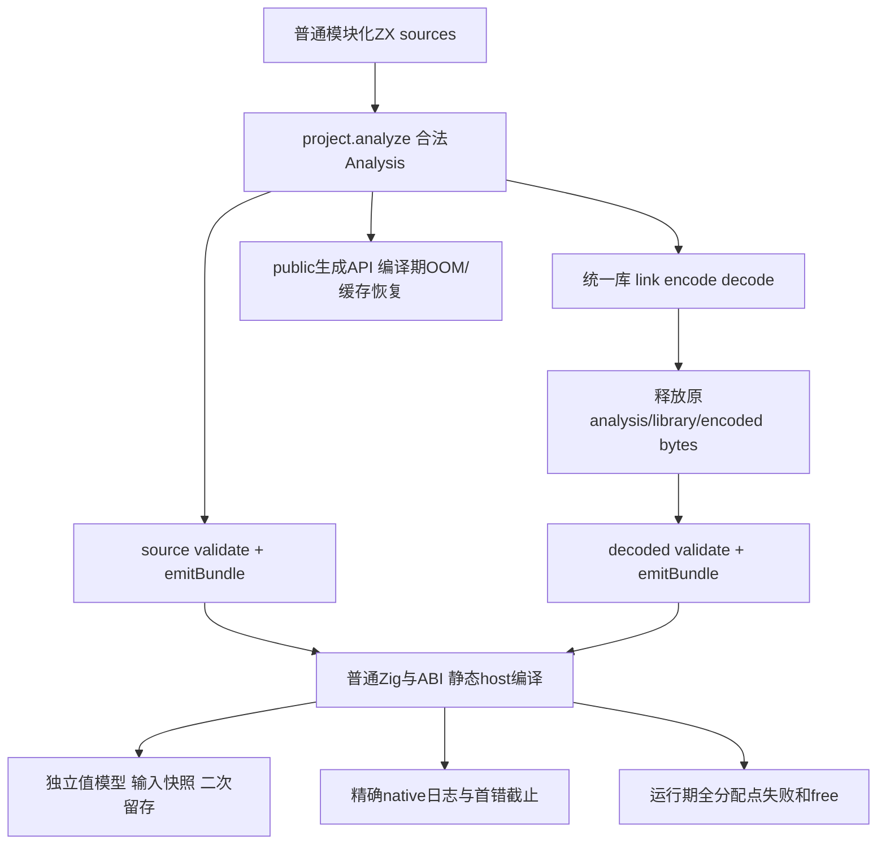

# 跨模块循环内联既有覆盖分析

## Intent：最终目标

针对 `1b4cc783` 的跨模块聚合循环展开，找出能由普通 ZX 源码和独立宿主断言验证、又没有被既有正式夹具重复覆盖的最小边界。复用现有生成普通 Zig、统一库 codec 往返、运行期 OOM 与输入快照组织，不新增通用执行器，不把生产资格 predicate 复制成测试预期。

本轮仅阅读与分析；唯一写入是本文件。正式源码、测试、注册不修改，不执行测试、门禁或提交。

## Data：可用证据

阅读固定 source SHA：`e0567565daf4b1f8c9845f24757344a1d8ee85b3`。新实现提交：`1b4cc78355fa32771a1fca4646f136efef59d523`。正式文件均以固定 SHA 的 git show 阅读，避免并发 HEAD 推进影响行号。可用 ast-grep 工具已发现，但未找到本范围可用的 Zig 配置，故回退 rg 与带行号源码阅读；空检索不当作无覆盖的证明。

完整读过 aggregate_loop 全部 18 文件、loop_columns 全部 19 文件及两份 build 文件，包括 compile、root/model/seed/shape、全部 fixtures、native choose、consumer、dual、leaves、nested、escaping。还阅读跨模块应用三份 ZX、实施计划、验证结果和应用/缓存实际执行 JSON，并补读 module_generation 成熟缓存与 OOM 路由。没有执行这些证据所记录的命令。

### 现有正式测试的具体边界

| 组织                               | 已存在的独立观察                                                                                                               | 对新 modular State step 的覆盖限制                                         |
| ---------------------------------- | ------------------------------------------------------------------------------------------------------------------------------ | -------------------------------------------------------------------------- |
| aggregate_loop stack               | push、读旧 Frame、更新字段、pop 与 popped；宿主独立 total 递推，输入内容/槽位保留，固定峰值资源，成功/零步/bounds 的逐分配失败 | next 全部位于入口；没有 helper 返回整份 State                              |
| aggregate_loop nested              | object/tuple/optional 旧值快照与深层更新，present/null、bool 两支，push/pop，OOM、固定峰值                                     | 全部单模块，未跨 helper 符号重映射                                         |
| two_lanes                          | 同一输入列表作为左右 lane，更新 +1/+2 后各自值，OOM、资源                                                                      | 没有重复调用同一 State helper                                              |
| bounds                             | count=0、空列表、合法尾项、越界与 u64 最大值；保留 input                                                                       | 单模块字段更新错误                                                         |
| old_list                           | 旧 whole-list 版本与更新后的值均观察，保守 fallback                                                                            | helper 输出列表借用旧 product 的新回退边界尚未表达                         |
| call                               | read_frame(previous) 与更新顺序，source/library 路由，call 被纳入值缓冲及 3/64 轮分配量相等                                    | read_frame 的 Input 是单个 Frame、Output 是 u64；不等价于 State→State step |
| escaping                           | 公开 Frame[] 全部内容、两个同 arena 调用留存、OOM、零步与 bounds                                                               | 聚合列表逃逸时回退，未结合 modular helper                                  |
| aggregate consumer                 | 循环后 native choose 的普通参数 ABI，精确调用次数/slot/fail，native error 优先于后续 bounds，循环 bounds 跳过 native，OOM 截止 | native 在循环外，不能证明展开中的 native 实参只求值一次                    |
| loop_columns mixed/direct/borrowed | u64 列与重复投影、借用 prefix、第二次调用前后旧结果、total 独立递推、OOM                                                       | next 仍为单模块                                                            |
| shrink/nested                      | 两次 push 再 pop，嵌套 State.box、tuple 返回与重复 mirror                                                                      | 没有 helper 内部 destructure/return 分支归一化                             |
| dual                               | 两列同借用 prefix 各自增长、mirror、长度/读取、第二次调用留存、bounds、逐分配错误                                              | 两列业务值 +11/+101 有独立断言；没有 modular State 输入输出                |
| leaves                             | optional/null、string/UTF8/NUL、bool 列，borrowed prefix、二次结果留存、bounds、OOM                                            | 无 native_reference 列，且没有模块化 step                                  |
| loop_columns consumer              | 移交后 native 调用日志、首错/后续错误、第一次输出留存、逐分配点失败                                                            | 调用仍在退出循环之后                                                       |
| loop_columns fallback              | 返回 frames 与 columns 迫使普通路径；检查每个 Frame 字段、列、OOM                                                              | 整个 product 列逃逸；不是 residual call 从临时 product 产生借用列表        |

精确入口：

- [aggregate_loop/root.zig:12](/Users/xiewendao/Documents/MatrixAges/zxc/packages/test/tests/collections/aggregate_loop/root.zig:12) 为独立数学/小状态模型，[42](/Users/xiewendao/Documents/MatrixAges/zxc/packages/test/tests/collections/aggregate_loop/root.zig:42) 运行/输入保留，[106](/Users/xiewendao/Documents/MatrixAges/zxc/packages/test/tests/collections/aggregate_loop/root.zig:106) OOM，[118](/Users/xiewendao/Documents/MatrixAges/zxc/packages/test/tests/collections/aggregate_loop/root.zig:118) 资源。
- [nested_test.zig:17](/Users/xiewendao/Documents/MatrixAges/zxc/packages/test/tests/collections/aggregate_loop/nested_test.zig:17) 构造真实 caller owner；[36](/Users/xiewendao/Documents/MatrixAges/zxc/packages/test/tests/collections/aggregate_loop/nested_test.zig:36) 检查输入全部对象、tuple、optional；[54](/Users/xiewendao/Documents/MatrixAges/zxc/packages/test/tests/collections/aggregate_loop/nested_test.zig:54) 独立 total。
- [consumer_test.zig:35](/Users/xiewendao/Documents/MatrixAges/zxc/packages/test/tests/collections/aggregate_loop/consumer_test.zig:35) 精确异常和 native 截止，[consumer/choose.zig:11](/Users/xiewendao/Documents/MatrixAges/zxc/packages/test/tests/collections/aggregate_loop/consumer/choose.zig:11) 原生日志。
- [loop_columns/model.zig:3](/Users/xiewendao/Documents/MatrixAges/zxc/packages/test/tests/collections/loop_columns/model.zig:3)、[seed.zig:10](/Users/xiewendao/Documents/MatrixAges/zxc/packages/test/tests/collections/loop_columns/seed.zig:10)、[root.zig:63](/Users/xiewendao/Documents/MatrixAges/zxc/packages/test/tests/collections/loop_columns/root.zig:63) 有独立递推、固定 caller 内容和二次调用留存；[dual_test.zig:7](/Users/xiewendao/Documents/MatrixAges/zxc/packages/test/tests/collections/loop_columns/dual_test.zig:7) 全列断言；[leaves_test.zig:10](/Users/xiewendao/Documents/MatrixAges/zxc/packages/test/tests/collections/loop_columns/leaves_test.zig:10) 全 leaf 值断言。
- [loop_columns/consumer_test.zig:10](/Users/xiewendao/Documents/MatrixAges/zxc/packages/test/tests/collections/loop_columns/consumer_test.zig:10) 记录至多两次事件的 payload，[62](/Users/xiewendao/Documents/MatrixAges/zxc/packages/test/tests/collections/loop_columns/consumer_test.zig:62) 精确错误/调用次数。
- [aggregate_loop/shape.zig:3](/Users/xiewendao/Documents/MatrixAges/zxc/packages/test/tests/collections/aggregate_loop/shape.zig:3)、[loop_columns/shape.zig:3](/Users/xiewendao/Documents/MatrixAges/zxc/packages/test/tests/collections/loop_columns/shape.zig:3) 限定 execute、循环内分配、capacity/deinit/take 的位置与数量。这些是代码生成的性能/清理形态契约，不是语言值 oracle。

### 现有实际运行证据与限度

[实施计划:59](/Users/xiewendao/Documents/MatrixAges/zxc/docs/2026-10-07/跨模块局部状态/实施计划.md:59) 记录发行构建34/34、相关专项265/265构建步、403/403 Zig 与1/1 Node；[71](/Users/xiewendao/Documents/MatrixAges/zxc/docs/2026-10-07/跨模块局部状态/实施计划.md:71) 记录聚合循环78/78步、102/102检查，列移交85/85步、124/124检查。对应 [验证结果.json](/Users/xiewendao/Documents/MatrixAges/zxc/docs/2026-10-07/跨模块局部状态/验证结果.json:70) 明确这两专项为 ReleaseFast，不能改称当前冻结 SHA 的新 Debug/ReleaseSafe 执行。

现有 build 静态组合与该记录相符：aggregate 8种 mode，每种 source/library；root 7声明×5 mode，nested 5、escaping 5、consumer 6，共51组/route、102组两 route。loop_columns 9种 mode：root 7×6，dual7、leaves6、consumer7，共62组/route、124组两 route。独立声明有重复 route/mode 实例，不能把所有实例数量都说成新增独立边界。

[应用执行.json](/Users/xiewendao/Documents/MatrixAges/zxc/docs/2026-10-07/跨模块局部状态/验证/应用执行.json:1) 三次 Debug 普通应用执行记录：

1. 空 frames/count4 → columns=[1,3,7,15]、total15；
2. 一项 frames/count0 → columns=[]、total0；
3. 一项 frames/count4 → 同第一项结果。

[model.zx:5](/Users/xiewendao/Documents/MatrixAges/zxc/docs/2026-10-07/跨模块局部状态/草稿/model.zx:5)、[stack.zx:12](/Users/xiewendao/Documents/MatrixAges/zxc/docs/2026-10-07/跨模块局部状态/草稿/stack.zx:12)、[step.zx:8](/Users/xiewendao/Documents/MatrixAges/zxc/docs/2026-10-07/跨模块局部状态/草稿/step.zx:8) 是真实模块化 State step 展示；生成 execute 两个 ArrayList、两 deinit、仅 column take。helper 的 pop 前必先 push，故 pop-null 早退在三次运行中不可达；[实施计划:79](/Users/xiewendao/Documents/MatrixAges/zxc/docs/2026-10-07/跨模块局部状态/实施计划.md:79) 自己也明确该限度。

[缓存修改执行.json](/Users/xiewendao/Documents/MatrixAges/zxc/docs/2026-10-07/跨模块局部状态/验证/缓存修改执行.json:1) 保存 helper 增量1→2后 [2,6,14,30]，恢复输出文件保存 [1,3,7,15]；实施记录还有重分析/生成/复用计数。这是一个真实应用缓存变化样本，不是新通用 fixture 的 source/library 双路、逐 OOM、各分支/native 生命周期覆盖。

### 新实现的完整职责边界

- [selection.zig:33](/Users/xiewendao/Documents/MatrixAges/zxc/packages/genz/src/zx/inline_call/selection.zig:33) 对尾部消费、丢弃循环和 scope 消费查找候选；[64](/Users/xiewendao/Documents/MatrixAges/zxc/packages/genz/src/zx/inline_call/selection.zig:64) 复用 result.candidate，[70](/Users/xiewendao/Documents/MatrixAges/zxc/packages/genz/src/zx/inline_call/selection.zig:70) 要求支持的 product list State并标记 condition/body。capture/task/transform 不能据此自动成为新 loop 支持。
- [plan.zig:16](/Users/xiewendao/Documents/MatrixAges/zxc/packages/genz/src/zx/inline_call/plan.zig:16) 用现有 pure 分析与签名/Store/contract/语句形状决定可展开函数；primitive→primitive 与 void 输入未展开。函数成本4096、子调用拓扑顺序、ExpansionLimit 是编译防膨胀边界，测试不应照抄它们制造阈值 IR。
- [mapping.zig:12](/Users/xiewendao/Documents/MatrixAges/zxc/packages/genz/src/zx/inline_call/mapping.zig:12) 每次 child init 追加独立 symbol 段；[33](/Users/xiewendao/Documents/MatrixAges/zxc/packages/genz/src/zx/inline_call/mapping.zig:33) 先映射实参，再映射 body，最后将实参绑定 input 一次。重复调用同 helper 必须保持各自的本地名字、参数与版本。
- [block.zig:25](/Users/xiewendao/Documents/MatrixAges/zxc/packages/genz/src/zx/inline_call/block.zig:25) 处理 result/constant/evaluate/destructure；[46](/Users/xiewendao/Documents/MatrixAges/zxc/packages/genz/src/zx/inline_call/block.zig:46) 区分继续分支与带 return 分支；[93](/Users/xiewendao/Documents/MatrixAges/zxc/packages/genz/src/zx/inline_call/block.zig:93) switch 绑定 subject 一次，以无 subject 的 match 做比较，exhaustive/fallback 保留。到这里编译成功不能代替实际进入 branch。
- [root.zig:25](/Users/xiewendao/Documents/MatrixAges/zxc/packages/genz/src/zx/inline_call/root.zig:25) ExpansionLimit 回退整个单元、OOM 传播；prepare 重建 symbols/expressions/body。该编译期 OOM 与生成程序 execute 的 OOM 是两个独立阶段。
- [iteration_layout.zig:140](/Users/xiewendao/Documents/MatrixAges/zxc/packages/genz/src/zx/iteration_layout.zig:140) 对残留 call 加入 listEscape；[159](/Users/xiewendao/Documents/MatrixAges/zxc/packages/genz/src/zx/iteration_layout.zig:159) 沿 output optional/object/tuple 查列表，[177](/Users/xiewendao/Documents/MatrixAges/zxc/packages/genz/src/zx/iteration_layout.zig:177) 沿 input product/optional 的栈重建子树判断。Input list 原 slice 不等同于栈 product 借用。必须靠普通源码保留值和生命周期验证，不能拿该 predicate 的副本算期待。

## Edges：边界与限制

1. 已测单模块循环与单 Frame→u64 helper读，并不代表跨模块 State→State、重复 helper、本地同名 symbols、真实早退/switch/condition都覆盖。
2. source/library 是统一库 encode/decode 后再 emitBundle 两路，确实有真实普通 Zig 编译执行；不是 emitLibrary 分模块 bundle，也不是 GenerationCache 恢复执行。不能混称。
3. aggregate_loop compile 用 init arena 持有 analysis/library/bytes直至 main退出；它的 decoded emit 不能单独证明原 analysis与bytes被释放后的独立 ownership。loop_columns 的 compile 已用 page_allocator 嵌套 block，在 decoded emit 前真正 deinit analysis/library、memset/free bytes；该成熟组织优先复用。
4. 所有现有运行期 OOM 在宿主 arena/allocator 执行，真实检查所有分配点，但没有让这些跨模块新夹具的 prepare/emitBundle 逐分配失败。原生日志主要在循环后，无法替代循环中实参求值和首错停止。
5. 返回值语义采用内容、长度、optional/tuple值、精确error和调用日志。普通 product wrapper 地址不是语言持久值合同；不要求 helper输入/返回对象地址相等，不要求不同结果必须不同指针。输入槽位本身的身份保留有明确只读合同，可以继续检查。
6. 递归/ExpansionLimit、Store、合同、whole-state escaping、capture 的普遍穷举不属于最小本轮。合法ZX若触发保守回退，可以验证值保留，不能强令所有函数都被内联。
7. 以下源码骨架按已成熟的 import、State消费、loop赋值、spread、pop-null、switch grammar 写成；本轮未分析/编译执行，因此标为可实施草稿，不宣称实际通过。主代理先用正式 compiler.project.analyze 确认 fixture，再运行原有路由。

## Answer：最小独立组合与可复制草稿

建议在现有 collections/loop_columns 组织追加三个受控 mode，复用其 compile/library ownership 路由；可以共用 types、普通 condition、step，第三组复用已有 choose host/interface，只在需要更大调用矩阵时按明确长度扩充事件数组。无需新建通用执行器或替换旧 fixture。

### A. modular_columns：State step、重复调用与列留存

使用三份生产形态源码：types.zx（纯类型）、continue.zx（State→bool）、step.zx（State→State），入口 main.zx。下面 Frame/State 同现有 scalar seed形状，便于复用 seed；输出保留 selected列、mirror及total。

types.zx：

```ts
export type Frame = { position: u64; count: u64 }

export type State = {
    frames: Frame[]
    columns: u64[]
    index: u64
    count: u64
    total: u64
}
```

continue.zx：

```ts
import type { State } from "./types"

export type Input = State

export type Output = bool

export default function (in: Input): Output {
    return in.index < in.count
}
```

step.zx：

```ts
import type { State } from "./types"

export type Input = State

export type Output = State

export default function (in: Input): Output {
    const [appended, _] = in.frames.push({
        position: in.index,
        count: in.total
    })

    const previous = appended[appended.length - 1]

    const [remaining, popped] = appended.pop()

    if (popped == null) {
        return { ...in, frames: remaining, index: in.index + 1 }
    }

    const total = previous.count + popped.count + 1

    return {
        ...in,
        frames: remaining,
        columns: in.columns.push(total)[0],
        index: in.index + 1,
        total: total
    }
}
```

main.zx：

```ts
import step from "./step"

import proceed from "./continue"

import type { Frame, State } from "./types"

export type Input = { frames: Frame[], columns: u64[], count: u64 }

export type Output = { columns: u64[], mirror: u64[], total: u64 }

export default function (in: Input): Output {
    const initial: State = {
        frames: in.frames,
        columns: in.columns,
        index: 0,
        count: in.count,
        total: 0
    }

    const state = loop(initial, {
        while: current => proceed(current),
        next: current => {
            current = step(current)
            current = step(current)
        }
    })

    return {
        columns: state.columns,
        mirror: state.columns,
        total: state.total
    }
}
```

每个 step 的业务公式是 t'=2t+1；入口每轮两次独立调用，实际 step 数为 2*ceil(count/2)。宿主只用小整数递推与完整 prefix 拼接为 oracle：count0、1、2、3、8、16以及 frames空/非空，columns空/257项；count0应完整返回借用prefix；奇数count必须额外执行第二个 step而不是丢失或复用第一个调用的结果。不同 helper调用中的 previous/appended/popped 名字相同仍不能互相覆盖。

对两次同 arena execute分别 count 与 count+2，在第二次执行/失败后再次逐项比较第一次输出；两个 mirror各自比完整独立期待，不只互比。两个 list的 pointer可相同也可不同，不作对象身份假设。输入所有 Frame/槽位、columns内容、ptr/len、count始终保留。

shape限定 execute 循环体不得调用 step/proceed 的普通 ABI，不得逐步 create product；核对局部frame buffer、selected column take与deinit真实位置。不要要求整个生成文件没有 helper普通ABI声明。resource观察采用相同输出长度的资源比较要谨慎：本组列有真实增长，不能照搬短/长总分配必须相等；可检查输出线性增长成本或仅固定帧buffer不逐轮复制的source形态。

该骨架 pop-null仍不可达，因此不能以本组代替B。

### B. modular_branch：可达空 pop、早退与 switch 返回

共用 types/proceed，将 step换为下列普通源码，main 每轮只调用一次step（删除第二句）。step 开始先pop原frames；因此 frames空的首次调用确实进入早退，非空有限prefix会逐轮到达空分支。无需伪造 IR或通过host制造不合法状态。

```ts
import type { State } from "./types"

export type Input = State

export type Output = State

export default function (in: Input): Output {
    const [remaining, popped] = in.frames.pop()

    if (popped == null) {
        return {
            ...in,
            frames: remaining,
            columns: in.columns.push(11)[0],
            index: in.index + 1,
            total: in.total + 11
        }
    }

    const index = in.index + 1

    switch (in.index % 3) {
        case 0:
            return {
                ...in,
                frames: remaining,
                columns: in.columns.push(popped.count)[0],
                index: index,
                total: in.total + popped.count
            }

        case 1:
            return {
                ...in,
                frames: remaining,
                columns: in.columns.push(popped.position)[0],
                index: index,
                total: in.total + popped.position
            }

        default:
            return {
                ...in,
                frames: remaining,
                columns: in.columns.push(7)[0],
                index: index,
                total: in.total + 7
            }
    }
}
```

宿主模型只维护remaining长度，按从输入尾部取Frame、index%3选择count/position/7，空时11；逐项期待prefix+列，并累加total。length0/count1命中空早退；length1/count3命中非空返回后转空；length3/count3命中三个switch分支；count0保留初值。该期待不使用“是否可内联”或映射后的IR。

这一组覆盖 block.result/destructure/branch/switch 的实际分支执行。继续分支的 void-binding不是这段 all-return switch的覆盖；若本轮还需该边界，最小改动为 helper中加入不带return的普通if/switch evaluate，然后继续现有return，并用实际native调用日志验证 evaluate。但含native会使函数非纯、只能覆盖普通调用回退，不能谎称覆盖纯helper的展开。纯函数无可观察evaluate时不必人为制造额外测试。

如果要加强 old/new产品快照，可将A step按正式 stack夹具改成字段更新后同时读取previous与新版本，宿主使用明确旧值和新值公式；优先在同组添加受控step模式，避免复制一套runner。嵌套Frame/tuple/optional跨模块可以随后复用nested_test seed，但不需要先重写已成熟leaf测试。

### C. modular_retained：残留非纯 helper 返回旧 Frame 列表

这一组针对实施记录48行提到的真实生命周期修复：普通helper输入product被重建为临时值，残留call输出列表含该product时必须安全回退。whole-list逃逸的既有fallback不是这一边界。

新增普通 retain.zx，复用已有 choose接口，不写原生pointer保存逻辑：

```ts
import choose from "zig:choose"

import type { Frame } from "./types"

export type Input = { frame: Frame, fail: bool }

export type Output = Frame[]

export default function (in: Input): Output {
    const selected = choose.index({ slot: in.frame.count, fail: in.fail })

    return selected == in.frame.count ? [in.frame] : []
}
```

入口的单轮body可以从正式 bounds/call组织演化，State加入archive:Frame[]和fail:bool，初始化archive=[]，末尾返回total（标量消费）：

```ts
const previous = current.frames[0]

current.frames[0].count += 1
current.archive = retain({ frame: previous, fail: current.fail })
current.total += current.archive[0].count
current.index += 1
```

Frame更新后的当前值与retained列表旧值必须区别：输入首count=b，第k轮native slot为b+k，total为sum(b+k)，不能读到b+k+1，也不能后面覆盖前面helper借用的value。模块仍有真实native effect，资格不应靠路径/名字硬编码；ABI是普通ZX对象/list，没有fakeTypeId。

复用loop_columns choose事件数组（最多8），count只取0/1/2/3：正常必须精确记录每轮slot/fail；空frames且count>0的bounds必须发生于native之前；fail=true首轮仅一次事件并SelectionFailed，不执行后续loop步骤。OOM可发生于首次host前或两host之间：用已有完整事件prefix判断已发生的每次payload，允许合法调用截止，不武断规定所有OOM必须0次。所有caller输入、旧结果与异常保持严格断言；不要求helper wrapper地址与原Frame相同。

这一组最小标量返回即可检测新call fallback及版本；若增加公开archive输出，会改变末尾消费候选，应另列whole-product escape含义，不能悄悄将二者当同一优化门禁。源码shape应确认C仍有残留ABI调用、没有不安全Frame值buffer；语言正确性以值和事件为准。

### 编译、统一库与 ownership 路由

复用 [loop_columns/compile.zig:13](/Users/xiewendao/Documents/MatrixAges/zxc/packages/test/tests/collections/loop_columns/compile.zig:13) 的内层block：

1. project.analyze(page_allocator,完整主/step/condition/types源码数组)；
2. validateIr与emitBundle，保存source+ABI并作shape；
3. library.link → codec.encode → codec.decode；
4. 真实释放original analysis、library，清零并释放encoded bytes；
5. 在外层用decoded.module(0) validate/emitBundle，保存library+ABI；
6. [build/loop_columns.zig:18](/Users/xiewendao/Documents/MatrixAges/zxc/packages/test/build/loop_columns.zig:18) 用现有b.addTest编译和执行这两份普通Zig，host为显式静态import。

不要用 aggregate_loop/compile 的全main defer误认为第4步已发生。传入library.link的Analysis指针须指向caller在当前作用域的稳定var；不返回带Arena.allocator内部指针的可移动夹具struct。本轮源码草稿都使用纯types模块及完整source数组，不靠捕获outer变量或伪造IR。

现有shape检查按mode区分值buffer/take/deinit；建议三个mode只扩充必要source形态期待与对应宿主断言，不另造通用shape引擎。[build.zig:42](/Users/xiewendao/Documents/MatrixAges/zxc/packages/test/build.zig:42) 已把这两成熟step挂到总test；最小门禁保留 test-loop-columns 的 source/library 与各optimize，若A采用aggregate组织则追加test-aggregate-loop。本轮仅建议，未运行。

### 共享 prepare / 分模块生成 / 缓存与编译期 OOM

上面真实codec路由仍是单源emitBundle，能直接验证新内联语义，但不能称 emitLibrary模块路由已验证。当前public入口包括 [zig.zig:15](/Users/xiewendao/Documents/MatrixAges/zxc/packages/compiler/src/backends/zig.zig:15) emitLibrary、[25](/Users/xiewendao/Documents/MatrixAges/zxc/packages/compiler/src/backends/zig.zig:25) emitModules、[45](/Users/xiewendao/Documents/MatrixAges/zxc/packages/compiler/src/backends/zig.zig:45) emitBundle。

[modules.zig:43](/Users/xiewendao/Documents/MatrixAges/zxc/packages/compiler/src/backends/zig/modules.zig:43) prepare一次，再依赖、fingerprint与emitPrepared共享该program；[library.zig:34](/Users/xiewendao/Documents/MatrixAges/zxc/packages/compiler/src/backends/zig/library.zig:34) 准备库program与public view。[fingerprint.zig:47](/Users/xiewendao/Documents/MatrixAges/zxc/packages/compiler/src/backends/zig/fingerprint.zig:47) entry哈希prepared symbols/expressions/body，helper展开体因此进入caller的摘要。这里的“共享”是相应生成路径不重复prepare，不主张整个库所有public view天然一次变换或幂等。

缓存应复用 [module_generation/fixture.zig:20](/Users/xiewendao/Documents/MatrixAges/zxc/packages/test/tests/incremental/module_generation/fixture.zig:20) 完整bundle比较、[buffer_resources_test.zig:26](/Users/xiewendao/Documents/MatrixAges/zxc/packages/test/tests/incremental/module_generation/buffer_resources_test.zig:26) original/repeat/changed/restored 生命周期，以及[buffer_recovery_test.zig:22](/Users/xiewendao/Documents/MatrixAges/zxc/packages/test/tests/incremental/module_generation/buffer_recovery_test.zig:22) same-cache逐点失败后恢复。现有buffer fixture是u64 list reduce，不含本次product loop；cache_test的scalar helper-body变化要求entry不变，不能照抄到被展开helper变更。

若主代理本轮纳入最小缓存检查，仅复用A的完整源码，将step增量1→2、签名/入口保持不变：callerentry必须重新生成，输出序列按独立公式t'=2t+2改变；恢复后能复用原缓存并恢复值。无关未引用helper修改不得把所有单元无条件失效。Source字节比较及缓存计数可作为生成观察，真实执行必须用A宿主期望补齐，不能只看generated.len>0。

编译期OOM最小先对合法A分析完成的IR，使用publicemitBundle(failing allocator)逐点检查OutOfMemory、未污染分析input及全部free；再按需要用上述同cache恢复成熟入口。existing execute的OOM不会触发prepare中的mapping/cost/symbol分配，两阶段不能混算。[allocation_testing.zig:3](/Users/xiewendao/Documents/MatrixAges/zxc/packages/test/tests/support/allocation_testing.zig:3) 禁用resize/remap并委托标准逐分配fail点检查，继续直接复用。

### 成功标准与数据流



值/类型/错误/输入只读/生命周期是主oracle；shape与资源是新优化的独立观察。A必须区分两次helper调用，B必须实际命中所有分支，C必须读旧Frame并精确停止native调用；每组source与真正释放原owner后的codec路由都编译执行普通Zig。没有实测记录前，不登记passed，不声称覆盖任意nested/capture/native_reference或完整自举。

### 自我批判

本分析完整阅读了指定成熟目录，明确区分了已提交测试断言、历史运行证据、新生产源码推断与未执行草稿。三组建议都从真实ZX语法和可观察业务值出发；尚未由frontend确认的新组合可能触发合法保守回退，主代理应以实际source生成结果缩小形态断言，不能为满足优化期待改生产predicate或削弱值/owner/OOM断言。方案不追求所有未来语句图与阈值穷举；优先填补本次整State跨模块、可达分支与残留借用call三个真实边界。
