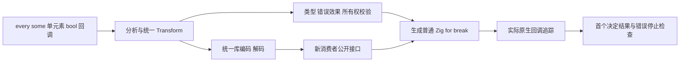
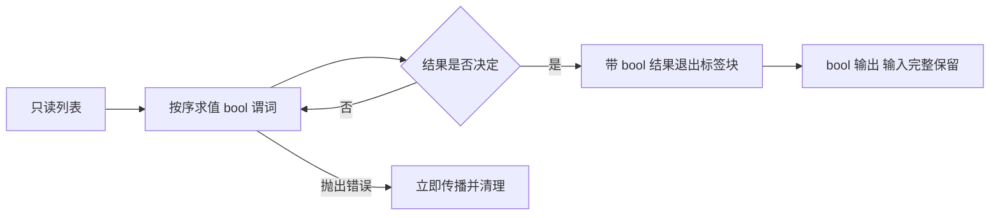

# 集合原生短路谓词执行计划

## Intent：最终目标

补齐 every/some 的原生单元素 bool 谓词与真正循环退出，消除前轮仅能适配观察、没有原生 API 的缺口。持续推进 Test262 和 zxc 全特性目标。

## Data：可用证据

Transform 当前只有 map/filter/reduce，列表方法通过统一 enum 名称解析。现有每类回调要求内联、无捕获，map/filter 单元素、reduce 双元素。genz 的 for_loop 与 break_loop 已成熟；现有 native_runtime 提供真实静态原生回调调用次数与错误追踪样例，borrowed_runtime 提供 provider 销毁后真正编译库消费样例。

## Edges：边界与限制

原任务明确要求“遇到不完善的去完善 zxc 再构建测试用例”，据此授权本部分必要的生产改动。沿用既有规则：every/some 都接受一个内联单元素回调，回调返回 bool，不新增隐式 truthiness、索引/数组参数或闭包捕获。空 every=true、空 some=false；只访问第一个决定结果的位置为止，之前错误传播、之后回调不执行。输入始终只读。

扩展统一 Transform enum、分析与 IR 校验、错误效果、所有权 copy 摘要；genz 直接生成普通 Zig for/break，不能引入运行库或把 reduce 全遍历伪装为退出。IR 版本推进到 25，生成指纹在合入并行优化的 v26 后推进到 v27，旧产物明确拒绝并重建。用户正在进行所有权自举改写，变更保持最小且不改其草稿。

文档和代码草稿统一于本目录，隔离工作区先实现并测试，验证后才按精确路径同步正式源码。无浏览器确认，只有确认生产缺陷时通知实现会话，不把本部分准备错误或明确不支持的旧 API 当成已有实现缺陷。

## Answer：交付与成功标准

源码与真正 compiled-library consumer 两路线；实际原生回调次数/顺序、首个决定结果、错误停止、空输入、输入保留、无谓词容器分配、连续调用及 OOM 清理。新增前端拒绝和非法 IR 检查，执行必要 compiler/core/genz 回归与已有 Test262 观察目标。保存冻结输入、原始日志、生成物和二进制执行 SHA，完成自我复核，英文 Conventional Commit 并实际 push。

## 并行实施补充

发布前 fetch 发现上游 `7e4b1fbb`、`9cef2cd3` 已推进循环内调用缓冲和通道来源审查。正式工作区先快进、隔离工作区保留所有已冻结的自身输入后合入；唯一交叉位置是生成指纹，不覆盖上游优化，继续推进为 v27。IR 仍为独立的版本 25。

全包回归还暴露 26 个已经不符合不可变列表契约的历史断言。合入前基线和当前实现失败名称逐项完全一致；仅修正三个现有测试文件，使同一表达式读取原值与派生值，并继续验证合法 IR。Store 权限、禁止深拷贝和 Task 线性约束不变。这是必要的回归维护，不把历史断言失败作为新生产缺陷通知其它会话。
