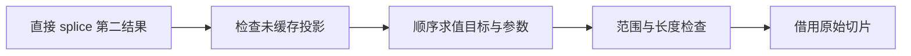
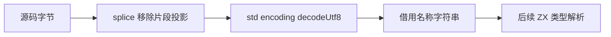

# 集合移除片段的直接借用

## Intent：最终目标

为纯 ZX 类型解析的 Span 文本读取消除整份源码的无用复制，通用优化直接 splice(...)[1]，不引入编译器专用字符串原生桥或新语法。

## Data：可用证据

collections.zig 的 splice 已返回 source[begin..end]，但在此之前无条件构造剩余列表；lower.zig 的 tuple_field 未消除这部分工作。std:encoding.decodeUtf8 已验证后借用输入切片，可直接复用。

## Edges：边界与限制

仅直接投影未缓存 splice 的第二结果。被绑定、缓存或完整消费的结果保留现有生成路径。目标及所有参数按原顺序各求值一次；保留范围与结果长度溢出检查。移除未使用的结果存储分配，不省略 replacement 表达式的副作用或错误。普通与循环值布局都遵守缓存和表示边界。引用元素列表保持原切片元素表示，不重建元素。

不新增测试用例，不执行全量测试。完整 Workspace 状态迁移仍未完成。

## Answer：交付与成功标准

交付 genz 投影生成优化、源码 Span 编译草稿与既有集合专项证据。直接读取移除片段时生成普通 Zig slice，保留参数和边界检查，不分配剩余列表或结果 tuple；完整 splice 行为保持不变。

## 执行与自我复核

普通 lower 与 iteration_value 的 tuple_field 共用 collections 投影入口。它只接受未缓存的直接 splice 第二结果；复用原 lowerMode 的 source/参数顺序、范围检查和结果长度加法。discard total 保留长度溢出，随后返回原 slice。当前 splice 不参与 append 或循环 capacity override，不会绕过已有缓冲。缓存或绑定的整个 tuple 保持原路径。

生成缓存版本从 v13 升至 v14，防止继续复用旧生成物。本次没有修改 IR、源码语法或库编码。

终态发行构建 34/34 步通过。既有 owned collections、value return、module generation 专项共 417/417 步、11423/11423 检查通过；这些专项主要覆盖完整集合操作及通用布局，不把数量当成直接投影路径的穷举证明。

span_text 草稿复用 std:encoding.decodeUtf8。生成物核心直接返回 source[begin..end]，没有非空数组分配、剩余输入 memcpy 或返回 tuple 构造；replacement 的空字面量仍保留既有空 dupe 表达式。应用从 UTF-8 源码的有效 Span 成功输出“名”，正常退出；草稿前提为经过解析器验证的 start/end，并非新的通用 substring API。源码、ABI、构建日志与执行结果归档。

自我复核：删除无用分配会消除对应的 OutOfMemory 机会，这是优化预期；replacement 自身错误、越界与长度溢出仍保留。返回片段的借用关系与原 tuple[1] 完全相同，不延长原始 owner 生命周期。当前只优化直接投影，绑定后再读取未被优化。完整 Workspace 的纯值状态尚未实现，后续 std:encoding 可经现有 zxc_standard 静态模块接入生成的 resolution，无需新增源码文本原生桥。

## 上游专项衔接

合入 e0567565 新增的既有严格范围专项后，当前源码通过 test-list-range 的 54/54 步、2037/2037 检查，未调整断言。该专项消费完整 splice tuple，覆盖整数、文本、结构体、元组、组合与惰性分支，不能作为直接第二投影的穷举证明。最终 v14 发行 CLI 再次生成 span_text，源码与先前审查版本逐字节一致；四份正式源码与镜像 SHA256、格式化生成物归档 SHA256 均核对通过。
