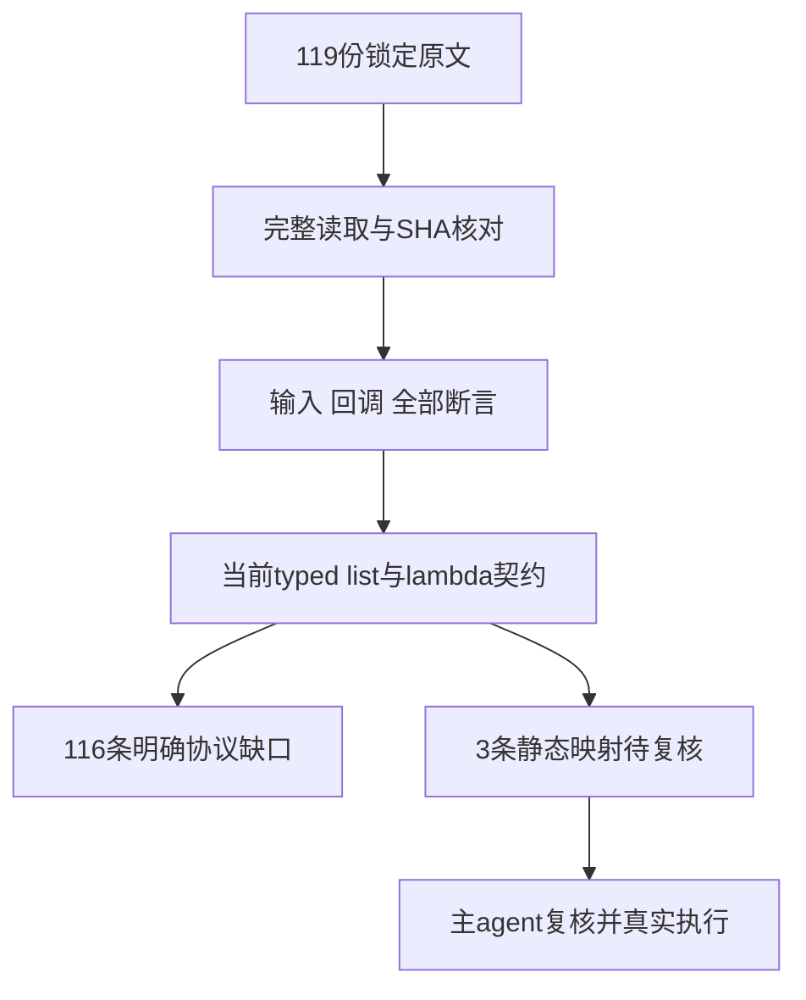

# A组 Filter 原文分析记录

## IDEA

- Intent：审查119份尚未登记的锁定Test262 filter原文，保留真实输入、回调及全部原断言，寻找完整映射的测试机会。
- Data：119份完整正文逐份读取；119个SHA逐项一致；共202项原断言。完整证据在同目录A审查草稿.json。参考packages/core/IR契约.md:56–76、transforms.zig与generate_array_callbacks.ts。
- Edges：仅候选草稿；不变更正式review，不构建，不浏览器，不模拟filter，不将属性协议输入预处理为dense list来宣称支持。静态回调是单元素、内联、非捕获并返回bool；普通列表是不可变持久值。
- Answer：116个excluded候选、3个needs_analysis、0个已认可adapted/equivalent。待主agent复核并真实执行后才形成正式登记。

## 第一性原理与阶段图

filter原例不总是数值筛选。需要分别审查接收者读取协议、长度边界、逐项存在性与读取、callback参数和this、返回值判定及结果容器类别。最终元素一致，不能自动证明中间协议。当前zxc typed list固定元素类型和长度表示，callback只有元素和bool结果；generic、prototype、hole、动态ToPrimitive和thisArg往往是语言边界。

## 三条待复核机会

- 15.4.4.20-5-29：输入[11]，回调无返回语句，恒返回undefined，唯一原断言length===0。可以讨论显式把静态ToBoolean(undefined)=false映射为bool false；真实执行in.filter(item => false).length。不能据此声称支持动态ToBoolean或void callback。
- 15.4.4.20-6-1：输入[]，callback不执行，原断言同时Array.isArray(a)及a.length===0。若允许Array类别映射到typed list类别，必须检查真实filter结果IR类型、生成结果与输出，再检查同一结果长度。不能删掉类别观察。
- 15.4.4.20-5-27：输入[11]，callback恒undefined，仅断言Array.isArray(result)，可以讨论组合前两项映射。不能因只有品牌断言就默认排除，也不能把JSON包装层恒产数组当作filter品牌证据。若Array品牌不可映射，此条与6-1都应排除。

## 逐例摘要

原断言按原文件顺序列出。原句、完整正文、SHA、协议标签与映射均在A审查草稿.json按path查找；这里不嵌入完整原文。

### 1. 15.4.4.20-1-1.js（excluded）

- 输入：Array.prototype.filter.call(undefined)，未提供callback
- 回调：尚未到回调校验阶段
- 原断言：抛TypeError
- 边界：typed list API不存在undefined receiver；编译期错误不能等价于此运行期TypeError，更不能只测试缺失callback。

### 2. 15.4.4.20-1-10.js（excluded）

- 输入：Math.length=1; Math[0]=1
- 回调：检查Object.prototype.toString.call(obj)为[object Math]
- 原断言：结果[0]严格等于1
- 边界：当前filter仅接收静态typed list，回调只接收元素；把此receiver预先变为dense list或把obj谓词替换成恒true会移除被验证的receiver及属性协议。

### 3. 15.4.4.20-1-11.js（excluded）

- 输入：new Date(0)，length=1，属性0=1
- 回调：检查obj instanceof Date
- 原断言：结果[0]严格等于1
- 边界：当前filter仅接收静态typed list，回调只接收元素；把此receiver预先变为dense list或把obj谓词替换成恒true会移除被验证的receiver及属性协议。

### 4. 15.4.4.20-1-12.js（excluded）

- 输入：new RegExp()，length=2，仅属性1=true，属性0缺失
- 回调：检查obj instanceof RegExp
- 原断言：结果[0]严格等于true
- 边界：当前filter仅接收静态typed list，回调只接收元素；把此receiver预先变为dense list或把obj谓词替换成恒true会移除被验证的receiver及属性协议。

### 5. 15.4.4.20-1-13.js（excluded）

- 输入：JSON.length=1; JSON[0]=1
- 回调：检查Object.prototype.toString.call(JSON)为[object JSON]；obj参数声明但未读取
- 原断言：结果[0]严格等于1
- 边界：真正缺口是generic JSON对象receiver及回调引用外层JSON并检查品牌；第三参数obj虽声明但未读取，不以声明本身排除。

### 6. 15.4.4.20-1-14.js（excluded）

- 输入：new Error()，length=1，属性0=1
- 回调：检查obj instanceof Error
- 原断言：结果[0]严格等于1
- 边界：当前filter仅接收静态typed list，回调只接收元素；把此receiver预先变为dense list或把obj谓词替换成恒true会移除被验证的receiver及属性协议。

### 7. 15.4.4.20-1-15.js（excluded）

- 输入：IIFE arguments对象，实参a,b
- 回调：检查Object.prototype.toString.call(obj)为[object Arguments]
- 原断言：结果[0]严格等于a；结果[1]严格等于b
- 边界：当前filter仅接收静态typed list，回调只接收元素；把此receiver预先变为dense list或把obj谓词替换成恒true会移除被验证的receiver及属性协议。

### 8. 15.4.4.20-1-2.js（excluded）

- 输入：Array.prototype.filter.call(null)，未提供callback
- 回调：尚未到回调校验阶段
- 原断言：抛TypeError
- 边界：typed list API不存在null receiver；编译期错误不能验证ToObject先于callback校验。

### 9. 15.4.4.20-1-3.js（excluded）

- 输入：primitive false；Boolean.prototype[0]=true，prototype.length=1
- 回调：检查装箱后obj instanceof Boolean
- 原断言：结果[0]严格等于true
- 边界：当前filter仅接收静态typed list，回调只接收元素；把此receiver预先变为dense list或把obj谓词替换成恒true会移除被验证的receiver及属性协议。

### 10. 15.4.4.20-1-4.js（excluded）

- 输入：new Boolean(true)，length=2，属性0=11,1=12
- 回调：检查obj instanceof Boolean
- 原断言：结果[0]严格等于11；结果[1]严格等于12
- 边界：当前filter仅接收静态typed list，回调只接收元素；把此receiver预先变为dense list或把obj谓词替换成恒true会移除被验证的receiver及属性协议。

### 11. 15.4.4.20-1-5.js（excluded）

- 输入：primitive 2.5；Number.prototype[0]=1，prototype.length=1
- 回调：检查装箱后obj instanceof Number
- 原断言：结果[0]严格等于1
- 边界：当前filter仅接收静态typed list，回调只接收元素；把此receiver预先变为dense list或把obj谓词替换成恒true会移除被验证的receiver及属性协议。

### 12. 15.4.4.20-1-6.js（excluded）

- 输入：new Number(-128)，length=2，属性0=11,1=12
- 回调：检查obj instanceof Number
- 原断言：结果[0]严格等于11；结果[1]严格等于12
- 边界：当前filter仅接收静态typed list，回调只接收元素；把此receiver预先变为dense list或把obj谓词替换成恒true会移除被验证的receiver及属性协议。

### 13. 15.4.4.20-1-7.js（excluded）

- 输入：primitive字符串abc
- 回调：检查装箱后obj instanceof String
- 原断言：结果[0]严格等于a
- 边界：当前filter仅接收静态typed list，回调只接收元素；把此receiver预先变为dense list或把obj谓词替换成恒true会移除被验证的receiver及属性协议。

### 14. 15.4.4.20-1-8.js（excluded）

- 输入：new String(abc)
- 回调：检查obj instanceof String
- 原断言：结果[0]严格等于a
- 边界：当前filter仅接收静态typed list，回调只接收元素；把此receiver预先变为dense list或把obj谓词替换成恒true会移除被验证的receiver及属性协议。

### 15. 15.4.4.20-1-9.js（excluded）

- 输入：function(a,b){return a+b}，函数length=2，属性0=11,1=9
- 回调：检查obj instanceof Function
- 原断言：结果[0]严格等于11；结果[1]严格等于9
- 边界：当前filter仅接收静态typed list，回调只接收元素；把此receiver预先变为dense list或把obj谓词替换成恒true会移除被验证的receiver及属性协议。

### 16. 15.4.4.20-10-3.js（excluded）

- 输入：foo.prototype=new Array(1,2,3)；f=new foo()；f.length=1
- 回调：无参数cb恒true
- 原断言：Array.isArray(a)为true；a.length严格等于1
- 边界：f是继承数组实例的普通对象，不能简化为[1]；typed list无prototype属性查找或JS Array品牌。

### 17. 15.4.4.20-2-1.js（excluded）

- 输入：普通obj属性0=12,1=11,2=9；own data length=2
- 回调：每次读取callback第三参数obj.length，等于2时保留
- 原断言：结果length严格等于2
- 边界：当前filter仅接收静态typed list，回调只接收元素；把此receiver预先变为dense list或把obj谓词替换成恒true会移除被验证的receiver及属性协议。

### 18. 15.4.4.20-2-10.js（excluded）

- 输入：child属性0=12,1=11,2=9；prototype length getter返回2
- 回调：每次读取callback第三参数obj.length，等于2时保留
- 原断言：结果length严格等于2
- 边界：当前filter仅接收静态typed list，回调只接收元素；把此receiver预先变为dense list或把obj谓词替换成恒true会移除被验证的receiver及属性协议。

### 19. 15.4.4.20-2-11.js（excluded）

- 输入：obj属性0=11,1=12；own length仅setter，没有getter
- 回调：如调用则accessed=true并返回true；原例要求不调用
- 原断言：结果length严格等于0；accessed严格等于false
- 边界：原输入仍含元素但属性length读取为undefined；不能用空typed list替代该属性解析，也不能删掉不调用callback的accessed观察。

### 20. 15.4.4.20-2-12.js（excluded）

- 输入：obj属性0=12,1=11；own length仅setter遮蔽Object.prototype的length getter(返回2)
- 回调：如调用则accessed=true并返回true；原例要求不调用
- 原断言：结果length严格等于0；accessed严格等于false
- 边界：原输入仍含元素但属性length读取为undefined；不能用空typed list替代该属性解析，也不能删掉不调用callback的accessed观察。

### 21. 15.4.4.20-2-13.js（excluded）

- 输入：child属性0=11,1=12；prototype length仅setter，没有getter
- 回调：如调用则accessed=true并返回true；原例要求不调用
- 原断言：结果length严格等于0；accessed严格等于false
- 边界：原输入仍含元素但属性length读取为undefined；不能用空typed list替代该属性解析，也不能删掉不调用callback的accessed观察。

### 22. 15.4.4.20-2-14.js（excluded）

- 输入：obj属性0=11,1=12；不存在length属性
- 回调：如调用则accessed=true并返回true；原例要求不调用
- 原断言：结果length严格等于0；accessed严格等于false
- 边界：原输入仍含元素但属性length读取为undefined；不能用空typed list替代该属性解析，也不能删掉不调用callback的accessed观察。

### 23. 15.4.4.20-2-17.js（excluded）

- 输入：function(a,b)内的arguments，实参12,11
- 回调：读取obj.length===2
- 原断言：func(12,11)返回true，即内部filter结果length===2
- 边界：当前filter仅接收静态typed list，回调只接收元素；把此receiver预先变为dense list或把obj谓词替换成恒true会移除被验证的receiver及属性协议。

### 24. 15.4.4.20-2-18.js（excluded）

- 输入：new String(012)，length=3，字符属性0,1,2
- 回调：读取obj.length===3
- 原断言：结果length严格等于3
- 边界：当前filter仅接收静态typed list，回调只接收元素；把此receiver预先变为dense list或把obj谓词替换成恒true会移除被验证的receiver及属性协议。

### 25. 15.4.4.20-2-19.js（excluded）

- 输入：function(a,b){return a+b}，length=2，属性0=12,1=11,2=9
- 回调：读取obj.length===2
- 原断言：结果length严格等于2
- 边界：当前filter仅接收静态typed list，回调只接收元素；把此receiver预先变为dense list或把obj谓词替换成恒true会移除被验证的receiver及属性协议。

### 26. 15.4.4.20-2-2.js（excluded）

- 输入：dense Array [12,11]，own length=2
- 回调：读取callback第三参数obj.length===2
- 原断言：结果length严格等于2
- 边界：typed list是适合的输入，但filter只能传元素，原谓词依赖原数组第三参数；用恒true或捕获in.length不验证原传参，当前不支持。

### 27. 15.4.4.20-2-3.js（excluded）

- 输入：child属性0=12,1=11,2=9；own length=2覆盖prototype length=3
- 回调：每次读取callback第三参数obj.length，等于2时保留
- 原断言：结果length严格等于2
- 边界：当前filter仅接收静态typed list，回调只接收元素；把此receiver预先变为dense list或把obj谓词替换成恒true会移除被验证的receiver及属性协议。

### 28. 15.4.4.20-2-4.js（excluded）

- 输入：Array.prototype.length=0；dense Array [12,11] own length=2
- 回调：读取callback第三参数obj.length===2
- 原断言：结果length严格等于2
- 边界：除第三参数缺失外，还必须真实表达Array prototype覆盖关系；不应把此原例登记为普通dense filter。

### 29. 15.4.4.20-2-5.js（excluded）

- 输入：child属性0=12,1=11,2=9；own data length=2覆盖prototype getter返回3
- 回调：每次读取callback第三参数obj.length，等于2时保留
- 原断言：结果length严格等于2
- 边界：当前filter仅接收静态typed list，回调只接收元素；把此receiver预先变为dense list或把obj谓词替换成恒true会移除被验证的receiver及属性协议。

### 30. 15.4.4.20-2-6.js（excluded）

- 输入：child属性0=12,1=11,2=9；prototype data length=2
- 回调：每次读取callback第三参数obj.length，等于2时保留
- 原断言：结果length严格等于2
- 边界：当前filter仅接收静态typed list，回调只接收元素；把此receiver预先变为dense list或把obj谓词替换成恒true会移除被验证的receiver及属性协议。

### 31. 15.4.4.20-2-7.js（excluded）

- 输入：obj属性0=12,1=11,2=9；own length getter返回2
- 回调：每次读取callback第三参数obj.length，等于2时保留
- 原断言：结果length严格等于2
- 边界：当前filter仅接收静态typed list，回调只接收元素；把此receiver预先变为dense list或把obj谓词替换成恒true会移除被验证的receiver及属性协议。

### 32. 15.4.4.20-2-8.js（excluded）

- 输入：child属性0=12,1=11,2=9；own getter返回2覆盖prototype length=3
- 回调：每次读取callback第三参数obj.length，等于2时保留
- 原断言：结果length严格等于2
- 边界：当前filter仅接收静态typed list，回调只接收元素；把此receiver预先变为dense list或把obj谓词替换成恒true会移除被验证的receiver及属性协议。

### 33. 15.4.4.20-2-9.js（excluded）

- 输入：child属性0=12,1=11,2=9；own getter返回2覆盖prototype getter返回3
- 回调：每次读取callback第三参数obj.length，等于2时保留
- 原断言：结果length严格等于2
- 边界：当前filter仅接收静态typed list，回调只接收元素；把此receiver预先变为dense list或把obj谓词替换成恒true会移除被验证的receiver及属性协议。

### 34. 15.4.4.20-3-1.js（excluded）

- 输入：generic obj，属性0=0,1=1，length=undefined
- 回调：如调用则设置accessed标记为true并返回true；应不调用
- 原断言：结果length严格等于0；accessed严格等于false
- 边界：原对象有数据属性但length为undefined；静态list长度不走此转换，替换为空list会丢掉输入协议和副作用观察。

### 35. 15.4.4.20-3-10.js（excluded）

- 输入：generic obj，属性0=9，length=NaN
- 回调：如调用则设置accessed标记为true并返回true；应不调用
- 原断言：结果length严格等于0；accessed严格等于false
- 边界：原对象有数据属性但length为NaN；静态list长度不走此转换，替换为空list会丢掉输入协议和副作用观察。

### 36. 15.4.4.20-3-11.js（excluded）

- 输入：generic obj仅属性1=11,2=9；length=字符串2
- 回调：恒true
- 原断言：结果length严格等于1；结果[0]严格等于11
- 边界：必须由filter读取并转换length，再跳过缺失索引0且忽略索引2；预先压成[11]无法验证这些观察的原因。

### 37. 15.4.4.20-3-12.js（excluded）

- 输入：generic obj属性1=11,2=9；length=字符串-4294967294
- 回调：恒true
- 原断言：结果length严格等于0；结果[0]严格等于undefined
- 边界：不能沿用旧ToUint32模数语义；当前原文期望负length为0。typed list无负length，也不以undefined表示越界读取。

### 38. 15.4.4.20-3-13.js（excluded）

- 输入：generic obj仅属性1=11,2=9；length=字符串2.5
- 回调：恒true
- 原断言：结果length严格等于1；结果[0]严格等于11
- 边界：必须由filter读取并转换length，再跳过缺失索引0且忽略索引2；预先压成[11]无法验证这些观察的原因。

### 39. 15.4.4.20-3-14.js（excluded）

- 输入：generic obj，属性0=9，length字符串-Infinity；变量为accessed2/newArr2
- 回调：如调用则设置accessed标记为true并返回true；应不调用
- 原断言：accessed2严格等于false；newArr2.length严格等于0
- 边界：原对象有数据属性但length为字符串-Infinity；静态list长度不走此转换，替换为空list会丢掉输入协议和副作用观察。

### 40. 15.4.4.20-3-15.js（excluded）

- 输入：generic obj仅属性1=11,2=9；length=字符串2E0
- 回调：恒true
- 原断言：结果length严格等于1；结果[0]严格等于11
- 边界：必须由filter读取并转换length，再跳过缺失索引0且忽略索引2；预先压成[11]无法验证这些观察的原因。

### 41. 15.4.4.20-3-16.js（excluded）

- 输入：generic obj仅属性1=11,2=9；length=字符串0x0002
- 回调：恒true
- 原断言：结果length严格等于1；结果[0]严格等于11
- 边界：必须由filter读取并转换length，再跳过缺失索引0且忽略索引2；预先压成[11]无法验证这些观察的原因。

### 42. 15.4.4.20-3-17.js（excluded）

- 输入：generic obj仅属性1=11,2=9；length=字符串0002.00
- 回调：恒true
- 原断言：结果length严格等于1；结果[0]严格等于11
- 边界：必须由filter读取并转换length，再跳过缺失索引0且忽略索引2；预先压成[11]无法验证这些观察的原因。

### 43. 15.4.4.20-3-18.js（excluded）

- 输入：generic obj，属性0=9，length字符串asdf!_
- 回调：如调用则设置accessed标记为true并返回true；应不调用
- 原断言：accessed严格等于false；结果length严格等于0
- 边界：原对象有数据属性但length为非数字字符串；静态list长度不走此转换，替换为空list会丢掉输入协议和副作用观察。

### 44. 15.4.4.20-3-19.js（excluded）

- 输入：generic obj仅属性1=11,2=9；length=对象own toString返回字符串2(继承默认valueOf返回自身)
- 回调：恒true
- 原断言：结果length严格等于1；结果[0]严格等于11
- 边界：必须由filter读取并转换length，再跳过缺失索引0且忽略索引2；预先压成[11]无法验证这些观察的原因。

### 45. 15.4.4.20-3-2.js（excluded）

- 输入：generic obj属性0=11,1=9，length=true
- 回调：恒true
- 原断言：结果length严格等于1；结果[0]严格等于11
- 边界：把receiver预处理为[11]删去了true length的动态转换。

### 46. 15.4.4.20-3-20.js（excluded）

- 输入：generic obj仅属性1=11,2=9；length=对象own valueOf返回数字2
- 回调：恒true
- 原断言：结果length严格等于1；结果[0]严格等于11
- 边界：必须由filter读取并转换length，再跳过缺失索引0且忽略索引2；预先压成[11]无法验证这些观察的原因。

### 47. 15.4.4.20-3-21.js（excluded）

- 输入：generic obj属性1=11,2=9；length.valueOf设置firstStepOccured=true并返回{}；toString设置secondStepOccured=true并返回2字符串
- 回调：恒true
- 原断言：结果length严格等于1；结果[0]严格等于11；firstStepOccured为true；secondStepOccured为true
- 边界：必须保留valueOf失败后toString后备及两个观察；不能只保留输出[11]。两个标记证明两阶段均执行，原例本身未直接用日志断言严格先后。

### 48. 15.4.4.20-3-22.js（excluded）

- 输入：generic obj属性1=11,2=12；length.valueOf与toString均设置各自标记并返回{}
- 回调：callback若调用会accessed=true并返回true；实际不能调用
- 原断言：抛TypeError；accessed严格等于false；firstStepOccured为true；secondStepOccured为true
- 边界：静态typed list不会调用两个用户转换方法；单个编译诊断无法保留转换异常与三个副作用观察。

### 49. 15.4.4.20-3-23.js（excluded）

- 输入：generic obj属性1=11,2=9；length为child；child继承valueOf返回2并设valueOfAccessed=true；own toString返回1字符串并设toStringAccessed=true
- 回调：恒true
- 原断言：结果length严格等于1；结果[0]严格等于11；valueOfAccessed为true；toStringAccessed严格等于false
- 边界：关键是继承转换方法优先级和toString不调用；无法预先固定list而保持这些观察。

### 50. 15.4.4.20-3-24.js（excluded）

- 输入：generic obj仅属性1=11,2=9；length=数字2.685
- 回调：恒true
- 原断言：结果length严格等于1；结果[0]严格等于11
- 边界：必须由filter读取并转换length，再跳过缺失索引0且忽略索引2；预先压成[11]无法验证这些观察的原因。

### 51. 15.4.4.20-3-25.js（excluded）

- 输入：generic obj属性1=11,2=9；length=数字-4294967294.5
- 回调：恒true
- 原断言：结果length严格等于0；结果[0]严格等于undefined
- 边界：不能沿用旧ToUint32模数语义；当前原文期望负length为0。typed list无负length，也不以undefined表示越界读取。

### 52. 15.4.4.20-3-3.js（excluded）

- 输入：generic obj，属性0=11，length=0
- 回调：如调用则设置accessed标记为true并返回true；应不调用
- 原断言：结果length严格等于0；accessed严格等于false
- 边界：原对象有数据属性但length为0；静态list长度不走此转换，替换为空list会丢掉输入协议和副作用观察。

### 53. 15.4.4.20-3-4.js（excluded）

- 输入：generic obj，属性0=11，length=+0
- 回调：如调用则设置accessed标记为true并返回true；应不调用
- 原断言：结果length严格等于0；accessed严格等于false
- 边界：原对象有数据属性但length为+0；静态list长度不走此转换，替换为空list会丢掉输入协议和副作用观察。

### 54. 15.4.4.20-3-5.js（excluded）

- 输入：generic obj，属性0=11，length=-0
- 回调：如调用则设置accessed标记为true并返回true；应不调用
- 原断言：结果length严格等于0；accessed严格等于false
- 边界：原对象有数据属性但length为-0；静态list长度不走此转换，替换为空list会丢掉输入协议和副作用观察。

### 55. 15.4.4.20-3-6.js（excluded）

- 输入：generic obj仅属性1=11,2=9；length=数字2
- 回调：恒true
- 原断言：结果length严格等于1；结果[0]严格等于11
- 边界：必须由filter读取并转换length，再跳过缺失索引0且忽略索引2；预先压成[11]无法验证这些观察的原因。

### 56. 15.4.4.20-3-7.js（excluded）

- 输入：generic obj属性1=11,2=9；length=数字-4294967294
- 回调：恒true
- 原断言：结果length严格等于0；结果[0]严格等于undefined
- 边界：不能沿用旧ToUint32模数语义；当前原文期望负length为0。typed list无负length，也不以undefined表示越界读取。

### 57. 15.4.4.20-3-9.js（excluded）

- 输入：generic obj，属性0=9，length=-Infinity
- 回调：如调用则设置accessed标记为true并返回true；应不调用
- 原断言：结果length严格等于0；accessed严格等于false
- 边界：原对象有数据属性但length为-Infinity；静态list长度不走此转换，替换为空list会丢掉输入协议和副作用观察。

### 58. 15.4.4.20-4-1.js（excluded）

- 输入：new Array(10)，10个hole；filter(不传callback)
- 回调：参数不是合法callback，不应进入遍历
- 原断言：运行期抛TypeError
- 边界：分析器会要求内联lambda并在编译期拒绝不合法参数；这是另一项静态契约，不能宣称等价验证JS运行期TypeError。

### 59. 15.4.4.20-4-10.js（excluded）

- 输入：generic obj属性0=11,1=12；length getter抛Test262Error；callback参数undefined
- 回调：不会校验到callback阶段
- 原断言：抛Test262Error
- 边界：必须验证length Get异常先于undefined callback IsCallable；静态callback校验无法表达此顺序。

### 60. 15.4.4.20-4-11.js（excluded）

- 输入：generic obj属性0=11,1=12；length getter返回对象，其toString抛Test262Error；callback参数undefined
- 回调：不会校验到callback阶段
- 原断言：抛Test262Error
- 边界：必须验证长度对象转换异常先于undefined callback校验，typed list不存在此阶段。

### 61. 15.4.4.20-4-12.js（excluded）

- 输入：dense Array [11,9]
- 回调：idx===1时返回val===9，其余返回false
- 原断言：结果length严格等于1；结果[0]严格等于9
- 边界：只传元素无法保留idx条件；把谓词改为val===9只对当前值偶合，duplicate与置换可区分，不能用手工counter模拟filter传参。

### 62. 15.4.4.20-4-15.js（excluded）

- 输入：generic obj有属性10=10；length getter设lengthAccessed=true并返回20；索引0 getter设loopAccessed=true并返回10；未传callback
- 回调：不会调用callback，不能访问索引0
- 原断言：抛TypeError；lengthAccessed为true；loopAccessed严格等于false
- 边界：三条观察共同约束校验顺序；编译拒绝缺参不允许执行Get length，不能用于等价review。

### 63. 15.4.4.20-4-2.js（excluded）

- 输入：new Array(10)，10个hole；filter(foo未声明)
- 回调：参数不是合法callback，不应进入遍历
- 原断言：运行期抛ReferenceError
- 边界：分析器会要求内联lambda并在编译期拒绝不合法参数；这是另一项静态契约，不能宣称等价验证JS运行期ReferenceError。

### 64. 15.4.4.20-4-3.js（excluded）

- 输入：new Array(10)，10个hole；filter(null)
- 回调：参数不是合法callback，不应进入遍历
- 原断言：运行期抛TypeError
- 边界：分析器会要求内联lambda并在编译期拒绝不合法参数；这是另一项静态契约，不能宣称等价验证JS运行期TypeError。

### 65. 15.4.4.20-4-4.js（excluded）

- 输入：new Array(10)，10个hole；filter(true)
- 回调：参数不是合法callback，不应进入遍历
- 原断言：运行期抛TypeError
- 边界：分析器会要求内联lambda并在编译期拒绝不合法参数；这是另一项静态契约，不能宣称等价验证JS运行期TypeError。

### 66. 15.4.4.20-4-5.js（excluded）

- 输入：new Array(10)，10个hole；filter(5)
- 回调：参数不是合法callback，不应进入遍历
- 原断言：运行期抛TypeError
- 边界：分析器会要求内联lambda并在编译期拒绝不合法参数；这是另一项静态契约，不能宣称等价验证JS运行期TypeError。

### 67. 15.4.4.20-4-6.js（excluded）

- 输入：new Array(10)，10个hole；filter(abc字符串)
- 回调：参数不是合法callback，不应进入遍历
- 原断言：运行期抛TypeError
- 边界：分析器会要求内联lambda并在编译期拒绝不合法参数；这是另一项静态契约，不能宣称等价验证JS运行期TypeError。

### 68. 15.4.4.20-4-7.js（excluded）

- 输入：new Array(10)，10个hole；filter(new Object())
- 回调：参数不是合法callback，不应进入遍历
- 原断言：运行期抛TypeError
- 边界：分析器会要求内联lambda并在编译期拒绝不合法参数；这是另一项静态契约，不能宣称等价验证JS运行期TypeError。

### 69. 15.4.4.20-4-8.js（excluded）

- 输入：generic obj属性0=11,1=12；length getter设accessed=true并返回2；callback为null
- 回调：不合法callback
- 原断言：抛TypeError；accessed为true
- 边界：必须保留length getter副作用在异常前执行；编译期拒绝null会丢掉该观察。

### 70. 15.4.4.20-4-9.js（excluded）

- 输入：generic obj属性0=11,1=12；length getter返回对象，toString设accessed=true并返回2字符串；callback为null
- 回调：不合法callback
- 原断言：抛TypeError；accessed为true
- 边界：必须保留长度对象转换副作用在异常前执行；静态错误无法等价。

### 71. 15.4.4.20-5-1-s.js（excluded）

- 输入：Array [1]，省略thisArg；callback函数体自身use strict；文件noStrict
- 回调：innerThisCorrect=this===undefined；返回true
- 原断言：innerThisCorrect为true
- 边界：zxc lambda无动态this，也不捕获标记；验证恒true filter不能观察this绑定。

### 72. 15.4.4.20-5-1.js（excluded）

- 输入：非严格IIFE；全局this._15_4_4_20_5_1=false，局部同名变量true；Array [1]；省略thisArg
- 回调：返回this._15_4_4_20_5_1
- 原断言：结果length严格等于0
- 边界：描述称thisArg is passed，但源码没有第二参数，关键是省略thisArg时非严格global绑定；不能换为恒false来验证。

### 73. 15.4.4.20-5-10.js（excluded）

- 输入：Array [11]；thisArg=new Array(10)
- 回调：accessed=true；返回this === objArray
- 原断言：结果[0]严格等于11；accessed为true
- 边界：filter只接收一个内联非捕获lambda参数，没有thisArg；对象身份与accessed均不可删掉。

### 74. 15.4.4.20-5-11.js（excluded）

- 输入：Array [11]；thisArg=new String()
- 回调：accessed=true；返回this === objString
- 原断言：结果[0]严格等于11；accessed为true
- 边界：filter只接收一个内联非捕获lambda参数，没有thisArg；对象身份与accessed均不可删掉。

### 75. 15.4.4.20-5-12.js（excluded）

- 输入：Array [11]；thisArg=new Boolean()
- 回调：accessed=true；返回this === objBoolean
- 原断言：结果[0]严格等于11；accessed为true
- 边界：filter只接收一个内联非捕获lambda参数，没有thisArg；对象身份与accessed均不可删掉。

### 76. 15.4.4.20-5-13.js（excluded）

- 输入：Array [11]；thisArg=new Number()
- 回调：accessed=true；返回this === objNumber
- 原断言：结果[0]严格等于11；accessed为true
- 边界：filter只接收一个内联非捕获lambda参数，没有thisArg；对象身份与accessed均不可删掉。

### 77. 15.4.4.20-5-14.js（excluded）

- 输入：Array [11]；thisArg=Math
- 回调：accessed=true；返回this === Math
- 原断言：结果[0]严格等于11；accessed为true
- 边界：filter只接收一个内联非捕获lambda参数，没有thisArg；对象身份与accessed均不可删掉。

### 78. 15.4.4.20-5-15.js（excluded）

- 输入：Array [11]；thisArg=new Date(0)
- 回调：accessed=true；返回this === objDate
- 原断言：结果[0]严格等于11；accessed为true
- 边界：filter只接收一个内联非捕获lambda参数，没有thisArg；对象身份与accessed均不可删掉。

### 79. 15.4.4.20-5-16.js（excluded）

- 输入：Array [11]；thisArg=new RegExp()
- 回调：accessed=true；返回this === objRegExp
- 原断言：结果[0]严格等于11；accessed为true
- 边界：filter只接收一个内联非捕获lambda参数，没有thisArg；对象身份与accessed均不可删掉。

### 80. 15.4.4.20-5-17.js（excluded）

- 输入：Array [11]；thisArg=JSON
- 回调：accessed=true；返回this === JSON
- 原断言：结果[0]严格等于11；accessed为true
- 边界：filter只接收一个内联非捕获lambda参数，没有thisArg；对象身份与accessed均不可删掉。

### 81. 15.4.4.20-5-18.js（excluded）

- 输入：Array [11]；thisArg=new RangeError()
- 回调：accessed=true；返回this === objError
- 原断言：结果[0]严格等于11；accessed为true
- 边界：filter只接收一个内联非捕获lambda参数，没有thisArg；对象身份与accessed均不可删掉。

### 82. 15.4.4.20-5-19.js（excluded）

- 输入：Array [11]；thisArg=IIFE arguments(1,2,3)
- 回调：accessed=true；返回this === arg
- 原断言：结果[0]严格等于11；accessed为true
- 边界：filter只接收一个内联非捕获lambda参数，没有thisArg；对象身份与accessed均不可删掉。

### 83. 15.4.4.20-5-2.js（excluded）

- 输入：Array [1]；thisArg=new Object() own res=true
- 回调：返回this.res；外层res=false作为区分背景
- 原断言：结果length严格等于1
- 边界：必须通过this读取正确接收对象的res；不能以恒true替代，typed lambda没有thisArg或动态this。

### 84. 15.4.4.20-5-21.js（excluded）

- 输入：Array [11]；thisArg=顶层this保存为global
- 回调：accessed=true；返回this === global
- 原断言：结果[0]严格等于11；accessed为true
- 边界：filter只接收一个内联非捕获lambda参数，没有thisArg；对象身份与accessed均不可删掉。

### 85. 15.4.4.20-5-22.js（excluded）

- 输入：Array [11]；thisArg=false
- 回调：accessed=true；返回this.valueOf() === false
- 原断言：结果[0]严格等于11；accessed为true
- 边界：不传thisArg并返回bool常量会丢掉primitive this绑定与valueOf解包观察；当前无该协议。

### 86. 15.4.4.20-5-23.js（excluded）

- 输入：Array [11]；thisArg=101
- 回调：accessed=true；返回this.valueOf() === 101
- 原断言：结果[0]严格等于11；accessed为true
- 边界：不传thisArg并返回bool常量会丢掉primitive this绑定与valueOf解包观察；当前无该协议。

### 87. 15.4.4.20-5-24.js（excluded）

- 输入：Array [11]；thisArg=abc字符串
- 回调：accessed=true；返回this.valueOf() === abc字符串
- 原断言：结果[0]严格等于11；accessed为true
- 边界：不传thisArg并返回bool常量会丢掉primitive this绑定与valueOf解包观察；当前无该协议。

### 88. 15.4.4.20-5-27.js（needs_analysis）

- 输入：Array [11]
- 回调：function(){}隐式返回undefined，ToBoolean后不保留元素
- 原断言：Array.isArray(newArr)为true
- 边界：可组合5-29的静态undefined到false映射与6-1的list类别映射，两者均需主agent明确复核；不能用JSON包装数组充当filter结果品牌证据。

### 89. 15.4.4.20-5-28.js（excluded）

- 输入：Array [11]
- 回调：function(){}隐式返回undefined，ToBoolean后不保留元素
- 原断言：newArr instanceof Array为true
- 边界：不能用typed list静态类型或Array.isArray替代instanceof；必须保留prototype链观察。

### 90. 15.4.4.20-5-29.js（needs_analysis）

- 输入：dense Array [11]
- 回调：function(){}每次隐式返回undefined，静态已知ToBoolean(undefined)=false
- 原断言：结果length严格等于0
- 边界：当前bool-only callback无法直接返回undefined。若允许显式语言映射其静态判定结果false，则所有原断言可保留，但测试证明的是选择规则，不是JS ToBoolean支持。须由主agent依据适配政策决定，不能直接登记完成。

### 91. 15.4.4.20-5-3.js（excluded）

- 输入：Array [1]；thisArg=new Array() own res=true
- 回调：返回this.res；外层res=false作为区分背景
- 原断言：结果length严格等于1
- 边界：必须通过this读取正确接收对象的res；不能以恒true替代，typed lambda没有thisArg或动态this。

### 92. 15.4.4.20-5-30.js（excluded）

- 输入：new innerObj()中this._15_4_4_20_5_30=true，局部同名变量false；Array [1]；省略thisArg，noStrict
- 回调：读取callback非严格this的_15_4_4_20_5_30；未绑定innerObj实例，该global字段缺失，返回undefined；设置实例retVal为结果length===0
- 原断言：new innerObj().retVal为true
- 边界：原例同时区分callback this与构造实例this，不能直接换恒false。

### 93. 15.4.4.20-5-4.js（excluded）

- 输入：Array [1]；thisArg=new foo()继承foo.prototype.res=true
- 回调：返回this.res；外层res=false作为区分背景
- 原断言：结果length严格等于1
- 边界：必须通过this读取正确接收对象的res；不能以恒true替代，typed lambda没有thisArg或动态this。

### 94. 15.4.4.20-5-5.js（excluded）

- 输入：Array [1]；thisArg=new foo() own res=true
- 回调：返回this.res；外层res=false作为区分背景
- 原断言：结果length严格等于1
- 边界：必须通过this读取正确接收对象的res；不能以恒true替代，typed lambda没有thisArg或动态this。

### 95. 15.4.4.20-5-6.js（excluded）

- 输入：Array [1]；thisArg=function foo(){}自身res=true
- 回调：返回this.res；外层res=false作为区分背景
- 原断言：结果length严格等于1
- 边界：必须通过this读取正确接收对象的res；不能以恒true替代，typed lambda没有thisArg或动态this。

### 96. 15.4.4.20-5-7.js（excluded）

- 输入：Array [11]；thisArg=内建eval函数
- 回调：accessed=true；返回this === eval
- 原断言：结果[0]严格等于11；accessed为true
- 边界：filter只接收一个内联非捕获lambda参数，没有thisArg；对象身份与accessed均不可删掉。

### 97. 15.4.4.20-5-9.js（excluded）

- 输入：Array [11]；thisArg=function(){}
- 回调：accessed=true；返回this === objFunction
- 原断言：结果[0]严格等于11；accessed为true
- 边界：filter只接收一个内联非捕获lambda参数，没有thisArg；对象身份与accessed均不可删掉。

### 98. 15.4.4.20-6-1.js（needs_analysis）

- 输入：空Array []
- 回调：function cb(){}，零个元素故从不调用；返回值及this不存在被执行观察
- 原断言：Array.isArray(a)为true；a.length严格等于0
- 边界：此例没有generic/index/捕获协议；核心待确认是跨语言typed list容器类别能否作为Array.isArray原观察的明确映射。仅长度0不满足全部原断言；不能让JSON包装层恒产array来替代filter容器证据。

### 99. 15.4.4.20-6-2.js（excluded）

- 输入：foo.prototype=new Array(1,2,3)；f=new foo()；own length=null
- 回调：function cb(){}；因length转换0不调用
- 原断言：Array.isArray(a)为true；a.length严格等于0
- 边界：f不是空list，而是带继承索引的普通对象；必须真实转换其own length为0且产生Array品牌结果，不能删到空list长度检查。

### 100. 15.4.4.20-6-3.js（excluded）

- 输入：foo.prototype=new Array(1,2,3)；f=new foo()；own length=false
- 回调：function cb(){}；因length转换0不调用
- 原断言：Array.isArray(a)为true；a.length严格等于0
- 边界：f不是空list，而是带继承索引的普通对象；必须真实转换其own length为0且产生Array品牌结果，不能删到空list长度检查。

### 101. 15.4.4.20-6-4.js（excluded）

- 输入：foo.prototype=new Array(1,2,3)；f=new foo()；own length=0
- 回调：function cb(){}；因length转换0不调用
- 原断言：Array.isArray(a)为true；a.length严格等于0
- 边界：f不是空list，而是带继承索引的普通对象；必须真实转换其own length为0且产生Array品牌结果，不能删到空list长度检查。

### 102. 15.4.4.20-6-5.js（excluded）

- 输入：foo.prototype=new Array(1,2,3)；f=new foo()；own length=字符串0
- 回调：function cb(){}；因length转换0不调用
- 原断言：Array.isArray(a)为true；a.length严格等于0
- 边界：f不是空list，而是带继承索引的普通对象；必须真实转换其own length为0且产生Array品牌结果，不能删到空list长度检查。

### 103. 15.4.4.20-6-6.js（excluded）

- 输入：foo.prototype=new Array(1,2,3)；f=new foo()；own length=对象own valueOf返回0
- 回调：function cb(){}；因length转换0不调用
- 原断言：Array.isArray(a)为true；a.length严格等于0
- 边界：f不是空list，而是带继承索引的普通对象；必须真实转换其own length为0且产生Array品牌结果，不能删到空list长度检查。

### 104. 15.4.4.20-6-7.js（excluded）

- 输入：foo.prototype=new Array(1,2,3)；f=new foo()；own length=对象own toString返回字符串0，继承默认valueOf返回自身
- 回调：function cb(){}；因length转换0不调用
- 原断言：Array.isArray(a)为true；a.length严格等于0
- 边界：f不是空list，而是带继承索引的普通对象；必须真实转换其own length为0且产生Array品牌结果，不能删到空list长度检查。

### 105. 15.4.4.20-6-8.js（excluded）

- 输入：foo.prototype=new Array(1,2,3)；f=new foo()；own length=空Array []，valueOf返回自身、toString返回空字符串
- 回调：function cb(){}；因length转换0不调用
- 原断言：Array.isArray(a)为true；a.length严格等于0
- 边界：f不是空list，而是带继承索引的普通对象；必须真实转换其own length为0且产生Array品牌结果，不能删到空list长度检查。

### 106. 15.4.4.20-9-1.js（excluded）

- 输入：srcArr=[1,2,hole,4,5]；初始length=5
- 回调：每次设置srcArr[2]=3(填原范围hole)与srcArr[5]=6(扩大length)，返回true
- 原断言：结果length严格等于5
- 边界：真实观察是填索引2被访问，新增索引5不访问；description说不考虑新增元素过宽。typed list不可变且lambda不能捕获srcArr，不能预填[1,2,3,4,5]替代。

### 107. 15.4.4.20-9-2.js（excluded）

- 输入：srcArr=[1,2,3,4,5]
- 回调：每次先改srcArr[2]=-1、srcArr[4]=-1，再根据当前传入val>0选择
- 原断言：结果length严格等于3；结果[0]严格等于1；结果[2]严格等于4
- 边界：filter必须访问修改后的未来元素值，原val仍是先前读取的当前值；不可变list和无捕获lambda无法保持修改过程。

### 108. 15.4.4.20-9-3.js（excluded）

- 输入：srcArr=[1,2,3,4,5]
- 回调：每次delete srcArr[2]、delete srcArr[4]，val>0保留
- 原断言：结果length严格等于3；结果[0]严格等于1；结果[2]严格等于4
- 边界：删除未来属性后应跳过该索引；只筛选预置[1,2,4]不验证delete/HasProperty。

### 109. 15.4.4.20-9-4.js（excluded）

- 输入：srcArr=[1,2,3,4,6]
- 回调：每次srcArr.length=2，返回true
- 原断言：结果length严格等于2
- 边界：长度减少导致索引2..4不存在而跳过，不等价于初始输入直接截为[1,2]。

### 110. 15.4.4.20-9-5.js（excluded）

- 输入：new Array(10)，仅srcArr[1]=1,srcArr[2]=2
- 回调：每次srcArr[1000]=3，返回true
- 原断言：结果length严格等于2
- 边界：typed list没有hole或扩展索引设置；dense [1,2]忽略了原10长稀疏状态。

### 111. 15.4.4.20-9-6.js（excluded）

- 输入：srcArr=[1,2,3,4,5]；Array.prototype[4]=5
- 回调：delete srcArr[2]和srcArr[4]，val>0保留；原例结束删除prototype[4]
- 原断言：结果length严格等于4；结果[0]严格等于1；结果[3]严格等于5
- 边界：删除own索引4后仍访问继承5，索引2无继承而跳过；typed list不能保留这一差异。

### 112. 15.4.4.20-9-7.js（excluded）

- 输入：o.srcArr=[1,2,3,4,5]；调用o.srcArr.filter
- 回调：每次delete o.srcArr；val>0保留；已经取到的receiver对象继续存在
- 原断言：结果length严格等于5；typeof o.srcArr严格等于undefined
- 边界：原description称停止callback与真实断言矛盾；要求删除持有属性不终止已捕获receiver遍历。typed list不可变对象与无捕获lambda均无法表达删除观察。

### 113. 15.4.4.20-9-8.js（excluded）

- 输入：generic obj属性0=11,1=12，length=0
- 回调：若调用则accessed=true，返回val>10
- 原断言：accessed严格等于false；obj.length严格等于0；结果length严格等于0
- 边界：三个原观察不可减为结果为空；typed list不能表达length与存在索引分离，accessed捕获也禁止。

### 114. 15.4.4.20-9-9.js（excluded）

- 输入：generic obj属性1=12,2=9，length=2；属性0 getter把obj.length改为3后返回11
- 回调：called++；恒true
- 原断言：结果length严格等于2；called严格等于2
- 边界：真正要验证getter扩大length后仍只遍历原界限，且callback次数为2；固定dense [11,12]不能替代。

### 115. 15.4.4.20-9-b-1.js（excluded）

- 输入：new Array(10)，仅srcArr[1]=undefined显式存在；其余hole
- 回调：callCnt++；恒false
- 原断言：结果length严格等于0；callCnt严格等于1
- 边界：typed optional空值并不等于缺失数组属性；不能用一元素list等价于10長hole输入，更不能删计数。

### 116. 15.4.4.20-9-b-10.js（excluded）

- 输入：generic obj属性2=2，length=20；属性0 getter删除Object.prototype[1]后返回0；预置prototype[1]=1
- 回调：恒true
- 原断言：结果length严格等于2；结果[1]不严格等于1
- 边界：删除继承索引1后跳过，只保留0,2；提前dense压缩删除了getter时序与继承查找。原断言仅要求第二项非1，不应声称原断言显式等于2。

### 117. 15.4.4.20-9-b-11.js（excluded）

- 输入：Array [0,hole,2]；属性0 getter删除Array.prototype[1]后返回0；预置prototype[1]=1
- 回调：恒true
- 原断言：结果length严格等于2；结果[1]不严格等于1
- 边界：当前typed list无getter或hole；不能预先用[0,2]代表完整原输入。原notSameValue不可加强成sameValue(2)后说原断言如此。

### 118. 15.4.4.20-9-b-12.js（excluded）

- 输入：generic obj属性0=0,1=111,2=2，length=10；属性0 getter删除obj[1]后返回0；Object.prototype[1]=1
- 回调：恒true
- 原断言：结果length严格等于3；结果[1]严格等于1
- 边界：需访问删除own111后露出的prototype1；输出[0,1,2]并非预构造即可验证。

### 119. 15.4.4.20-9-b-13.js（excluded）

- 输入：Array [0,111,2]；属性0 getter删除arr[1]后返回0；Array.prototype[1]=1
- 回调：val<3返回true，否则false
- 原断言：结果length严格等于3；结果[1]严格等于1
- 边界：predicate本身可表达，但输入必须实现getter删除和prototype后备；改为dense [0,1,2]会删关键行为。

## 自我批判

1. 初审只因Array品牌把5-27判excluded，复核发现它能组合5-29与6-1两项待证映射，改为needs_analysis。116/3只是候选数，没有将三条计作支持。
2. 声明val/idx/obj不等于实际读取这些参数。1-13使用外层JSON而非obj，已修正协议标签及缺口理由，不能按形参数量排除。
3. 9-7的description称停止callback，但正文要求结果length=5及o.srcArr变undefined；真实语义是删除持有属性不终止已取到的receiver遍历。9-1填原范围hole仍可见，新增索引5不访问，不能照描述过度概括。
4. 9-b-10与9-b-11只断言结果[1]非1，原文没有显式sameValue(2)。不能把加强断言当作原断言。
5. 3-12、3-25与3-7当前原文要求负length结果为空，不依据ES5编号套旧ToUint32环绕规则。
6. JSON嵌入原文是审阅证据，并非执行JS来冒充zxc通过。没有运行原例或zxc构建，不提供运行支持证明。
7. 两种静态映射争议须主agent结合review政策解决。允许后仍需真实程序及独立预期；不允许则具体排除，不能硬编码品牌true或预处理输入伪造协议。
