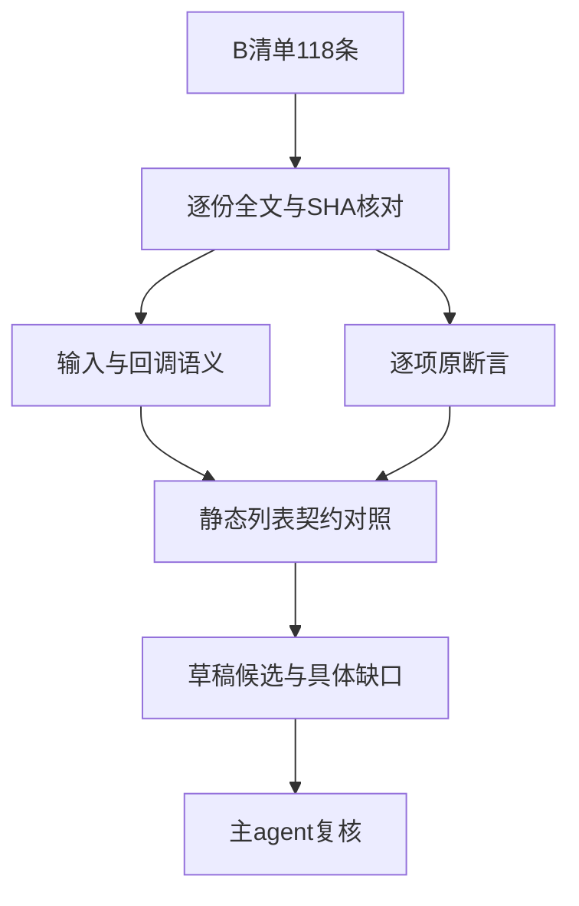
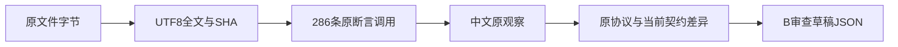

# B 路径原文分析记录

## IDEA

- Intent：寻找可以完整保留原输入协议、回调语义和每项原断言的真实 filter 测试机会。
- Data：118 个原文件全文及索引 SHA 均一致；逐项原断言源码与行号存入 B审查草稿.json；还读取了可调整 buffer 的 harness 输入构造。
- Edges：当前契约为静态同型列表、单元素参数、内联无捕获 bool 回调、持久不可变值。不能改成 dense 输入、人工 index 或手工 filter 丢掉原观察。仅写 docs 草稿，未构建、未运行、不修改正式 review。
- Answer：118 项中文逐例草稿、完整原文、原断言映射、协议边界，交主 agent 复核后决定正式登记。

## 结论及证据

候选计数：adapted 0，equivalent 0，excluded 118，needs_analysis 0。118/118 SHA 一致；完整原断言调用 286 项。这里的 excluded 表示当前语言契约无法完整保留原例，不表示原文未经分析，也不计作正式 reviewed。

packages/core/IR契约.md 第 58 行规定普通值为持久值，第 72 行限定 transform 作用域、单元素参数及无捕获；transforms.zig 第 12–21 行强制单回调及参数个数，第 50 行为 filter 设置 bool 结果类型。generate_array_callbacks.ts 的成熟 predicate 套件使用真实 in.filter(val => val > 10)，输入为 i64[]。该实现证据不能覆盖 JS generic、动态属性、index/array/arguments 或 species。

## 易误判候选的复核

- 9-c-i-2：虽然 [11] 为 dense list，谓词仍实际检查 idx===0，且其它分支隐式返回 undefined；删除 idx 或换成恒定 0 会丢失回调传参观察。
- 9-c-i-6：虽然谓词只有 val===11，原文还装有 Array.prototype[0] getter，旨在检验 own data 覆盖继承 getter；直接 dense list 不能证明该协议。
- 9-c-iii-4 与 9-c-iii-5：bool 返回值本身受支持；输入分别是 generic {0:11,length:1}。前者还要求 accessed=true。不能凭结果 []/[11] 就把 generic 与回调状态删掉。
- 9-c-iii-29：结果选择条件 val>10 受支持；原文同时要求 generic length=20 的洞不调用回调且 called=2。dense [11,8] 只能提供局部 predicate 对照，不能作为完整原例通过。
- 9-c-iii-1-1：原例选择恒true且两项元素可映射，但 receiver 是普通对象、原断言直接取其索引；该子行为有价值，但不覆盖 generic dispatch。
- resizable-buffer.js：数值偶数谓词可提取独立用例，原文全部20个比较还依赖共享 RAB 的 resize、TA 固定/追踪视图与偏移。只移植初始 [0,1,2,3] 偶数筛选不足以适配此原例。

上述局部机会可作为新控制测试，但必须保留原例 excluded，不宣称 equivalent 或 adapted；本任务未创建这些测试。

## 原断言中的特殊事实

- 9-b-6 第二断言实际读取全局构造器 Array[1]，并非 newArr[1]。它依赖新增 Object.prototype[1] 对构造器的继承影响，必须如实记录。
- 9-c-i-19 和 9-c-i-20 描述说继承 accessor，但实际代码分别写 Object.prototype[1]=10 与 Array.prototype[0]=100，是真实继承 data。审查依据正文。
- create-ctor-non-object 的 cb 执行 callCount += 0；计数断言不独立证明未执行，不能悄悄改为 +=1 并声称原断言。四个 TypeError 仍须保留。
- 9-c-ii-4 只断言 newArr.length===called，未独立断言调用六次；9-c-iii-1-5 才独立断言长度和called均5。
- 9-c-iii-1-5/1-6 标题提及 to，但回调实际读取 idx；不能据标题设计虚构的目标索引传参。
- callbackfn-resize-arraybuffer 允许 resize 抛错分支；原文有 resize 方法存在性前置断言和两轮 elements/indices/arrays/result 全部比较。成功缩容期望两项0，拒绝缩容期望三项0；增容轮不能新增本轮开始length外的位置。

## 审查架构与数据流

## 逐例审查

### 1. 15.4.4.20-9-b-14.js

- 输入：数组 [0,1,2,"last"]，索引0 getter将length改为3。
- 回调：恒true。
- 原观察：输出length=3，输出[2]=2。
- 候选：excluded。协议：accessor, mutation, sparse；原断言调用 2 项，SHA 已核对。

### 2. 15.4.4.20-9-b-15.js

- 输入：数组 [0,1,2]，Array.prototype[2] getter为"prototype"，索引1 getter把length改为2。
- 回调：恒true。
- 原观察：输出length=3，输出[2]="prototype"。
- 候选：excluded。协议：accessor, mutation, sparse, prototype；原断言调用 2 项，SHA 已核对。

### 3. 15.4.4.20-9-b-16.js

- 输入：数组 [0,1,2]，索引2不可配置getter返回"unconfigurable"，索引1 getter把length改为2，非严格模式。
- 回调：恒true。
- 原观察：输出length=3，输出[2]="unconfigurable"；缩短length不能删除不可配置索引。
- 候选：excluded。协议：accessor, mutation, descriptor；原断言调用 2 项，SHA 已核对。

### 4. 15.4.4.20-9-b-2.js

- 输入：generic {} 的length getter新增obj[2]="length"并返回3。
- 回调：恒true。
- 原观察：输出length=1，输出[0]="length"。
- 候选：excluded。协议：generic, accessor, mutation, sparse；原断言调用 2 项，SHA 已核对。

### 5. 15.4.4.20-9-b-3.js

- 输入：generic {2:6.99,8:19} 的length getter删除obj[2]并返回10。
- 回调：恒true。
- 原观察：输出length=1，输出[0]不等于6.99；原断言未直接要求19。
- 候选：excluded。协议：generic, accessor, mutation, sparse；原断言调用 2 项，SHA 已核对。

### 6. 15.4.4.20-9-b-4.js

- 输入：generic {length:2}，索引0 getter新增索引1 getter返回6.99，并返回0。
- 回调：恒true。
- 原观察：输出length=2，输出[1]=6.99。
- 候选：excluded。协议：generic, accessor, mutation, sparse；原断言调用 2 项，SHA 已核对。

### 7. 15.4.4.20-9-b-5.js

- 输入：稀疏数组 [0,,2]，索引0 getter新增索引1 getter返回6.99，并返回0。
- 回调：恒true。
- 原观察：输出length=3，输出[1]=6.99。
- 候选：excluded。协议：accessor, mutation, sparse；原断言调用 2 项，SHA 已核对。

### 8. 15.4.4.20-9-b-6.js

- 输入：generic {length:2}，索引0 getter新增Object.prototype[1] getter返回6.99，并返回0。
- 回调：恒true。
- 原观察：输出length=2；第二断言实际检查Array[1]=6.99（全局Array构造器的继承属性），不是newArr[1]。
- 候选：excluded。协议：generic, accessor, mutation, sparse, prototype；原断言调用 2 项，SHA 已核对。

### 9. 15.4.4.20-9-b-7.js

- 输入：稀疏数组 [0,,2]，索引0 getter新增Array.prototype[1] getter返回6.99，并返回0。
- 回调：恒true。
- 原观察：输出length=3，输出[1]=6.99。
- 候选：excluded。协议：accessor, mutation, sparse, prototype；原断言调用 2 项，SHA 已核对。

### 10. 15.4.4.20-9-b-8.js

- 输入：generic {length:2}，索引1 getter返回6.99，索引0 getter删除obj[1]并返回0。
- 回调：设置accessed=true后恒true；原例未断言accessed。
- 原观察：输出length=1，输出[0]=0。
- 候选：excluded。协议：generic, accessor, mutation, sparse, capture；原断言调用 2 项，SHA 已核对。

### 11. 15.4.4.20-9-b-9.js

- 输入：数组 [1,2]，索引1 getter返回字符串"6.99"，索引0 getter删除arr[1]并返回0。
- 回调：恒true。
- 原观察：输出length=1，输出[0]=0。
- 候选：excluded。协议：accessor, mutation, sparse；原断言调用 2 项，SHA 已核对。

### 12. 15.4.4.20-9-c-i-1.js

- 输入：generic {5:kValue,length:100}，kValue为空对象。
- 回调：idx===5且val与捕获对象kValue同一引用。
- 原观察：输出length=1，输出[0]与kValue同一引用。
- 候选：excluded。协议：generic, sparse, index, capture, identity；原断言调用 2 项，SHA 已核对。

### 13. 15.4.4.20-9-c-i-10.js

- 输入：数组[]的索引2 getter返回12，length变为3。
- 回调：idx===2且val===12。
- 原观察：输出length=1，输出[0]=12。
- 候选：excluded。协议：accessor, sparse, index；原断言调用 2 项，SHA 已核对。

### 14. 15.4.4.20-9-c-i-11.js

- 输入：prototype {0:5,1:6} 的child，child.length=10，own索引0 getter返回11。
- 回调：idx===0且val===11。
- 原观察：输出length=1，输出[0]=11；own getter覆盖继承data。
- 候选：excluded。协议：generic, accessor, sparse, index, prototype；原断言调用 2 项，SHA 已核对。

### 15. 15.4.4.20-9-c-i-12.js

- 输入：数组[]，Array.prototype[0]=10，own索引0 getter返回111。
- 回调：val===111且idx===0。
- 原观察：输出length=1，输出[0]=111。
- 候选：excluded。协议：accessor, index, prototype；原断言调用 2 项，SHA 已核对。

### 16. 15.4.4.20-9-c-i-13.js

- 输入：prototype索引1 getter返回6的child，child.length=10，own索引1 getter返回12。
- 回调：idx===1且val===12。
- 原观察：输出length=1，输出[0]=12。
- 候选：excluded。协议：generic, accessor, sparse, index, prototype；原断言调用 2 项，SHA 已核对。

### 17. 15.4.4.20-9-c-i-14.js

- 输入：数组[]，Array.prototype[0] getter返回5，own索引0 getter返回11。
- 回调：idx===0且val===11。
- 原观察：输出length=1，输出[0]=11。
- 候选：excluded。协议：accessor, index, prototype；原断言调用 2 项，SHA 已核对。

### 18. 15.4.4.20-9-c-i-15.js

- 输入：prototype索引1 getter返回11的child，child.length=20。
- 回调：val===11且idx===1。
- 原观察：输出length=1，输出[0]=11。
- 候选：excluded。协议：generic, accessor, sparse, index, prototype；原断言调用 2 项，SHA 已核对。

### 19. 15.4.4.20-9-c-i-16.js

- 输入：稀疏数组 [,,,]，Array.prototype[0] getter返回11。
- 回调：idx===0且val===11。
- 原观察：输出length=1，输出[0]=11。
- 候选：excluded。协议：accessor, sparse, index, prototype；原断言调用 2 项，SHA 已核对。

### 20. 15.4.4.20-9-c-i-17.js

- 输入：generic {length:2}，own索引1只有setter，无getter。
- 回调：val===undefined且idx===1。
- 原观察：输出length=1，输出[0]=undefined；存在属性与洞不可混同。
- 候选：excluded。协议：generic, accessor, sparse, index, undefined；原断言调用 2 项，SHA 已核对。

### 21. 15.4.4.20-9-c-i-18.js

- 输入：数组[]，own索引0只有setter，无getter。
- 回调：val===undefined且idx===0。
- 原观察：输出length=1，输出[0]=undefined。
- 候选：excluded。协议：accessor, index, undefined；原断言调用 2 项，SHA 已核对。

### 22. 15.4.4.20-9-c-i-19.js

- 输入：generic {length:2}，own索引1只有setter，Object.prototype[1]=10。
- 回调：val===undefined且idx===1。
- 原观察：输出length=1，输出[0]=undefined；own setter覆盖继承data（描述写accessor，原文为data）。
- 候选：excluded。协议：generic, accessor, sparse, index, undefined, prototype；原断言调用 2 项，SHA 已核对。

### 23. 15.4.4.20-9-c-i-2.js

- 输入：数组 [11]。
- 回调：idx===0时返回val===11，其它位置隐式返回undefined。
- 原观察：输出length=1，输出[0]=11；读取实际index不能删去。
- 候选：excluded。协议：index, truthiness；原断言调用 2 项，SHA 已核对。

### 24. 15.4.4.20-9-c-i-20.js

- 输入：数组[]，own索引0只有setter，Array.prototype[0]=100。
- 回调：val===undefined且idx===0。
- 原观察：输出length=1，输出[0]=undefined；own setter覆盖继承data。
- 候选：excluded。协议：accessor, index, undefined, prototype；原断言调用 2 项，SHA 已核对。

### 25. 15.4.4.20-9-c-i-21.js

- 输入：prototype索引1只有setter的child，child.length=2。
- 回调：val===undefined且idx===1。
- 原观察：输出length=1，输出[0]=undefined。
- 候选：excluded。协议：generic, accessor, sparse, index, undefined, prototype；原断言调用 2 项，SHA 已核对。

### 26. 15.4.4.20-9-c-i-22.js

- 输入：稀疏数组 [,]，Array.prototype[0]只有setter。
- 回调：val===undefined且idx===0。
- 原观察：输出length=1，输出[0]=undefined。
- 候选：excluded。协议：accessor, sparse, index, undefined, prototype；原断言调用 2 项，SHA 已核对。

### 27. 15.4.4.20-9-c-i-25.js

- 输入：func(a,b)只传入11，receiver为arguments，参数数大于实参数。
- 回调：val===11且idx===0。
- 原观察：输出length=1，输出[0]=11。
- 候选：excluded。协议：generic, arguments, index；原断言调用 2 项，SHA 已核对。

### 28. 15.4.4.20-9-c-i-26.js

- 输入：func(a,b)传入11,9，receiver为arguments。
- 回调：idx0检查val11，idx1检查val9，其它false。
- 原观察：输出length=2，输出[0]=11，输出[1]=9。
- 候选：excluded。协议：generic, arguments, index；原断言调用 3 项，SHA 已核对。

### 29. 15.4.4.20-9-c-i-27.js

- 输入：func(a,b)传入11,12,9，receiver为arguments，实参数大于参数数。
- 回调：idx0检查val11，idx1检查val12，idx2检查val9，其它false。
- 原观察：输出length=3，输出[0]=11，输出[1]=12，输出[2]=9。
- 候选：excluded。协议：generic, arguments, index；原断言调用 4 项，SHA 已核对。

### 30. 15.4.4.20-9-c-i-28.js

- 输入：数组[]，索引0 getter设置preIterVisible=true返回11；索引1 getter据该状态返回9或11。
- 回调：idx===1且val===9。
- 原观察：输出length=1，输出[0]=9；必须在迭代时执行getter并观察其状态。
- 候选：excluded。协议：accessor, mutation, index, capture；原断言调用 2 项，SHA 已核对。

### 31. 15.4.4.20-9-c-i-29.js

- 输入：generic {length:2}，索引0 getter设置preIterVisible=true返回11，索引1 getter据状态返回9或13。
- 回调：val===9且idx===1。
- 原观察：输出length=1，输出[0]=9。
- 候选：excluded。协议：generic, accessor, mutation, index, capture；原断言调用 2 项，SHA 已核对。

### 32. 15.4.4.20-9-c-i-3.js

- 输入：prototype {0:11,5:100} 的child，own[5]="abc"，length=10。
- 回调：idx===5且val==="abc"。
- 原观察：输出length=1，输出[0]="abc"。
- 候选：excluded。协议：generic, sparse, index, prototype；原断言调用 2 项，SHA 已核对。

### 33. 15.4.4.20-9-c-i-30.js

- 输入：generic {0:11,5:10,10:8,length:20}，索引1 getter抛RangeError。
- 回调：idx>1时设置accessed=true，返回true。
- 原观察：抛RangeError且accessed=false；异常必须阻止后续回调。
- 候选：excluded。协议：generic, accessor, sparse, index, capture, error；原断言调用 2 项，SHA 已核对。

### 34. 15.4.4.20-9-c-i-31.js

- 输入：数组[]设置[5]=10、[10]=100，索引1 getter抛RangeError。
- 回调：idx>1时设置accessed=true，返回true。
- 原观察：抛RangeError且accessed=false；索引0为洞。
- 候选：excluded。协议：accessor, sparse, index, capture, error；原断言调用 2 项，SHA 已核对。

### 35. 15.4.4.20-9-c-i-4.js

- 输入：数组 [12]，Array.prototype[0]=11。
- 回调：idx===0且val===12。
- 原观察：输出length=1，输出[0]=12。
- 候选：excluded。协议：index, prototype；原断言调用 2 项，SHA 已核对。

### 36. 15.4.4.20-9-c-i-5.js

- 输入：prototype索引0 getter返回5的child，child.length=2，own[0] data为11，own[1]=12。
- 回调：idx===0且val===11。
- 原观察：输出length=1，输出[0]=11。
- 候选：excluded。协议：generic, accessor, index, prototype；原断言调用 2 项，SHA 已核对。

### 37. 15.4.4.20-9-c-i-6.js

- 输入：数组 [11]，Array.prototype[0] getter返回9。
- 回调：val===11；idx,obj仅声明未使用。
- 原观察：输出length=1，输出[0]=11；own data覆盖继承getter的条件不能删除。
- 候选：excluded。协议：accessor, prototype；原断言调用 2 项，SHA 已核对。

### 38. 15.4.4.20-9-c-i-7.js

- 输入：prototype {5:"abc"} 的child，child.length=10。
- 回调：idx===5且val与外层kValue字符串相等。
- 原观察：输出length=1，输出[0]="abc"。
- 候选：excluded。协议：generic, sparse, index, prototype, capture；原断言调用 2 项，SHA 已核对。

### 39. 15.4.4.20-9-c-i-8.js

- 输入：稀疏数组 [,,,]，Array.prototype[1]=13。
- 回调：idx===1且val===13。
- 原观察：输出length=1，输出[0]=13。
- 候选：excluded。协议：sparse, index, prototype；原断言调用 2 项，SHA 已核对。

### 40. 15.4.4.20-9-c-i-9.js

- 输入：generic {10:10,length:20}，own索引0 getter返回11。
- 回调：idx===0且val===11。
- 原观察：输出length=1，输出[0]=11。
- 候选：excluded。协议：generic, accessor, sparse, index；原断言调用 2 项，SHA 已核对。

### 41. 15.4.4.20-9-c-ii-1.js

- 输入：混合数组 [0,1,true,null,new Object(),"five"] 并设置[999999]=-6.6。
- 回调：设置bCalled=true；读取obj[idx]检查是否与val同一值，不返回值。
- 原观察：bCalled=true且bPar=true；验证实际element,index,array三者一致。
- 候选：excluded。协议：index, array, capture, sparse, heterogeneous, truthiness；原断言调用 2 项，SHA 已核对。

### 42. 15.4.4.20-9-c-ii-11.js

- 输入：数组 [11]，回调两个formal参数。
- 回调：val>10且arguments[2][idx]===val。
- 原观察：输出length=1，输出[0]=11；formal参数少但第三实参仍传入。
- 候选：excluded。协议：arguments, index, array；原断言调用 2 项，SHA 已核对。

### 43. 15.4.4.20-9-c-ii-12.js

- 输入：数组 [11]，回调三个formal参数。
- 回调：val>10且obj[idx]===val。
- 原观察：输出length=1，输出[0]=11。
- 候选：excluded。协议：index, array；原断言调用 2 项，SHA 已核对。

### 44. 15.4.4.20-9-c-ii-13.js

- 输入：数组 [11]，回调零个formal参数。
- 回调：arguments[2][arguments[1]]===arguments[0]。
- 原观察：输出length=1，输出[0]=11。
- 候选：excluded。协议：arguments, index, array；原断言调用 2 项，SHA 已核对。

### 45. 15.4.4.20-9-c-ii-16.js

- 输入：generic {0:11,length:2}，thisArg=false。
- 回调：this.valueOf()===false，非严格函数this包装为Boolean对象。
- 原观察：输出length=1，输出[0]=11。
- 候选：excluded。协议：generic, sparse, this_arg；原断言调用 2 项，SHA 已核对。

### 46. 15.4.4.20-9-c-ii-17.js

- 输入：generic {0:11,length:2}，thisArg=5。
- 回调：5===this.valueOf()，非严格函数this包装为Number对象。
- 原观察：输出length=1，输出[0]=11。
- 候选：excluded。协议：generic, sparse, this_arg；原断言调用 2 项，SHA 已核对。

### 47. 15.4.4.20-9-c-ii-18.js

- 输入：generic {0:11,length:2}，thisArg="hello"。
- 回调："hello"===this.valueOf()，非严格函数this包装为String对象。
- 原观察：输出length=1，输出[0]=11。
- 候选：excluded。协议：generic, sparse, this_arg；原断言调用 2 项，SHA 已核对。

### 48. 15.4.4.20-9-c-ii-19.js

- 输入：generic {0:11,non_index_property:8,2:5,length:20}。
- 回调：accessed=true后返回val===8。
- 原观察：输出length=0，accessed为true；非索引属性8不能被访问。
- 候选：excluded。协议：generic, sparse, capture；原断言调用 2 项，SHA 已核对。

### 49. 15.4.4.20-9-c-ii-2.js

- 输入：数组 [0,1,2,3,4,5,6,7,8,9]。
- 回调：设置bCalled=true并检查arguments.length是否为3，不返回值。
- 原观察：bCalled=true，parCnt=3。
- 候选：excluded。协议：arguments, capture, truthiness；原断言调用 2 项，SHA 已核对。

### 50. 15.4.4.20-9-c-ii-20.js

- 输入：generic {0:11,length:1}，thisArg={threshold:10}。
- 回调：this===捕获的thisArg引用。
- 原观察：输出length=1，输出[0]=11。
- 候选：excluded。协议：generic, this_arg, capture, identity；原断言调用 2 项，SHA 已核对。

### 51. 15.4.4.20-9-c-ii-21.js

- 输入：generic {0:11,1:12,length:2}。
- 回调：idx0检查val11，idx1检查val12，其它false。
- 原观察：输出length=2，输出[0]=11，输出[1]=12。
- 候选：excluded。协议：generic, index；原断言调用 3 项，SHA 已核对。

### 52. 15.4.4.20-9-c-ii-22.js

- 输入：generic {0:11,1:12,length:2}。
- 回调：val11检查idx0，val12检查idx1，其它false。
- 原观察：输出length=2，输出[0]=11，输出[1]=12。
- 候选：excluded。协议：generic, index；原断言调用 3 项，SHA 已核对。

### 53. 15.4.4.20-9-c-ii-23.js

- 输入：generic {0:11,length:2}。
- 回调：捕获外层obj并检查obj===第三实参o。
- 原观察：输出length=1，输出[0]=11。
- 候选：excluded。协议：generic, sparse, array, capture, identity；原断言调用 2 项，SHA 已核对。

### 54. 15.4.4.20-9-c-ii-4.js

- 输入：数组 [0,1,2,3,4,5]，lastIdx=0、called=0。
- 回调：called自增；lastIdx与实际idx相等则lastIdx自增并true，否则false。
- 原观察：输出length=called；原例没有直接断言called=6。
- 候选：excluded。协议：index, capture, mutation；原断言调用 1 项，SHA 已核对。

### 55. 15.4.4.20-9-c-ii-5.js

- 输入：数组 [11,12,13,14]，thisArg显式undefined，kIndex=[]、called=0。
- 回调：按idx检查访问一次及前序index已访问，记录kIndex[idx]，正常返回false，异常顺序返回true。
- 原观察：输出length=0，called=4。
- 候选：excluded。协议：index, capture, mutation, this_arg, undefined；原断言调用 2 项，SHA 已核对。

### 56. 15.4.4.20-9-c-ii-6.js

- 输入：generic {0:11,length:1}，thisArg={}。
- 回调：零formal参数；检查this身份、arguments[0]=11、arguments[1]=0、arguments[2]与obj同一引用。
- 原观察：输出length=1，输出[0]=11。
- 候选：excluded。协议：generic, arguments, index, array, this_arg, capture, identity；原断言调用 2 项，SHA 已核对。

### 57. 15.4.4.20-9-c-ii-7.js

- 输入：generic {0:11,4:10,10:8,length:20}，called=0。
- 回调：called自增，首次回调抛Error，其后true。
- 原观察：抛Error，called=1；不能只换为其它错误忽略调用次数。
- 候选：excluded。协议：generic, sparse, capture, mutation, error；原断言调用 2 项，SHA 已核对。

### 58. 15.4.4.20-9-c-ii-8.js

- 输入：generic {0:11,1:12,length:2}。
- 回调：idx0时原地改写obj[idx+1]=8，返回val>10。
- 原观察：输出length=1，输出[0]=11；必须观察前回调修改的后元素。
- 候选：excluded。协议：generic, index, capture, mutation；原断言调用 2 项，SHA 已核对。

### 59. 15.4.4.20-9-c-iii-1-1.js

- 输入：generic {0:11,1:9,length:2}。
- 回调：恒true。
- 原观察：输出[0]===obj[0]，输出[1]===obj[1]；原例未断言length。
- 候选：excluded。协议：generic；原断言调用 2 项，SHA 已核对。

### 60. 15.4.4.20-9-c-iii-1-2.js

- 输入：generic {0:11,1:9,length:2}，随后tempVal保存输出[1]并执行newArr[1]+=1。
- 回调：恒true。
- 原观察：输出[1]与tempVal不相等；检查原输出对象可原地改写。
- 候选：excluded。协议：generic, mutation；原断言调用 1 项，SHA 已核对。

### 61. 15.4.4.20-9-c-iii-1-3.js

- 输入：generic {0:11,length:2}，输出上for-in并hasOwnProperty。
- 回调：恒true。
- 原观察：enumerable为true；索引"0"为own且可枚举。
- 候选：excluded。协议：generic, sparse, descriptor；原断言调用 1 项，SHA 已核对。

### 62. 15.4.4.20-9-c-iii-1-4.js

- 输入：generic {0:11,1:9,length:2}，保存tempVal=输出[1]再delete输出[1]。
- 回调：恒true。
- 原观察：tempVal不等于undefined，输出[1]=undefined；删除形成洞而非列表splice。
- 候选：excluded。协议：generic, mutation, sparse, undefined；原断言调用 2 项，SHA 已核对。

### 63. 15.4.4.20-9-c-iii-1-5.js

- 输入：数组 [0,1,2,3,4]，lastToIdx=0、called=0。
- 回调：called自增，lastToIdx与实际idx相等则自增并true，否则false。
- 原观察：输出length=5，called=5；描述提到to，回调实际观察idx。
- 候选：excluded。协议：index, capture, mutation；原断言调用 2 项，SHA 已核对。

### 64. 15.4.4.20-9-c-iii-1-6.js

- 输入：数组 [11,12,13,14]，thisArg显式undefined，toIndex=[]、called=0。
- 回调：按idx检查未访问及前序已访问，正常记录并true，重复或倒序false。
- 原观察：输出length=4，called=4；不是直接暴露目标to索引。
- 候选：excluded。协议：index, capture, mutation, this_arg, undefined；原断言调用 2 项，SHA 已核对。

### 65. 15.4.4.20-9-c-iii-1.js

- 输入：数组 [0,1,2,3,4]。
- 回调：val%2的JS truthiness为true则true，否则false。
- 原观察：输出非空；输出索引1 descriptor.value=3，writable/enumerable/configurable均true。
- 候选：excluded。协议：truthiness, descriptor；原断言调用 5 项，SHA 已核对。

### 66. 15.4.4.20-9-c-iii-10.js

- 输入：数组 [11]。
- 回调：返回数值-5。
- 原观察：输出length=1，输出[0]=11；隐式ToBoolean(-5)=true。
- 候选：excluded。协议：truthiness；原断言调用 2 项，SHA 已核对。

### 67. 15.4.4.20-9-c-iii-11.js

- 输入：数组 [11]。
- 回调：返回Infinity。
- 原观察：输出length=1，输出[0]=11；隐式ToBoolean(Infinity)=true。
- 候选：excluded。协议：truthiness；原断言调用 2 项，SHA 已核对。

### 68. 15.4.4.20-9-c-iii-12.js

- 输入：数组 [11]。
- 回调：返回-Infinity。
- 原观察：输出length=1，输出[0]=11；隐式ToBoolean(-Infinity)=true。
- 候选：excluded。协议：truthiness；原断言调用 2 项，SHA 已核对。

### 69. 15.4.4.20-9-c-iii-13.js

- 输入：数组 [11]，accessed=false。
- 回调：设置accessed=true并返回NaN。
- 原观察：输出length=0，accessed为true；ToBoolean(NaN)=false。
- 候选：excluded。协议：truthiness, capture, mutation；原断言调用 2 项，SHA 已核对。

### 70. 15.4.4.20-9-c-iii-14.js

- 输入：数组 [11]，accessed=false。
- 回调：设置accessed=true并返回空字符串。
- 原观察：输出length=0，accessed为true；ToBoolean("")=false。
- 候选：excluded。协议：truthiness, capture, mutation；原断言调用 2 项，SHA 已核对。

### 71. 15.4.4.20-9-c-iii-15.js

- 输入：数组 [11]。
- 回调：返回"non-empty string"。
- 原观察：输出length=1，输出[0]=11；非空字符串truthy。
- 候选：excluded。协议：truthiness；原断言调用 2 项，SHA 已核对。

### 72. 15.4.4.20-9-c-iii-16.js

- 输入：数组 [11]。
- 回调：返回新函数对象 function(){}。
- 原观察：输出length=1，输出[0]=11；函数对象truthy。
- 候选：excluded。协议：truthiness, function_object；原断言调用 2 项，SHA 已核对。

### 73. 15.4.4.20-9-c-iii-17.js

- 输入：数组 [11]。
- 回调：返回new Array(10)，含10个洞。
- 原观察：输出length=1，输出[0]=11；对象truthy，不检查其元素。
- 候选：excluded。协议：truthiness, sparse；原断言调用 2 项，SHA 已核对。

### 74. 15.4.4.20-9-c-iii-18.js

- 输入：数组 [11]。
- 回调：返回new String()，空字符串包装对象。
- 原观察：输出length=1，输出[0]=11；包装对象truthy而空字符串primitive为false。
- 候选：excluded。协议：truthiness, boxing；原断言调用 2 项，SHA 已核对。

### 75. 15.4.4.20-9-c-iii-19.js

- 输入：数组 [11]。
- 回调：返回new Boolean()，false包装对象。
- 原观察：输出length=1，输出[0]=11；false包装对象truthy。
- 候选：excluded。协议：truthiness, boxing；原断言调用 2 项，SHA 已核对。

### 76. 15.4.4.20-9-c-iii-2.js

- 输入：generic {0:11,length:1}，accessed=false。
- 回调：设置accessed=true并返回undefined。
- 原观察：输出length=0，accessed为true。
- 候选：excluded。协议：generic, truthiness, undefined, capture, mutation；原断言调用 2 项，SHA 已核对。

### 77. 15.4.4.20-9-c-iii-20.js

- 输入：数组 [11]。
- 回调：返回new Number()，0包装对象。
- 原观察：输出length=1，输出[0]=11；0包装对象truthy。
- 候选：excluded。协议：truthiness, boxing；原断言调用 2 项，SHA 已核对。

### 78. 15.4.4.20-9-c-iii-21.js

- 输入：数组 [11]。
- 回调：返回Math对象。
- 原观察：输出length=1，输出[0]=11；对象truthy。
- 候选：excluded。协议：truthiness；原断言调用 2 项，SHA 已核对。

### 79. 15.4.4.20-9-c-iii-22.js

- 输入：数组 [11]。
- 回调：返回new Date(0)。
- 原观察：输出length=1，输出[0]=11；Date对象truthy。
- 候选：excluded。协议：truthiness；原断言调用 2 项，SHA 已核对。

### 80. 15.4.4.20-9-c-iii-23.js

- 输入：数组 [11]。
- 回调：返回new RegExp()。
- 原观察：输出length=1，输出[0]=11；RegExp对象truthy。
- 候选：excluded。协议：truthiness；原断言调用 2 项，SHA 已核对。

### 81. 15.4.4.20-9-c-iii-24.js

- 输入：数组 [11]。
- 回调：返回JSON对象。
- 原观察：输出length=1，输出[0]=11；对象truthy。
- 候选：excluded。协议：truthiness；原断言调用 2 项，SHA 已核对。

### 82. 15.4.4.20-9-c-iii-25.js

- 输入：数组 [11]。
- 回调：返回new EvalError()。
- 原观察：输出length=1，输出[0]=11；错误对象为返回值，不抛出。
- 候选：excluded。协议：truthiness；原断言调用 2 项，SHA 已核对。

### 83. 15.4.4.20-9-c-iii-26.js

- 输入：数组 [11]。
- 回调：返回回调自己的arguments对象。
- 原观察：输出length=1，输出[0]=11；arguments对象truthy。
- 候选：excluded。协议：truthiness, arguments；原断言调用 2 项，SHA 已核对。

### 84. 15.4.4.20-9-c-iii-28.js

- 输入：数组 [11]，global保存顶层this。
- 回调：返回捕获的global对象。
- 原观察：输出length=1，输出[0]=11。
- 候选：excluded。协议：truthiness, capture；原断言调用 2 项，SHA 已核对。

### 85. 15.4.4.20-9-c-iii-29.js

- 输入：generic {0:11,1:8,length:20}，called=0。
- 回调：called自增后返回val>10。
- 原观察：输出length=1，输出[0]不等于8，called=2；洞跳过，不调用20次。
- 候选：excluded。协议：generic, sparse, capture, mutation；原断言调用 3 项，SHA 已核对。

### 86. 15.4.4.20-9-c-iii-3.js

- 输入：generic {0:11,length:1}，accessed=false。
- 回调：设置accessed=true并返回null。
- 原观察：输出length=0，accessed为true。
- 候选：excluded。协议：generic, truthiness, capture, mutation；原断言调用 2 项，SHA 已核对。

### 87. 15.4.4.20-9-c-iii-30.js

- 输入：数组 [11]。
- 回调：返回new Boolean(false)。
- 原观察：输出length=1，输出[0]=11；包装false对象为true。
- 候选：excluded。协议：truthiness, boxing；原断言调用 2 项，SHA 已核对。

### 88. 15.4.4.20-9-c-iii-4.js

- 输入：generic {0:11,length:1}，accessed=false。
- 回调：设置accessed=true并返回false。
- 原观察：输出length=0，accessed为true；谓词为bool仍不能删除generic与副作用观察。
- 候选：excluded。协议：generic, capture, mutation；原断言调用 2 项，SHA 已核对。

### 89. 15.4.4.20-9-c-iii-5.js

- 输入：generic {0:11,length:1}。
- 回调：恒true。
- 原观察：输出length=1，输出[0]=11；bool语义有支持，但generic receiver无支持。
- 候选：excluded。协议：generic；原断言调用 2 项，SHA 已核对。

### 90. 15.4.4.20-9-c-iii-6.js

- 输入：数组 [11]，accessed=false。
- 回调：设置accessed=true并返回0。
- 原观察：输出length=0，accessed为true。
- 候选：excluded。协议：truthiness, capture, mutation；原断言调用 2 项，SHA 已核对。

### 91. 15.4.4.20-9-c-iii-7.js

- 输入：数组 [11]，accessed=false。
- 回调：设置accessed=true并返回+0。
- 原观察：输出length=0，accessed为true。
- 候选：excluded。协议：truthiness, capture, mutation；原断言调用 2 项，SHA 已核对。

### 92. 15.4.4.20-9-c-iii-8.js

- 输入：数组 [11]，accessed=false。
- 回调：设置accessed=true并返回-0。
- 原观察：输出length=0，accessed为true。
- 候选：excluded。协议：truthiness, capture, mutation；原断言调用 2 项，SHA 已核对。

### 93. 15.4.4.20-9-c-iii-9.js

- 输入：数组 [11]。
- 回调：返回数值5。
- 原观察：输出length=1，输出[0]=11。
- 候选：excluded。协议：truthiness；原断言调用 2 项，SHA 已核对。

### 94. call-with-boolean.js

- 输入：分别以true和false primitive为receiver，Array.prototype.filter.call。
- 回调：零formal箭头函数无返回值；因ToObject与缺失length，实际不调用。
- 原观察：两个输出分别compareArray等于[]；原观察是boolean generic调用，不能换成空列表输入。
- 候选：excluded。协议：generic, boxing, truthiness；原断言调用 2 项，SHA 已核对。

### 95. callbackfn-resize-arraybuffer.js

- 输入：testWithTypedArrayConstructors全部常规数值TA；buffer初长3*BPE、最大4*BPE，sample为length-tracking TA。
- 回调：首次调用尝试缩至2*BPE；分别收集element,index,array，恒true；第二轮首次尝试增至4*BPE，仍用该轮开始时length。
- 原观察：resize为函数；shrink/grow各四项比较elements、indices、arrays、result；缩容成功则[0,0]/[0,1]/[sample,sample]，抛错则三项0/索引0..2/sample三次，grow沿用前轮预期。
- 候选：excluded。协议：generic, resizable, index, array, capture, mutation, error, identity；原断言调用 9 项，SHA 已核对。

### 96. create-ctor-non-object.js

- 输入：四个空数组依次设置constructor为null、1、"string"、true。
- 回调：回调callCount+=0且无返回值。
- 原观察：四次分别抛TypeError，且各callCount=0；+=0导致该计数本身不能证明未调用，必须如实保留原断言弱点。
- 候选：excluded。协议：species, constructor, capture, error, truthiness；原断言调用 8 项，SHA 已核对。

### 97. create-ctor-poisoned.js

- 输入：空数组constructor getter抛Test262Error。
- 回调：回调callCount+=1。
- 原观察：抛Test262Error，callCount=0。
- 候选：excluded。协议：species, constructor, accessor, capture, error；原断言调用 2 项，SHA 已核对。

### 98. create-non-array.js

- 输入：generic {length:0}，constructor getter会callCount+=1。
- 回调：零formal参数且无返回值。
- 原观察：callCount=0（constructor未访问），结果prototype为Array.prototype，Array.isArray为true，结果length=0。
- 候选：excluded。协议：generic, constructor, accessor, capture, prototype, array_exotic；原断言调用 4 项，SHA 已核对。

### 99. create-proto-from-ctor-realm-array.js

- 输入：空数组constructor为其它realm的原生Array；当前与其它realm Array.species都装计数getter。
- 回调：零formal参数且无返回值。
- 原观察：结果prototype为本realm Array.prototype；callCount=0（双方species不访问）。
- 候选：excluded。协议：species, constructor, realm, accessor, capture, prototype；原断言调用 2 项，SHA 已核对。

### 100. create-proto-from-ctor-realm-non-array.js

- 输入：空数组constructor为其它realm Object；该Object.species=CustomCtor，本realm Array.species有计数getter。
- 回调：零formal参数且无返回值。
- 原观察：结果prototype=CustomCtor.prototype；callCount=0（本realm Array.species未访问）。
- 候选：excluded。协议：species, constructor, realm, capture, prototype；原断言调用 2 项，SHA 已核对。

### 101. create-proxy.js

- 输入：空数组被两层Proxy包裹，数组constructor.species=Ctor。
- 回调：零formal参数且无返回值。
- 原观察：结果prototype=Ctor.prototype；需Proxy IsArray传递识别。
- 候选：excluded。协议：generic, species, constructor, proxy, prototype；原断言调用 1 项，SHA 已核对。

### 102. create-revoked-proxy.js

- 输入：空数组的revocable Proxy，constructor getter计数，随后revoke。
- 回调：回调cbCount+=1。
- 原观察：抛TypeError；ctorCount=0，cbCount=0；撤销导致访问在两者之前失败。
- 候选：excluded。协议：generic, constructor, proxy, accessor, capture, error；原断言调用 3 项，SHA 已核对。

### 103. create-species-abrupt.js

- 输入：空数组constructor={}，species=Ctor，Ctor抛Test262Error。
- 回调：回调callCount+=1。
- 原观察：抛Test262Error，callCount=0。
- 候选：excluded。协议：species, constructor, capture, error；原断言调用 2 项，SHA 已核对。

### 104. create-species-non-ctor.js

- 输入：空数组constructor={}，species=parseInt。
- 回调：回调callCount+=1。
- 原观察：前置isConstructor(parseInt)=false；filter抛TypeError，callCount=0。
- 候选：excluded。协议：species, constructor, capture, error, function_object；原断言调用 3 项，SHA 已核对。

### 105. create-species-null.js

- 输入：空数组constructor={}，species=null。
- 回调：零formal参数且无返回值。
- 原观察：结果prototype=Array.prototype，Array.isArray结果为true；原文未断言length。
- 候选：excluded。协议：species, constructor, prototype, array_exotic；原断言调用 2 项，SHA 已核对。

### 106. create-species-poisoned.js

- 输入：空数组constructor={}，species getter抛Test262Error。
- 回调：回调callCount+=1。
- 原观察：抛Test262Error，callCount=0。
- 候选：excluded。协议：species, constructor, accessor, capture, error；原断言调用 2 项，SHA 已核对。

### 107. create-species-undef.js

- 输入：空数组constructor={}，species=undefined。
- 回调：零formal参数且无返回值。
- 原观察：结果prototype=Array.prototype，Array.isArray结果为true。
- 候选：excluded。协议：species, constructor, prototype, array_exotic, undefined；原断言调用 2 项，SHA 已核对。

### 108. create-species.js

- 输入：数组 [1,2,3,4,5,6,7]，constructor.species=Ctor；Ctor保存this/arguments，计数后返回预存instance=[]。
- 回调：零formal参数且无返回值，故所有元素不保留。
- 原观察：Ctor调用1次；Ctor的this prototype为Ctor.prototype；构造实参length=1、args[0]=0；result与instance同一引用。
- 候选：excluded。协议：species, constructor, prototype, arguments, capture, identity, truthiness；原断言调用 5 项，SHA 已核对。

### 109. length.js

- 输入：Array.prototype.filter函数对象。
- 回调：不执行filter。
- 原观察：length描述符value=1、writable=false、enumerable=false、configurable=true。
- 候选：excluded。协议：function_object, descriptor；原断言调用 1 项，SHA 已核对。

### 110. name.js

- 输入：Array.prototype.filter函数对象。
- 回调：不执行filter。
- 原观察：name描述符value="filter"、writable=false、enumerable=false、configurable=true。
- 候选：excluded。协议：function_object, descriptor；原断言调用 1 项，SHA 已核对。

### 111. not-a-constructor.js

- 输入：Array.prototype.filter函数对象；调用new Array.prototype.filter(()=>{})。
- 回调：箭头函数无返回值，但构造filter应先失败。
- 原观察：isConstructor(filter)=false；new抛TypeError。
- 候选：excluded。协议：function_object, constructor, error；原断言调用 2 项，SHA 已核对。

### 112. prop-desc.js

- 输入：Array.prototype及其filter属性。
- 回调：不执行filter。
- 原观察：typeof filter="function"；filter描述符writable=true、enumerable=false、configurable=true。
- 候选：excluded。协议：function_object, prototype, descriptor；原断言调用 2 项，SHA 已核对。

### 113. resizable-buffer-grow-mid-iteration.js

- 输入：harness所有TA与部分子类，初始RAB值[0,2,4,6]；四种view为fixed(0,4)、fixed(offset2,2)、tracking(0)、tracking(offset2)。
- 回调：收集到全局values；前两类全长view第2次、offset第1次将RAB增至5*BPE；恒false。
- 原观察：四种filter输出均[]；全长view收集[0,2,4,6]，offset收集[4,6]；grow新位置不加入该轮。
- 候选：excluded。协议：generic, resizable, capture, mutation；原断言调用 8 项，SHA 已核对。

### 114. resizable-buffer-shrink-mid-iteration.js

- 输入：同上初始RAB [0,2,4,6] 的四种TA view。
- 回调：全长view第2次、offset第1次将RAB缩至3*BPE；收集到全局values后恒false。
- 原观察：四种filter输出均[]；fixed收集[0,2]，fixed offset收集[4]，tracking收集[0,2,4]，tracking offset收集[4]；固定view越界后不再存在索引。
- 候选：excluded。协议：generic, resizable, capture, mutation；原断言调用 8 项，SHA 已核对。

### 115. resizable-buffer.js

- 输入：harness所有TA与子类；RAB初长4*BPE最大8*BPE，四种view；共享taWrite写0..3；依次resize3、1、0、6*BPE，grow后写0..5。
- 回调：isEven(n)先排除undefined再Number(n)%2==0；包括BigInt转Number。
- 原观察：初始四view输出[0,2]/[2]/[0,2]/[2]；缩3时[]/[]/[0,2]/[2]；缩1时[]/[]/[0]/[]；缩0时全[]；增6后[0,2]/[2]/[0,2,4]/[2,4]；全部20项原比较逐项保留。
- 候选：excluded。协议：generic, resizable, mutation, truthiness；原断言调用 20 项，SHA 已核对。

### 116. target-array-non-extensible.js

- 输入：数组 [1]，constructor.species=A；A设置this.length=0并preventExtensions(this)。
- 回调：恒true。
- 原观察：filter抛TypeError，来自结果对象无法CreateDataProperty索引0。
- 候选：excluded。协议：species, constructor, descriptor, error；原断言调用 1 项，SHA 已核对。

### 117. target-array-with-non-configurable-property.js

- 输入：数组 [1]，constructor.species=A；A定义结果own[0] writable=true/configurable=false，value默认undefined。
- 回调：恒true。
- 原观察：filter抛TypeError；不可配置索引阻止重新定义。
- 候选：excluded。协议：species, constructor, descriptor, error, undefined；原断言调用 1 项，SHA 已核对。

### 118. target-array-with-non-writable-property.js

- 输入：数组 [1]，constructor.species构造返回数组q=[]；q索引0旧value=0、writable=false、configurable=true、enumerable=false。
- 回调：恒true。
- 原观察：结果索引0 descriptor.value=1、writable=true、configurable=true、enumerable=true；CreateDataProperty重定义而非普通写入。
- 候选：excluded。协议：species, constructor, descriptor；原断言调用 1 项，SHA 已核对。

## 自我批判

118 项全为排除是原文逐项核对与当前契约交集的结果，不能靠共同标题或预设类别得出；草稿为主 agent 复核提供完整正文与每条原断言源码。这里未执行任何候选，因此没有运行证据。

静态源码证据只证明契约边界，不能证明后端没有实现缺陷；目前完全符合交集的例子为空，也不说明无需增加独立 zxc 测试。原例中可用子行为应另行设计并诚实标注范围，不能提高 upstream 通过数。

原断言提取仅用于保存 assert/verifyProperty 的原句和行号，不将相同描述当作相同测试；RAB helper 内含额外输入前置断言，harness路径和SHA已记录。原源码完整保留，以便复核漏项或原断言强度。
