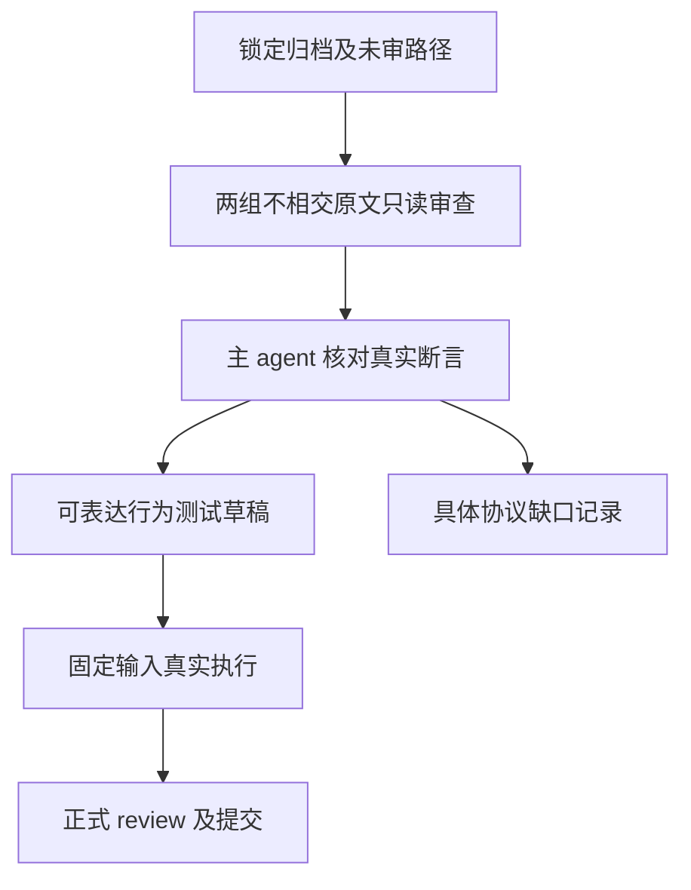

# Filter 剩余原文审查

## IDEA

- Intent：逐份审查锁定 Test262 中尚未登记的 Array.prototype.filter 原例，保留其真实输入、断言和协议边界，为能够表达的行为增加测试，不以修改原观察或批量排除冒充对齐完成。
- Data：锁定 revision 7ab7fafa0003f73fc85c1b95d88094d33f7eb8bd，归档 SHA 1d497a1e7430094a41d06f38db775df4a63db5d587b2a8b08aba6fad5de19585；当前 query 返回 237 个未审原例。原文已在持久 upstream 目录恢复，必须逐份核对索引 SHA。
- Edges：静态 typed list 和单参数、内联、非捕获布尔谓词有明确契约；JS generic receiver、稀疏属性、thisArg、回调 index/array/arguments、prototype/species 与动态 ToBoolean 不能被无痕删去。不能仅因文件名或描述分类。复杂原文只读分析可由两个 agent 分别审查，主 agent 汇总和复核后才形成正式测试及 review。
- Answer：中文逐例审查草稿、原字节和独立断言映射；可表达的原观察必须经过真实 zxc 执行，不可表达的条件须具体登记并保留未实现边界；每个完成的测试部分英文规范提交并 push。

## 执行安排

完整回归的固定源码不变。原文分析与代码草稿均在本目录，不改变正在执行的测试包。先分成两个不相交路径清单，每份原文逐项核验 SHA、读完整正文、记录原观察和支持边界。分类只是候选结论，不计作正式 reviewed 数量或运行通过。

参考契约为 packages/core/IR契约.md 的所有权与集合回调，以及当前 transforms.zig。成熟测试组织参考 built_ins/list/callbacks/filter/predicate，生成器参考 generate_array_callbacks.ts；排除不能通过大量复制相同诊断提高测试数量。

## 自我批判

没有 index 参数的回调中手工重建 ordinal 不能自动证明 JS index 传递正确；dense list 也不能代表 generic receiver 的属性协议。空数组观察只有结果长度并不允许忽略原文件同时断言的 Array.isArray。每个适配结论必须说明原观察如何完整保留，新增 zxc 控制另行列出。
