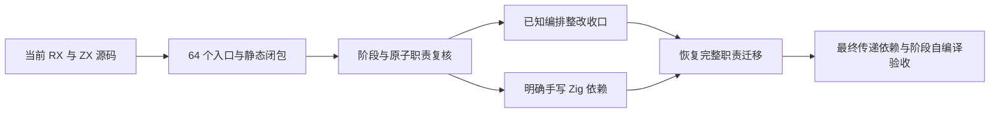

# RX 与 ZX 当前职责复核

## Intent：最终目标

核对上一轮全面审查提出的整改是否落实，结束已知编排问题的整改阶段，恢复剩余自举迁移。既不把手写 Zig 状态桥算作自举完成，也不为增加 RX 标签把内聚算法机械拆碎。

## Data：可用证据

源码基线 93e04422。当前依赖清单.json 记录 packages 各 src 内 647 个 RX/ZX 文件的哈希、直接引用和 64 个 RX 入口闭包。收集依赖.py 根据 generate_parser.zig 的实际 lint/naming 虚拟目录与包映射解析引用，未解析引用为零。该清单是静态定位证据，不是语言解析器或正确性验证器；不能仅据零遗漏判定架构完成。

| 范围                   | 当前 RX 入口数 | 当前源码复核                                                                                                                                                                                                                                                                                          |
| ---------------------- | -------------: | ----------------------------------------------------------------------------------------------------------------------------------------------------------------------------------------------------------------------------------------------------------------------------------------------------- |
| 前端词法与解析         |             13 | scan 与 boundary/scan 显示 UTF-8 门禁、初始化、扫描、收尾、发布；templates/prepare 显示条件性插值扫描；parser/prepare 显示主流与插值提示；program/native 显示诊断、类型索引与结果组装。其余 header/body/expression/type 文法状态机保持 ZX。lexical 复用真实 prepare 模块，lex 显示旧 token 输出转换。 |
| 语义类型               |             14 | resolve 显示请求分流，新增 initialize 显示 aliases/declarations 门禁；preflight 显示 shape/origins/bounds/prefix；origins 显示形状门禁。构造驻留、包含查询、查找、合并、提取、引用映射、来源生成与堆排序仍为内聚算法。                                                                                |
| IR 规范检查            |             22 | body 的结构/引用、contracts 的结构/语义、tasks 的接口/引用/消费、program pure 的事实/调用、scopes 的准备/初始化/遍历/后置、native export 的名称/效果/兼容阶段均已显露。细节边界见下文。                                                                                                               |
| 所有权                 |              4 | initialize 与 check 显示准备和分析；places/apply 显示执行与合并；ir/prepare 负责 IR 引用适配。工作栈推进拆为连续规则族，保留同一算法状态，无动态调度表。                                                                                                                                              |
| RX 自身                |              8 | 文档解析 prepare/validate/parse、路径 scan/resolve 显式；图 DFS、路径类别、属性角色、调用契约、空白内容与文件类别属于原子操作。                                                                                                                                                                       |
| 整数、模块说明符、命名 |              3 | 分别为十进制解析、说明符分类和命名谓词，单 Call 合理。                                                                                                                                                                                                                                                |

范围包括原报告的 55 个入口及新增子模块。各入口的精确文件与传递引用以清单为准；入口数用于覆盖盘点，不能作为自举比例。

现行全部 packages ZX 文件共 1743 个，实际总行数最大 232，未发现超过 240 行的文件。生产 src 最大 220 行。没有以缩排压缩或减少空行规避限制。

### 组合结构谓词的审查纠正

本次复核曾将以下四个组合检查再次判为跨职责总控；检查调用目的及受保护索引后撤回该判断，不据此继续改代码：

- body/symbols.zx：列长与 span 范围共同判断一个符号表是否合法；列长门禁保护 offsets 的成对索引。
- expressions/validation/validate.zx：widths、ranges、payloads、offsets 是同一个表达式表表示不变量，未产生跨阶段状态。
- control/validate.zx：列宽、分段、payload 对应及子块顺序是同一控制表结构谓词。
- contracts/tables.zx：外层列宽与位置检查后逐项检查嵌套表，属于契约表结构遍历，复用上面谓词是合理的。

这也纠正旧 IR与所有权审查.md 将这些组合谓词直接列为必须上提 RX 的建议。短路与多个 helper 不足以证明跨职责；真正的阶段边界包括生成事实后交给作用域检查、结构验证后运行契约语义，以及初始化布局后执行所有权分析。

### 提示扫描的生成证据

93e04422 已直接借用 tokens 逆序索引，独占 Hint 结果原地反转。对应构建 36/36，既有专项 212/212，通过日志与 SHA 记录在 ../提示扫描零复制/。本次审查不重复运行这些检查，也不把它们扩张为整个编译器的零分配或行为证明。

## Edges：仍未完成的自举边界

| 当前边界                                     | 仍有手写 Zig 的职责                                                                                  |
| -------------------------------------------- | ---------------------------------------------------------------------------------------------------- |
| semantic/native 与 resolving/host            | 来源索引与类型映射缓冲、类型追加、DFS 提取状态、引用映射写入、来源提交、列交换、解析缓存快照及提交。 |
| ir/scopes 与 flow_state                      | Workspace、Refinement、声明与活动状态、历史回退、事件和捕获。                                        |
| ir/validate.zig                              | 正式总结构门禁、函数与表达式遍历、外部调用约束及 scopes/tasks/ownership 调度。                       |
| ir/native_type.zig 与 core/ir.zig NativeType | 递归原生类型形状的规范状态模型、绑定名称与类型结构匹配。                                             |
| ownership/input/generated                    | 原始 IR 适配、错误及诊断映射。                                                                       |
| RX 编译主体及其后端                          | 模块注册、流程类型化、绑定、IR 与目标代码生成。                                                      |

依赖清单之外仍有九个原生接口声明和三个 ZX helper；接口声明通过原生注册接入，三个 helper 不在当前 RX 静态闭包。未为本次审查清理它们，也不凭未被 RX 引用断言它们没有其他入口。

已知编排整改完成与完整职责自举是不同结论。当前未执行 stage 1/2/3，不存在可以宣称完整自举的证据。静态闭包不覆盖 Zig 宿主调用链，也不能证明所有未被本轮识别的代码都没有设计问题。

## Answer：本阶段结论与下一动作

原审查提出且经语义复核成立的编排问题已有当前源码整改证据；当前没有需要继续机械拆分的已确认问题。结束这一批 RX/ZX 对齐整改，恢复剩余自举工作，保留上表为确定未完成项。

下一职责是 NativeType：不能只将 native_type.zig 的递归算法搬进 ZX，再由 Zig 每次把递归树复制成临时列。先追踪 core 函数表中的 native_inputs、模块原生类型构造、库序列化与 genz 消费，确定唯一规范表示及兼容边界，再迁移检查。现有深度 256、绑定名称匹配、task 拒绝、native_reference 必须具名且无子节点等规则必须保持。

### 自我批判

本次最重要的纠偏是撤回四处过度拆分建议。单 Call、文件长度、多个布尔子检查均不能替代职责判断。清单脚本采用当前静态引用格式与已核对构建映射，不是通用项目解析器；未来引入新的包映射应同步核对实际构建契约。此次只新增审查材料，未修改生产源码、未新增测试、未运行全量测试或浏览器。
