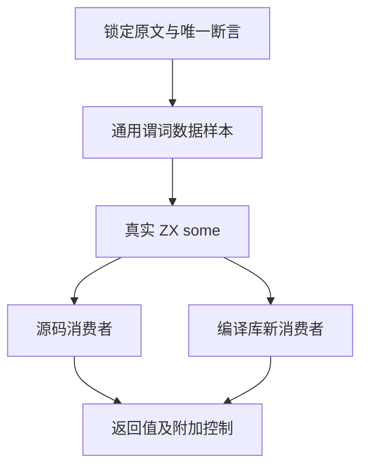
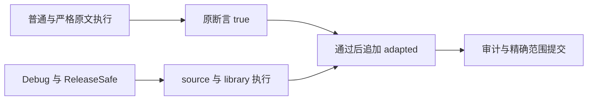

# Some 零形参返回观察

## Intent：最终目标

接入尚未审查的 Test262 some 原例，保留原数组 [11,12]、恒真回调及唯一原断言 some=true。用源码和编译库两个消费者验证，并明确区分原断言与附加的 zxc 顺序/输入控制。

## Data：可用证据

锁定 revision 7ab7fafa0003f73fc85c1b95d88094d33f7eb8bd，原路径 test/built-ins/Array/prototype/some/15.4.4.17-7-c-ii-9.js，SHA 与索引 aaf42089… 相等，全部 review 中尚未登记。原回调无形式参数，只返回 true；原文件没有调用次数断言。

沿用 generate_predicate_reviews 的成熟样本、原生宿主观察和 source/library 两路线。宿主按通用 rule=always、value=true 返回，检查真实结果、calls、visited、输入及边界哨兵；不存在 case ID 特例。库提供者与编码缓冲释放/填毒后，解码库在新消费者中运行。

## Edges：边界与限制

ZX 的集合回调目前要求一个元素形式参数，适配为显式但未使用的 item；状态为 adapted，不能据此宣称支持零形参 lambda、JS callback.length、this、index/source 参数或稀疏数组协议。VM 中原函数 length=0 仅是原文环境观察，不能作为 ZX 语法支持证据。

some=true 是唯一原断言。calls=1、visited=[11]、input=[11,12] 是附加 zxc 控制，不冒充三条上游原断言。两个涉及稀疏类数组和 some.call 的候选留待其协议问题，不转成稠密列表登记通过。

固定 12431932 的独立检出加数据草稿，两个模式执行完整 test-predicate-reviews，冻结包输入至终态。review 只在两模式全部通过后追加，并记录执行时旧 SHA 与发布时新 SHA。仅三个正式数据路径变化；不修改生成器、checker、已有案例、生产算法或运行库。

## Answer：交付格式与成功标准

交付 IDEA 计划及记录、三个正式数据变更和草稿、锁定原文、真实 harness 的普通/严格两次执行（共两条原断言）、两个优化模式的六个真实消费者结果、源/生成物身份及审计。新增 some 样本四次真实执行，上游未审减一，adapted 加一；检查数与审查原例数分开报告。核验后使用英文 Conventional Commit 提交并 push，只有当前生产缺陷才通知实现会话。

