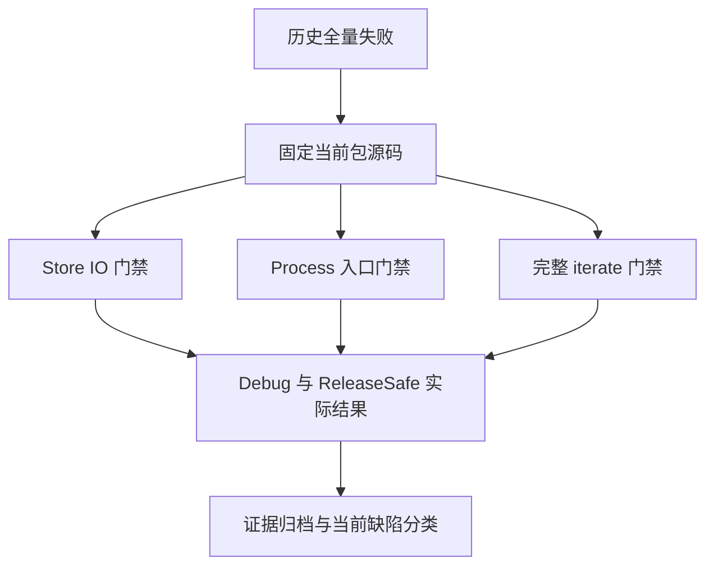
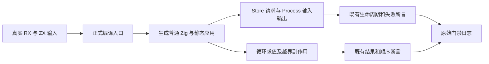

# Store 与 CLI 历史故障当前复验

## Intent：最终目标

复验历史全量 ReleaseSafe 中的 Store IO 初始化失败、Process Store 入口初始化失败和 iterate 越界副作用顺序失败，确认当前正式源码是否仍存在这些问题，并保留可以接续工作的执行证据。

## Data：可用证据

历史执行提交为 37d534314aa8027863ecd497d1c0d4e8b6787b0d。Store 的 write、service、readonly 生成均报 InvalidInitializer；Process 前 41 项检查通过，state.rx 构建报同一错误；iterate CLI 越界样本期望 P|、实际 P|V|。首轮固定 e5c67484 包输入；Debug 终态核验通过，但 ReleaseSafe 末尾共享源码变动导致身份未证明。随后创建固定 3bda0e58 的独立检出，重新执行两个模式。首轮日志与源码基线保留，最终源码清单与 SHA-256 见开始基线。

复用既有 test-rx-store-io、test-process-entry 和完整 test-iterate。后者包含 test-iterate-cli、分析、前置/后置条件、快照和列表更新。原测试包含真实生成应用和分配失败注入，不新增重复测试，也不改预期。

## Edges：边界与限制

Debug 与 ReleaseSafe 各运行一次，独立检出保持固定提交至两个进程终态；保留原 180 秒子进程超时。测试缓存允许复用，报告实际执行与缓存条目。三个门禁的通过不能代替未过滤根门禁或完整 Test262 对齐。Store 内存跨请求存活不代表跨进程恢复，测试中的显式文件能力不代表 Store 自动落盘。

仅文档和证据写入本目录，不修改生产或测试源码。只有验证的当前生产缺陷才通知指定实现会话；通过时不发送消息。

## Answer：交付格式与成功标准

记录 IDEA 执行计划、原始日志、终态、源码与实际生成物身份、测试计数及自我复核。根据实际结果分类历史故障是否仍成立。核对提交范围和原有工作区文件后，使用英文 Conventional Commit 提交并 push。本部分不宣称整体目标完成。

