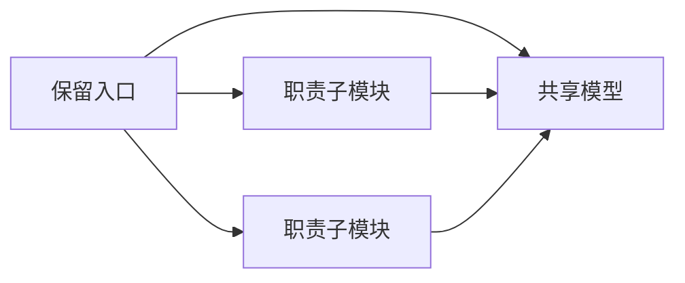

# ZX 文件粒度拆分

## Intent：最终目标

按用户新增硬约束，把当前超过 120 行的 ZX 文件拆成更小的职责单元，保留语义空行与公共行为，不靠排版压缩、改后缀或不可执行的文本片段规避限制。

## Data：可用证据

基线 d2a20ccf。版本控制中有 49 个超限文件：12 个编译器文件、10 个测试文件、27 个历史草稿。逐项路径和原始行数见超限清单.json。原生名称校验还有未提交的性能修复，位于独立工作树，不纳入本次粒度提交。

## Edges：边界与限制

- 入口保留，子职责通过同名目录收口；模型放独立文件，避免子模块反向导入入口形成环。
- 测试样例保留原始表达式、空白和执行顺序，仅抽出独立检查组，不新增测试用例。
- 关键字大枚举同时承载终结关键字和前缀自动机状态，必须分离模型职责；不能把一个枚举截成多个无关联类型后宣称兼容。
- 原生声明当前单文件，fs 与历史 resolution 声明的拆分必须保留同一个模块身份及可用装载方式。
- 历史草稿保留可复制的入口与关联资源，拆分后记录新组织方式，不改写既往验证结论。
- 不运行全量测试，不进行 UI 确认；按实际受影响职责验证构建与既有专项。

## Answer：交付格式与成功标准

提交实际拆分、相关生成器与装载接入，输出剩余超限检查和自审记录。成功标准为原清单全部处理，新增文件也不超过 120 行，导入无环，行为和有效接口保持；特殊内部模型调整明确记录，不掩饰为纯移动。

