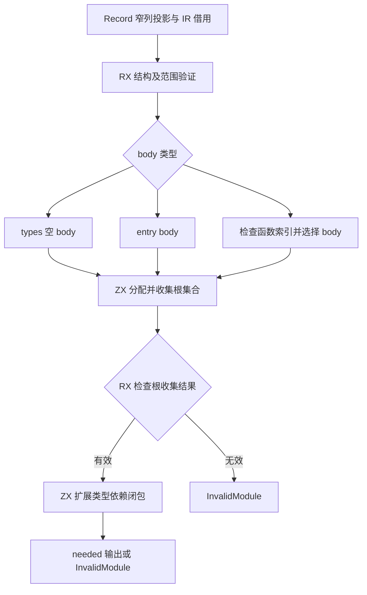
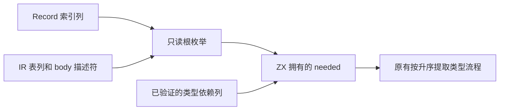

# 产物类型根集合自举

## Intent

将 artifact 初始类型根选择与类型依赖闭包完整迁移到 RX/ZX。RX 显式表达结构验证、body 选择、无效短路和集合计算；ZX 内部拥有 needed 布尔集合，不新增原生可变缓冲桥。

## Data

现有 roots.collect 读取 Record、函数签名、原生模块公开类型、body 的符号/表达式/合同/Store 类型，建立根集合后按类型 ID 降序扩展依赖。Types.init 已验证类型依赖严格指向较早行，单次反向扫描成立。

FunctionTable 和 NativeModuleTable 已按列存储，完整 Symbols/Expressions/Contracts/Stores 描述符已有 ZX 模型，可通过现有编译期布局校验借用。Record 的 exports/type_imports/function_imports/imports 仍为行数组，需要窄列投影；其字符串正文保持借用。

## Edges

- 只迁移初始 roots.collect 的完整职责，不将迟到 native module 公开类型提前并入初始集合。当前单次 native module 顺序扫描会按即时 mapping 决定是否触发其他类型，不能改成全局闭包。
- 按 specifier 匹配 native imports 的现有根收集规则不改变；后续 build 按 identity 匹配的差异单独保留，不在本轮混改。
- 不复制类型、表达式、符号、合同和字符串正文；Record 窄列投影和 needed 输出有明确分配成本。
- 根枚举 helper 只借用输入，不接收可变 needed；集合算法统一持有并更新输出，检查生成代码防止辅助调用复制整张集合。
- 保留 seed 供初始引导；正式 roots 只负责 ABI 适配、分配生命周期和错误翻译。
- 不新增测试、不运行全量检查；运行现有模块产物和相关链接专项。

## Answer

交付 RX 阶段图、ZX 数据模型/根枚举/闭包算法、正式适配器与构建接入，生成普通 Zig。确认源数据借用、needed 分配及更新成本，记录自举未完成边界，英文提交并推送。

## 自我批判

roots 不是整个 artifact 构建会话的所有权边界。本次迁移能消除这一算法的手写规则与状态，但不能据此宣称持久 mapping 或终端存储已经迁出；也不能将少量 ABI 投影成本隐去。

## 跨阶段缓冲复用

根集合收集与依赖闭包是两个职责，由 reachable.rx 显式连接。genz 的通用调用优化仅在证明生产者返回全新列表、调用点独占该列表、其他可读字段不携带共享引用、消费方只更新固定索引时，借用原分配建立标准 ArrayList 视图。

不得增长、弹出或经嵌套可变调用改变缓冲；不能改变元素布局；存在合同、并行值、重复动态区域或整体对象逃逸时拒绝该优化。不能依赖函数、类型或字段名称识别这个根集合场景。

## 成本与边界复核

Record 行结构仍需要窄列元数据投影；RX 调用参数中其他元数据成本另计，不能由 needed 无复制推导所有临时分配归零。主入口在 roots 前验证完整 Program；对损坏私有输入与分配失败组合，不宣称与旧实现完全相同的错误优先级。

原有阶段构建曾通过；加入跨调用复用后需要重新检查生成代码与相关专项。2026-10-09 主机未签名执行故障恢复期间，针对本地缓存生成器补本地签名，不把该环境措施加入编译器或应用运行库。
