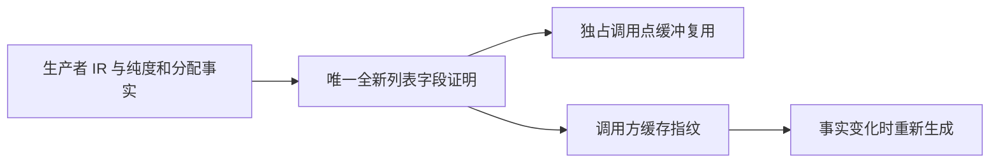

# 产物类型根集合自举执行记录

## IDEA

- Intent：用 RX 连接根收集与依赖闭包，在普通生成代码中复用独占的新建根集合。
- Data：正式 roots.rx / select.rx / reachable.rx、ZX 集合算法及生成 artifact_roots.zig。
- Edges：不改变迟到原生模块的扫描顺序，不把行转列元数据投影称作零分配；所有优化均以通用所有权证明为条件。
- Answer：正式源码与草稿逐字对应，验证实际生成调用、构建和现有专项；未通过的项保留待验证状态。

## 当前实现

RX 先检查原生结构和输入范围，然后按 body 选择分支；有 body 时单独验证 body，再调用 reachable。reachable 显式连接 collect、valid 分支和 closure。ZX 的根枚举与依赖枚举仅读取输入，两个集合算法各自只负责一个阶段。

## 生成代码审计

2026-10-09 生成目录为 .zig-cache/o/57107012b8caa118b04686936ebea716/。

- 三个实际分支均通过 ArrayList(bool).fromOwnedSlice(@constCast(source)) 建立栈上视图。
- transferred_started 初始化为 true，调用对应的 function_37_buffered、function_76_buffered、function_93_buffered。
- buffered 更新路径收到非空 lane，跳过 started 为 false 时的 appendSlice，随后仅更新索引位置。
- 文件中的普通 function/value 后备实现仍含 dupe(bool)。它们的存在不能证明本分支发生复制，必须按实际调用关系判断。
- 复用不改变底层切片的所有者；ArrayList 视图不 deinit、不扩容，底层分配继续归调用 arena 管理。
- RX 参数和返回结构仍有元数据 create，Record 行到窄列转换仍有分配，尚不宣称整个入口零临时分配。

## 验证状态

生成代码审计完成。重新构建通过，36/36 步骤成功。现有 extract / invalid / resources 专项已启动，尚待最终结果；原来的专项任务因主机未签名执行阻塞被显式停止，不能沿用为通过证据。

## 自我批判

当前证明覆盖单层对象参数中的列表投影、全新纯生产者输出与固定索引更新，遇到并行、合同、重复区域、共享观察者或布局变化即不启用。该范围与规则不能通过根集合函数名称放宽。根集合职责迁移也不代表 artifact 的 mapping、合并和终端状态已完整自举。

## 增量缓存补强

复核发现：跨调用复用依据生产者输出新建列表的证明，而既有 FunctionId 指纹只记录值调用、纯度、局部性和 buffer lane 事实。因此新增相同证明得到的可转移输出字段摘要到调用方缓存指纹；只记录摘要，不把生产者全部函数体加入调用方键，保留不影响可转移性的普通实现变动的缓存粒度。更新指纹版本，避免旧键误用。

补强前现有产物专项 14 项、buffer eligibility/resources/recovery 9 项通过；这些用例没有直接证明新增生产者事实的缓存边界，不能因其通过省略补强。

## 专项结果

- 产物提取 6 项、无效输入 6 项、产物分配失败 2 项通过。
- 缓存补强后，buffer eligibility / resources / recovery 各 3 项通过。
- Store 能力槽 5 项、对应分配失败 2 项通过。
- 共 30 项现有断言通过；没有新建测试用例，也未执行全量测试。
- 最新补强与已发布的显式加载帧修复合并后，最终构建 36/36 步骤成功。

## 最终生成一致性

合入显式加载帧与缓存补强后，最终生成目录 a4f2e0c75d4826984620ed6b86eebf6f 的 artifact_roots.zig，与专项使用的 57107012b8caa118b04686936ebea716 版本逐字一致。共同 SHA-256 为 801892fe559278ac93968974fb3720d8959f4cef3ba55b461faf17db77db3bf3。此证据只覆盖该生成文件，不替代完整自举阶段验收。
