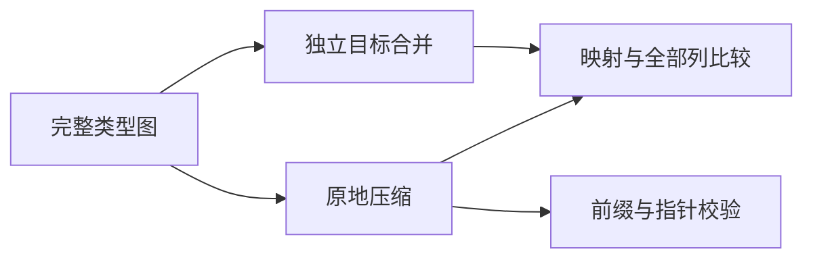

# 共享类型列原地压缩边界

## IDEA

- Intent：验证共享类型列原地压缩与既有独立目标表合并语义一致，覆盖所有类型与合法前缀、名义身份、错误及内存回滚。
- Data：固定执行提交 8ddf71d10064e7b3bf3cb0a99aa52c8c615fb6d0 包含 94de53224 优化；Table.compact 保留前缀后借用原完整 source，再 appendFrom；成熟测试是 incremental/type_merge/preflight。
- Edges：仅新增测试、注册测试入口；不修改生产实现、不使用浏览器。原完整 ReleaseSafe 89265 继续独立运行。独立目标合并是语义参照，不是对同一原地实现调用两遍。失败只要求恢复已承诺前缀，不声称未提交后缀仍完整。
- Answer：按 compaction 子目录组织草稿、测试与文档；Debug/ReleaseSafe 日志、固定输入及生成源码/二进制 SHA；正常英文 Conventional Commit 并 push。确认实现缺陷才通知实现聊天。

## 实施步骤

1. 构造九类类型的完整图以及重复结构、重复名义身份和新结构；深复制参照输入，使其不会被原地写入影响。
2. 枚举合法类型前缀；名义前缀计数对应 type_id 小于 first 的绑定，逐列比较独立合并与原地压缩、完整映射与缓冲区指针。
3. 覆盖同名同来源复用、不同来源保留不同身份、同来源成员冲突，检查失败时完整前缀不变。
4. 对 owner 和 temporary 两类分配器分别穷举失败；每次失败后检查所有类型与名义列回滚。
5. 冻结输入后执行类型合并、原生签名、类型解析与跨模块回归；同批全部终态前不改输入。
6. 对执行过程自我批判、精确发布测试范围与证据；保留并行源码与外部文件。

## 架构图

## 数据流图

## 自我批判标准

两条路径共享 appendFrom，因此比较主要检验原地读写别名与前缀管理；须额外断言去重映射、名义身份及指针稳定性。局部测试不能替代完整门禁，更不能新增 Test262 对齐数量。失败回滚不代表完整后缀可直接重试。
