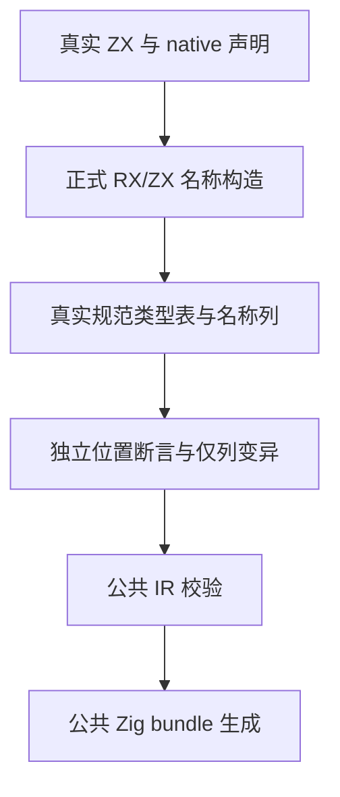

# 原生名称列拓扑边界

## Intent：最终目标

为 IR 34 名称列校验和 `e968646c` 的 RX/ZX 名称构造提供独立边界测试：名称必须对应真实类型节点，列长度精确，引用叶必须有正确名字，结构节点允许 null。

## Data：可用证据

完整回归仍在另外的固定 `3e85c85d` 检出运行。其只读审查产生九项草稿；随后生产提交 `e968646c4a2785f4ed920bf904df89ddd81391b3` 又迁移了名称构造。现在使用独立的新检出验证最新构造与校验，不修改完整回归检出，也不等待旧基线才能开始最新实现验证。

沿用成熟 IR fixture 的 `nativeOnly`、公共 `validateIr` 和 `emitBundle`。真实接口声明 Packet 对象包含 list/optional、tuple/scalar、两个不同 opaque 叶及独立 scalar，故意打乱声明字段顺序。独立预期前序列按规范类型字段顺序为 `Packet, null, null, Alpha, null, null, Beta, null`。

## Edges：边界与限制

只新增两个测试文件，并在原有 native references IR 构建数组加一项。没有生产源码修改，没有新增 runtime。草稿只对真实分析所得 IR 的 native_inputs 做变异，不替换类型表、模块绑定或 owner。

两个模式执行完整 `test-native-references-ir`，包括既有四组测试与新组；两进程全部终态前保持该执行检出的 packages 源码冻结。预先导入现有 yaml 2.9.1，避免复现此前新检出的环境准备错误。保存逐文件身份、真实日志、生成选项和执行二进制哈希。缓存摘要和实际运行分别计数。

九项覆盖正常构造、八种截断前缀、三种额外节点、两叶缺名、叶名交换、三处未知名、无名结构根，以及接受/拒绝逐分配点清理。不能扩大为深度边界、所有 alias 拓扑、所有库生命周期或整个仓库通过。

## Answer：交付格式与成功标准

交付正式测试、中文草稿、IDEA 记录、架构图和数据流图、固定源证据与发布范围核验。正常名称列必须由最新真实构造产生；每项接受/拒绝与清理在 Debug、ReleaseSafe 均成立后才发布。仅确证生产缺陷才通知实现会话。

完成后用英文 Conventional Commit：`test(native): cover input name column topology`，正常 hook 后核验，再 push。

