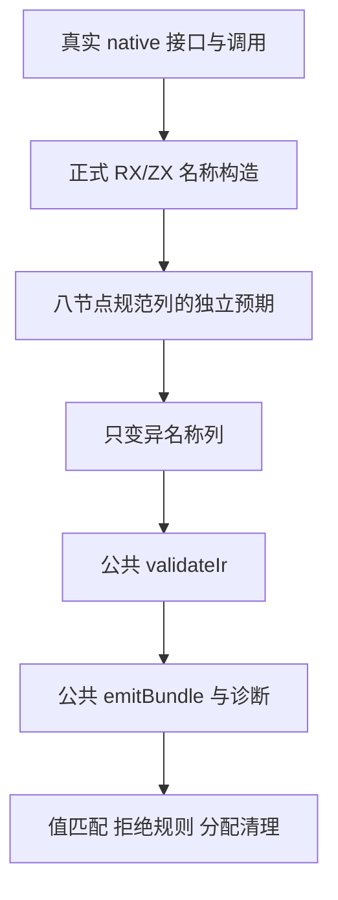

# 原生名称列拓扑边界执行记录

## Intent：最终目标

验证 IR 34 的名称列校验和最新 `e968646c` RX/ZX 名称构造共同保持拓扑对应：按规范字段顺序产生名称、精确消费列、要求 opaque 叶别名、允许无名结构节点。补齐迁移后仍沿用单叶旧断言的缺口。

## Data：可用证据

使用固定检出 `/Users/xiewendao/.codex/worktrees/native-name-column-conformance/zxc`，执行提交 `e968646c4a2785f4ed920bf904df89ddd81391b3`，加三份测试/构建草稿，共 5,540 个输入。`开始基线.json` 保存每个输入 SHA-256，最终原字节快照为 `/tmp/zxc-native-name-column-source-e968646c-module-fixed`。

三个正式文件为现有 `build/native_references.zig` 的最小登记，以及新 `ir/name_columns/fixture.zig`、`root_test.zig`。显式导入成熟共享 fixture，复用其 nativeOnly、精确 contract 诊断和 InvalidIr 生成拒绝断言；不复制公共 helper，也不改生产实现。

真实 ZX 调用 `host.read(in)`，接口声明两种 opaque 叶 Alpha/Beta 和 Packet 对象。对象字段声明为 scalar/right/left，独立预期按规范字段 left/right/scalar 得到八个节点：`Packet, null, null, Alpha, null, null, Beta, null`。测试检查真实分析结果，不手写替代 AST，也不使用 seed 代替正式生成路径。

九项新增检查全部通过：

| 检查         | 实际输入与断言                                                    |
| ------------ | ----------------------------------------------------------------- |
| 正常构造     | 分析所得八个位置的名字/null 精确匹配，独立 IR 接受并可 emitBundle |
| 截断列       | 长度 0 至 7 的所有前缀均拒绝                                      |
| 多余节点     | 尾部各加 null、Alpha、Packet 均拒绝                               |
| 无名引用叶   | Alpha/Beta 位置分别置 null 均拒绝                                 |
| 叶名错位     | 交换两个不同 exported 名，仍因 type_id 不匹配拒绝                 |
| 未导出名     | root、Alpha、Beta 三个位置分别改为 Missing 均拒绝                 |
| 无名结构根   | Packet 根置 null，两个叶保留正确别名，接受并可 emitBundle         |
| 接受分配清理 | 正常列遍历所有失败分配点                                          |
| 拒绝分配清理 | 缺末节点列遍历所有失败分配点                                      |

每次变异都来自真实分析 IR，只替换 native_inputs 列；类型表、模块、owner 和 export 不变。使用公共 `validateIr` 与 `zig.emitBundle`，所有拒绝同时检查 contract 诊断和 InvalidIr。

| 阶段                   | 模式        | 构建步骤 | 实际通过检查 | 实际测试二进制 |
| ---------------------- | ----------- | -------- | ------------ | -------------- |
| 首轮（新增组编译失败） | Debug       | 30/33    | 既有 18/18   | 4              |
| 首轮（新增组编译失败） | ReleaseSafe | 30/33    | 既有 18/18   | 4              |
| 修正后完整 IR 专项     | Debug       | 33/33    | 新增 9/9     | 1              |
| 修正后完整 IR 专项     | ReleaseSafe | 33/33    | 新增 9/9     | 1              |

两轮、两个模式合计 54 项实际通过检查、10 次实际原生二进制执行，其中新测试为 18 次检查。最终门禁四个既有组使用缓存，不能把它们重复算成新执行；最终摘要仅报告 9/9 实际检查。首轮每模式缓存构建摘要 14 条，最终每模式 30 条，均独立记录。

首轮与最终生产输入完全一致，仅三份草稿范围可能不同；首轮四个既有组的编译根、真实二进制 SHA、日志身份与通过结果已保存。最终五个编译命令的正式 parser 选项均为 `generated_parser = true`，实际新测试运行身份及 `native_names.zig`、`native_type.zig` 生成物字节也已保存。核验脚本交叉检查冻结源码、两轮快照、日志、生成物、二进制、计数、旧组来源与缓存区分，返回 0。

复现位置为上述固定检出的 `packages/test`。PATH 加入 `工具身份.json` 中 Zig/Z3 目录，ZXC_TEST_SOLVER 使用其记录路径：

```sh
zig build test-native-references-ir \
  -Doptimize=Debug \
  -Dzig-archive=/tmp/zig-x86_64-macos-0.17.0.tar.xz \
  --cache-dir /tmp/zxc-map-observations-debug-cache \
  -j1 --verbose --summary all
```

ReleaseSafe 对应 `-Doptimize=ReleaseSafe` 和 safe cache。准确的四个进程身份、命令和终态见 `运行状态.json`。

## Edges：边界与限制

首轮新增组不能从模块根的子目录相对导入 `../fixture.zig`，两个模式均编译失败并退出 1。错误来自测试集成，不是生产构造/校验缺陷。两进程全部终态后，保留首轮基线与三份 `.zig.txt` 原草稿，才改为显式 `native_ir_fixture` 测试模块导入；两轮包源码都在其门禁活跃期间冻结。没有放宽任何断言。

专项检出预先接入现有 Node 依赖并成功导入 yaml 2.9.1，未下载或升级依赖。本专项是 Zig 原生 IR 测试，不把这项环境预检算入检查数量。

最终发布父提交 `d2a20ccf44f98af711488a49a5dd080dbef05f6c` 比执行基线多一项 AGENTS.md 的 ZX 120 行规则，包生产源码相同；该并行规则路径完整保留。本部分没有新增 ZX 文件；测试字符串中的 ZX/native 声明也只是短输入，不产生超限源码。

尚在运行的完整回归位于另一检出，基线为 3e85c85d，其两个进程及冷构建超时属于相邻记录。不得用这里的专项通过代替那里的完整结果，也不修改其冻结输入。

本部分未证明所有拓扑、深度极值、库编码重排、缓存生命周期或 host 运行 ABI，也没有直接执行本 fixture 的 native host。emitBundle 成功只是生成接受观察；现有完整 IR 组与其他运行门禁保留各自范围。不宣称整个自举架构或完整 Test262 对齐完成。

目录审计仍为 128,468 项登记、812 个 adapted、50,630 个未审查上游文件。本部分是 zxc 特性测试，不新增上游适配计数。没有确证生产问题，未通知实现会话。

## Answer：交付格式与成功标准

交付三份正式文件、完整中文草稿、IDEA 计划与记录、原始两轮日志、逐输入身份、生成源码和 ABI 副本、实际执行二进制身份及可执行核验。新增九项在 Debug、ReleaseSafe 均通过，既有四组由同生产基线的首轮实际结果和最终缓存结果共同保留。

使用英文 Conventional Commit：`test(native): cover input name column topology`。正常 hook 前后分别核验精确提交范围、正式文件与草稿字节、证据和并行规则路径；完成后 push。未完成的完整回归文档不会混入本次提交。




## 自我批判

初稿忽略了 Zig 测试模块根的边界，说明目录分层必须同时设计显式依赖，不能仅凭相对路径推断可复用。修正通过现有编译器模块共享 fixture，保留原职责和测试断言；原始错误证据使用文本扩展名，避免再次被 hook 格式化。

最终全专项步骤通过，但实际运行只新增一组；报告将每轮来源与缓存清楚分开。九个测试名与内部有限变体不能代替一般拓扑证明，特别是当前未覆盖深度和生命周期极值。后续应继续从真实特性及上游断言推进，避免用重复检查或目录登记数掩盖缺口。
