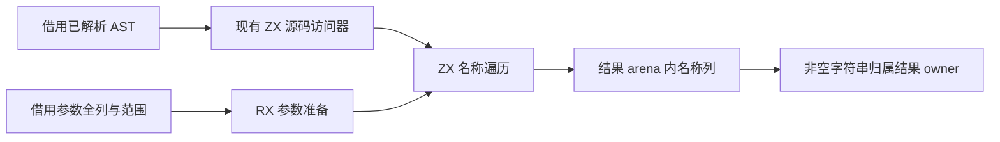
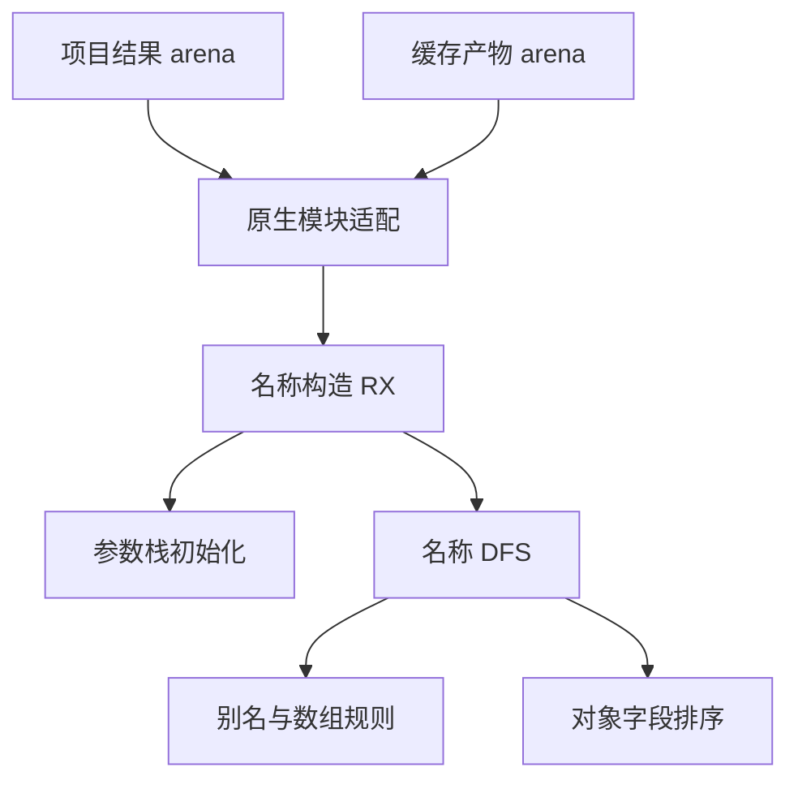

# 原生名称构造自举

## Intent：最终目标

把原生输入名称列的别名展开、对象字段排序、集合元素可寻址规则与前序输出迁入 RX/ZX。正式构造直接借用已解析 AST，在项目结果 arena 内产生名称列，不再由手写 Zig 执行递归类型语义。

## Data：可用证据

基线 1f4ea3ab。modules/native_types.zig 是剩余构造算法，接收类型视图与参数视图。现有 semantic/resolving/source 的 node、find、declaration、field、item、text 已用普通 ZX 表达 AST 访问；host/source.zig 对 Indexed 视图借用原解析表，不创建投影树。std:encoding.decodeUtf8 校验 UTF-8 后返回同一字节 slice。

native.load 仅由 project.zig 和 semantic_cache/native_artifact.zig 调用，两处均已经拥有结果 arena；Project 只有一处初始化。可显式传递该 arena，让生成结果直接属于最终结果生命周期，无须增加 allocator 入口或事后复制整列。

## Edges：边界与限制

- 保留零/单/多参数的根规则、最外层别名覆盖、字段字典序及原生数组元素必须可寻址的诊断。
- 输入参数全列与 AST 均借用；参数 first/count 限定当前函数，不创建参数投影数组。
- 源文本和解析 scratch 不随输出保留。返回前必须让被选中的非空名称归属结果 owner；不得返回悬空字符串。
- 不新增专用原生 getter、动态解释器或运行库。引导构造留在 seed，正式路径不回调其语言规则。
- 工作栈按标量列组织；字段排序保留 O(F log F)，不以逐字段扫描换取更短实现。
- 不新增测试，不运行全量测试；使用既有原生声明、别名、库和缓存专项，并审查生成代码。

## Answer：实施与成功标准

1. RX 显示参数准备、名称遍历与结果发布；ZX 负责栈算法、名称规则与字段排序。
2. 生成输入借用已有 Source 和参数表，输出名称列直接在调用者 arena 内生成。
3. Zig 只保留输入布局适配、owner 边界和诊断映射；逐项列出未迁移职责。
4. 验证行为、源生命周期、生成分配及既有专项，英文提交并推送。

