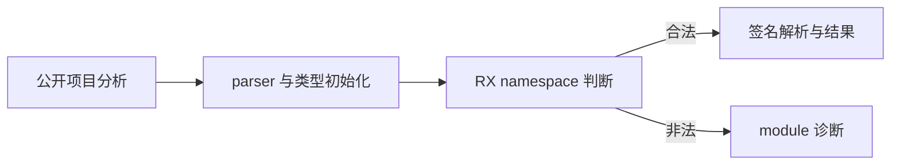

# 原生命名空间编排边界

## IDEA

- Intent：验证迁入 RX 的 namespace 校验真正短路后续签名处理，保留既有诊断优先级，并验证 UTF-8、路径字段所有权和分配失败清理。
- Data：初始参考提交 9a6989a85b2d08c029a33db5b010bcec11cacd6f，正式执行前更新并固定为 0463f9635a752bca1084e1d82b9626cf45f168f8；成熟测试为 native/type_import_test.zig、configuration_test.zig、declarations_test.zig。实际阶段在隔离工作树复核，不能把并行修改中的源码当作固定执行版本。
- Edges：只新增测试与注册；不修改编译器，不调用浏览器。空 namespace 合法，每个成员须非空、无 NUL、为有效 UTF-8；不额外要求成员必须是普通标识符。行为通过不代表手写状态桥或完整自举验收完成。旧压缩批次已完成，旧执行工作树仍保留原身份。
- Answer：分层测试草稿、真实两种模式门禁、固定输入及生成源码/二进制身份、IDEA 执行记录与自我批判，英文 Conventional Commit 并 push。确认实现缺陷才通知实现聊天。

## 阶段与测试

1. 核对 parser/声明校验、类型初始化、namespace 判断和签名解析的真实顺序。
2. 对 namespace 成员的首、中、末位置分别覆盖空字符串、NUL、UTF-8 截断、非法续字节、过长编码、代理范围和越界码点。
3. 合法 Unicode、空白和标点成员保持字段路径字节；检查生成 Zig 的普通静态字段调用。
4. 无效 namespace 与无效签名同时存在时检查短路；前置语法或类型初始化错误保持优先级；合法 namespace 不掩盖后续签名错误。
5. 释放输入 arena 后检查结果字段路径，再发出产物；对成功与拒绝分别执行分配故障注入。
6. 执行前格式化并冻结；同批全部终态后才修改测试输入。准确保护并行实现与外部文件，完成后提交推送。

## 架构图

## 数据流图

## 自我批判标准

诊断类别只能说明可见的阶段结果，不能单凭错误码证明内部没有任何准备分配。输入释放后检查能揭示借用生命周期错误，不能穷举所有地址复用；分配故障必须进入目标处理路径，不能被测试生成器的错误转换截断。最终依据实际源码与调用关系说明 RX 边界，不能把测试通过扩大为全部自举完成。
