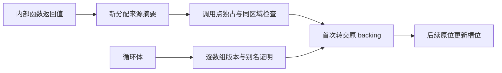

# 循环列表转交执行记录

## Intent：最终目标

消除临时名称槽表每次写入及首次写入的整表复制。先交付通用生成器修复；原生声明校验迁移仍为未提交草稿，不能将本记录当作该模块已完成自举。

## Data：可用证据

### 根因与修改

1. 循环原先以整体 pure 条件阻止缓冲分析。现在所有循环均有机会执行既有的逐数组版本与别名证明；证明失败仍保留原行为。与目标数组无关的原生标量/源文本调用不再阻止该数组复用。
2. 既有初始所有权证明只识别 map/filter，无法识别普通列表构造函数。新增按依赖顺序计算的分配来源摘要，并保留调用点唯一使用、同区域、独占检查。不是将所有 call 都当作新分配。
3. 内部列表返回函数的每个返回分支必须成立。输入列表、原生返回列表、混合来源和未支持路径都不获证明。循环先证明所选路径初值新建，再用同一路径的归纳假设证明循环体。
4. 证明成功使用现有 Storage.transfer 首写转交，不新增运行时数据结构、动态分派或专用运行库。

正式代码在 packages/genz/src/zx/iteration_buffer/ownership/allocation.zig 和同名目录中；调用点接入 render、Lower 和既有 ownership 检查。

### 实际生成证据

槽位生成证据.json 保存实际生成文件 SHA-256 与代码行。execute 经 function_23 到 function_22 的真实入口中，槽位更新首次使用 @constCast 接管，再直接更新对应元素；唯一剩余的同类型 dupe 输入为空列表，未复制表内容。普通版和 value 版共四处接管均核对。

生成器修复与原生校验草稿共同验证：

- 主构建 36/36 步通过。
- native-declarations、native-aliases、native-generation、iterate-buffer、iterate-calls、modular-loop、function-effects 七项既有专项：209/209 构建步、358/358 Zig 测试通过，另 12/12 Node 测试通过。
- 既有 iterate-buffer 覆盖 stale_local、stale_branch、stale_switch、stale_state、two_fields 等旧值及别名场景。
- 未增加测试用例，未执行全量测试，未进行浏览器确认。

## Edges：边界与限制

- pure 在当前生成器中是边界分类，不是数学纯性。新摘要仍明确拒绝原生返回 backing；原生标量调用不能借此获得转交特权。
- 逐数组分析直接拒绝异步、Store 读取以及目标数组逃逸。普通列表 object/tuple 元素保留独立 ABI 指针，覆盖槽位不会改写旧元素对象。inline-list 的局部路径仍要求 primitive 调用边界，未放宽。
- 列表构造的新建证明依赖现有 lowering：返回 list 的函数不使用非空静态列表；map/filter 创建新 backing。以后改变这些生成策略时，必须同时更新证明。
- 当前函数摘要支持单个列表结果；没有声称所有聚合输出路径都能转交。无法证明的新来源保留既有语义。
- 声明校验草稿中仍有逐轮临时状态记录分配，未把“槽表不复制”夸大为“全部抽象成本已消除”。本次提交不包含该迁移的正式源码。

## Answer：交付与自我批判

交付通用列表分配来源证明、循环缓冲接入、实际生成证据和此记录。阶段成功标准是目标槽表不克隆且已有别名回归通过，已达到；整个自举目标仍未完成。

后续应分别处理安全 local_calls 的嵌套状态值表示，以及新建返回对象的普通入口复用 value 实现。必须保留嵌套对象 origin、身份、契约只执行一次和异常顺序，不用直接取消 boxing 来掩盖成本。

自审发现原始判断将“不纯”与“数组不可复用”混为一谈，并遗漏首次复制。修复通过逐数组证据及分配来源证据分别处理，不用哈希表名称或固定输入规模作特殊优化。

