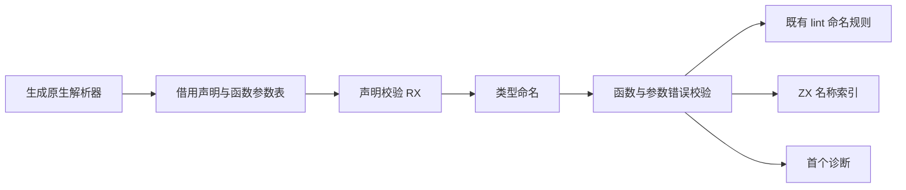
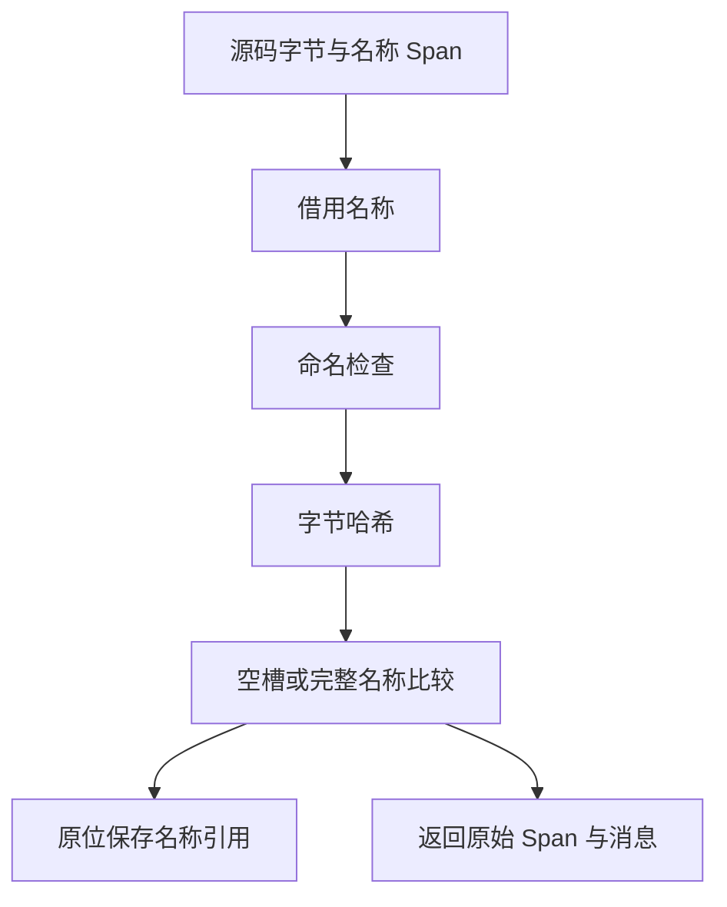

# 原生声明校验自举

## Intent：最终目标

把原生模块声明的命名、函数重名、参数重名与错误名称重名校验迁入 RX/ZX，保持诊断文本、位置和优先顺序。Zig 保留解析结果借用和诊断映射。

## Data：可用证据

基线 e968646c。`modules/native/validate.zig` 在生成解析完成后检查声明。命名规则已有 `packages/lint/src/naming/check.zx`；解析产物已有 Declaration、Function、Parameter 和 Span 表。源码名称访问可复用语义 Source 的 text 函数，仅借用原 UTF-8 字节。

当前函数及错误重名使用两重扫描，参数重名使用 StringHashMap。自举不得把参数检测改成两重扫描。按已知名称数量预留开放寻址槽，在 ZX 内执行哈希、冲突比较和插入，可以保持期望线性检测，并让函数和错误名称使用同一机制。

## Edges：边界与限制

- 先检查所有类型名，再按函数声明顺序检查函数名、函数重名、参数、错误名；同一位置先命名再重名。
- 继续将类型声明重复与类型解析交给原职责，不额外改变诊断优先级。
- 只借用源码和 AST 列；不复制原生解析树，不新增语义 getter 或运行库。
- 表容量由输入规模确定且保持空槽，碰撞必须比较完整名称，不能用哈希相等代替名称相等。
- 不新增测试、不运行全量测试；复用已有原生声明专项并检查生成入口的分配和复制路径。

## Answer：交付格式与成功标准

交付 RX 编排、ZX 校验实现、最小 Zig 适配、构建接入、生成代码证据与专项验证记录；英文提交并推送。整个模块加载的类型构造与导出组装不因本阶段完成而被标记为已自举。

## 生成代码阻断项：临时槽位整表复制

上一版真实入口每次首次名称插入都复制整个 slots，违反用户明确的零复制要求，禁止以专项通过代替修复。

当前调查发现 iteration.zig 以整个循环的 pure 作为 iteration_buffer 初始化门槛；哈希中的原生字节扩宽使调用链不满足此门槛。下一步检查逐数组版本与别名分析能否作为独立优化证明：外部调用若收到该数组或包含它的聚合必须拒绝；仅接收不相关标量的调用不应影响数组缓冲。

还需追踪初始数组所有权：消除逐次复制后，首次写入若仍复制整表也不能交付。不得硬编码原生名称校验或给专用函数特权；必须从通用 IR 与所有权证据证明。

### 返回分配来源证明

为普通内部函数建立返回列表的新分配来源摘要。按既有函数依赖顺序计算，只接受内部、无数组逃逸调用的函数；结果必须来自本次调用的列表构造、map/filter、已证明的新列表调用，或从新列表开始并保持该来源的循环。所有返回分支必须成立，输入列表、原生返回列表及混合来源拒绝。循环以所选字段的新分配来源作为归纳假设，校验初值与循环体，不按固定次数猜测。

调用点继续使用既有 Graph 的独占、单次使用及同区域证明。摘要不证明任意输入独占；它只证明返回 backing 属于此次调用。首写直接接管此 backing，借用元素的字节并不因此变为可变。

## 临时状态分配修复

先沿现有调用点机制复用值实现：只有已满足 value_functions 且每个返回点直接构造新 object/tuple 的函数，普通调用才使用值入口，随后在返回边界构造一次根对象。复用已有 fresh 判定并提取成同职责共享文件；子对象引用保持不变，契约仅由被调用的值实现执行一次。

循环中的 selected_state 使用既有 local_calls 隔离条件，仍由 state_plan 决定哪些类型允许值表示；native 边界、列表元素、Store 和比较相关类型继续 boxed。必须追实际入口验证，不能把未被调用的 value 函数变快当作成功。

### 仅字段读取的局部记录

对函数内每个符号一次性计算用途：只有根引用全部作为 field/tuple_field 的目标时，才允许值实现中的状态作用域把 flat 临时记录放到局部值。返回根、保存别名、整对象调用参数、比较及 task 捕获都拒绝。字段值仍按原 ABI 读取，子对象指针不改写。分析结果按当前函数缓存，避免每个局部符号重复扫描整张表达式表。

用途检查还沿绑定、条件分支与 match 结果反向传播整对象观察：纯转交别名链最终只有字段读取时可以作为局部值；链中一旦出现返回、调用、容器保存或身份比较，所有相关来源都失去资格。工作队列每个表达式最多入队一次，不使用固定轮数，不为单个诊断类型设置特权。

自审发现 scope 结果不能当作透明别名：即使最终只读字段，局部记录地址也可能先越过 Zig block 的生命周期。因此 scope.result 一律作为整对象观察边界；只转交字段值仍可优化。未放宽跨 scope 指针生命周期。
