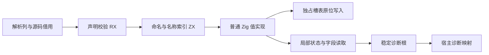

# 原生声明校验自举执行记录

## Intent：最终目标

把原生声明的命名及重复名称规则迁入 RX/ZX，并消除迁移过程中发现的槽表复制和逐轮临时状态分配。保留原诊断位置、文本和先后次序。

## Data：可用证据

### 实现

- native/validate.rx 先检查全部类型名称，再进入函数声明检查。
- validation/declarations、functions、members 分别负责类型名、函数名以及参数与错误名检查；复用 lint 的 naming 规则。
- validation/slot、slots 负责名称索引，冲突时比较完整名称，不以哈希相等代替名称相等。
- native/validate.zig 只借用解析列、调用生成模块、映射诊断。源码及 AST 列保持借用，不复制输入表。
- 首次及逐项槽表复制已由前一提交 d8fda95c4 的通用分配来源证明修复；本阶段完成状态与局部记录值化后正式接入原生校验。

### 通用生成器修复

现有 fresh 返回根证明被提取到 value_call/fresh.zig。满足既有 value_functions 和分配条件、且全部返回根直接来自 object/tuple 构造的调用，可使用已有值入口，再在 ABI 边界构造根对象。输入引用和字段引用返回不走此路径；不深拷贝子对象。调用结果先绑定再构造根，保留错误顺序，函数体及契约只执行一次。

循环 selected_state 可使用现有 local_calls 隔离条件；state_plan 对 native、list 元素、Store 及身份敏感类型的 boxing 限制不变。

value_call/projections.zig 以线性工作队列反向分析整对象观察。仅字段读取及安全的本地绑定/条件别名链可使用局部值。返回、调用、比较、容器保存和捕获传播为不可局部化；scope.result 明确作为生命周期边界。每个表达式最多入队一次，分析按函数缓存，不逐局部变量重复扫描整表。

### 最终验证

- 最终主构建：36/36 步通过。
- 最终六项专项：native-declarations、value-return、aggregate-loop、iterate-calls、modular-loop、native-borrowed-runtime。
- 328/328 构建步、470/470 Zig 测试、9/9 Node 集成测试通过。
- 包含已有旧值快照、跨模块别名、原生借用、先前返回值保留及分配失败场景。
- 受版本控制及本次新增校验的 4426 个 ZX 文件最多 115 行。本轮未修改工作树中遗留、未纳入提交的历史草稿。
- 未新增测试用例，未运行全量测试，未调用浏览器。

### 实际生成路径

状态值生成证据.json 保存最终文件 SHA-256 与行号。最终 SHA-256 为 feb4e586a053395a5be0bd5373f9209e575029af4b7cdea20fc14d23aac8c125。

真实入口为 execute → function_8_value，以及 execute → function_23_value → function_22_value。Name 按值返回，名称字节借用源码；循环状态是 Zig 局部值；逐项 Diagnostic 按值传递。没有逐轮状态、Name、Diagnostic 堆分配，也没有非空源文本或槽表克隆。

生成文本中的 Input80/Input90 create 只位于 origin 为空的转换分支。初始 origin 来自非 null 函数输入指针，所有循环步骤原样保留 input；嵌套 native 输入同样保持原指针，实际路径不会执行这些分配分支。不能仅以全文出现 create 就认定循环仍分配，也不能只看未调用的值版本宣称优化成功。

## Edges：边界与限制

- 不是整个函数零分配：槽表本身需要存储；RX 接口仍需稳定的根 Diagnostic，类型名失败时一个，继续函数检查时共两个。这些不是逐名称分配。
- fresh 只证明返回根的新建身份，不证明所有子对象新建。身份、origin 和 ABI 转换仍使用原有机制。
- local_calls 不是任意原生调用无逃逸的声明；可局部化的类型仍由 state_plan 决定。
- 当前契约语法禁止 scope、iteration 和调用。以后扩展契约语法时，需为用途分析提供契约自己的根和缓存生命周期，不能沿用原函数 body。
- 此阶段只完成原生声明命名及重复检查。原生模块整体加载、类型与导出组装等剩余职责仍须继续自举，不能据此宣称完整编译器已自举。

## Answer：交付与自我批判

交付 RX 编排、六个 ZX 职责文件、最小宿主适配、构建接入和通用值调用/局部记录分析，并提交推送。

中间审查发现一个真实错误：只证明最终读取字段，不足以证明局部记录的地址可越过 scope。已恢复 scope.result 的整对象观察边界，并使用修正后的源码重新运行最终构建与全部本阶段专项。中间产物和中间测试不作为最终验收证据。

执行中另一次全工作树行数扫描发现未纳入本任务的旧未跟踪草稿超限，不能把该扫描说成全通过；最终行数报告明确限定于受版本控制文件及本次新增源码，并保留无关草稿。

