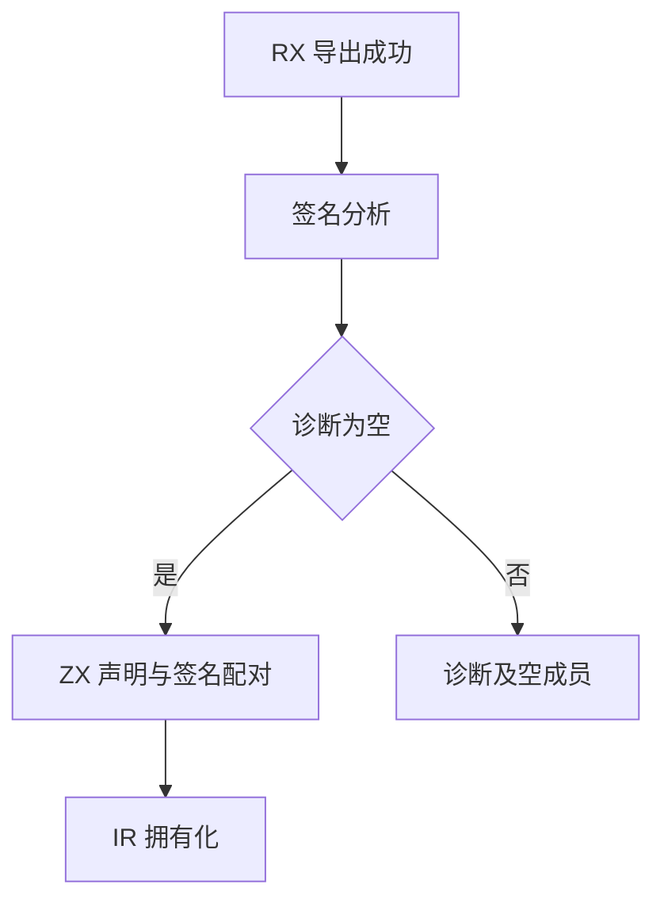
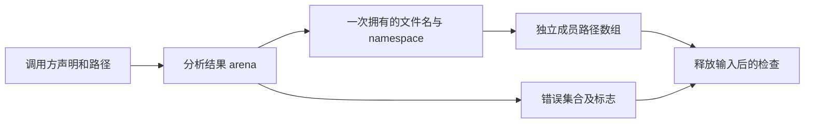

# 原生成员描述符边界

## IDEA

- Intent：验证新 RX/ZX 描述符迁移保留参数展开、错误集合、注入与并发标志、声明配对，以及多个函数共享已拥有前缀的生命周期。
- Data：固定参考 ca03326fa14a944d38770bfba2b1d19e6cd3f59e；成熟实现参考 native/signatures 与 typed_try/native_contract。既有 finite throws 测试已经覆盖 null 和空集合的单函数情况，本批重点补混合声明配对与共享前缀，避免重复制造计数。
- Edges：仅测试和注册；不修改编译器。原 namespace ReleaseSafe 全部终态后才启动新门禁，不推进任何已冻结工作树。共享字符串身份是本次明确优化的验收，独立成员路径数组仍需要分开。行为通过不证明完整自举。
- Answer：语义分组测试与草稿、输入身份、Debug/ReleaseSafe 实际结果、生成源码和二进制身份、英文 Conventional Commit 并 push。只在确认实现缺陷后通知指定聊天。

## 实施步骤

1. 复核 RX 签名诊断后的成功/失败分支，确认失败时不执行成员配对。
2. 区分零参数、单标量、单个 tuple 与多个参数，不根据最终 tuple 类型判断展开。
3. 在同一声明批次混合 infallible、unknown throws、empty finite throws、非空错误集合、allocator/io/process/concurrent 标志，检查每个名称绑定的完整元数据。
4. 动态分配声明、文件名和 namespace，分析后污染并释放输入，检查多函数结果字节与同接口前缀指针共享；成员路径列表保持独立。
5. 对成功批次及后置签名错误分别注入分配失败，准备输入在故障范围外，避免 Writer 错误转换遮蔽目标分配。
6. 先完成旧 namespace 批次，再冻结本批并运行门禁；两种模式终态后发布精确范围。

## 自我批判

指针相等只能验证当前承诺的共享关系，必须同时检查字节所有权；仅仅共享调用方指针并不正确。单函数已有测试不应重复作为新粒度成果，新的覆盖重点是跨声明配对、同一接口共享及失败短路。生成代码和 stage 审计缺失时，不宣称迁移职责全部自举。
