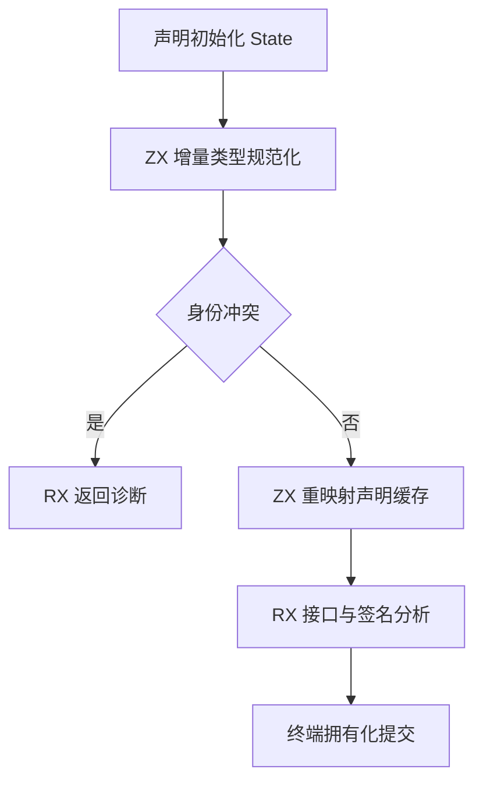
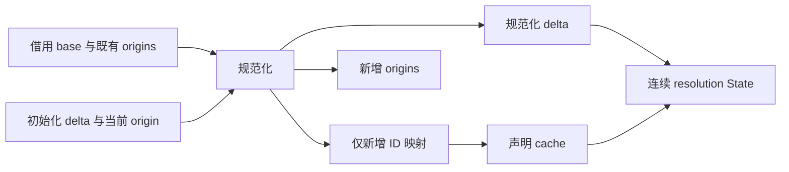

# 名义类型增量规范化

## Intent

将原生声明初始化后的名义身份规范化表达为普通 ZX 集合算法，再由 RX 连接声明初始化、规范化、缓存重映射和接口分析。最终撤除这条路径上的专用 Writer 调度，不复制既有类型表。

## Data

- resolve.zig 先执行初始化和宿主提交，再调用 shared_types.resolve；后者追加来源并执行 Pool.compact。
- 类型行按依赖拓扑顺序追加，旧前缀 ID 固定；所有新增引用可以使用已生成的增量映射。
- 名义类型是 Enumeration、NativeReference；身份包含来源 kind/owner/member 与 label。身份一致后仍比较内容。
- entries/row 已提供借用整列加 offset/count 的行视图，可用于比较，避免为每个候选切出临时数组。
- signatures/initial 当前重新建立状态；接入统一阶段时必须改为接收连续 State。

## Edges

- 本算法只接受编译器初始化产生的有效拓扑增量，不承担任意外部类型表的校验。
- base 与 base_origins 全程借用；仅输出规范化 delta、新来源与新增 ID 映射。
- 不为旧前缀生成 identity mapping。不拼接完整新类型表。
- 比较时按需重映射引用，命中已有行时不建立候选成员数组；未命中才追加成员到结果列。
- 字符串借用输入；一次终端拥有化提交仍是过渡状态边界。
- 不新增测试、不运行全量测试；集成后执行相关现有专项并检查生成产物的存储行为。

## Answer

先在名义增量草稿保存原子 ZX 算法，再接入正式生成链。验收包括真实 RX 阶段图、名义冲突诊断、连续 State、生成列存储复用和现有专项。草稿通过语法检查不代表接入完成或零复制已经验证。

## 自我批判

纯 ZX 语法不能单独证明零成本。尤其需要确认循环内输出列不会反复复制、结果字符串不会超过输入生命周期，并区分现有失败后部分提交行为与新流程的提交时机。本阶段未验证前不宣称消除了宿主状态边界。

## 生成器阻断与修复

草稿经 zxc 语义编译后，使用导出的 Zig 调用包装强制编译 execute，发现嵌套缓冲收尾写入只读字段（cannot assign to constant）。普通 state layout 的根可变不意味着嵌套 ABI 对象可变；原 finish 仅对跨函数缓冲或 fallback 重建对象，遗漏直接 push 的嵌套列。

修复统一规定：deep 内联状态可直接写字段；普通状态一律使用已有 writeback.replaceLayout 重建受影响路径，再赋给根状态。删除基于更新来源的 rebuild 标志。保留对象身份失效与路径重建契约，不做 constCast，不放宽借用校验。

验证结果：

- 主构建 36/36 步骤通过。
- 现有 test-loop-call-origins 专项 99/99 步骤、106/106 测试通过。
- 用新编译器重新生成 normalize.zx 与 normalize.rx，并通过导出的 Zig 调用包装强制编译 execute，均通过。仅 build-lib 模块而没有调用入口会受 Zig 懒分析影响，不能作为本次修复证据。
- 生成 normalize 的 append 调用传入全部八个非空容量 lane，普通字段收尾通过路径重建；仍存在描述符包装分配，不宣称零分配。
- 独立只读审查确认：重建保留路径外字段，路径上 ABI 对象重新构造；未启动容量时保持原身份；深层内联对象可直接写。没有新增测试用例。

草稿包含七个原子 ZX 文件（均不超过 120 行）与 normalize.rx，真实表达冲突短路、缓存与结果 ID 重映射。这是草稿阶段的验证记录；后续正式接入与剩余边界见下文及名义增量接入执行记录。

## 正式接入

- native/declarations.rx 复用 resolving/initial、initialize、declarations，返回连续 State。
- native/prepare.rx 表达声明诊断短路、shared 分支、名义规范化及 State 重组。
- native/analyze.rx 在准备成功后调用 interface.rx；interface 接收已有 State，导出读取其 cache，签名继续其 delta。
- native/interface.zig 只借用输入，调用统一生成模块，再提交结果；native/commit.zig 承接类型与新增 nominal origins 的终端拥有化。
- native.zig 的 generated 路径撤除宿主 resolution.initialize；seed 路径保留原实现。
- 失败分析不对外提供结果；统一流程只在全部分析成功后提交。与旧初始化诊断前可能提交部分状态不同，不承诺失败可继续使用 Types，不扩大为事务 API。
- 删除不再使用的 signatures/initial.zx；构建入口从 native/interface.rx 调整为 native/analyze.rx，不增加独立生成模块。

### 终端提交一致性

独立审查发现类型提交后再分配 origin 存在 OOM 不一致窗口。已调整为先 reserve 来源列并复制一次本接口 immutable origin，再提交类型/cache，最后 appendAssumeCapacity 发布来源。多个新名义类型共享同一 owned origin 字符串；Storage 不逐条释放字符串，由结果 arena 整体释放。type/cache 提交失败时释放未发布 origin；预留失败不改变列长度。

签名阶段只会新增结构类型：命名声明均已解析并命中规范化 cache，匿名枚举仍被拒绝。因此初始化阶段生成的 origin delta 覆盖所有新名义声明，不需要在签名后再次生成来源。
