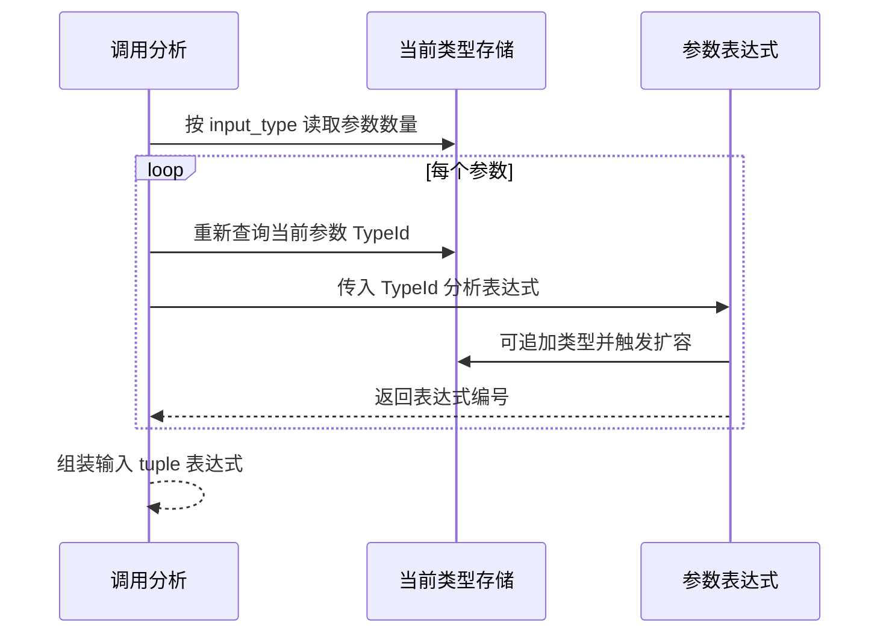

# 导入参数类型按编号读取

## Intent：最终目标

为 Project 共享类型存储消除跨模块参数切片借用，使导入记录在类型列扩容后仍只持有稳定编号；同时删除 artifact 为重复参数列分配和重映射的工作。

## Data：实现与验证

FunctionImport 删除 positional_types。Project 与 native artifact 创建导入时只填函数编号、输入输出类型编号及名字。调用从函数签名读取 expand_tuple，从当前 Types 读取输入 tuple 的长度；每轮参数分析前重新查询参数 TypeId。参数表达式可以触发类型存储增长，下一轮不再读取之前保存的切片。

artifact 根收集已经从输入类型递归标记 tuple 子类型，故删除独立参数根。artifact 构建不再单独分配参数编号数组。缓存恢复仍保留输入输出类型映射、函数签名与 External 一致性检查；原生缓存的 IR 验证仍要求 expand_tuple 的输入为 tuple。

既有 mixed artifact 用例的一条断言从“没有参数副本”改为“签名不展开参数”，未新增测试。

- 原生声明、module-artifacts、semantic-cache 三个既有专项：44/44 构建步，44/44 测试通过。
- 主构建：36/36 步通过。
- 上游 8ddf71d10 新增原生签名生命周期检查，合入后补跑原生声明专项：30/30 步、17/17 测试通过。一次补跑会话丢失终态且原进程已不存在，重新执行并从保存的日志取得退出 0，不将丢失终态计为通过。
- 九份代码草稿与正式源码逐字节一致。
- 未运行全量测试，未调用浏览器。

## Edges：边界

这是编译器内部导入与内存缓存结构的简化，不改变 ZX 语法、生成原生 ABI 或 IR External 字段。不新增运行时、动态加载或类型表副本。

当前 Project 仍使用完整表交接。Unit.program、compiled.Loaded 的历史类型视图、source/native/external/compiled/cache 的 owner 转交，以及缓存追加失败回退均尚未完成。当前修正不能证明整个 Project 已经零复制。

## Answer：交付与自我批判

交付调用分析、导入记录与 artifact/cache 的一致修改，并保留参数数量诊断和签名语义。

自审发现最容易遗漏的边界在调用分析内部：只把长期切片改成函数开始时的局部切片仍不安全，参数表达式自身可能触发扩容。因此实现保存数量和编号，每轮重新查询，不保存跨表达式的 tuple 视图。Arena 的整块释放策略也不能替代这个要求，因为 Allocator.free 会先使旧内存 undefined。

