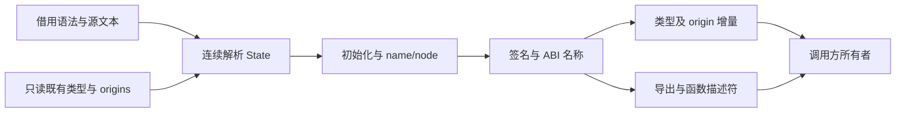
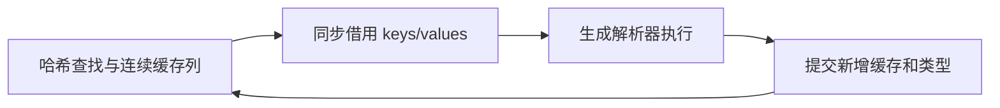
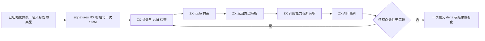

# 原生接口分析增量自举

## Intent：最终目标

将一次原生接口分析的完整语义流程迁入 RX/ZX：借用语法和既有类型，持续持有解析状态，完成初始化、共享名义身份、导出、全部函数签名及 ABI 名称分析，只向所有者发布增量。不得将几个检查迁移称作整个分析流程完成。

## Data：可用证据

基线 f8aeef742。modules/native.zig 的 analyzeView 仍决定 namespace、exports、参数/返回类型、void 输入、tuple、引用能力和函数描述符。

现有 resolving.State 已持有只读 context.base、自有 delta/cache/frame/scratch；run 结束不会清空已积累结果。声明循环已经演示 state 的连续复用。

当前开销与边界：

- semantic/resolution.zig 每次 named/node 请求都构造 Snapshot；Snapshot 逐次把 resolved HashMap 复制成名称和编号列。
- aliases 和 visiting 也由 Snapshot 转列。原生临时 Types 中二者为空；普通源码分析仍可能非空，不得宣称它们已全部零复制。
- native.analyzeView 一开始 appendDelta(existing)，复制已有类型列。
- shared_types.resolve 又复制 origins 与 existing prefix、合并新增名义类型、重映射 resolved。
- native.Result.types、缓存恢复及 Project.types 都以完整单表交接。只改生产者返回 delta 而不接通所有者，仍会在下一层重新拼表复制。
- native.load 的正式消费者为 Project.importNative 和 semantic_cache/native_artifact；缓存恢复还经 native_restore 及 link.Pool。

## Edges：边界与限制

- 不增加 nativeResolveName/nativeResolveNode 一类专用语义桥。复用普通 resolving、constructing/update、querying/contains、types/nominal/find 和 native_names。
- 类型已解析缓存需要哈希查找和连续列借用；采用标准库 ArrayHashMap 存储，不增加自有索引层。只在同步生成调用期间借用，提交增量后视图失效，不跨更新保留。
- TypeId 是 enum(u32)，编号列借用必须有编译期表示检查；不逐项重新编码。
- 类型表、共享 origins 与缓存对象的所有者必须明确。不能对借来的 const slice 猜测所有权后 constCast 成可增长容器；不能悄悄改变公共输入生命周期。
- 共享名义驻留必须保留 entry.key() 及 nominal label。原流程先完成声明解析再报告共享冲突；若改为构造时驻留，不能让较早共享冲突遮蔽后续语法/类型诊断。
- 当前阶段不改名义类型语义，不为绕过所有权问题只支持空 base 或缓存路径后宣称完整迁移。
- 不新增测试、不运行全量测试；按实际修改运行已有专项。

## Answer：实施次序与成功标准

1. 消除每请求 resolved 全列复制：密集存储、直接只读借用、提交后才允许增长。保留 seed 与 shared remap 行为。
2. 接通类型/名义增量所有者与结果消费者，明确缓存恢复、无缓存加载和初始外部 context 的生命周期，不让拼表复制换位置。
3. 让一个解析 State 贯穿接口全部 name/node 请求，消除逐请求 snapshot/commit 编排。
4. 将剩余阶段迁入 RX 编排与 ZX 原子逻辑，宿主只保留数据借用、必要的字符串拥有化和 IR 布局包装。
5. 检查真实生成入口的数组复用、临时记录、字符串及结果生命周期，保持原诊断顺序，英文提交并推送阶段交付。

第一阶段成功不等于完整流程完成。执行记录须分别说明已消除的复制与剩余职责。

## 连续签名阶段实施调整

当前先实施步骤 3、4 中完整函数签名部分，再接通步骤 2 的统一所有者。依据是 Project、缓存恢复、编译库和普通源文件仍共同使用完整 TypeTable；仅改 native.Result 为 delta 会转移拼表复制，不能作为步骤 2 的完成。

函数签名阶段采用一个 RX 入口与连续 resolving.State：按原函数顺序完成参数解析、void 检查、tuple 构造、返回值解析、引用能力与所有权检查、ABI 名称分析。解析直接复用现有 frame/run、constructing/update、querying/contains、native_names，不新增原生类型解析专用宿主。

声明初始化和共享名义合并仍先执行；导出的名称在初始化时已全部解析，直接取 resolved 编号，不再次运行解析器。函数签名只在全部成功后将积累的类型 delta 提交一次。宿主仅借用 parser 列、包装上下文、拥有化最终名称并组装 IR。

诊断顺序保持为每个函数的全部检查先于下一个函数。特别保留 ABI 名称校验位置，避免后续函数的类型错误遮蔽前面函数的匿名数组元素错误。seed 路径保留现有逐项语义实现，用于生成编译器自身；正式 generated 路径必须接通新入口，不能仅新增未使用的源码。

自审边界：这一阶段消除的是函数间与参数间的宿主 snapshot/execute/commit，既有类型前缀和 shared origins 的复制仍未解决。构建、诊断顺序与生成代码的实际分配行为需要分别核对，不能从 ZX 的值语义直接推断生成结果没有额外分配。
