# 原生接口分析增量自举

## Intent：最终目标

将一次原生接口分析的完整语义流程迁入 RX/ZX：借用语法和既有类型，持续持有解析状态，完成初始化、共享名义身份、导出、全部函数签名及 ABI 名称分析，只向所有者发布增量。不得将几个检查迁移称作整个分析流程完成。

## Data：可用证据

基线 f8aeef742。modules/native.zig 的 analyzeView 仍决定 namespace、exports、参数/返回类型、void 输入、tuple、引用能力和函数描述符。

现有 resolving.State 已持有只读 context.base、自有 delta/cache/frame/scratch；run 结束不会清空已积累结果。声明循环已经演示 state 的连续复用。

当前开销与边界：

- semantic/resolution.zig 每次 named/node 请求都构造 Snapshot；Snapshot 逐次把 resolved HashMap 复制成名称和编号列。
- aliases 和 visiting 也由 Snapshot 转列。原生临时 Types 中二者为空；普通源码分析仍可能非空，不得宣称它们已全部零复制。
- native.analyzeView 一开始 appendDelta(existing)，复制已有类型列。
- shared_types.resolve 又复制 origins 与 existing prefix、合并新增名义类型、重映射 resolved。
- native.Result.types、缓存恢复及 Project.types 都以完整单表交接。只改生产者返回 delta 而不接通所有者，仍会在下一层重新拼表复制。
- native.load 的正式消费者为 Project.importNative 和 semantic_cache/native_artifact；缓存恢复还经 native_restore 及 link.Pool。

## Edges：边界与限制

- 不增加 nativeResolveName/nativeResolveNode 一类专用语义桥。复用普通 resolving、constructing/update、querying/contains、types/nominal/find 和 native_names。
- 类型已解析缓存需要哈希查找和连续列借用；采用标准库 ArrayHashMap 存储，不增加自有索引层。只在同步生成调用期间借用，提交增量后视图失效，不跨更新保留。
- TypeId 是 enum(u32)，编号列借用必须有编译期表示检查；不逐项重新编码。
- 类型表、共享 origins 与缓存对象的所有者必须明确。不能对借来的 const slice 猜测所有权后 constCast 成可增长容器；不能悄悄改变公共输入生命周期。
- 共享名义驻留必须保留 entry.key() 及 nominal label。原流程先完成声明解析再报告共享冲突；若改为构造时驻留，不能让较早共享冲突遮蔽后续语法/类型诊断。
- 当前阶段不改名义类型语义，不为绕过所有权问题只支持空 base 或缓存路径后宣称完整迁移。
- 不新增测试、不运行全量测试；按实际修改运行已有专项。

## Answer：实施次序与成功标准

1. 消除每请求 resolved 全列复制：密集存储、直接只读借用、提交后才允许增长。保留 seed 与 shared remap 行为。
2. 接通类型/名义增量所有者与结果消费者，明确缓存恢复、无缓存加载和初始外部 context 的生命周期，不让拼表复制换位置。
3. 让一个解析 State 贯穿接口全部 name/node 请求，消除逐请求 snapshot/commit 编排。
4. 将剩余阶段迁入 RX 编排与 ZX 原子逻辑，宿主只保留数据借用、必要的字符串拥有化和 IR 布局包装。
5. 检查真实生成入口的数组复用、临时记录、字符串及结果生命周期，保持原诊断顺序，英文提交并推送阶段交付。

第一阶段成功不等于完整流程完成。执行记录须分别说明已消除的复制与剩余职责。

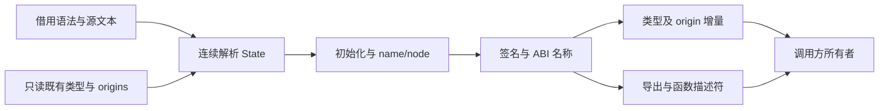

## 连续签名阶段实施调整

当前先实施步骤 3、4 中完整函数签名部分，再接通步骤 2 的统一所有者。依据是 Project、缓存恢复、编译库和普通源文件仍共同使用完整 TypeTable；仅改 native.Result 为 delta 会转移拼表复制，不能作为步骤 2 的完成。

函数签名阶段采用一个 RX 入口与连续 resolving.State：按原函数顺序完成参数解析、void 检查、tuple 构造、返回值解析、引用能力与所有权检查、ABI 名称分析。解析直接复用现有 frame/run、constructing/update、querying/contains、native_names，不新增原生类型解析专用宿主。

声明初始化和共享名义合并仍先执行；导出的名称在初始化时已全部解析，直接取 resolved 编号，不再次运行解析器。函数签名只在全部成功后将积累的类型 delta 提交一次。宿主仅借用 parser 列、包装上下文、拥有化最终名称并组装 IR。

诊断顺序保持为每个函数的全部检查先于下一个函数。特别保留 ABI 名称校验位置，避免后续函数的类型错误遮蔽前面函数的匿名数组元素错误。seed 路径保留现有逐项语义实现，用于生成编译器自身；正式 generated 路径必须接通新入口，不能仅新增未使用的源码。

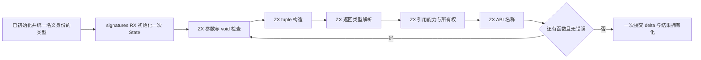

自审边界：这一阶段消除的是函数间与参数间的宿主 snapshot/execute/commit，既有类型前缀和 shared origins 的复制仍未解决。构建、诊断顺序与生成代码的实际分配行为需要分别核对，不能从 ZX 的值语义直接推断生成结果没有额外分配。

## 共享初始化所有者实施

shared_types.resolve 当前把既有 origins 复制到 declared，再把类型前缀复制到新 Pool。改为先向现有 origin owner 追加本轮来源，保存完整源视图，然后将类型与 origin 两套存储明确转交 Pool；只缩短已使用长度，保留容量，在原列上向前合并。

该路径沿用 appendFrom 的完整类型验证。合法 TypeTable 的结构契约已经要求各类 payload 连续、无空洞、无复用且覆盖整列，不能把类型拓扑合法与任意 payload 布局混为一谈。每源行最多产生一个目标行，保留行的 payload 数量不扩张，当前行与重映射后的引用在写入前已经读完。由此目标写入不会超过当前源行，也不会触发列增长或覆盖未来数据。

origin 的既有前缀保持原顺序，本轮 tail 由现有 produce 按 source row 递增追加。preflight 在修改数据之前保存 type ID 到源 origin 下标的映射。目标 origin 游标不超过本轮已读取的源 origin 游标；来源字符串在 append 前已复制。

失败分两段处理：staging origins 失败只退回新增长度；Pool 接管后无条件交回当前所有者。压缩失败丢弃未发布尾段，只保留原前缀，不能恢复源表原长度伪装回滚。resolved 编号只在整个合并成功后更新。不得通过借来的 const slice 猜测所有权或容量。

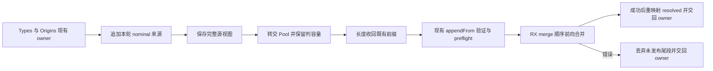

边界：此阶段消除 shared merge 中的整前缀列复制，不消除 native 开始 appendDelta(existing) 的复制，也没有把所有语义迁入 ZX。源与目标别名只在这个明确拥有整列容量的 compact 入口开放，普通 appendFrom 不获得任意别名写入承诺。

## Project 共享存储前的引用边界

### Intent：最终目标

继续消除跨模块整表复制。首先让函数导入记录只保存稳定编号，避免共享类型存储增长后留下参数类型切片；后续再统一 Project 的类型 owner 与缓存追加回退。

### Data：可用证据

当前 Zig 标准库 ArrayList.ensureTotalCapacityPrecise 在无法原址 remap 时分配新内存、复制已用项并调用 Allocator.free。Allocator.free 在进入 ArenaAllocator.free 之前先将字节设为 undefined。因此 Arena 未实际回收旧区域，不代表旧 TypeTable 或 TypeIds 视图有效。

FunctionImport.positional_types 重复表示函数签名的 input_type tuple；是否展开已由 Function.external.expand_tuple 表示。artifact 根收集本来就遍历 input_type 的所有子类型，缓存恢复的 sameExternal 本来就比较 expand_tuple。删除这份重复状态可以同时消除悬空引用与 artifact 参数列复制。

### Edges：边界与限制

- 调用分析不能在整个参数循环中持有 tuple 切片：分析任一参数可能追加类型。保存参数数量，每轮按 input_type 从当前 Types 重新读取参数 TypeId。
- FunctionImport 是编译器内部导入与内存 artifact 元数据；不修改 ZX 语法、原生 ABI 或 IR External 的公开字段。现有一处测试断言需改为检查签名的展开语义，不新增用例。
- 删除参数副本校验后，保留原有 IR tuple 校验、类型重映射校验和 external 签名一致性校验。
- 本阶段尚不改变 Project 存储所有权，历史 Program.types 及 compiled.Loaded.types 仍需后续处理。
- grit apply --help 的支持语言列表没有 Zig，本轮按职责使用精确文本修改并检查 diff。

### Answer：交付与成功标准

移除生产代码全部 positional_types 引用；既有原生调用、模块 artifact 与缓存专项通过。只运行相关专项和编译，不运行全量测试。

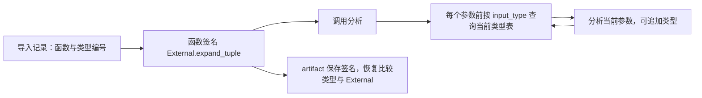

自审要求：删除冗余切片只是共享存储的前置修正，不得据此声称整个 Project 已经零复制；仍需完成 owner 迁移、旧表引用处理和缓存失败回退。

## Project 唯一类型 owner 与恢复回退

### Intent：最终目标

使 Project 在整个模块图分析期间持有唯一 TypeStorage，source、native、external、compiled、缓存恢复仅交接其元数据并追加新增行，不再复制已有类型前缀。

### Data：实现依据

导入参数已经按稳定编号查询。Unit 的依赖消费者只需编号和导出，缓存 compiled.Loaded 后实际只读取 exports；这些缓存可以不保存历史 TypeTable。Analyzer.finish 当前会把列缩成 owned slice，下一轮无法保留容量；调整为发布 view，存储仍由分析 arena 持有。契约子分析当前每条复制整个 owner 类型表再交回，也必须改为明确转交。

### Edges：边界与限制

- 只读公共 Context 的独立结果生命周期保留：由 type_table.storage 对外部输入拥有化一次，内部直接接管新 storage，不再先生成 Table 再复制整列。
- compiled.load 仍供 library 与 RX 调用，保留只读入口；新增供 Project 使用的明确 owner 入口，二者共用加载实现。
- source/native/external 失败终止整次 Project 分析，defer 负责交回当前容量；缓存不匹配会继续分析，必须在错误返回之前把八列类型和 origins 的长度退回进入时位置。前缀本身不修改。
- 旧 Program 缓存在保存时清空 types，读取时绑定当前 owner 视图；compiled 缓存只存 exports。返回给外部的最终 Program 使用 owner 当前视图。
- 不能从 const Table 猜测 capacity，不能靠 Arena 保证旧 slice 有效，不引入专用 allocator 或保留全表副本。
- 本轮是已有宿主存储所有权修正，仍为待迁入 RX/ZX 的过渡实现，不宣称完成自举状态模型。

### Answer：交付与成功标准

按 source、native、external、compiled、cache 入口核查代码，内部接入既有类型的 appendDelta 消失；适配原有签名、缓存命中/失配、模块及 library 专项，不新增用例、不运行全量测试。执行记录分别报告公开边界的一次拥有化、动态数组必要扩容和已消除的模块间重复复制。

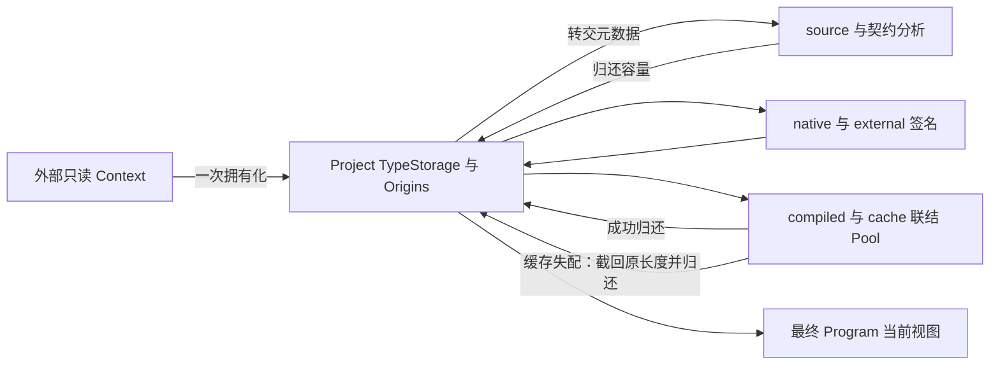

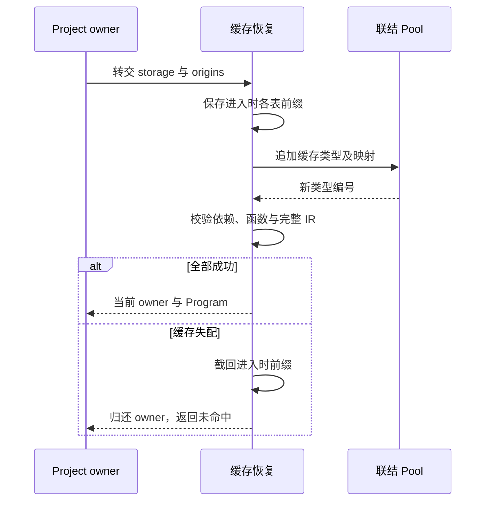

## 命名空间校验与签名短路阶段

### Intent

把原生接口命名空间规则迁入 ZX，由 RX 显式连接初始化、命名空间校验和函数签名分析，并表达失败短路。

### Data

- 当前 `native.zig` 在类型初始化后、函数签名前检查 namespace，各段必须非空、无 NUL、UTF-8 合法；空 namespace 列表合法。
- `frontend/lexer/utf8/validate.zx` 已有 UTF-8 校验算法，可直接复用。
- `std:encoding.encodeUtf8` 会先抛出 InvalidUtf8，不能用它将待校验 namespace 转成字节；适配器应借用原始 `u8[][]`，确保非法字节进入正常诊断路径。
- 导出名称仍由宿主哈希表解析；未来迁移必须保持哈希索引，不能改成每项遍历完整缓存。

### Edges

- 本阶段不宣称原生接口职责已完整自举。导出构造、函数描述符、类型初始化宿主协调仍待迁移。
- 保持 seed 路径及现有诊断文本、代码和位置；正式生成路径移除重复宿主规则。
- 输入字节列借用，校验仅遍历，不复制 namespace。ZX 文件不超过 120 行。
- 不新增测试用例、不运行全量测试、不进行浏览器检查；复用原生声明专项并构建。

### Answer

将 `signatures.rx` 扩展并更名为 `native/interface.rx` 作为真实接口阶段入口，签名算法继续位于 `signatures/`；适配器及生成槽使用 interface 命名。草稿镜像与执行记录放同目录。验收检查 RX 分支、生成入口依赖、现有专项结果和本轮 diff。

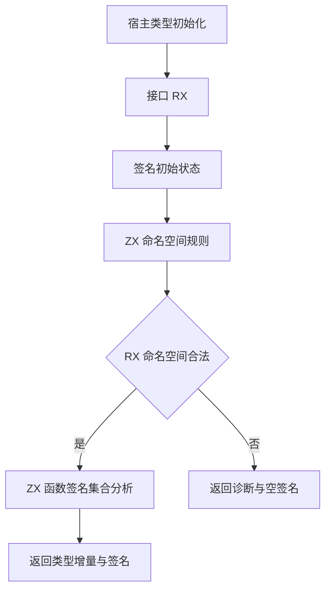

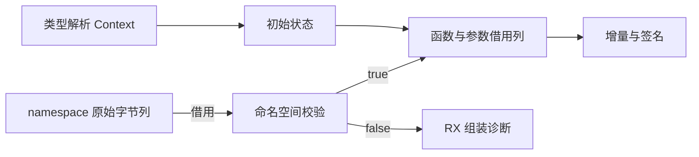

## 原生导出索引与提取阶段

### Intent

将声明到公开类型导出的规则迁入 ZX，并在接口 RX 中显式连接索引构建、导出提取和函数签名分析。

### Data

`Snapshot.resolved` 借用 Types 的名称和编号列；当前宿主按源声明顺序执行哈希查找。现有 resolving/lookup 是线性扫描，不适合逐项生成全部导出。native/validation/slot 已有字符串哈希与开放寻址算法。

### Edges

- 新索引只保存 borrowed resolved 列的位置，不克隆名称字节或 TypeId 列。
- 从已有命名校验抽出同一哈希计算，索引采用半载荷以下的开放寻址；期望线性构建、常数查找，仍需完整名称比较解决冲突。
- 空声明和空缓存不得执行模零。若初始化契约异常导致声明无对应类型，返回内部 contract 诊断，不默认 type_id=0。
- 维持 namespace 失败优先、导出按源顺序、seed 行为和类型稳定编号。
- 宿主仅拥有化返回行，保留 seed 的旧规则；IR 函数描述符及整体宿主协调仍待迁移。
- 不新增测试用例，不做全量测试；复用原生声明和模块产物专项，完成主构建。

### Answer

代码先存 `导出索引草稿/` 再写生产文件；执行记录记录最终验证和自我复核。验收核对 RX 显式阶段、输入列借用、空索引与冲突处理、声明顺序及生成产物调用关系。

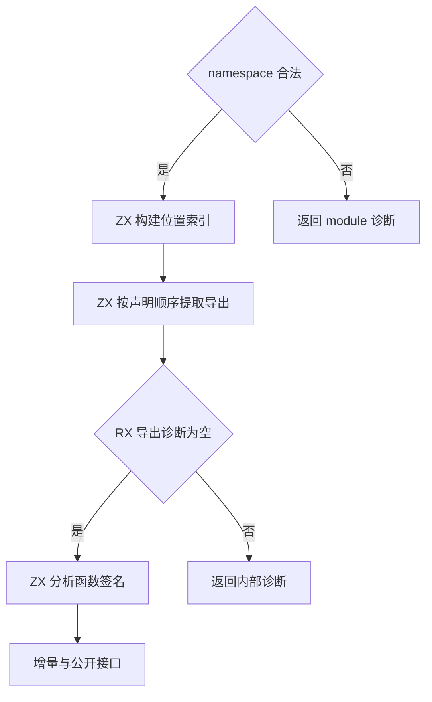

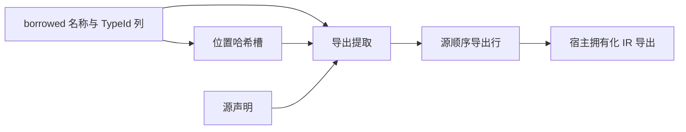

## 原生函数描述符阶段

### Intent

把原生函数声明与已验证签名配对的规则迁入 ZX，RX 在签名成功后显式生成成员描述符；宿主收束到 IR 表示与生命周期拥有化。

### Data

- native.zig 当前从 view.functionAt 读取错误集合和注入标志，并决定 parameters.len > 1 时展开元组。
- parser Function 已包含 count、errors_present、first_error/error_count 和全部调用标志，错误名以 Span 列存储，可借用后由 ZX 提取。
- 当前每个成员都复制 entry.path 与 namespace 各段；这些字节在同一结果 arena 中可以共享一次拥有化。

### Edges

- 只有签名诊断为空才能生成成员，否则部分 signatures 不足以与全部声明按索引配对。短路必须在 RX 中表达。
- 保留 errors=null 与 errors=[] 的区别；参数数目决定 expand_tuple，不能用 input 类型是否 tuple 替代（一个 tuple 参数不可展开）。
- ABI 类型名称、错误名和函数名在解析 scratch 释放前拥有化；文件名与 namespace 前缀只拥有一次，成员路径列表仍独立。
- seed 保留引导用规则。宿主解析状态、类型初始化及 IR 表示适配仍是后续迁移内容，不宣称完整职责已自举。
- 不新增测试用例，不运行全量回归；复用原生声明、模块产物和原生运行专项及主构建。

### Answer

代码先写 `成员描述符草稿/`，再写生产文件。验收核对 RX 失败分支、ZX 描述符语义、共享前缀的实际所有权、现有专项和生成产物。记录继续按 IDEA 分工。

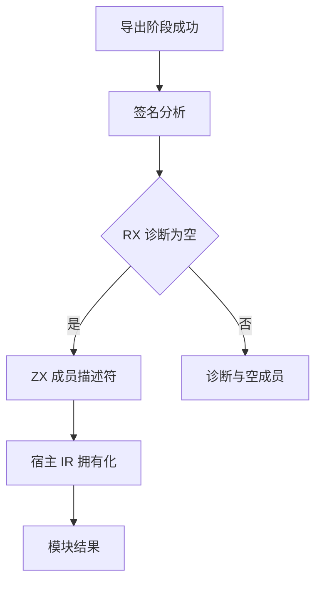

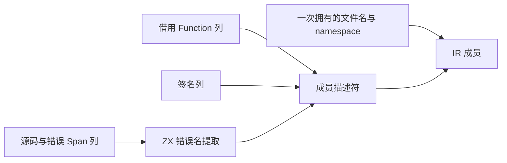

### 描述符迁移发现的通用生成缺口

- 证据：首版成员列表每次 push 都生成 alloc(len+1)+memcpy，错误名 optional-list 返回也未进入循环消费优化；原生专项 122/122 通过不能证明性能合格。
- ZX 回调禁止捕获外部变量，移出循环状态的尝试被明确拒绝，恢复显式参数，不增加隐式闭包能力。
- genz 的 iteration_consumer 把“适合内联列表布局”同时当作“可以消费循环结果”的门禁，导致普通对象列表的直接投影没有进入已有容量缓冲区。
- 修正：保留内联布局自己的 eligibility；对非捕获、直接列表投影允许进入普通 consume 路径，继续使用既有局部调用、状态表示、借用与缓冲区安全检查。普通对象元素保留指针身份，不强制内联或复制对象。
- iteration 的本地内联入口按 consumer candidate 再判断，不把新增普通列表投影送进仅支持基础元素的内联结果转换。
- 错误名提取只返回名称列表，是否为 null 由成员描述符按 errors_present 决定，避免把存在性规则与提取算法混在同一返回形状中。
- 配套执行已有 test-loop-call-origins 验证共享别名、调用结果身份及原生循环效应，不增加针对性用例。
