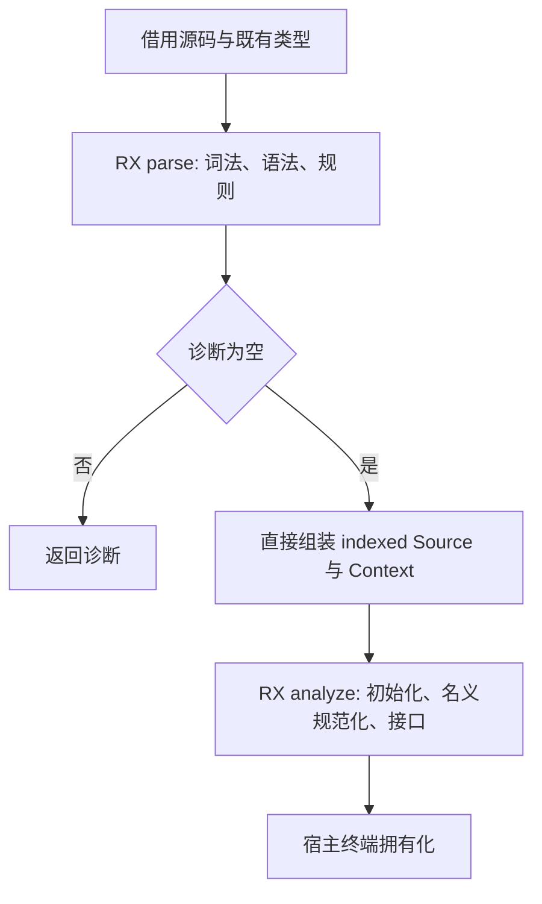
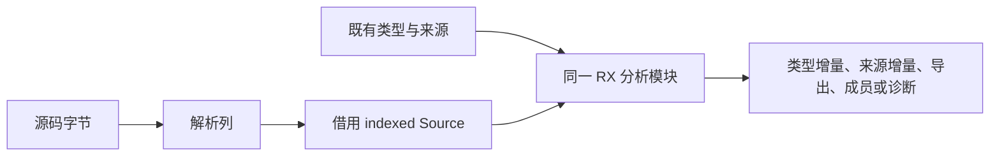

# 原生接口统一 RX 入口

## Intent

将源码解析、声明校验和完整接口分析交给同一个 RX 入口；宿主仅承担输入借用、结果拥有化与外部诊断位置报告。

## Data

此前 parse.rx 与 analyze.rx 分别生成模块；native.zig 调解析、创建 Indexed view，再由 interface.zig 经 Source/Snapshot 组装 Context 调分析。新 native/load.rx 直接用解析列构造 Source.indexed，调用 analyze.rx。

## Edges

- 源码保持 u8[] 借用，types/order/declarations/members/functions/parameters/errors 直接引用解析结果。
- 语法或声明规则诊断短路，不执行类型初始化、名义合并或签名分析。
- 该入口每次创建新的本模块名称缓存和访问状态；既有类型表及名义来源来自宿主借用。
- seed 实现仍保留，单独放在 native/seed.zig；仅删除正式路径不再需要的 Indexed 视图。
- 删除独立 generated_native 的生成槽、ABI、注册，不重复生成解析模块。
- 终端存储与输出拥有化仍为过渡 Zig 边界，不宣称整套自举完成。

## Answer

先保存对应代码草稿，再更新正式代码。验收包括生成模块的真实阶段调用、诊断顺序、共享列借用、主构建与原生相关专项。不新增测试、不运行全量测试、不调用浏览器。

## 自我批判

入口统一必须真实撤除宿主阶段切换，而不能只新增一个 RX 包装层。Source/Snapshot 的删除只适用于本模块新建缓存的契约，不能顺手删除其他解析路径仍在使用的通用适配器。最终拥有化及描述符分配仍要分别说明。
