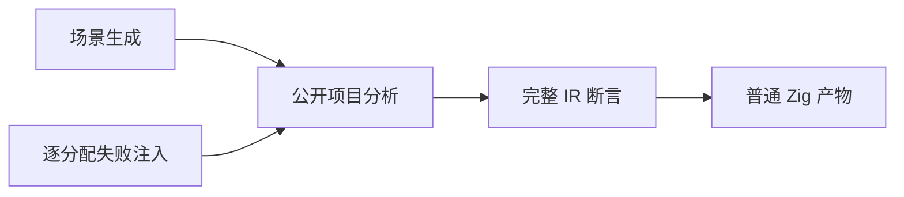

# 原生签名批处理生命周期

## IDEA

- Intent：为最新原生签名自举与借用类型缓存补充细粒度生命周期、跨声明一致性和失败清理测试。
- Data：固定执行提交 e42668e4713aac0326ec0a711f6faf3928cce401；签名实现使用临时 arena，一次解析全部函数后复制名称；类型缓存借用 names/ids 列。成熟样例为 native/declarations_test.zig 与 references/ir/name_columns。
- Edges：仅修改测试与一处测试注册；不修改编译器，不重新启动仍运行的旧完整 ReleaseSafe；分配失败由现有 allocation_testing 驱动；不增加运行库、不调用浏览器。公开分析结果仍由 AnalysisResult 管理，测试不访问已释放内存。
- Answer：测试草稿、正式测试、Debug/ReleaseSafe 日志与输入 SHA、实际执行证据、英文 Conventional Commit 和 push；发现确认实现缺陷才通知实现聊天。

## 执行步骤

1. 根据公开 project.analyze API 生成有多条声明的原生接口；全部函数均由主程序调用，避免仅检查未使用声明。
2. 覆盖零参数、标量、嵌套命名对象、多参数 tuple；比较每个调用的完整名称列及输入形状。
3. 用长别名链和连续函数扩容缓存；重复独立分析并发出 Zig 产物，观察临时签名 arena 已退出后的结果。
4. 在有效声明之后加入未知输出类型，检查诊断路径；对成功和失败运行逐分配故障注入。
5. 全部执行输入固定后运行两种模式；同批进程全部终态前不修改输入。保存原始日志、编译及二进制身份。仅发布拥有的路径。

## 架构图

## 数据流图

## 自我批判标准

公开项目测试可证明结果在内部临时 arena 退出后有效，不能证明所有可能的内存地址复用。长链、批量声明和失败注入提高覆盖，不能宣称全部原生生命周期或 Test262 已完成。测试计数只记录真实 gate 输出，缓存步骤不重复计数。
