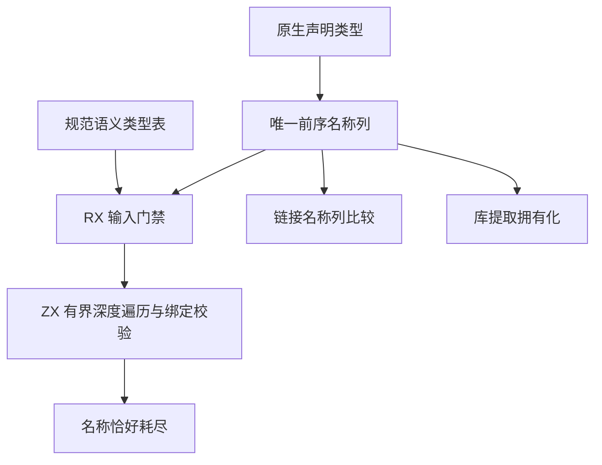
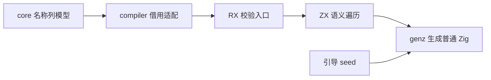

# 原生输入名称列与校验自举

## Intent：最终目标

移除 NativeType 中与规范 TypeTable 重复的递归树，只保留按语义类型前序排列的可选原生别名。校验借用名称列与类型表，由 RX 显示边界门禁、ZX 执行有界深度遍历；不在每次调用前构造临时类型树或复制输入。

## Data：可用证据

基线 1eefda14。core/ir.zig 的 NativeType 只有 name 与 children；genz 的 external、types、type_bundle 根据函数 TypeId 和模块绑定生成 ABI，不消费 NativeType。native_type.zig 将 children 数量和顺序逐项与 TypeTable 核对，因而拓扑没有独立信息。

仍需保留的独有信息是别名选择：构造器将最外层 named 名称覆盖到同一个节点；IR 校验匹配模块中的 (TypeId, name)，链接要求名称选择一致。link/build.zig 和 semantic_cache/restore.zig 两个 sameExternal 调用点均先确认映射后的输入输出 TypeId 一致，名称列比较可以沿用这项前置条件。

## Edges：边界与限制

- 保留 null 与空名称的区别、单参数直接根、零或多参数的合成根、对象字段字典序与最外层别名覆盖规则。
- 校验保持深度达到 256 时失败，task 拒绝，native_reference 必须有名称；必须恰好消费全部名称，缺失与多余均拒绝。
- 遍历工作栈是算法状态，不复制输入。单次树遍历 O(N)，栈 O(depth)；名称绑定匹配暂沿用逐绑定扫描，完整成本仍包含 O(N×B)，不夸大复杂度。
- 库与缓存持久格式随 IR 版本升级拒绝旧结构，不能把旧递归对象静默解析为默认名称列。
- 库提取跨 owner 的必要名称拥有化仍须保留，不能返回旧 arena 字符串。
- 本阶段先统一表示并迁移校验；原生声明名称构造与模块宿主仍是明确后续迁移项，不把去掉递归结构称作整个职责完成。
- 不新增测试，不执行全量测试。现有变异夹具只改等价的数据表达，保留断言。

## Answer：实施与成功标准

规范模型：

```zig
pub const NativeType = struct {
    names: []const ?[]const u8 = &.{null},
};
```

1. 构造器直接追加前序名称列，不先创建旧树再展平；库提取与链接直接消费同一列。
2. RX 输入门禁后调用 ZX 有界 DFS；类型拓扑唯一来自 TypeTable，名称位置与语义节点一一对应。
3. 引导 seed 的校验同步新表示，正式生成路径不回调 seed。
4. 构建与既有 native reference、库链接专项验证；检查生成结果的借用输入与工作栈行为，记录实际局限。





本次是跨模型、构造、校验与构建接线的职责迁移，不是同一函数替换模式；不以批量文本替换代替语义修改。
