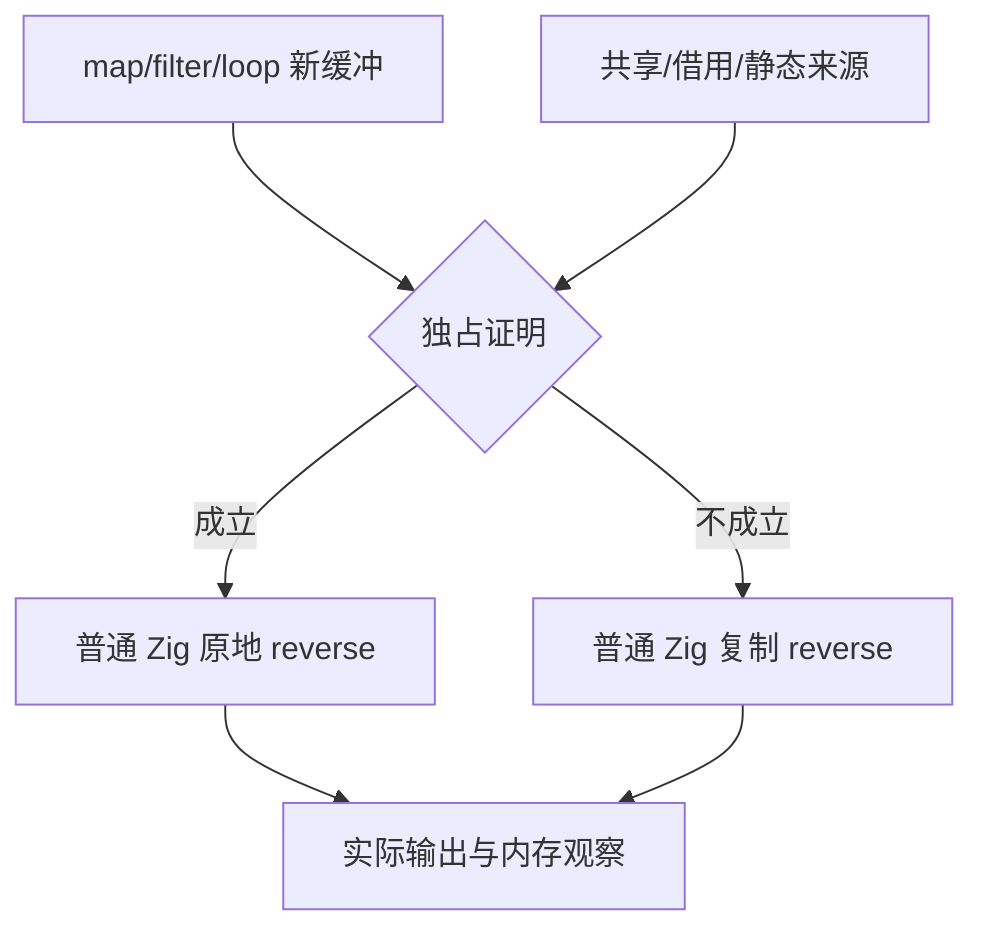
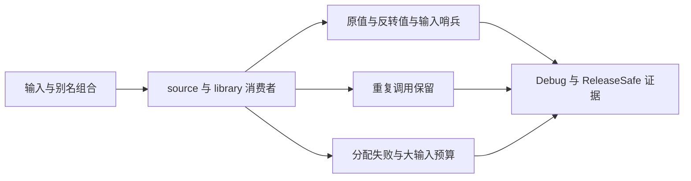

# 反转独占与别名边界

## Intent：最终目标

覆盖最新通用 reverse 独占缓冲复用的语义和资源边界，确保它在没有借用或别名时复用，并保持共享列表、调用者输入与静态常量不可变。补充实现会话专项之外的独立测试。

## Data：可用证据

93e04422 新增 collections/ownership 的图证明并在 reverse 时选择 constCast；map/filter、字段、元组、scope 和 iteration 是可回溯路径，多个引用、未知来源、借用及非空静态列表不应直接修改。现有反转、表达式准备和循环缓冲门禁通过，但没有本部分的十种来源/别名组合。

沿用已有编译测试工具的 source 与 library 新消费者路线，旧提供者释放、编码缓冲填毒后仍须保持结果。新增十份短 ZX：map/filter 独占和共享、调用者借用、静态字面量、对象和元组路径、循环独占和共享。输出统一为 original/reversed，由独立 Zig 期望计算器核对值和调用者完整边界。

## Edges：边界与限制

只新增测试与构建登记，不修改生产证明或放宽断言。共享路径要保留未反转值，独占路径仍保护输入。重复执行时第一份结果必须保持；非空与空执行做逐分配点失败清理。所有 ZX 低于 240 行，循环算法保留在 ZX，不制造 RX 包装。

资源预算先限定 primitive map 独占反转：大输入应不需要第二份完整 payload；同时核对值、输入与释放。不能把这个预算扩大到 filter/loop 的全部增长成本，也不能以字符串搜索生成源码替代真实资源检查。若预算失败，先核对测量与生成路径，区分实现缺陷、优化能力边界和测试假设错误。

固定 973216e9 的独立检出加草稿，两个模式执行新完整门禁；原 test-list-reverse、test-expression-preparation、test-iterate-buffer 另行执行作为回归。源码冻结至全部终态。仅确证当前生产问题才通知指定实现会话。

## Answer：交付格式与成功标准

交付分层测试、完整草稿、IDEA 记录、架构图/数据流图、源身份、实际日志、生成模块、执行检查及资源测量证据。成功必须值语义、输入保护、旧结果保留、分配失败释放和限定资源预算都成立。完成部分后英文 Conventional Commit 提交 push，不用局部通过宣称全部对齐完成。

