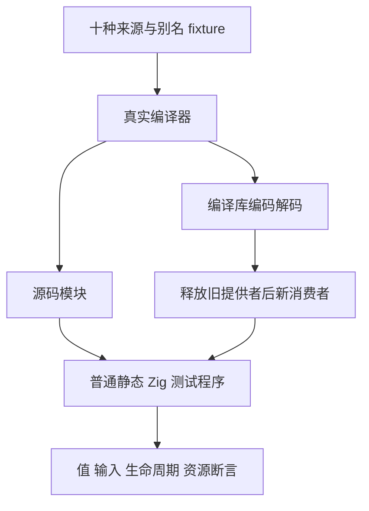
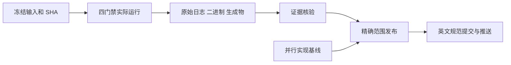

# 反转独占与别名边界执行记录

## Intent：最终目标

为 `93e04422` 引入的 reverse 独占缓冲复用补充独立语义、生命周期和资源测试。验证共享或借用来源仍保留原值，独占来源反转正确；不修改生产实现，不把优化等同于一般内存证明。

## Data：可用证据

执行检出固定在 `973216e901f4b561ce2cc279dc58bbcae5b3b5f9`，加 16 份测试与构建草稿，合计冻结 5,523 个输入。`开始基线.json` 保存逐文件 SHA-256；最终快照位于 `/tmp/zxc-reverse-ownership-source-973216e9-bounds-fixed`。独立检出为 `/Users/xiewendao/.codex/worktrees/reverse-ownership-conformance/zxc`，执行目录为其 `packages/test`。

十份 ZX 覆盖 map 独占/共享、filter 独占/共享、调用者借用、非空静态字面量、对象字段、元组字段和 loop 独占/共享。每份经源码消费者与编译库新消费者执行，库路线先编码、解码，再将旧编码缓冲填毒并释放旧提供者，随后生成新消费者。没有新增运行库。

独立 Zig 期望计算器核对 `original` 与 `reversed`。输入前后带哨兵；第二次调用后再次检查第一次结果。非空和空输入分别执行逐分配点失败清理。映射边界使用 `maxInt(i64) - 1`，加一后精确到达最大值；未映射来源直接检查最大值。

| 门禁             | 构建步骤 | 原生检查 | 实际执行二进制 |
| ---------------- | -------- | -------- | -------------- |
| 新增 Debug       | 97/97    | 102/102  | 22             |
| 新增 ReleaseSafe | 97/97    | 102/102  | 22             |
| 原有 Debug       | 117/117  | 212/212  | 22             |
| 原有 ReleaseSafe | 117/117  | 212/212  | 22             |

总计 628 项检查、88 次原生二进制执行。原有范围为 `test-list-reverse`、`test-expression-preparation`、`test-iterate-buffer`。新增测试运行步骤显式禁用结果缓存；四份日志中的全部 22 条原生运行摘要均实际通过。缓存的编译/选项等构建摘要分别为新增 44 条、原有 35 条，不能再算作执行次数。

每份门禁保存真实 verbose 命令、二进制 SHA-256、编译 root 与运行二进制的对应、生成源码及 ABI 的哈希副本。每份都有一条正式编译工具的 `generated_parser = true` 选项身份。`核验执行证据.py` 检查冻结输入、日志、二进制、生成物、计数和资源预算；最终返回 0。工具及归档版本见 `工具身份.json`。

primitive map 独占反转测量如下，两个编译模式、两条消费路线均相同：

| 元素数 | payload 字节 | 总申请字节 | arena 容量字节 | 两份 payload 上限 |
| ------ | ------------ | ---------- | -------------- | ----------------- |
| 2,048  | 16,384       | 24,648     | 24,624         | 32,768            |
| 16,384 | 131,072      | 196,680    | 196,656        | 262,144           |

测试检查总申请量严格小于两份完整 payload，并核对精确值、调用者输入及销毁后申请/释放总量相等。资源预算未放宽。

复现命令如下；先按 `工具身份.json` 为 PATH 加入 Zig/Z3 目录，并设置 `ZXC_TEST_SOLVER` 为其中记录的绝对路径。运行位置必须为上述独立检出的 `packages/test`：

```sh
zig build test-reverse-ownership \
  -Doptimize=Debug \
  -Dzig-archive=/tmp/zig-x86_64-macos-0.17.0.tar.xz \
  --cache-dir /tmp/zxc-map-observations-debug-cache \
  -j1 --verbose --summary all

zig build test-list-reverse test-expression-preparation test-iterate-buffer \
  -Doptimize=Debug \
  -Dzig-archive=/tmp/zig-x86_64-macos-0.17.0.tar.xz \
  --cache-dir /tmp/zxc-map-observations-debug-cache \
  -j1 --verbose --summary all
```

ReleaseSafe 对应 `-Doptimize=ReleaseSafe` 和 `/tmp/zxc-map-observations-safe-cache`。实际四个进程身份、命令和终态保存在 `运行状态.json`。

## Edges：边界与限制

首轮两个模式均为退出 1，84/97 步骤、90/102 检查通过，12 个映射来源的测试进程在 `maxInt + 1` 处触发 Zig integer overflow。此前将它误设为返回 `error.Overflow`，与 `packages/core/IR契约.md` 的整数运算规则及现有 safety 用例不一致。因此是测试假设错误，不是生产 reverse 缺陷。

先保留首轮基线、日志、失败分类及两个变更草稿，再等待两进程都终态，才修改测试边界和设置实际运行步骤。最终四门禁执行期间没有修改包源码。首轮语义与资源通过结果不代替修正后的门禁；两轮证据分别保存。

首次收集最终日志时，脚本把任意 `failed command:` 文本都视为失败，尽管构建退出 0、全量摘要通过。这两条文本对应容量测试的 stderr 打印；同名原生摘要各为 `1 pass (1 total)`。修正后保留全部标记，并要求同名通过摘要才能接受退出 0，未删改原始日志。一次核验也因把相对编译 root 解析为仓库根而失败；改为实际构建工作目录 `packages/test` 后通过。

资源预算只约束 primitive map 的单次大输入，不宣称覆盖 filter/loop 增长成本或长期 arena 回收。十份 fixture 证明有限输入上的值、别名和失败清理行为，不能替代一般所有权证明；全部 ZX 低于 240 行。

执行后并行实现提交推进到 `1f4ea3abbc308cd310306fc133ba6656703cd23e`，主要涉及原生类型名列检查。发布基线与执行基线分别记录；正式测试登记文件、reverse 实现及提示扫描文件没有这些并行改动。发布保留基线之间的 20 个其他路径。不以本次固定源码门禁宣称最新整个仓库全部通过。

本部分没有新增 Test262 原文适配记录。矩阵仍为 128,468 个登记用例、812 个 adapted、50,630 个未审查上游文件。登记数不等于实际执行数；项目生产级目标和完整对齐仍未完成。未确证生产缺陷，未向实现会话发送消息。

## Answer：交付格式与成功标准

正式交付 16 份测试/构建文件及完整中文草稿、IDEA 计划、原始日志、两轮身份、生成物、可执行核验与发布范围保护。独占/共享结果、调用者保护、旧结果保留、分配失败清理、可表示整数边界和限定资源预算在 Debug 与 ReleaseSafe 均通过。

完成范围使用英文 Conventional Commit：`test(collections): cover reverse ownership boundaries`。提交前和正常 hook 后分别核验精确文件集合、草稿字节、证据及并行路径，成功后 push。

提交前格式检查识别三个文件的空行调整。全部门禁终态后，保留它们的原执行字节到 `执行草稿/`，正式文件与 `代码草稿/` 使用格式化版本；`格式整理.json` 分别记录执行/发布哈希，核验按空白分隔后的完整 token 序列相等。执行检出与快照仍保持原测试版本，未把格式化版本伪称为实际执行身份。格式检查随后通过，无逻辑改动，无需重复运行门禁。

首次正常提交 hook 将 `执行草稿/` 与 `首轮草稿/` 的 `.zig` 副本也格式化，提交后核验因此返回 1，尚未 push。恢复冻结快照的五份原字节，改用 `.zig.txt` 保存并再次核对首轮/最终哈希，只修正本部分未发布提交，继续运行正常 hook。详见 `提交Hook修正.json`。实际执行源码、日志、二进制和正式测试逻辑均未因此变化。





## 自我批判

首轮把 Zig 安全检查误当业务错误返回，说明边界断言必须先读真实语言契约。修正使用可表示极值，而不移除边界测试；非法算术由既有 safety 用例承担。

收集脚本也曾将文本标签等同进程结果，核验路径曾忽略构建工作目录。最终改以退出状态、完整摘要、同名原生结果和真实路径交叉检查，并保留错误过程。证据工具自身也需要审阅，不能因输出 PASS 就推断更宽范围成立。

原始证据最初使用可被 hook 格式化的源码扩展名，是归档设计错误。改用文本扩展名及独立执行哈希后，归档与可执行草稿职责明确；必须等提交后核验通过才能推送，不能跳过 hook 或覆盖哈希掩盖问题。

本次没有检查指针身份，也没有逐个证明图判定的内部路径。黑盒语义和实际申请量提供独立证据，但无法证明每一种符合条件的表达式都复用，也无法证明所有不符合条件的表达式都复制。后续应继续按真实语言特性补齐边界，避免堆叠近似重复的计数。
