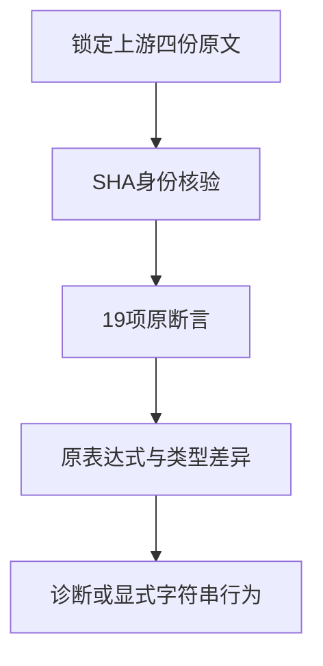

# 字符串连接剩余原文审查

## Intent：最终目标

完成锁定Test262修订字符串连接目录剩余四份原文的逐断言审查，保留支持差异，不将诊断拒绝声称为JavaScript运行语义等价。

## Data：可用证据

四份原文按上游索引SHA逐字节核验，并保留原始版权头。A1_T2涉及undefined、void和eval；A2_T2涉及null隐式ToString；A4_T2包含普通字符串和typeof结果；A5_T2包含Number/Boolean/Array包装与用户对象ToPrimitive。原始断言分别3、1、2、13项。

当前ZX不提供JavaScript动态eval、typeof及对象隐式ToPrimitive；既有addition_strings明确拒绝字符串加号，字符串组合使用显式模板插值。后续必须分别核对原表达式的诊断与可适配的显式字符串行为，不能把包装对象替换为常量。

## Edges：边界与限制

本地缓存只解出了部分原文件，历史归档路径已不存在；本次读取锁定修订的四份原文件，并与仓库索引SHA一致。不更新上游修订、索引或元数据。不改变当前仍运行的组合门禁输入。

## Answer：交付格式与成功标准

当前交付原文、来源身份、19项表达式/上下文数据草稿及生成器草稿，尚未执行生成器、登记review决策或增加adapted数量。后续按完整19项断言及实际能力确定诊断/运行覆盖，真实执行后再提交测试与决策。

## 自我批判

缓存目录存在不代表原始文件完整；两次只读尝试发现文件及历史归档缺失后才读取锁定网络源。不能凭文件名推断内容，也不能凭显式插值通过声称原JavaScript加号、typeof或动态对象转换已经实现。当前尚未形成可发布的适配结果。

后续草稿将四份原文均归为当前静态契约外的隐式转换，分别链接19项真实诊断观察；显式字符串模板拼接仅作独立对照，不计为原运行语义等价。该方案仍需实际诊断核验，最终分类不得先于真实执行。
