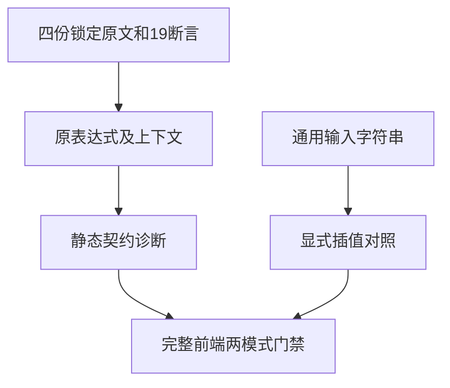

# 字符串连接剩余原文审查执行记录

## Intent：最终目标

逐项核对剩余四份字符串连接原文的19个断言，验证静态契约拒绝边界，另以显式模板插值做字符串对照，不把拒绝当原JavaScript语义通过。

## Data：可用证据

四份原文均来自锁定修订，每个源文件SHA与索引一致。保留undefined/void/eval、null、普通字符串/typeof及包装对象/用户对象上下文，共19条。生成器草稿和数据先存本目录，再复制到独立concat-original-boundaries-conformance检出，固定9c177db5d提交。

正式候选七个文件：生成器、原文数据、前端JSONL、显式字符串JSONL/ZX、review JSONL和suite登记。未新增生产实现或专用构建层，复用完整前端与现有template-primitives门禁。冻结5,665个输入。生成与--check、TypeScript6严格检查均通过。

候选目录审计128,488项，前端新增19、运行新增1；四个review均excluded，adapted仍812，excluded2056、未审查50626。以上只在独立候选检出，不是已发布计数。类型拒绝与显式字符串对照均不声明隐式ToString/typeof/ToPrimitive实现。

首轮Debug使用前端过滤，仅运行新增19项诊断及模板原语控制；真实终态0，51/51步、46/46检查。所有19个原表达式与上下文的预期诊断均实际成立，源码无需调整。

最终Debug11825、ReleaseSafe18163均已真实终态0，不使用前端过滤。Debug为51/51步、6661/6661完整前端检查、一次原生测试执行，四个模板原语组缓存；ReleaseSafe为51/51步、6688/6688检查、五次原生测试执行，覆盖6661个前端项及27个模板原语项。连同首轮46项/五次执行，共13395项实际检查、11次实际二进制执行。

核验生成身份与执行证据均通过，原始日志、编译/运行关联、相关生成源码和完整输入身份已保存。Source snapshot与原检出HEAD保持9c177db5d，不移动或改写已执行证据。

## Edges：边界与限制

源码中的var改为ZX const并补充静态string注解；原表达式及用户对象的方法体保持原样，不用常量替代包装对象或转换调用。独立插值程序使用输入value，不硬编码abc返回。

两模式终态和身份核验完成后，才将七份正式文件复制到主检出。发布父提交记录在发布基线.json，其他并行路径与非本次.DS_Store保持原样。旧完整ReleaseSafe89265继续观察，无重启或超时放宽。

## Answer：交付格式与成功标准

两模式完整组合门禁及原文/生成身份、全输入哈希、实际二进制与缓存边界核验均通过。七文件与本目录证据按精确范围提交push，使用英文Conventional Commit：test(conformance): cover remaining concatenation boundaries。本部分不会把四份excluded原文或一个显式字符串对照计为新的语义适配。

## 自我批判

通过诊断拒绝不能证明原JavaScript运行断言正确，因而四份review不增加adapted数量。首轮过滤仅定位新边界，必须完成无过滤的全前端组合验证。候选矩阵和草稿存在均不作为已发布或整目标完成证据。

字符串连接目录剩余四份原文均已有逐项决策；这只是该目录的审查完成，不代表Test262整体完成。全部已发布登记为128488项，未审查50626，adapted812、excluded2056、equivalent103。
